*← [Silver Family Archive](./)*

These are the letters [David Silver](David-Silver) wrote home from boarding school at **[King's School, Bruton](Kings-School-Bruton)**, in Somerset, between **September 1937**, when he arrived aged thirteen, and **June 1942**, when he was eighteen and waiting to join the RAF. His elder brother [Christopher ("Kit")](Christopher-Silver/) had been at the school before him; Christopher's own letter home of May 1936 is on [his page](Christopher-Silver/#bruton-1936). Nearly all of David's letters are addressed to "Daddy and Mummy", the Exeter dentist [Clifford Marking Silver](Clifford-Marking-Silver) and his wife Gladys (née Acott, see [The Acott Letters](Acott-Letters)), at **Tresillian**, the family home in West Avenue, Exeter.

They begin with a homesick new boy counting the days to the next "Sunday leave", drawing his locker and asking for toothpaste, cornflakes and an episcope for Christmas. They run straight through the coming of the war: school debates after Munich, the first wartime term with gas masks, blackout and evacuees, the sinking of the *Royal Oak*, the fall of France, German bombers passing over towards Bristol on the night of the Coventry raid. By the end David is head of his house and of the school's Air Training Corps, sitting an RAF aircrew selection board in Oxford, and, five days after the **Exeter Blitz** of 3–4 May 1942 wrecked Tresillian, writing to his parents that "your extraordinary good fortune in being unhurt more than counterbalances the misfortune of losing the houses." In the same letter he tells them he is to be "the second person in a two seater night-fighter", working the radar.

Throughout he is the man his grandchildren knew: always drawing, mad about photography, building things in his head, reading everything, and very funny.

**About the transcription.** There are sixty-nine letters, the last an unsigned fragment that may be David's or Christopher's. They are transcribed in full with David's own spelling and punctuation. ~~Struck text~~ shows his crossings-out, [?] a doubtful reading, and [square brackets] describe drawings and layout. Page breaks appear as *(p. n)*. Most letters are undated, so each has been dated from postmarks, his own headings or the events he mentions; the evidence is given in italics under each heading, and "c." marks an estimate. The scans for each letter are in the collapsible **Scans** box beneath it.

---

## 1937

### 01. A Sunday, September 1937 (his first days at Bruton)

*Undated. New boy ("only done an hours work so far and I've only seen 4 masters"), first Sunday leave still to come — his first weeks at King's School, autumn term 1937.*

> *(p. 1)*
> Kings School
> Sunday Bruton
> Dear Mummy
> I hope you are very well, I am getting on quite well, most of the larger boys are very helpful. Yesterday (Saturday) We did what we liked in the morning, and played "Rugger" in the afternoon.
> There are 3 ~~four~~ new boys in our dormitory a prefect and a boy who was here last term a Portugoose (is that right?).
> I shall right to Daddy next week Can you send my sponge at once. I enclose the time table next week as it is in a
>
> *(p. 2)*
> a place where we are not supposed to go. Sunday leave is on the Sunday after next, (NOT The Sunday after today)
> We have only done an hours work (prep) so far and I've only seen 4 masters. I've have found no time when to eat Kellogs Korn Flakes as no one at our table eats them at tea, Please ask Kit about it.
> Dont forget Hairbrush Sponge knife. You may receive a postcard with this which was posted yesterday
> Give my love to the family its only 2 weeks to 3rd Sunday
> with love
> your loving
> Son
> David

> [!scan]- Scans (2)
> 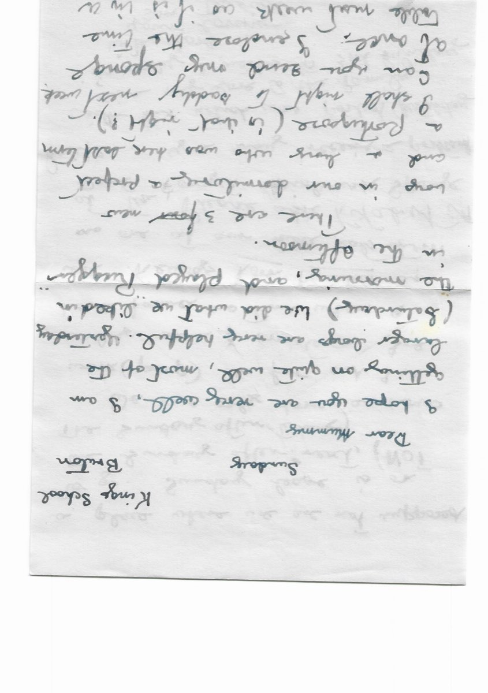
> 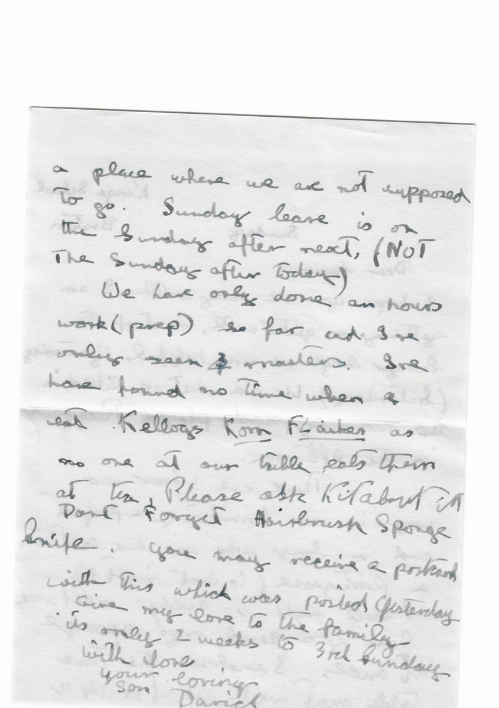

### 02. September/October 1937 (first term)

*Undated. First fagging, placed in the combined second/third form, joining the Musical Society — first term, autumn 1937. The model-house P.S. links to the 7 Nov 1937 letter.*

> *(p. 1)*
> [sheet number] 1
> Kings School
> Bruton
> Dear Mummy and Daddy
> I hope you Mummy are very well and that you Daddy are much better.
> The Class I am in is a combination of the third and second form, and please tell Kit I'm in set four for maths with Mr Paisy.
> Yesterday I got forty eight out of fifty for English.
> Also yesterday We had drawing with someone, I don't know who.
> We were give a pretty good choice
> one of these {
> a Chinese Junk (Model in room)
> a Geraniums (in room)
> an incident in holidays
> ~~an~~ adventure
> ~~an~~ accident
> [continues]
>
> *(p. 2)*
> Sheet 2
> Absorbent Cotton wool as the skin seems to be chafed off my toes.
> ... I have had my nail scissors pinched from my locker. . . . . . as prefects at the time it was pinched seemed to want to inspect finger nails.
> I fagged for first time yesterday.
> Theres a boy called Willis. Willis from a distance
> [Drawing: a boy in round glasses with a long scarf/trail behind him, labelled "~~[struck]~~ Pursued by Prefect", with a tiny stick figure running after him.]
>
> *(p. 3)*
> [sheet number] 3
> (Prefect)
> Sladen Major seems a very nice very, I should think he liked Kit awfully because he's awfully nice to me.
> Loyd-Price is very nice too. I belong to the Musical Society and sing treble
> I'm afraid this letter is very scrappy and uninteresting. You see in future I shall write like this
> Dear Mummy or Daddy
> ~ ~ ~ ~ ~ ~ ~ ~
> On Monday ~~~~ etc
> ON Tuesday ~~~~ etc
> and so on. I rather like Grogan
> This is what a Train looks like here looking down the line
> [Drawing: a small steam engine seen head-on, puffing smoke, with the rails converging.]
>
> *(p. 4)*
> NOTE Kings School
> Bruton
> I'm going to write a general letter to both of you every Sunday and a letter to each of you of each day of the week.
> Mice are an awful Nuisance
> Theres a boy who catches them he has a most appriate name appropiate
> SLAUGHTER
> The A.P. is in the Library Now. I've read it.
> MUMMY. That Detective Book isn't much good. The stories don't contain much about Detectives.
>
> *(p. 5)*
> P.S.S.S.S. or whatever it is
> Very model Dutch house built by boys
> Looks like old Lady's house Llangollen
> I must build one when I get home for Hogsnorton
> [Drawing: a single-storey bungalow with a pitched roof, central gable, door, two windows and a chimney with smoke.]

*Notes:* the teacher's name may be "Mr Paisy" or "Mr Daisy" — uncertain.

> [!scan]- Scans (5)
> 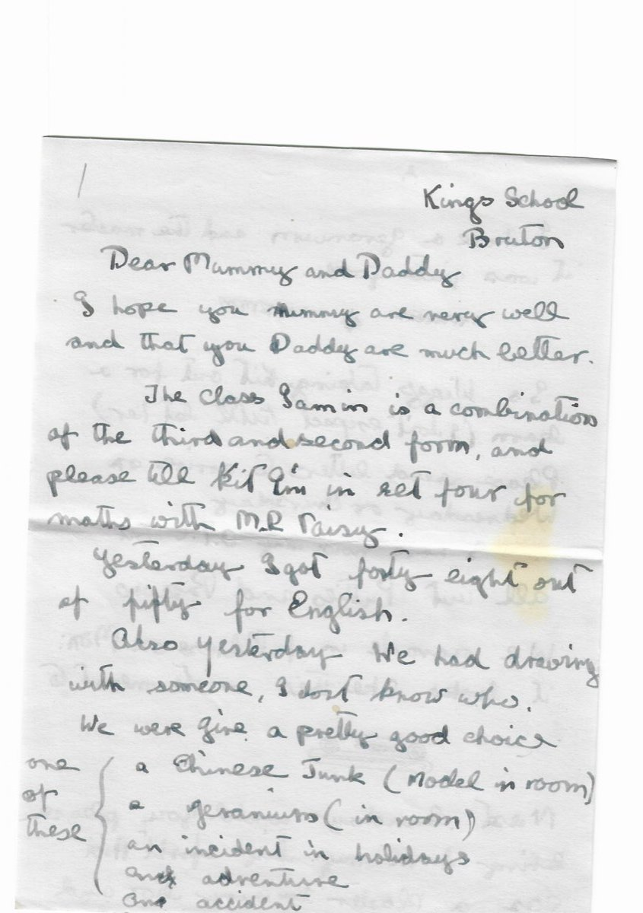
> 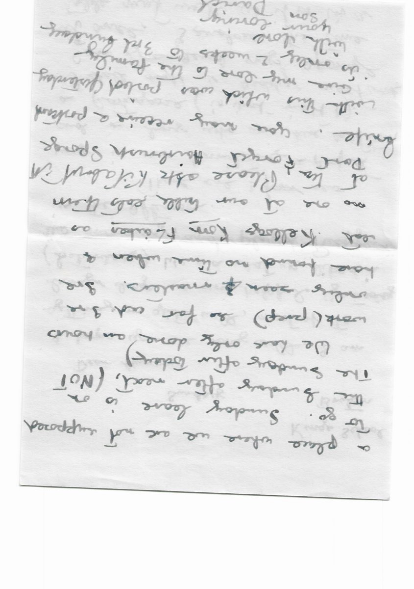
> 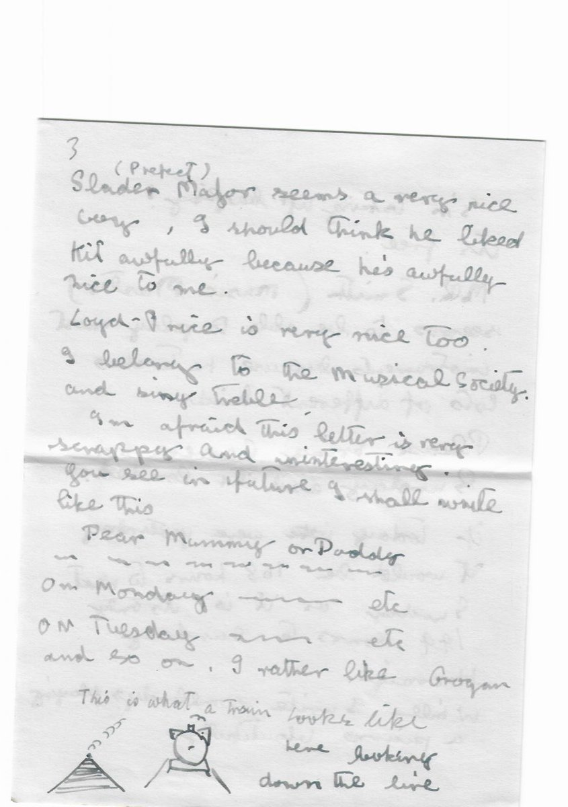
> 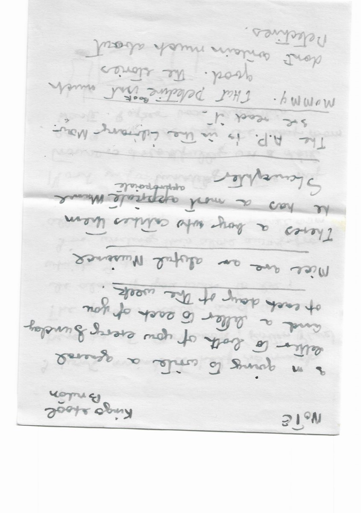
> 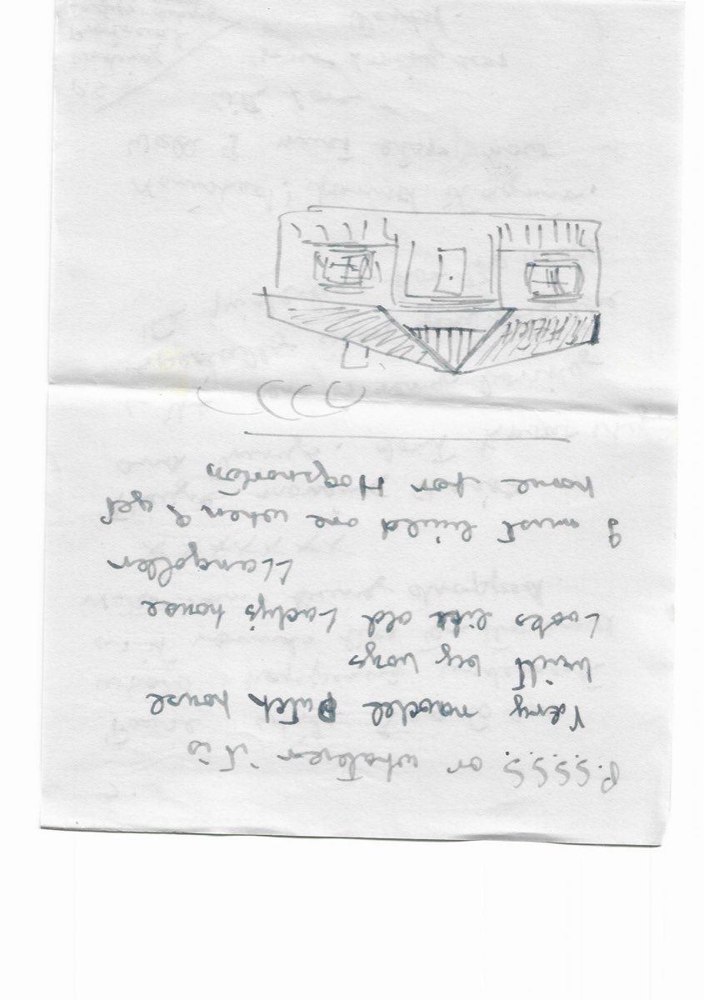

### 03. Sunday 17 October 1937

*Dated "Sunday 17 Oct"; 17 October was a Sunday in 1937, his first term.*

> *(p. 1)*
> Kings School
> Sunday 17 Oct: Bruton
> Dear Mummy + Daddy
> I hope you are very well; Well its only 2 weeks to next third Sunday then there will be only 7 weeks to the end of the term.
> Today the weather is wonderful, I hope we have such nice weather next third Sunday.
> Yesterday the Colts (not Plox) played Downside and one (away). We played our first XV against them at the same time (home).
> I'm afraid this a very scrappy letter: By the way we also had a house match and New house won
>
> *(p. 2)*
> My nose is less sore and my cold has almost gone, But the inside of my mouth is very sore.
> Mummy, I have changed my mind, I like biscuits better than sweets
> Please bring some ordinary Rye Vita as well a chocolate. I like Chocolate Bath-olivers and chocolate Digestives.
> Isn't it awful I have lost my prayer book, This morning I looked for it for church and was unable to find it anywhere.
> I must ask everybody if theie seen, if it isn't found I suppose I shall have to tell the Prefects. Please could you send me one that will reach me before next
>
> *(p. 3)*
> Daddy, my watch has gone wrong, I have as far as I know hurt in no way but it keeps stopping especially at the quarter to- mark. I think the minute hand must touch the glass, Anyway the main point is it doesn't work. shall I try to have it mended at the shop here? Shall I keep it till 3rd Sunday? or Shall I send it to you by Post?
> I don't know if the glass distorts but this is what it looks like
> [Drawing: side view of the watch, the minute hand rising against the glass, labelled "TOUCHING HERE".]
> I don't know that there's much more to say. I went for a 5 mile walk today By the way Beaman got up today
>
> *(p. 4)*
> but we mustn't mention ~~now~~ his accident as he ~~could~~ doesn't know he has had one. Elgar has been taken with a Pendicitis (is that the way to spell it) and I think they are going to operate, I don't know for certain.
> with love
> your loving
> son
> David
> Note Mummy.
> I like marmite (I don't want two tons though)
> My locker looks like this
> [Drawing: the locker interior — boxes labelled BOOKS, a jar of TEA [?], SWEETS, CORN FLAKES, BISCUITS, and a tall compartment labelled EMPTY.]

*Notes:* Sunday 17 October 1937.

> [!scan]- Scans (4)
> 
> 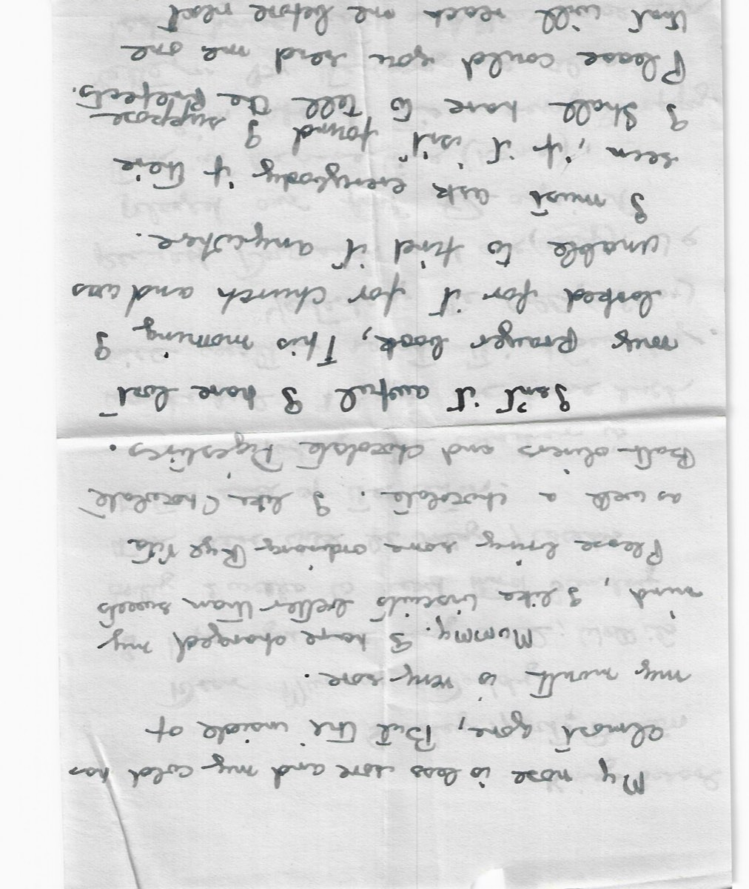
> 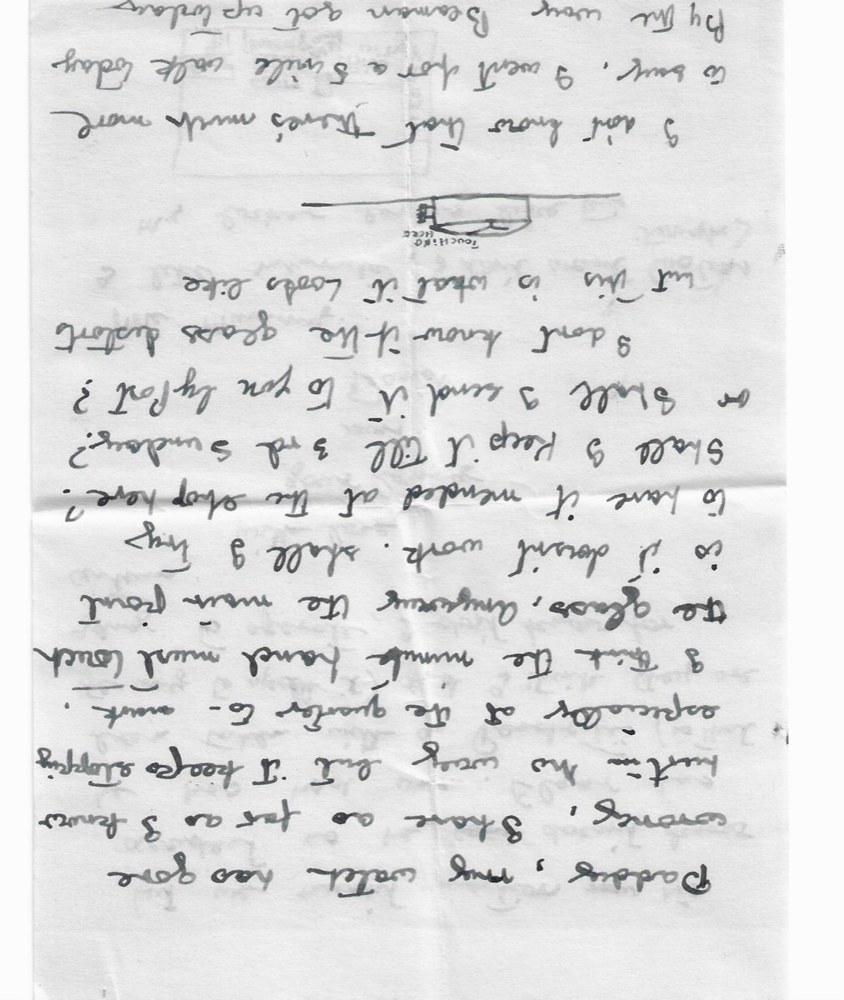
> 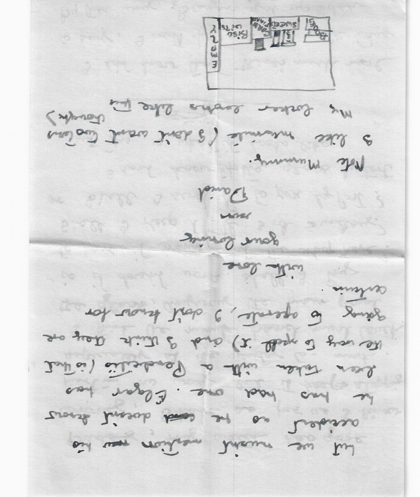

### 04. Sunday 7 November 1937

*Dated "November 7th"; Armistice service, fireworks, and the episcope "advertised in Meccano Mag November 1937".*

> *(p. 1)*
> Kings School
> November 7th Bruton
> Dear Mummy and Daddy
> I hope you are very well,
> Contrary to my expectations we had fireworks, and just before November 5th nanny sent me a bob postal order for sweets fireworks
> I promptly spent it on fireworks, Then 4 other boys joined me with a few other fireworks, two boys I like, two boys I don't.
> It was a rotten display owing chiefly to the darkness of the Park The boys I don't like and bad fireworks.
> Those fireworks which did go off
>
> *(p. 2)*
> only fizzed and gave a pop we had two tuppenny rockets one we stuck very gently into the ground and when we light it it stayed there and one that was a dud (Brocks fireworks too).
> The best firework I had was a penny one like this [small drawing of a cone-shaped firework] and there wasn't time to fire it in before prep so I kept and fired (against the rules) the next day it made an awful smoke but nobody noticed it.
> I went out for a work with Warren mi and fired a banger ~~[struck]~~ I think it was a brocks little wonder but it only sounded like a man shooting rabbits
>
> *(p. 3)*
> It was awful and the buglers began bugling (our buglers) and the dog howled like a wolf.
> Its only 3 weeks to 3rd Sunday. Its half-term, I saw the old head master while I was out for a run.
> There are some lovely model houses built by some boys last term they look like this
> [Drawings: two model houses — a long low weatherboarded house with a pitched roof and windows, and a narrow two-storey house.]
>
> *(p. 4)*
> I didn't get much pleasure out of the fireworks because I wasn't doing them at home with a beautifully chalked programme and catherine wheels on walking sticks and things, in fact the thing fell rather flat.
> my watch has gone wrong for the last day or so.
> We have just had the armistice service the vicar preached rather well but just as the somebody or other was putting the wreath on the war memorial a dog rushed out and snapped at everbody and ran round and round the choir
>
> *(p. 5)*
> Yesterday night Tom and a friend who was at school with him, who has been in Spain for sometime lately lectured his name was Buckly (I think) He lectured on the civil war in Spain. This friend had been doing relief work.
> There was a Photograph in the A.P. by ~~a~~ man called MCEWEN what are his initials! (our MR MCEWEN I mean) I wondered if it was his.
> Hows Kit I haven't heard from him yet.
> To-night 1. Scientific Soc: meet
> 2. MUSICAL CONCERT BY MUSICAL SOC:
>
> *(p. 6)*
> I intend to do a lot of writing to people shortly but I must hurry up with this letter or I shall miss the Post.
> I've decided what I'd rather like FOR XMAS but I better consult you, Daddy first, its easier to get than the Photo electric cell I was telling you about Mummy, last Sunday its the Mills EPiscope (minor I think its called and its 12/6 My Photographs fit it do you think it would be any good, Daddy, it gives 24" by 36" pictures and any kind of the right size picture can be put in it
>
> *(p. 7)*
> it looks like this and its advertised in Meccano Mag November 1937 Which I'd like you please Mummy to get instead of the B.O.P
> [Drawing: the episcope — a box with a projecting lens throwing out rays of light.]
> I don't want any other Meccano Magazines though except Nov + DEC
> I shall want some corn flakes next week I should think near the end and Please send Toothpaste immediately (anything but Philips Dental Magnesia)
> with Love
> your loving
> Son
> David
> [In the bottom corner, boxed off:] I'm afraid this is a scrappy letter
>
> *(p. 8)*

*Notes:* "model houses built by some boys last term" — compare the P.S. "Very model Dutch house built by boys" in scan 121 (first term, autumn 1937). This letter is therefore Sunday 7 November 1937. "Meccano Mag November 1937" + Armistice service → Sunday 7 November 1937. Ties in with letter 05 (Nov 1937), which mentions the episcope and Mills Brothers.

> [!scan]- Scans (7)
> 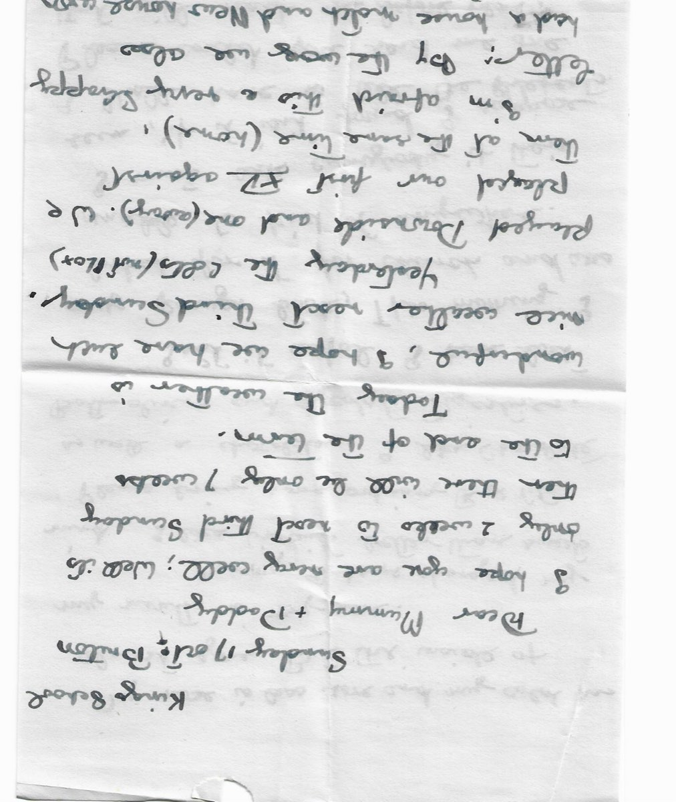
> 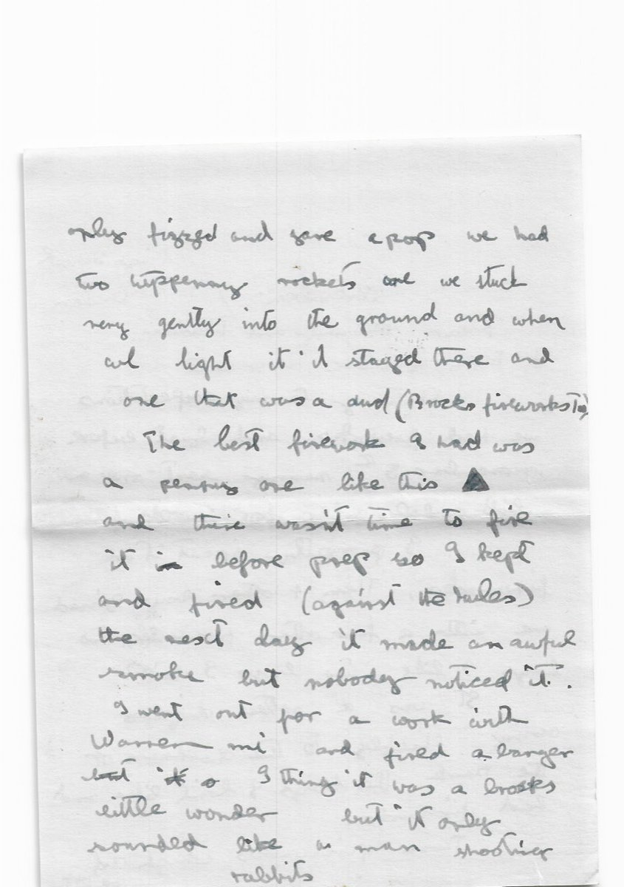
> 
> 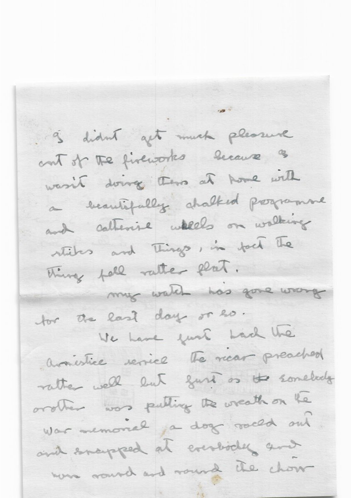
> 
> 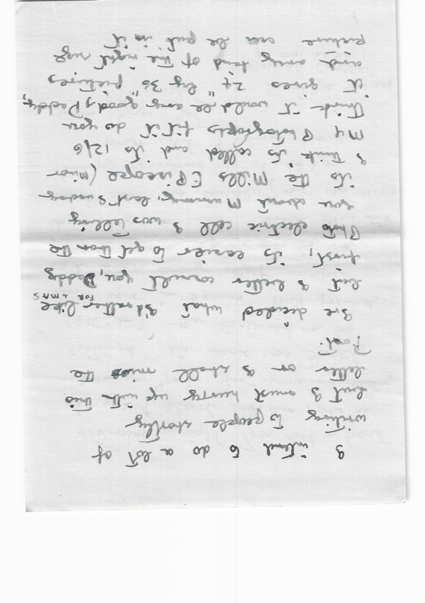
> 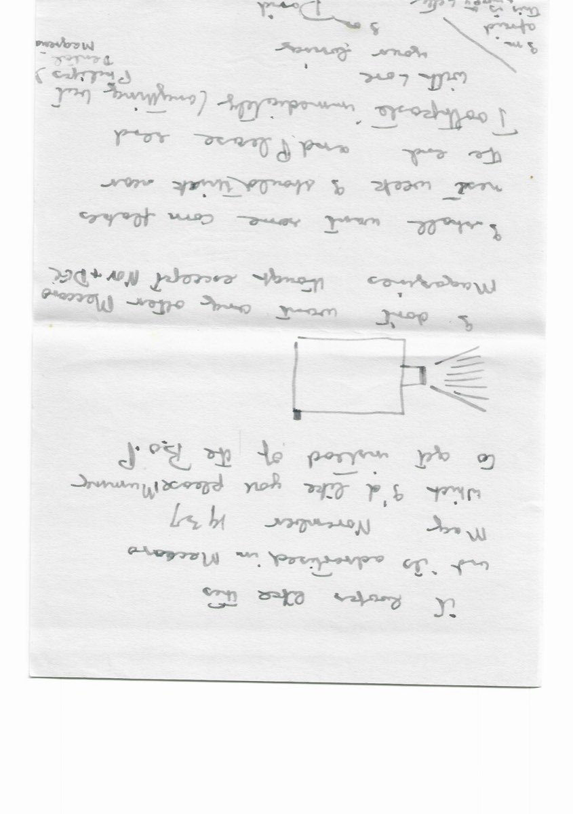

### 05. Sunday 21 – Tuesday 23 November 1937

*Envelope postmarked BRUTON 23 NO 37 (a Tuesday), matching the "Today is Tuesday" continuation.*

> [Envelope]
> C. M. Silver Esq:
> Tresillian
> West Avenue
> Exeter
> [1½d stamp, King George VI; postmark BRUTON SOMERSET, 23 NO 37]
> [Back flap, in pencil:] I'VE LEFT OUT THE CATALOGUE FOR THE EPISCOPE
> BOTHER!
>
> ---
>
> [p. 1]
> Kings School
> Bruton
> Sunday
>
> Dear Daddy and Mummy
> I hope you are very well, Daddy that letter you sent me arrived the day after you wrote it at about 7.30 AM.
> Today (Sunday) is really quite a fine day I hope it will be like on next Sunday.
> Christopher wrote to me and said "I am enclosing a small present", of course he enclosed a
> HUGE BOX OF
> CHOCOLATE BISCUITS.
> as I told you I wrote to Mills Brothers for particulars. Well I received a pamphlet which I enclose.
> There doesn't seem to very much news as I'm so excited about next Sunday
>
> [p. 2]
> I think I shall have to stop till after Church *********
> .....        ....
> Isn't it awful I can't think of anything because on Tuesday its only 4 weeks
> ____________
>
> Can you inquire from everybody what they would like for Christmas
> I've bought two School Christmas cards one which I shall send to Granty.
> I'm in a special ~~schol~~ school
> CHOIR for special services.
> Marjorie sent me a card to thank me for her birthday card
> I would have rathered it she hadn't as she spelt Somerset
> "Summerset" (LUCKILY NOBODY NOTICED IT)
>
> [p. 3]
> I can't remember have I seen you since firework Day.
> Please send me family addresses
> Selwyn Driver (Entertainer) was quite funny only I wasn't very excited about as I'd much rather have seen at home. Tonight the beak gives some sort of a lecture on Switzerland.
> We lose practically all our Rugger matches.
> I laughed till I nearly died when I read your accounts of Timmy in the larder.
> IT Is ~~[struck word]~~ frightfully cold here.
>
> [p. 4]
> That episcope seems to be a marvellous thing if it works.
> Can you tell me of any good book to read and also do you know of a book which has very short but exciting stories which I haven't read.
> Isn't it annoying I'm always getting awful cramp in my leg and sometimes it wakes me up in the night Matron gave me two green looking pills about this size [drawing of two small pills] which looked like that box of stuff we once bought for rejuvenating flowers.
> I get it practically every night I remember having it twice when I was at Norwood.
> Hooray
> MR. FARMAR'S
> LEAVING
>
> [p. 5]
> I've just had dinner
> Its a lovely day but jolly cold.
> I am awfully sorry I've missed the post and lost my stamps which I've just discovered.
> Today is Tuesday. and I'm trying to get time to write between class and dinner.
> !!!!! PLEASE SEND TOOTHPASTE !!!!!
> and bring new sponge mine has died, pieces keeping coming off it.
> The Heads lecture on Switzerland was awfully good he made all the slides himself and seems to be quite a keen photographer
>
> [p. 6]
> Compared to Bruton Norwood was like Dartmoor Prison
> The foods much better than Norwoods.
> In other words I consider compared to Bruton,
> Norwood is a Rotten Hole. [underlined]
> I'm doing quite well at work in fact out of the combination of forms two and three I hope to be about 6th out of 20 and by the end of the Summer Term this time next year when I'm 14½ I shall be in the fourth if I work hard
> I'm the next youngest boy in the school the youngest boy being 16 days younger than me
>
> [p. 7]
> I'm afraid this is a frightfully boring ~~story~~ letter and shorter than usual.
> THANK YOU AWFULLY
> FOR THE CAKE ITS LOVELY
> [drawing of a round cake]
> ONLY 4 DAYS TILL
> SUNDAY
> I'm getting rather excited about it
> But on Saturday I shall just about [drawing: a cloud-like burst labelled] BURST
> with love
> your
> Loving
> Son
> David
> [In corner, boxed off:] I'M LOW IN JAM AND CORN FLAKES
>
> [p. 8 — pencil drawing]
> [Nested rectangles counting down the days, from the outside in: WEDNESDAY, THURSDAY, FRIDAY, SATURDAY, with SUNDAY at the centre.]
> [Below: a curved arrow from HOME back to HOME, labelled "4 WEEKS".]

> [!scan]- Scans (10)
> 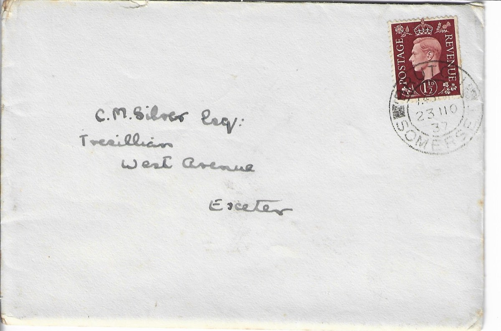
> 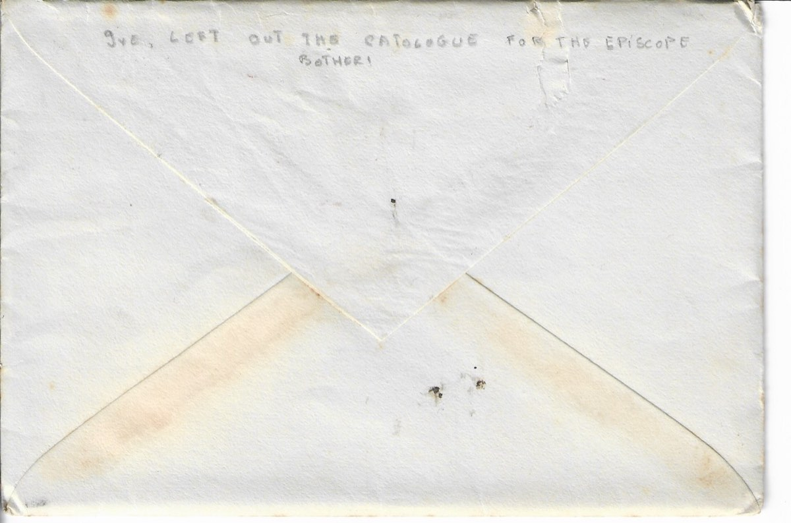
> 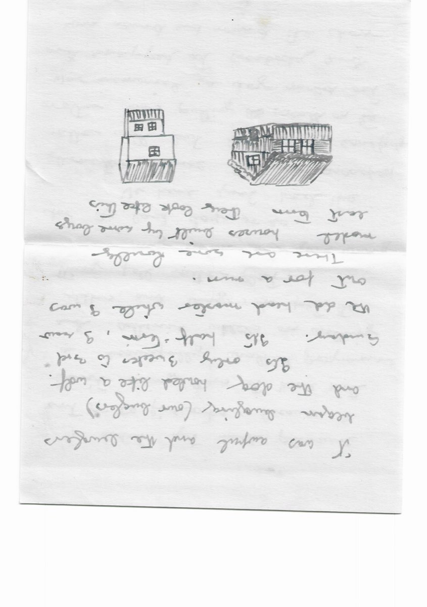
> 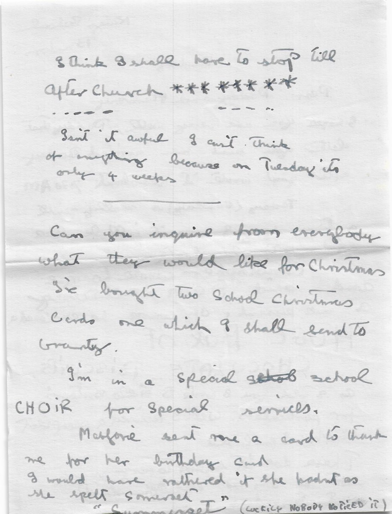
> 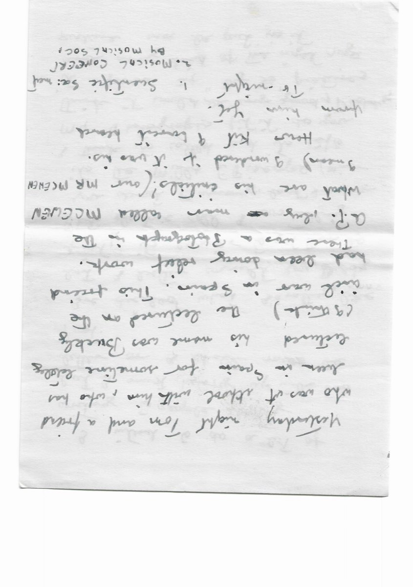
> 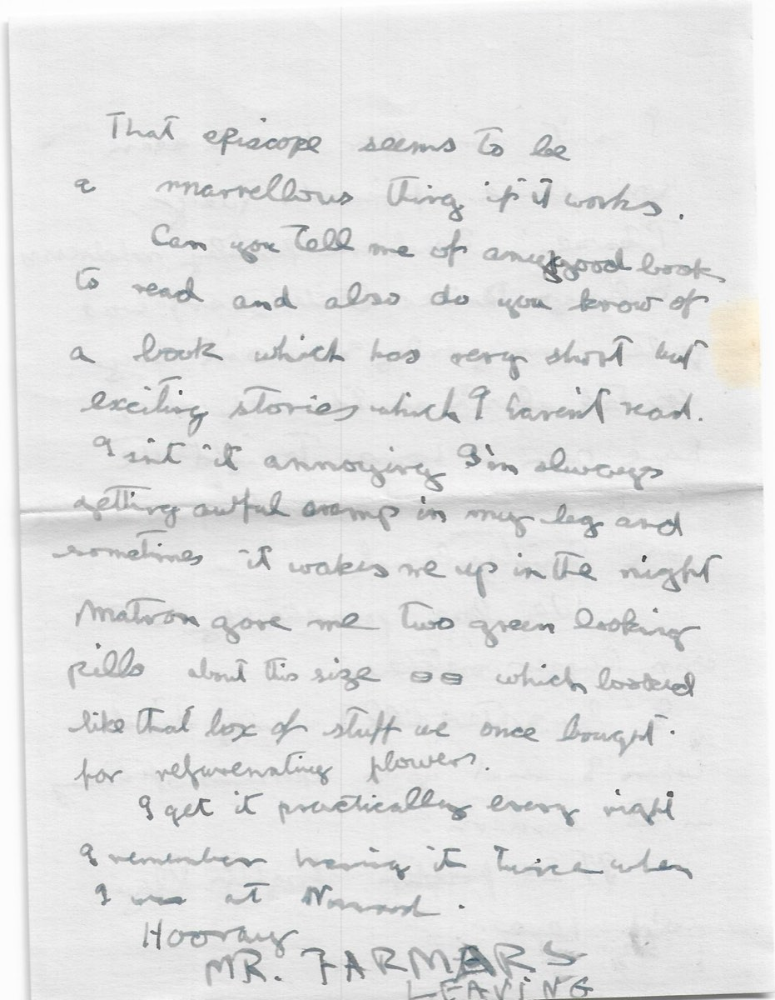
> 
> 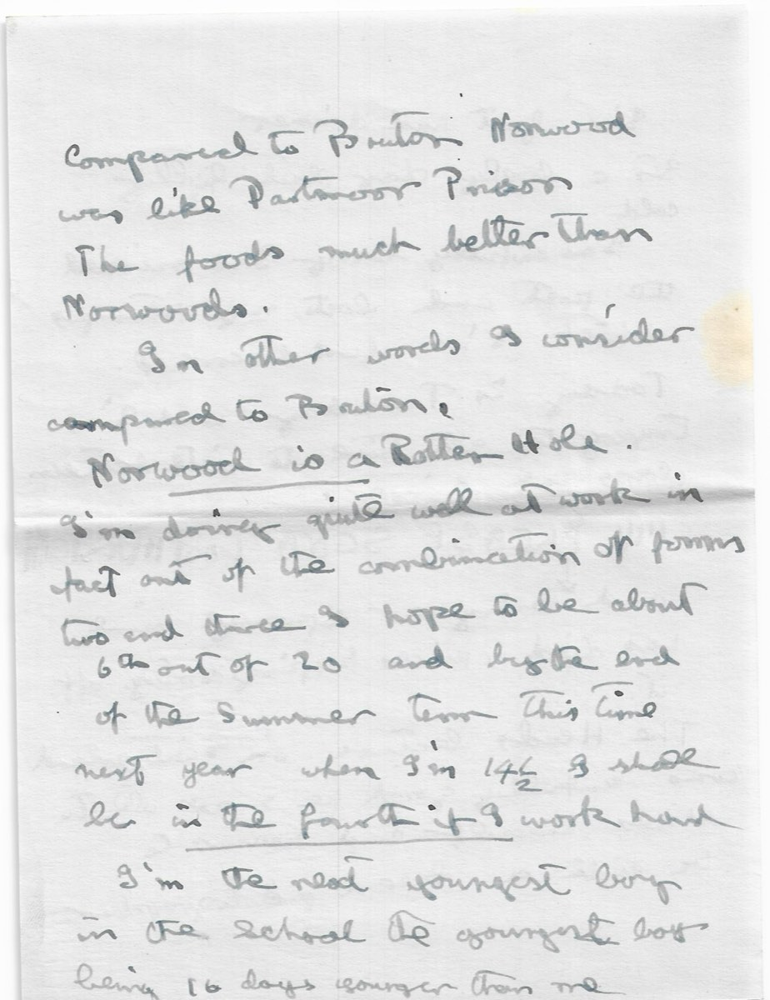
> 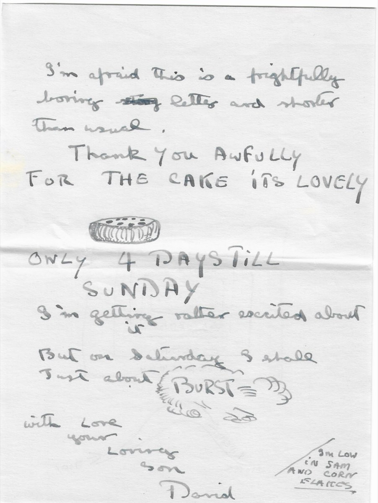
> 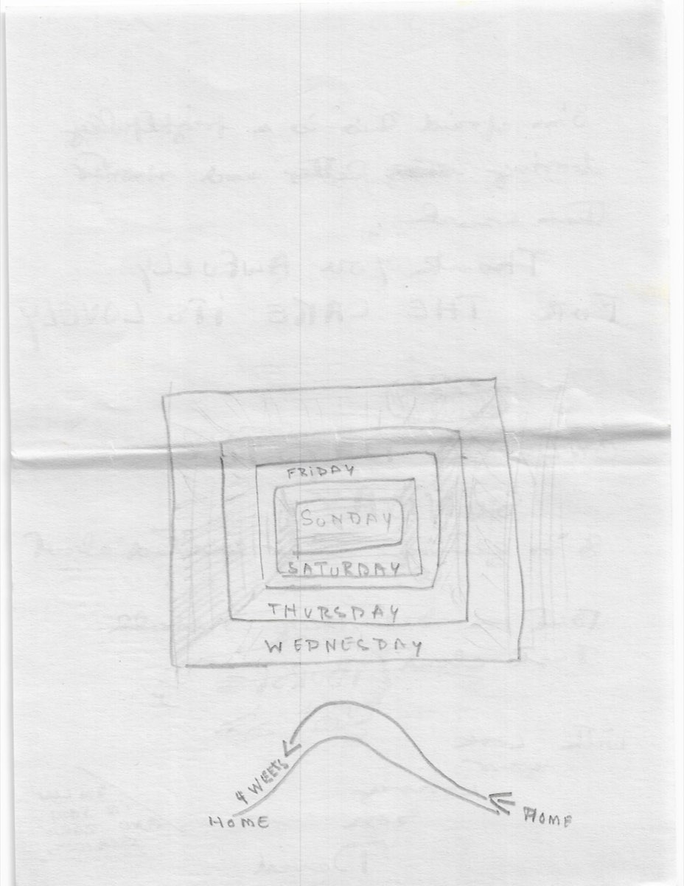

### 06. Late November / early December 1937

*Undated short note. Kit's box of chocolate biscuits and the request for family addresses echo the 21–23 Nov 1937 letter; parents away at Percival's Hotel, West Worthing.*

> *(p. 1)*
> Kings School
> Dear Mummy
> What on earths happened I written to you ~~[struck]~~ on Sunday haven't you had the letters, I spose I sent them too late I sent them on Sunday to.
> Percival's Hotel
> West Worthing
> Sussex
> wasn't that right I suppose you must have left early
> I'm – bother my pen's run out – just dashing off this letter within 5 minutes of opening yours.
> Have you any idea what
>
> *(p. 2)*
> Philip would like for Christmas and birthday
> Kits sent me a lovely box of chocolate biscuits and some sweets.
> Can you Please give me Philip Nanny and James (if you know it) address. I must stop now as its lunch I shall write to you again in a day or two with more news
> The food was (mince Pies) was received alright thank you awfully for them.
> I am glad about Woty [?]
> with love
> your loving son
> David
> [bottom left, boxed off:] I'll write soon again

*Notes:* compare letter of Nov 1937 (scans 0–7): "Christopher wrote to me ... HUGE BOX OF CHOCOLATE BISCUITS" and "Please send me family addresses" — this note probably dates from the same weeks, Nov 1937.

> [!scan]- Scans (2)
> 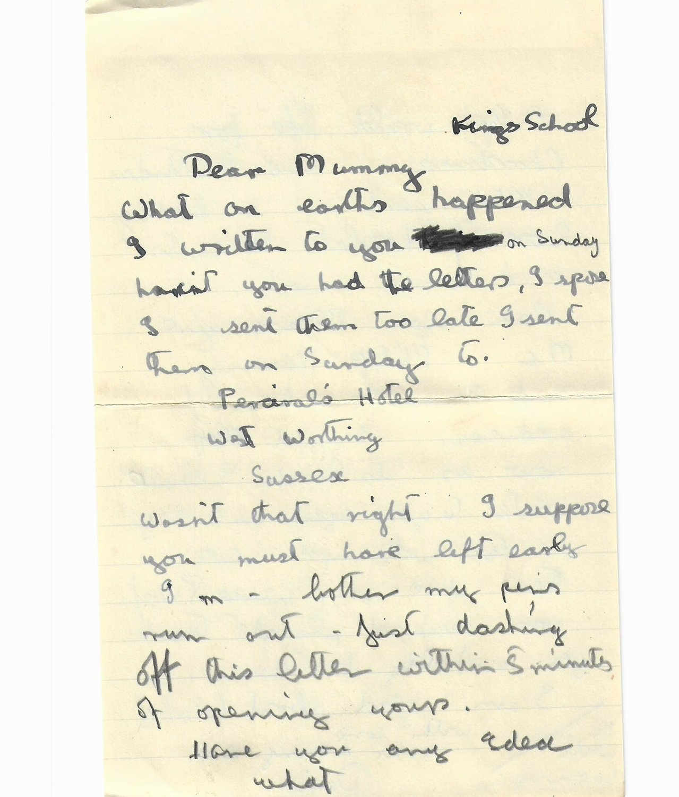
> 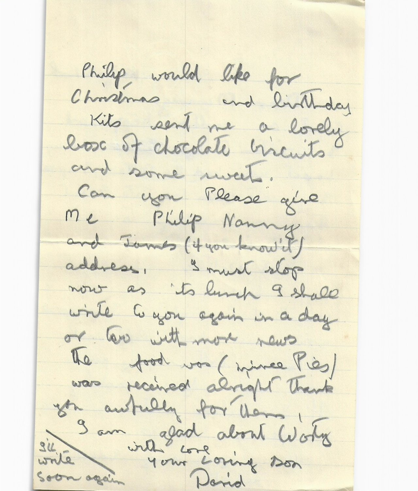

## 1938

### 07. Saturday–Sunday, first days of the spring term, January 1938

*Undated. First day of term, moved up to the third form, a hockey stick bought, confirmation asked about, the injured policeman and Wheatons (also in the Feb 1938 letter) — January 1938.*

> *(p. 1)*
> New House
> ~~Friday~~ Saturday Bruton
> Dear Mummy and Daddy
> I hope you are very well. The term lasts nine weeks 3 days and there are three Sunday leaves.
> I'm enclosing a calendar.
> I've gone up into the third form.
> I have an awful headache and my bed seems as hard as bricks.
> There is not very much news today, as its only the first day you said it was alright so I got a hockey stick it was the
> [continues on scan 280 "cheapest they had..."? then Sheet 2 = scan 279]
>
> *(p. 2)*
> cheapest they had but even so was 12/6 it weighs 18 ounces
> I hope this term goes quickly but we've got the sports so I suppose it won't.
> I'm writing in the museum and its in an awful state of disrepair tons of broken cases.
> The dayrooms are in an awful muck tuck boxes shavings and wood boxes tins, paper, & bottles
> That William Book is very good.
> How's the Policeman in Hospital? and was
> [continues — next page not in sequence]
>
> *(p. 3)*
> Sheet 2
> Saturday New House
> Bruton
> Was there anything in the evening paper about Wheatons?
> ~~~~~~~~
> INTERVAL
> ~~~~~~~~
> Sunday
> Headache gone, but mice have ~~begun~~ their warfare top of Jampot eaten off.
> Am I to be confirmed this Term? as the head wants to know.
> This term seems to be going to last years and years however so far there are not very many changes
>
> *(p. 4)*
> New House
> Sunday Bruton
> I am glad I am fagging on Tuesday not Sunday.
> 3 weeks between each 3rd Sunday
> 9 weeks next Tuesday isn't it awful.
> I've told Mr Smith about music but he is expecting you to write I think.
> Hockey seems to be a curious game.
> I can't think of a single thing to write. My locker's awfully full and I don't feel as if I could look at food without being sick I had one piece of Bread
>
> *(p. 5)*
> this morning (with butter & marmalade of course) I didn't feel as if I could eat anything
> Pause for Thought
> (interval till later).
> The head has just asked me if I'm going to be confirmed this term so I said I wasn't sure but that I was going to write to you. He said he either expected ~~me~~ you to write to me and tell me or you to write to him.
> I can't think of any more news as I've only been here a day.
> with Love
> your loving
> son
> David
>
> *(p. 6)*
> for the good or the bad
> anyway no early morning school if I am to be confirmed this Term please send in your next letter one celluloid Jam cover and one white tie.
> I enclose the calendar
> I've read the William book and am now about to begin the grey Owl book.
> There's one new boy in the New House and about 4 in Old.
> Today is very dull (weather & life)
> Please can you send prayer book as you omitted packing it.

*Notes:* "12/6 ... 18 ounces" — probably the hockey stick mentioned on scan 281. "Wheatons" — compare scan 122 (Feb 1938): "Fancy me seeing the police actually investigating at Wheaton" and "I'm glad the policeman isn't dead". celluloid jam covers + prayer book are also requested in scan 122 (Feb 1938) — this is probably January 1938.

> [!scan]- Scans (6)
> 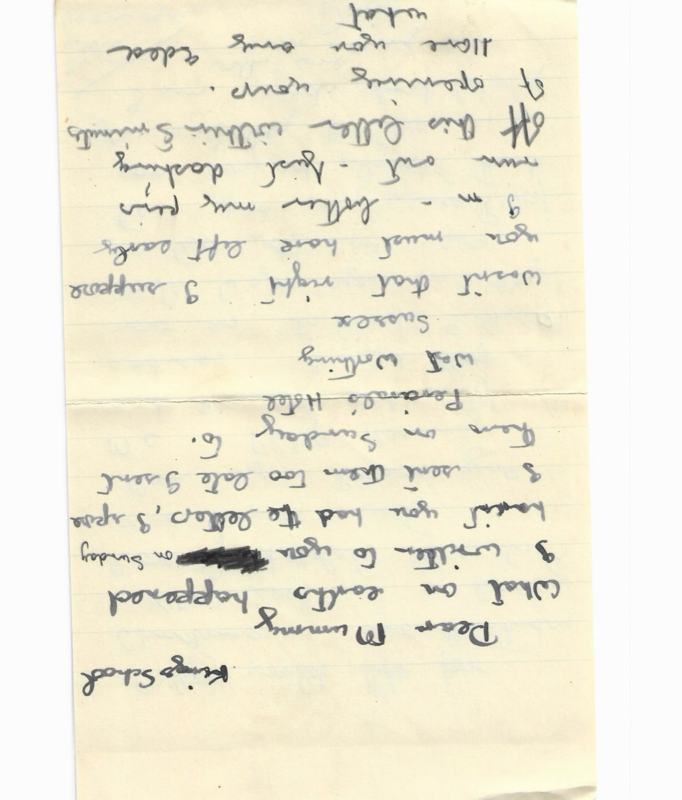
> 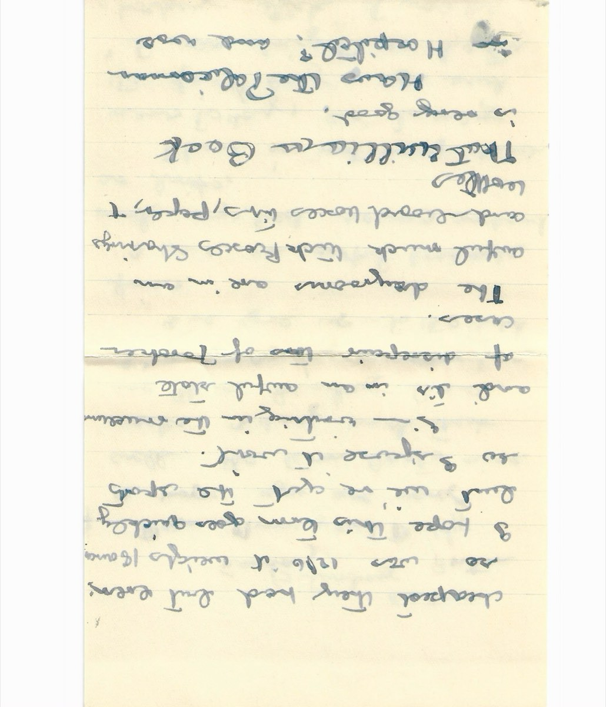
> 
> 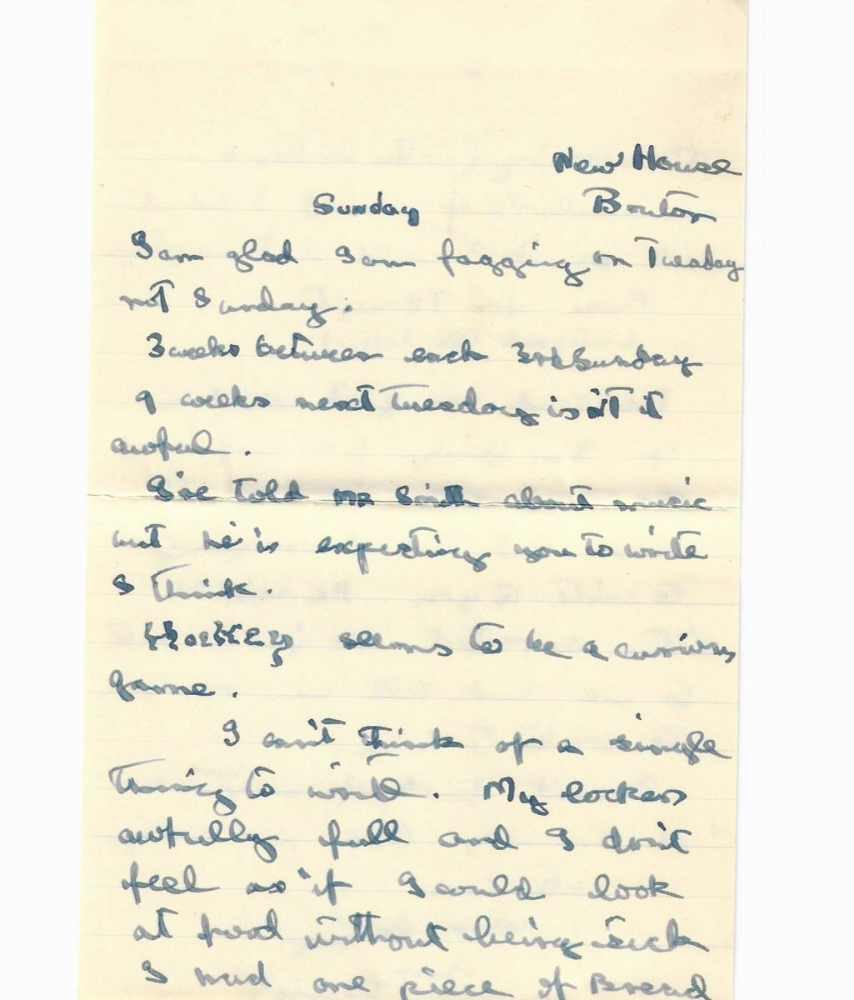
> 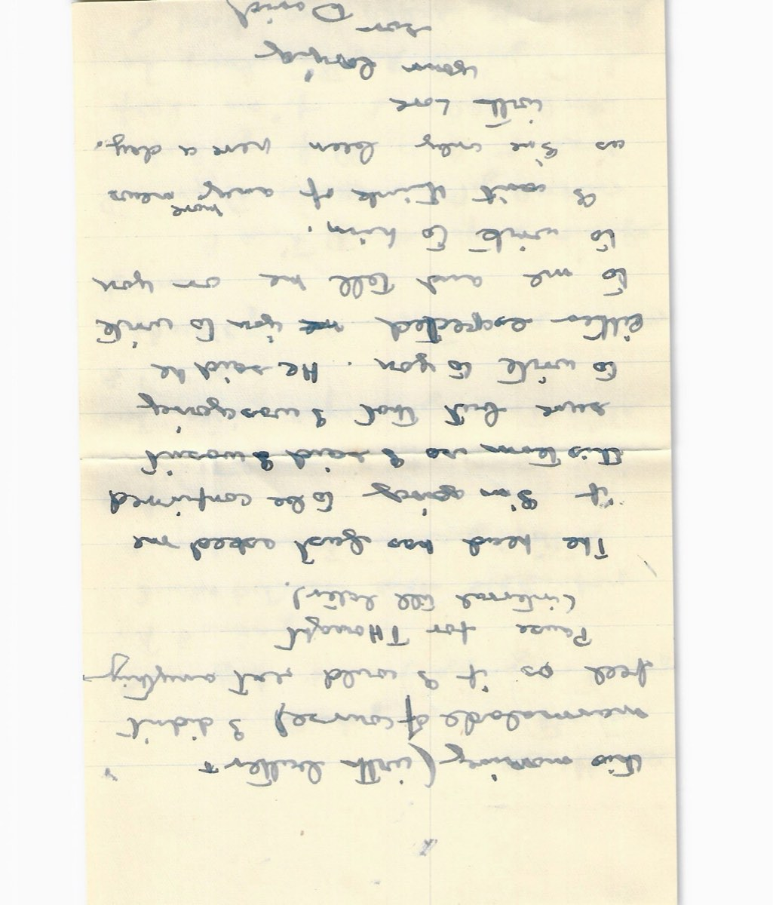
> 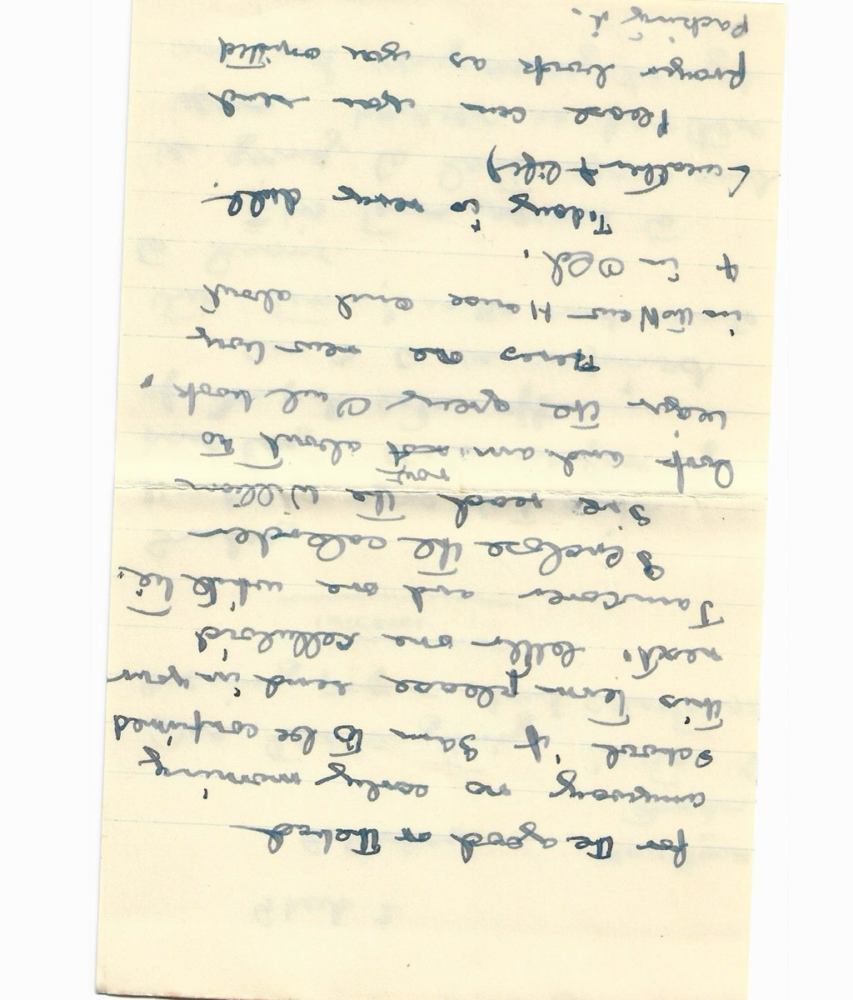

### 08. Tuesday, early February 1938

*Headed "Tuesday 4.30". The St Ives lifeboat disaster (31 Jan 1938) and his second ever game of hockey — probably Tuesday 1 February 1938.*

> *(p. 1)*
> Tuesday 4.30 Kings School
> Dear Daddy & Mummy Bruton
> Thank you very much for your letter Kit wrote to me a day or two ago and told me all about how he went out to tea to tea with Rickers.
> I've just seen a small boy (not attached to school) wheeling a small bicycle home very dejectedly and Donald came out of the New house and saw there was something wrong he found the breaks didn't work and the last I saw of him was that he and the small boy where ~~[struck]~~ kneeling by the bicycle while Donald repaired it.
> I played the second game of hockey I have ever played
>
> *(p. 2)*
> yesterday it was quite fun.
> I saw about the St Ives life boat you told me about in ~~both~~ papers, wasn't it awful?
> Latin seems to be very hard this term, ~~[struck]~~ Mr Venters who takes Latin French & German teaches the wrong way for me I never seem to understand what he means. In Latin while with Mr Dover I always used to get on
> The ~~[struck]~~ pen is working beautifully.
> I have been thinking out all sorts of things for the theatre in the way of scenery and am keeping a look out for things for
>
> *(p. 3)*
> the episcope. Did Kit tell you he saw a lovely Dufay calendar of Donald's printed by "Country life".
> I'm sorry I forgot to enclose the jolly old calendar only I mislayed it. I'll put it in this time if I can remember
> I must stop now goodbye.
> by the way I'm reading a book partly about Col: Fawcett its called Brazilian Adventure.
> With love
> Your loving son
> David
>
> *(p. 4)*

*Notes:* scan 123 (Feb 1938) says "I have played Hockey once" — so this is early February 1938, probably Tuesday 1 February 1938, the day after the St Ives lifeboat capsized (31 Jan 1938).

> [!scan]- Scans (3)
> 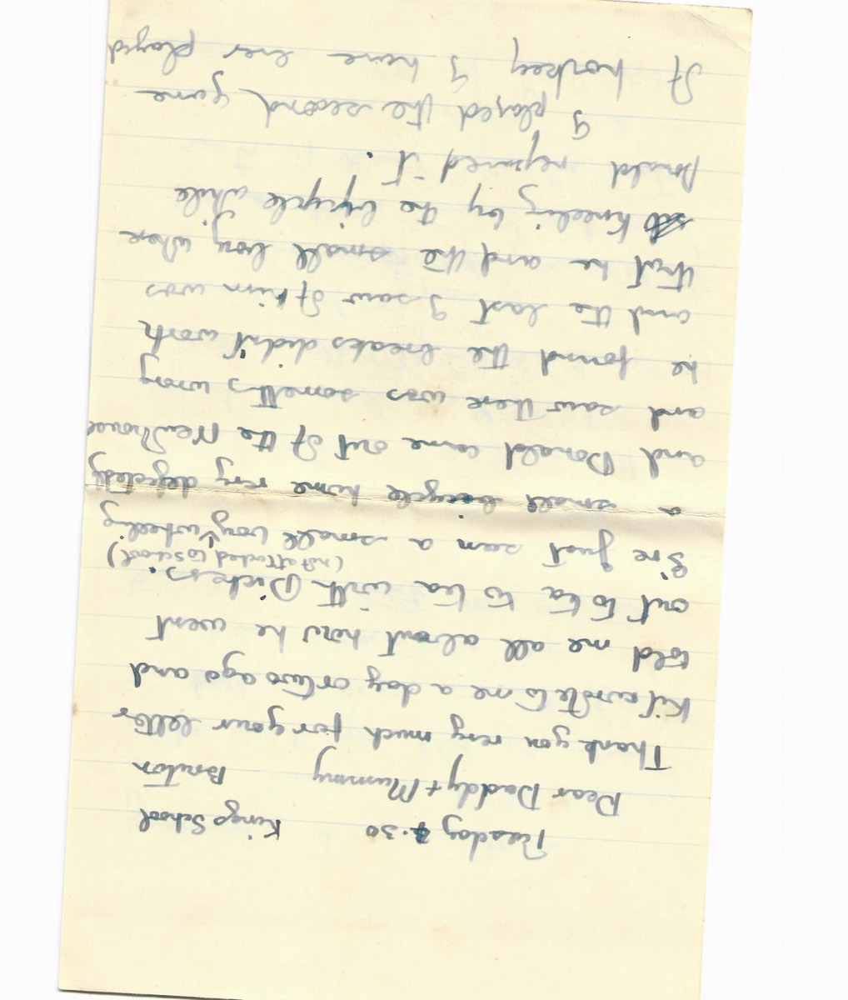
> 
> 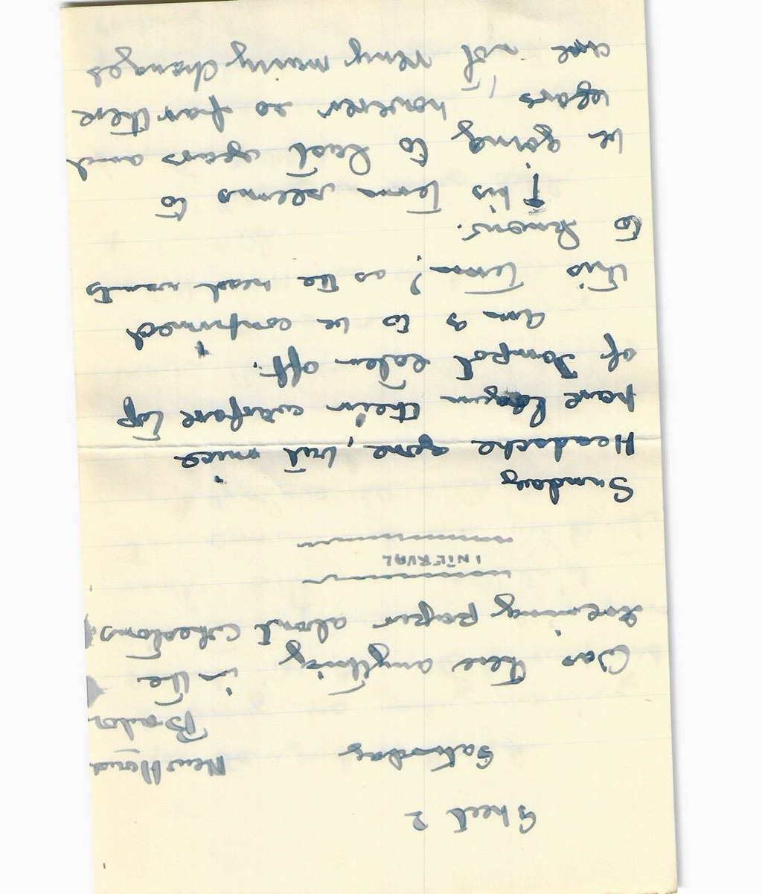

### 09. A Sunday, February 1938

*Undated. One week into term, the Northern Lights (the great aurora of 25–26 Jan 1938), and "15 Tues Feb" on the calendar (a Tuesday in 1938).*

> *(p. 1)*
> New House
> Sunday Bruton
> Dear Daddy and Mummy
> I hope you are very well.
> Please send the Prayer Book at once as I've only been away a week but it seems like a year. Could you please send some of those celluloid Jam covers as all those pots of Hartleys and Robertsons have paper tops and have been eaten by mice years ago (the tops I mean not the Jam). Only a week till I see you and by the time this reaches you six days.
> I'm glad the policeman isn't dead. ■■■ Fancy me seeing ■■■ the police actually investigating at Wheaton
> [two short passages inked over]
>
> *(p. 2)*
> The wireless world doesn't seem to be very highbrow to me (my writing is different because I'm using a hard pen.
> Did you see the Northern lights? I did they were all orange and red.
> I have played Hockey once and do not think its a bad game the only trouble is I can't see the ball when its muddy and more than 20 paces from me and I'm afraid to wear my glasses
> there are about 180 hours before I see you.
> My watch is still working
>
> *(p. 3)*
> Sheet 2
> New House
> Bruton
> - touch wood.
> Daddy, its a pity I can't get my photographs to enlarge do you think its due to me or to under exposure of the negatives for instance you know that one I showed you that was so grey
> [small sketch of the photograph — a landscape with a tree at one side — labelled "IN WALES"]
> was that due to my enlarging or the negative.
> I'm just going to do Divinity with Mr Poer, I wish I had my ~~hymn book~~ Prayer book as we are meant to have them.
>
> *(p. 4)*
> Last Monday I was 8 st 7 pounds in clothes minus sports coat and shoes.
> Please can you bring my Lixens.
> I must stop now if you are to get this on Monday.
> Look on the Calender on 15 Tues Feb
> With love
> your
> Loving
> son
> David

*Notes:* the great aurora of 25–26 January 1938 was seen (red) across southern England — confirms early 1938.

> [!scan]- Scans (4)
> 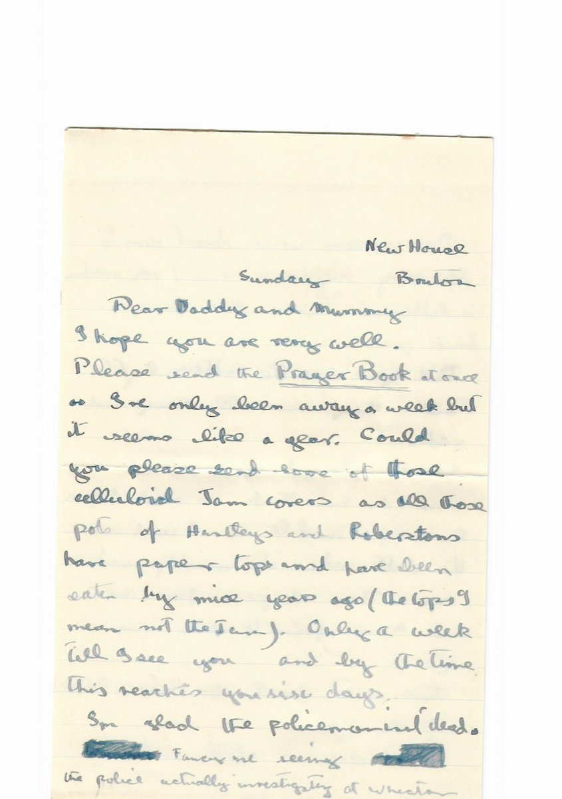
> 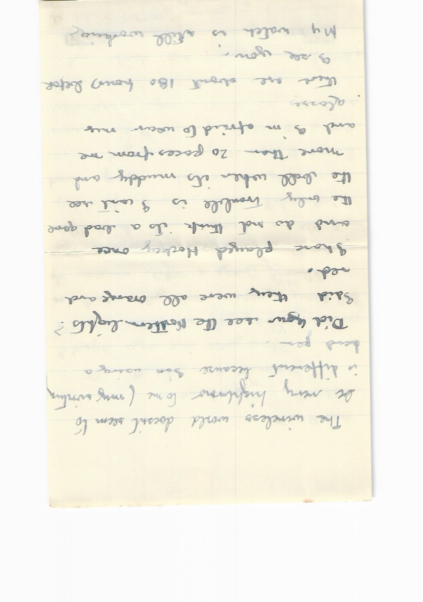
> 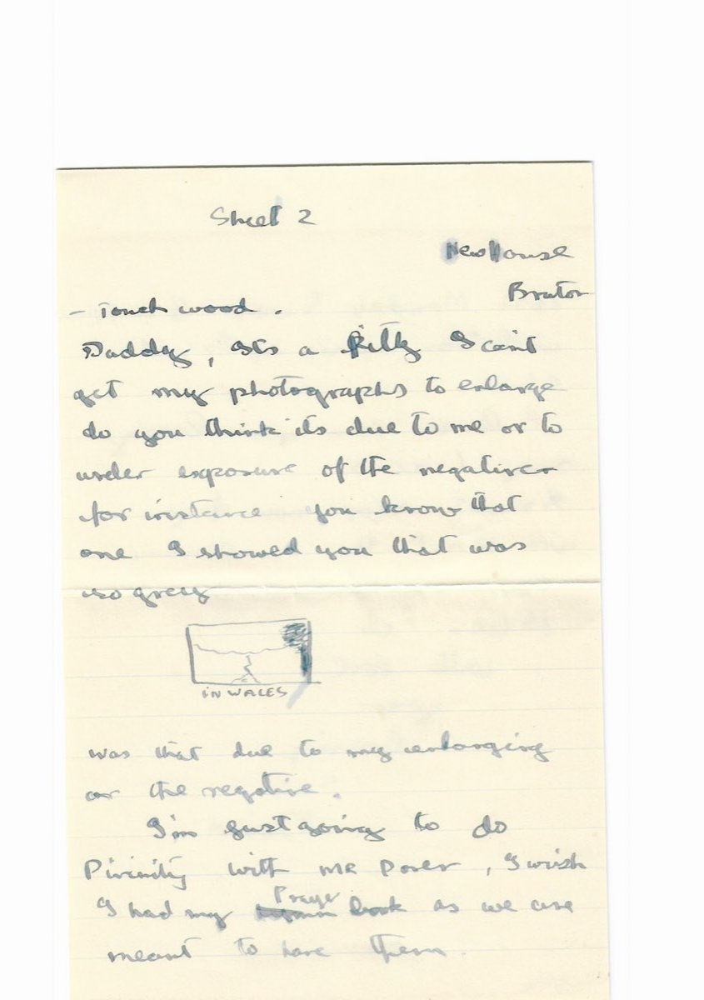
> 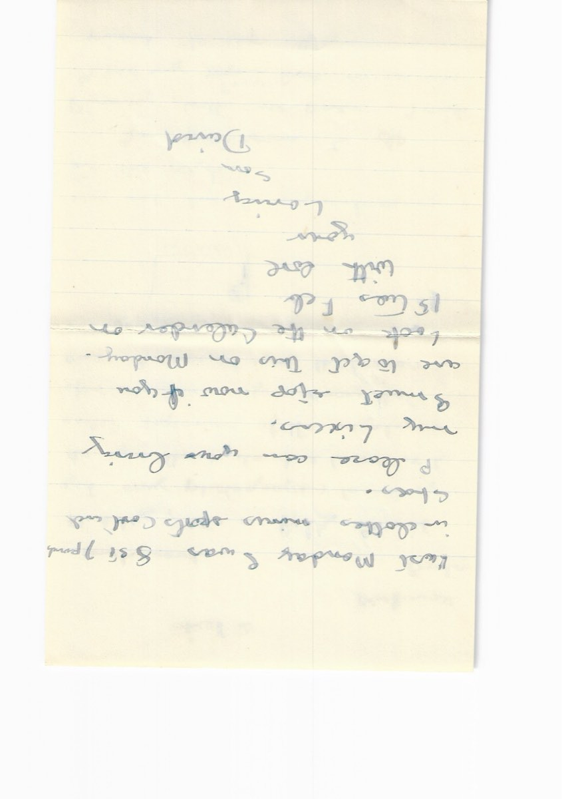

### 10. A Sunday, c. spring 1938

*Undated. Fagging, sports training, Country Life volumes, the drawing report from Mr Jenkins. Probably spring term 1938.*

> *(p. 1)*
> Kings School
> Sunday. Bruton
> Dear Daddy and Mummy
> I hope you are very well Only two weeks on Tuesday till I see that sounds rather a long time its sounds better to say a week the tuesday after next, anyway its not very long. What a pity you couldn't come up its such a lovely day.
> The bound copies of Country life have just arrived there's a place near ~~Widcombe~~ Bath called Widcombe manor it describes it also there's a place within a few
>
> *(p. 2)*
> miles of Lacock called Corsham I think it is - wait a minute I'll go and look at country life they are all in here after five minutes I've found it — Corsham Court & Wiltshire — Built in 1582 it became the home of the Hungerfords — The Bath road skirts the south side of Corsham Park before going through the village. The trouble is it doesn't say if its open to the public its on the Chippenham - Bath road.
> I've only got two more fag-days
>
> *(p. 3)*
> Kings School
> Bruton
> I almost wish I had taken my camera in. Theres a photograph I want to take from pigeon tower.
> I like sports training I'm in the ~~[struck]~~ M.O.B. I manage to get quite a lot of walks I went for one on Tuesday, Wednesday Saturday and I shall go out this afternoon. I've just caught sight of Daphne pulling a woolley dog nearly as large as herself. Has Kit arrived? Work and Music are progressing moderately well I wish we had a better French Master
>
> *(p. 4)*
> ~~The~~ Mr Jenkins (who draws) came round to do our drawing Reports he put VG against Me isn't it lovely! I'm afraid My letters get shorter and shorter, I must write to Wiggs and Nanny. I'm reading "Thatched Cottage" By Beverley Nichols its jolly good I'll say goodbye Now but add some more after church
> With love, your Loving Son
> David
>
> *(p. 5)*
> Kings School
> P.S. Bruton
> Somebody's pinched hundreds of my envelopes. Isn't it awful two people have had 10/- notes pinched and electric light globes have been pinched as well as minor ~~[struck]~~ sums. And Parts of bycicles have been removed Dynamo sets and 3 speeds.
> Hullo, I've just come out of church. The vicar preached quite a good sermon today.
> I don't know how I'll get all the Tins in my locker
>
> *(p. 6)*
> into my Tuck-box.!
> Mr Wheatley the Bursar is rather a nice man I should think he ways about 18 stone he has a face like this
> [Drawing: a plain circle on a pair of sloping shoulder lines.]
> of course he has a nose and eyes and a mouth and hair only I'm not very good at drawing them.
> Goodbye

> [!scan]- Scans (6)
> 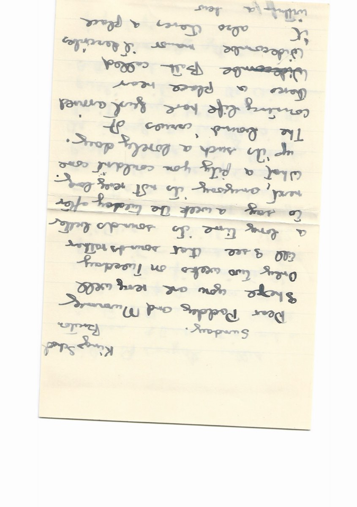
> 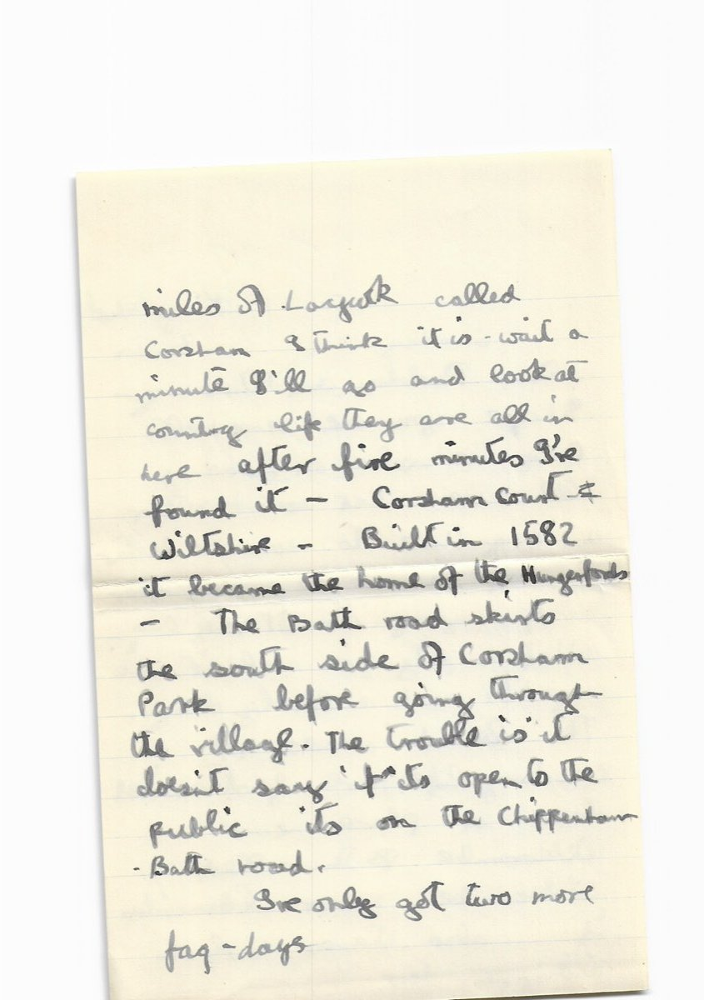
> 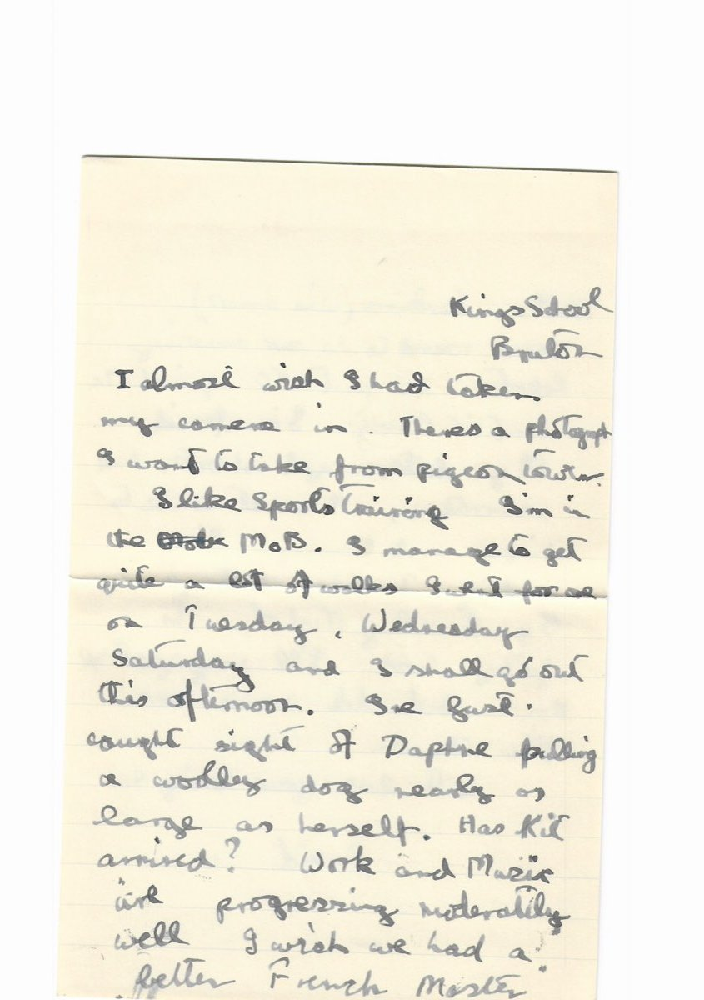
> 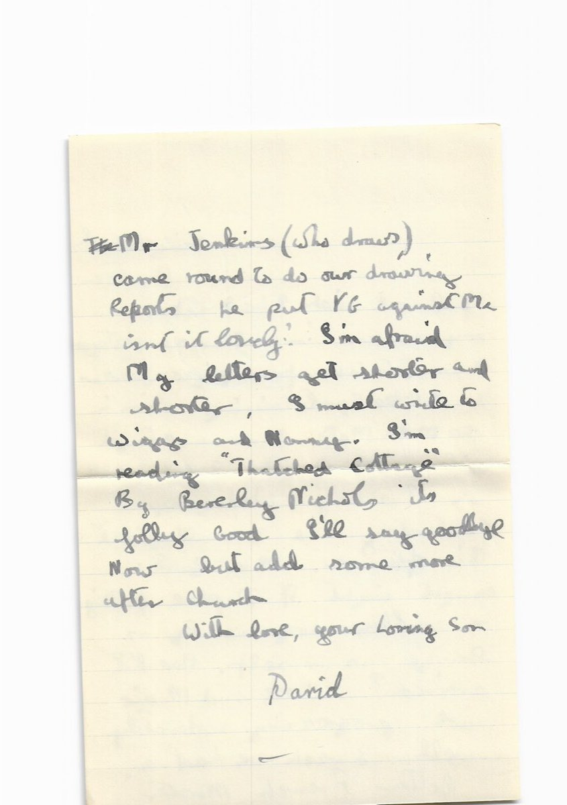
> 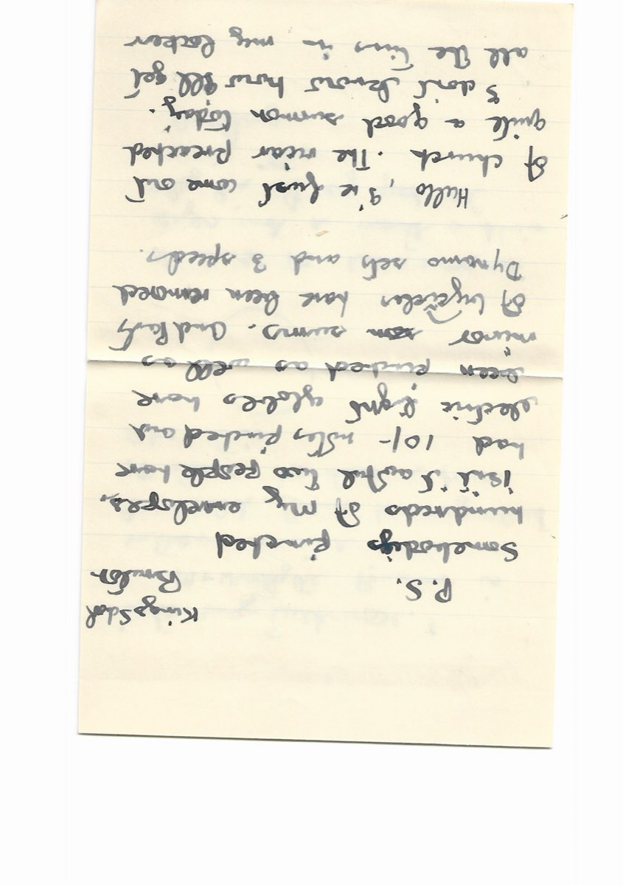
> 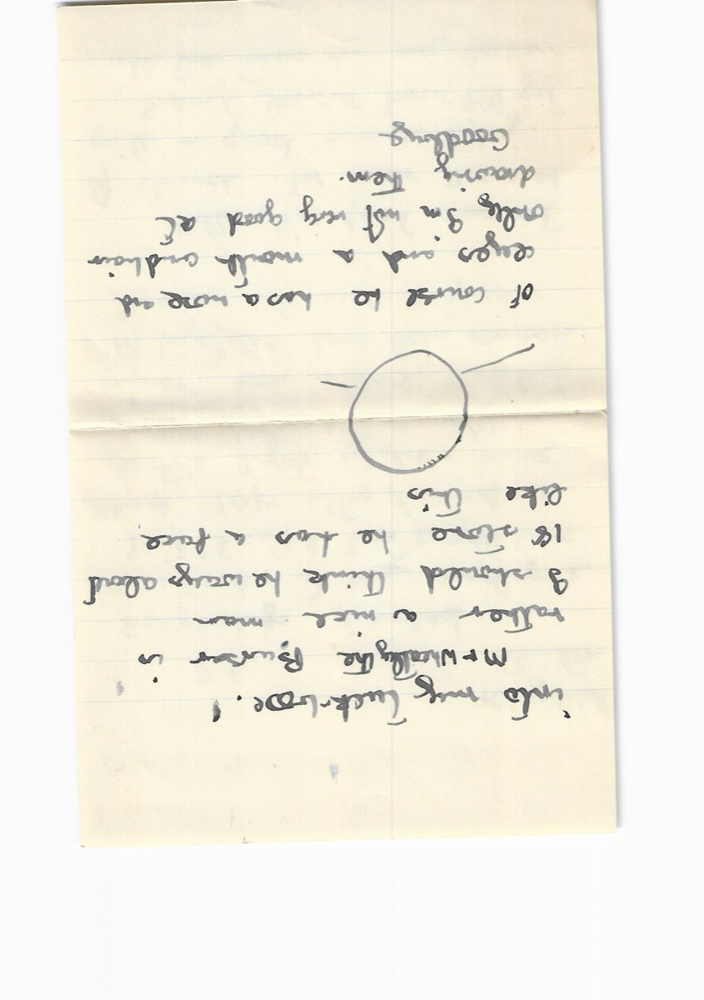

### 11. A Sunday near the end of a spring term, c. 1938–39

*Undated. End of term "a week on Tuesday", hockey team photographs, sports training, a debate "This house favours friendship with Germany" — spring term 1938 or 1939.*

> *(p. 1)*
> [sheet number] 1.
> Kings School
> Bruton
> Dear Mummy and Daddy
> I hope you are very well, isn't it marvellous a week on Tuesday. I've run out of toothpaste could you send me one of Philips Dental Magnesia and one of something else please. Sladen has been reading the "Speckled band" to us. Time goes very slowly now. I believe I'm getting thinner I weigh 8 st 4 lb. Class begins shortly so I shall have to stop till after church. Can I please have a new toothbrush when I get home
>
> *(p. 2)*
> One more Drawing lesson
> " " Music "
> 2 more O.T.C. parades
> 1 more signaller
> isn't it marvellous.
> Daddy I wish you could be here at the end of term concert as they are going to have some (~~marvellous~~) Strauss waltzes with orchestra.
> Kit's books are very popular I want to read "Hymalayan Campaign" which is one of them but I can't get it out, people have always got it.
> I shall be glad when the end of term comes as I am bored with school
>
> *(p. 3)*
> [sheet number] 2
> On Friday night Nellie Carson and Cuthbert Kelly performed there were only just enough people to fill the front two rows and a half the next ~~[struck]~~ 17 were visitors. It was fairly good but the sort of thing you would hear on the wireless, ordinary sort of songs. Last night somebody gave a lecture on Foreign Mission There was also a Debate, the motion was "This house favours friendship with Germany"
> Mr Yeats Brown (known as Y.B.) and Long for the motion and MR Smith and one of Fellows's [?] against it, Y.B won.
>
> *(p. 4)*
> Mr Yeats-Brown has a brother who writes in the "Daily Telegraph" he also writes novels. He also has another brother who runs ~~[struck]~~ in things (~~[struck]~~ "and wins them.
> Y.B is very good at fives and he runs jolly well but he doesn't seem to teach as well as Tom. Nicholas has a wonderful sand-cart (I wish it was mine) its just like those ones I used to have and Daphne has a duck on wheels Daphne likes the ~~[?]~~ Cart best and Nicholas the Duck.
> I love sports training but when I get threequarters
>
> *(p. 5)*
> [sheet number] 3
> round the course I develop the most awful headache and the skin on my forehead feels as if it is going to peel off at any moment otherwise I think I would be in the Junior specialists
> Have you been getting my letters alright as Pirkes [?] said something about the Bursar and him have both found that their letters have not reached their destinations.
> The people who take photographs of the teams (Hockey) seem to charge an awful lot but it costs them enough as the plates are 12 X 10 the camera ~~[struck]~~ goes down to S.6F ~~[struck]~~
>
> *(p. 6)*
>
> *(p. 7)*
> 2 boys were playing with the fish in the aquarium and one seemingly died so they hastened quietly away and buried it a minute or so later they wondered if it really was dead so they unburied it and it was perfectly alright so they put it back in the museum and it is still alive
> Tonight Philip will give a lecture on birds with gramophone records, I shall go to it.
>
> *(p. 8)*
> Kings School
> Bruton
> I'm sure with your camera you could take just as good photographs.
> I've made rather a muck of this letter as I have begun to write some more on another sheet before I've finished this one so there will be a bit of a gap here. Oh no it's alright. I really ought to stop soon but I don't seem as if I can. I really must as the dinner bell went ages ago and there won't be time to write more after dinner
> with love
> your Loving Son
> David

*Notes:* Mr Yeats-Brown's brother is presumably Francis Yeats-Brown, author of "Bengal Lancer". "S.6F" — probably f/6 or similar aperture marking. "Philip" here is presumably a boy/master at school, not the brother — or possibly brother Philip visiting.

> [!scan]- Scans (7)
> 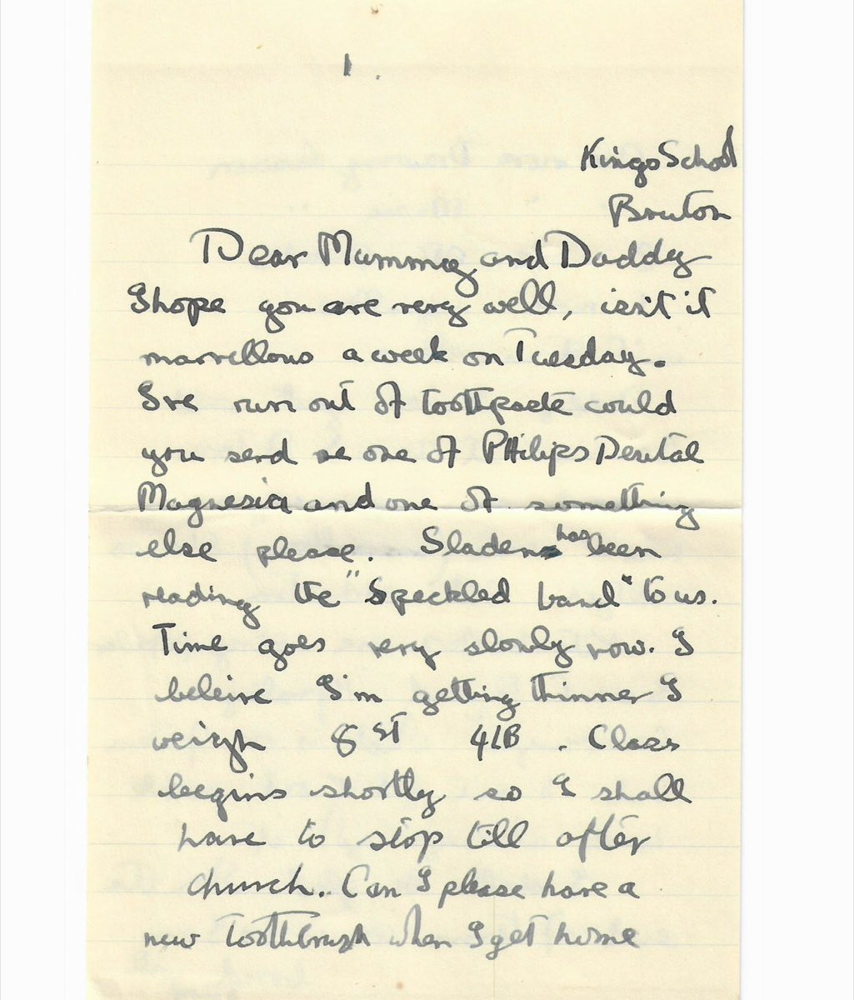
> 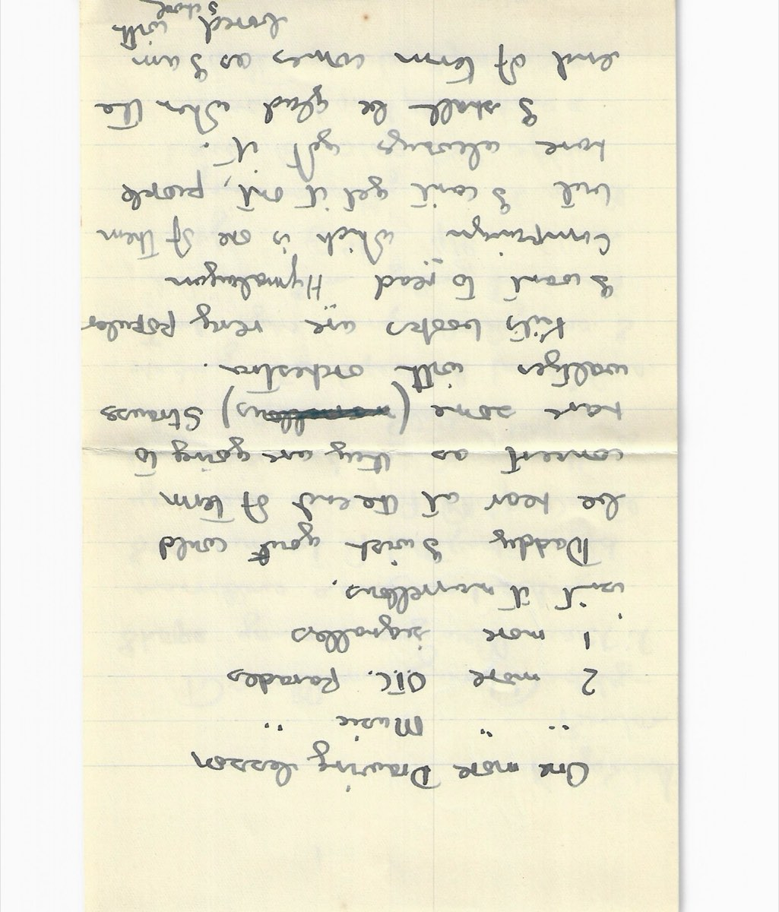
> 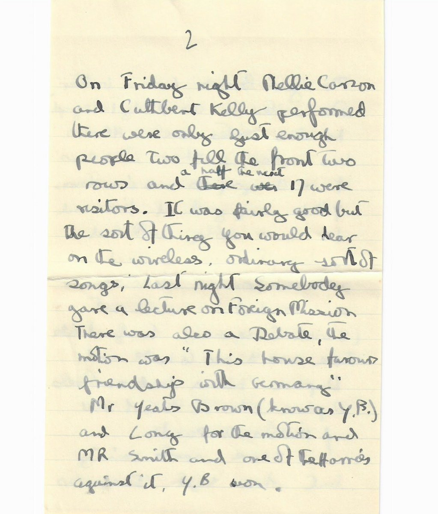
> 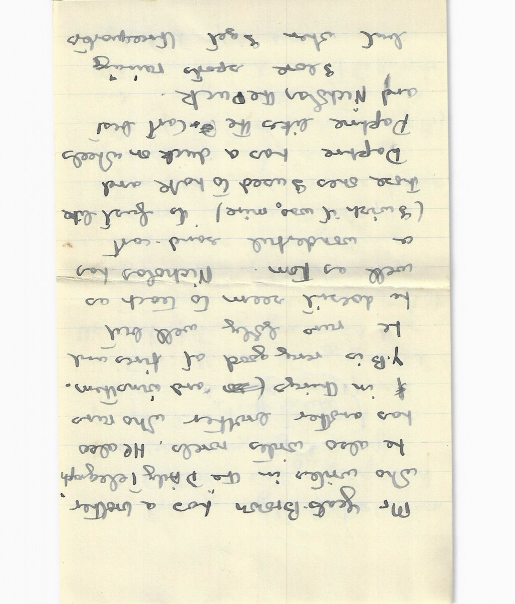
> 
> 
> 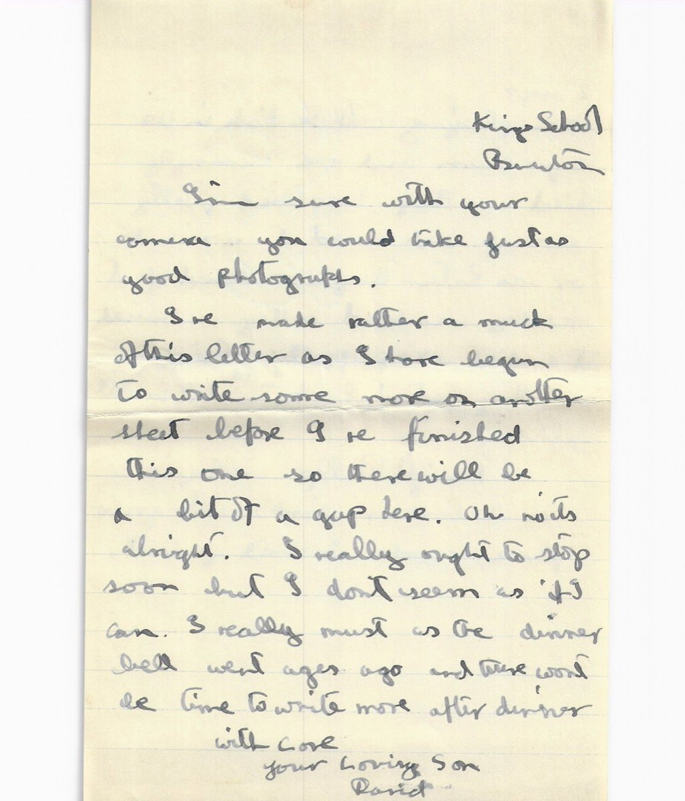

### 12. Early in a summer term, c. 1938

*Undated. "6½ weeks to Corpus", new tuck shop, three new boys. Probably summer term 1938.*

> *(p. 1)*
> Kings School
> Bruton
> Dear Mummy and Daddy
> I hope you are very well, isn't it awful being back at school and its 6½ weeks to Corpus. I wish I had brought a book back as at first you have such a lot of spare time, can you give me Nanny's address please as I have forgotten it again
> I am enclosing the calender.
> Please bring my camera up next 3rd Sunday
> Has Philip gone yet?
> The trouble is there's nothing to
>
> *(p. 2)*
> do and I wish the term would hurry up. I don't know if there will be any work this morning. There are ~~two~~ three new boys this term two twins in the Old house and one boy called Lemon in the new. I can't think of anything to read in the library can you tell me some book which you think is in the library which is good.
> This new pen is running well, but I am afraid my writing is rather spidery. A new tuck shop has been presented which is in the paddock behind
>
> *(p. 3)*
> the new house. The weather here is very grey and I'm bored stiff
> isn't it awful I wore a ~~[struck]~~ black ~~[struck]~~ pair of ordinary shoes up to cricket and somebody else went away with them I shall have to tell the prefects if I can't find them.
> Can you send my Oxford Psalter its a little brownie-red book
> I shall stop now
> with love
> your loving son
> David
>
> *(p. 4)*

> [!scan]- Scans (3)
> 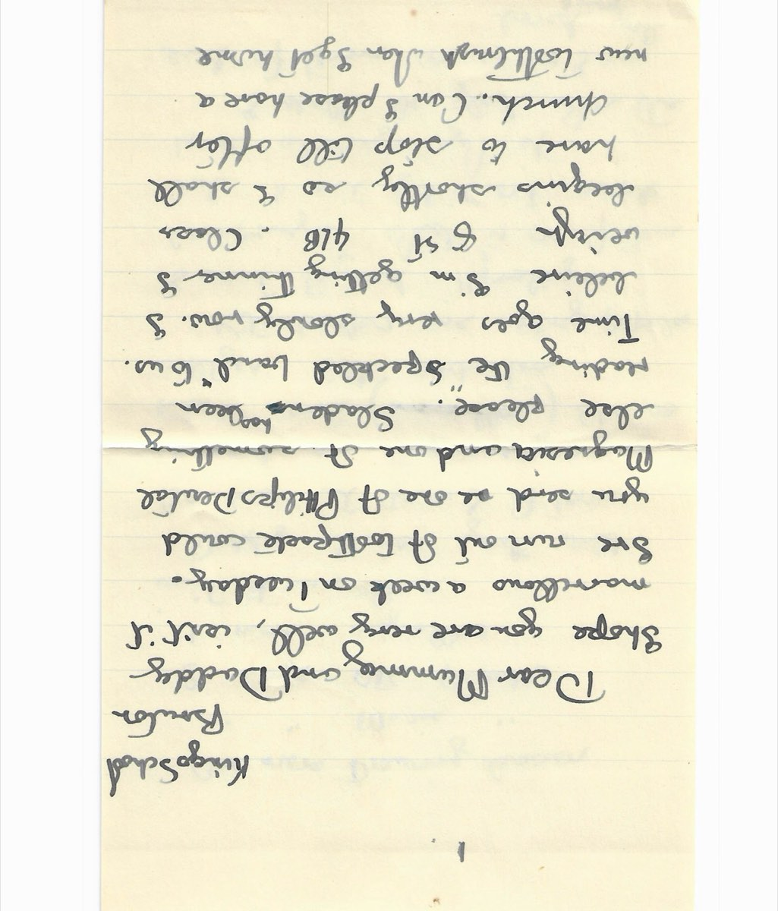
> 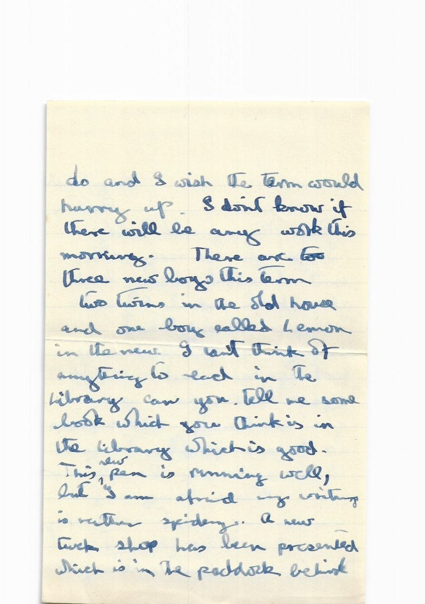
> 

### 13. A summer term, c. 1938–39

*Undated. Cricket, botany, the sawmill log tractor, the boy's enlarging lecture (also mentioned Oct 1938).*

> *(p. 1)*
> Kings School
> Bruton
> Dear Daddy and Mummy
> I hope you are very well, it seems ages since I saw you. cricket has begun properley now. Yesterday Mr Yeats Brown, Tommy, (who looks after games) and the head master and the bursar and some others played the first XI. Wasn't it remarkable this morning we had grape fruit for breakfast and once we had tomatoes at dinner.
> Are there English new potatoes yet? I say Daddy when do you plant Convolvuluses as
>
> *(p. 2)*
> I meant to sow some.
> We are doing botany and it is jolly good because we go out in school periods in order to collect flowers.
> I rather wish I had my camera here, as there is something I would rather like to take, its not pretty but it would be rather good its the sawmills with the log tractor going in and from a certain view it would look rather good.
> I'm reading an autobiography (at least I think its one) Its called
> Days of My Years
>
> *(p. 3)*
> By Sir Melville Macnaghten Late Chief of C.I.D. Scot: Yard 1914 I don't think its a very good book.
> I hardly ever have time to go for walks this term, I also wish I had my bycicle here but it would only get ruined
> In this weeks auto car theres ~~[struck]~~ a supplement on various counties I'll go and look at it ras. anything about Yorkshire or Tenby when I've finished and put it at the end of this letter
>
> *(p. 4)*
> Oh by the way the score of that match 245 we made it was a draw Sladen made 61 yesterday the match before he made 101 at his brother 48. Harries made 100 yesterday.
> Its just going to be class so I'll have to stop till after church.
> A boy here has got a F.4.5 Compur shutter on a £9 Voigtlander like yours Daddy and when he has set his shutter he can alter whatever he likes. Why can't Philip?
>
> *(p. 5)*
> Its marvellous weather here. I should think I could give a 1/25 between 10 am – 5 pm now.
> If you make a view finder is the only way ~~[struck]~~ to test how much the camera gets in, ~~[struck]~~ to take a photograph of something say a brick wall, and then mark it where the corners of the photograph come. And from the same distance away arrange the view finder so that it only just gets the ~~cross~~ mark on the wall just in? I'm afraid that sounds very involved but is that the only way to test
>
> *(p. 6)*
> only I want to make a view finder.
> I think perhaps its a good thing I haven't got my camera or I should take ~~[struck]~~ worthless photographs all the time.
> Liddell is giving an enlarging lecture the same as Christopher's
> I must stop now. The Lime juice is very good.
> with Love
> Your loving
> son
> David

*Notes:* the boy's enlarging lecture is probably the one described (fogged first sheet) in the 30 Oct 1938 letter, scan 145 — so this summer-term letter is likely 1938 or 1939.

> [!scan]- Scans (6)
> 
> 
> 
> 
> 
> 

### 14. A summer term, c. 1938

*Undated. Wants a Purma Special camera (introduced 1937); may join the band next term.*

> *(p. 1)*
> New House
> Kings School
> Dear Mummy and Daddy Bruton
> I've suddenly remembered I must write to Granty so I'll write directly I've finished this.
> Daddy, have you ever seen a Purma Special (camera) as I've suddenly had a mad desire to buy one when I've saved up enough money.
> This will probably end like most of my ideas because I shall find something better to buy but still this is its specification
>
> *(p. 2)*
> Purma Special
> 16 photographs on a V.P. film 1¼" square. It has a F6.3 lense (fixed stop 6.3)
> Speeds 1/25 1/150 1/450
> The lense is a Beck it has a telescopic view finder it looks like this (something like this I mean)
> [Drawing: a small oblong camera seen from the front, with a round lens in the centre and the viewfinder on top.]
> you can buy a ~~[struck]~~ leather case extra a portrait lense. It has a ~~shutter~~ lense cover
>
> *(p. 3)*
> New House
> KSB.
> that opens when the shutter opens. The speeds work automatically (I don't know what it means but thats what it says)
> It is made of stuff like vulcanite and I should think if you melt it in one place you could fit a bush socket in. It's in focus from 12 feet to infinity. You can buy a portrait lense you probably know all about this camera its really a cheap imitation of a Leica it costs 50/-
>
> *(p. 4)*
> Anyway Mummy please get the A.P. that came out last Wednesday and give it to Daddy and bring it up on Sunday leave. The exposure meter in it is a new kind but not so good ~~good~~ as the one you add up. Its the Novices number and it has an advertisement of the Purma Special.
> I've written to Granty just now. I might be in the Band next term. must stop but I will write on Wednesday
> With love
> your loving
> son David

> [!scan]- Scans (4)
> 
> 
> 
> 

### 15. Shortly before Corpus Christi, c. 1938–39

*Undated. "95½ hrs to Corpus"; pictures up in the art room.*

> *(p. 1)*
> Kings School
> Bruton
> Dear Daddy and Mummy
> You will be surprised to hear I've got two perfectly rotten pictures up on the walls of the art room for Corpus.
> By the time you get this letter it will 95½ hrs to Corpus.
> Hodson (you may have heard me tell you of him before, because he is a very ~~drawer~~ draughts man or whatever you call it) has got about 40 pictures up he made them out of his head and they are jolly good.
>
> *(p. 2)*
> The film I am using is the remains of my panchromatic film that got torn in half, the winder stuck so Rickers let me put it right in his dark room I don't what's wrong but something is wrong with my camera. Anyway I should have got to number 7 in the window or number 6 and I'm at no 5 so when I get home I shall have to rewind it.
> I shall see ~~you~~ you at St Davids usual time.
> Will Kit be at home? I don't believe he will, will he?
>
> *(p. 3)*
> Lloyd Price said he thought he would is iodine a bleacher Daddy because I feel as if I'd like to take a print draw over the main details with Indian ink and then bleach, I saw an article on it in the A.P. in connection with machines and how the best way of drawing them is.
> I'm afraid that A.P. you ordered was not really worth ordering now I come to think of what it had in it but some of the advertisements are quite interesting. Its been beastly and thundery here for the last few days
>
> *(p. 4)*
> I've just had to go up the town to get MRS Dover a can of petrol as she's run out, I then found I couldn't get in the tank of the car (Wolsley) as the bumper was in the way, went down to Nellie in Plox didn't know she was deaf shouted my head off she hadn't got one in the end Rickers lent her one
> I must stop now as post is just going
> With love
> your loving son
> David
> I'll see you on Thursday.
> After Church Probably

*Notes:* St Davids = Exeter St David's station — he is coming home for the Corpus Christi break.

> [!scan]- Scans (4)
> 
> 
> 
> 

### 16. A summer term, c. 1938–39

*Undated. Less than three weeks to Corpus; measured at 5 ft 9 in the gym.*

> *(p. 1)*
> [page number] 1
> New House
> Kings School
> Dear Mummy Bruton
> I hope you are very well, you will be able to come up on Sunday won't you?
> Please could you bring a good tennis racket and case in the car I don't know if I had better bring it to school or not but we can see about that in the car.
> Could you please bring my camera up on Sunday.
> If you haven't thought of or made anything for Sunday dinner do you think we could
>
> *(p. 2)*
> have Cornish Pasties with Potatoe pastry please?
> If you have thought of anything better or made anything please do bring it up instead.
> Can you bring Cereals up please and biscuits but I have plenty of jam. I hardly ever eat any marmalade at breakfast and I still have 1 and ¾ pots of it, however its nice at tea sometimes.
> I do hope its fine on Sunday as its very cold, windy, and grey here.
> I'm afraid this letter is all about food only
>
> *(p. 3)*
> [page number] 2
> King School
> Bruton
> I sometimes wonder if you have enough to go upon as I never tell you what I like. The biscuits in the Palmer and Huntley were lovely and ~~so~~ the Cadburys Red Gold Blue ones were very nice. Do tell Daddy what asses some people are here. They take 1/25 of sec at F11 on a dull day when its nearly raining between 5 and six on a Selochrome film at about 70 yds from some cricketers correct exposure being about ¾ sec
>
> *(p. 4)*
> its less than 3 weeks isn't it? to Corpus, I'm reading the Arches of the Years, which Kit presented; they have just sent an advertisement from Borrough Wellcome to Kit I forwarded it was it ~~[struck]~~ alright to forward it it only had a ½ stamp on but it was printed matter.
> I've written to Christopher, Wiggs and Nanny. My worst trousers other than my new ones are the only ones that will fit, isn't it awful the other pair are in quite good condition but are too short
> I ~~[struck]~~ was measured in the Gym and discover to my great surprise that I'm 5FT Nine Must stop now. with love your loving [signature cut off]

> [!scan]- Scans (4)
> 
> 
> 
> 

### 17. Summer term, c. July 1938

*Undated. Mr Wasdell leaving, exams on Monday, corps finished for the term, can't afford the Bournemouth trip. Probably July 1938.*

> *(p. 1)*
> Kings School
> Bruton
> Dear Daddy and Mummy
> I hope you are better, Daddy, I have an idea for getting the rabbit out of the mould, get a large sheet of cellophane put in to the mould and press it down into all the dips then fill it with cement when its set the mould comes off leaving the rabbit covered in cellophane scrape this off. Only 3 more Sundays counting this and one of them I'm with you.
> The school is going to
>
> *(p. 2)*
> a fund for Mr Wasdell as he is ~~[struck]~~ leaving and I'm almost broke as I have just bought a lovely tinting (liquid) outfit its all going to be collected on Friday next, Can you send me some money? as it would look awful if I could only give ~~him~~ the fund ~~a~~ next to nothing. I hadn't forseen this or I would have kept some money in hand. All corps is at an end no more P.T. and possibly no more Early school. Exams on Monday.
> My worst competitor in
>
> *(p. 3)*
> English hasn't come back since Corpus so I feel very hopeful. I haven't bought anything at the Tuckshop as my locker is still keeping me going.
> The tinting set cost 3/- new I bought for 1/-. I wish it wasn't so hard to save money here, and that the tuck-shop didn't sell ices. Its a lovely one all the colours are washable in the instructions (but I don't believe they are).
> The colours in it are lovely different kinds. Pink Violet light blue dark blue red brown
>
> *(p. 4)*
> light green dark green brown yellow scarlet. You know that picture of ships at Newlyn of Kit's that I coloured it would do that beautifully. I'll write to you on Wednesday.
> Please could you bring my photograph album up on Sunday, its a granite covered one its either in my photographic draw, my bedroom, the study, or the drawing room (in order of likelyhood). I can't go to Bournemouth after all as it costs 6/6 (you know the musical society thing).
> I hope that Rabbit idea work because it would be awful
>
> *(p. 5)*
> if you had to ~~[struck]~~ cut the mould off it. I hope to get an mouse proof locker next term. Its no use bringing up biscuit tins that ~~[struck]~~ are the kind that the lid gets out of shape as mice climb through cracks this size
> [Drawing: a biscuit tin with its lid sitting askew, the gap labelled "CRACK".]
> They awful they soon helped me to eat the cheese biscuits. Has Pusey said that he is coming home and is there any likelyhood of me
>
> *(p. 6)*
> getting that camera.
> I have taken one photograph to test the difference between a ISS Pan no filter and a verichrome 5+ filter I want to see how much better the Verichrome is.
> I must stop now I ~~[struck]~~ am afraid this letter is a very short one. I hope you are better Daddy
> With love
> Your loving son
> David

> [!scan]- Scans (6)
> 
> 
> 
> 
> 
> 

### 18. Summer term, c. July 1938 (two weeks before the end of term)

*Undated. Postal orders for the Bournemouth trip "the last Saturday in term", the Harry Wasdell fund, exams begun. Probably July 1938.*

> *(p. 1)*
> Kings School
> Bruton
> Dear Mummy
> I received the postal orders intact this morning but I am afraid I may not be able to go to Bournemouth as we were meant to tell Mr Smith on Saturday also I'm not sure if the 6/6 includes tea, I'll ask Mr Smith about these two things it may be alright of course. We are going the last Saturday in term.
> If I can't go can I take 1/6 out of the 6/6 to add to Harry Wasdell's fund as I think most people are giving
>
> *(p. 2)*
> about 2/6. James sent me a lovely Postcard which I have coloured. Please can you look out a pair of white cricket trousers and bring them up on Sunday ~~please~~ as I find that I may have to play in the Junior house match I hope not anyway. If you receive a postcard on Friday could you please pack them off by the next Post as I might want them on Saturday. If there are none in the house do not bother as I can borrow some I hope.
> Only two weeks today to the
>
> *(p. 3)*
> end of term
> I've got some quite good news for you but I won't tell you till Sunday as it may be better by then I hope so anyway. We have begun exams by the way.
> Isn't it surprising ever since Corpus we have been having fairly new potatoes with butter on them and sometimes beans. Hows my potato in my garden by the way? We have had 6 exams so far, 3 Frenchs 1 latin 1 ~~[struck]~~ Geometry, English Essay.
>
> *(p. 4)*
> I've just been fagging next Easter or Summer term I may get off fagging with any luck.
> My colour attempts with tints have been quite successful please don't forget to bring the album up on Sunday.
> Only 4 days till I see you again.
> For food please would you bring one pkt of Kellogg cornflakes 1 PKT Biscuits. I've got enough Marmalade and so I will eat it at tea otherwise I won't finish it. I'll bring tons of Jampots out and some
> [continues]
>
> *(p. 5)*
> Tins, can you please remember to give me Kit and James' addresses.
> Must be stopping now Goodbye till next Sunday.
> Don't get too hopeful about the good news ~~and is~~ as it isn't very important
> With love
> your loving Son
> David
> [Drawn in large decorated capitals:]
> G.S.R.
> WILL CONVEY YOU ANY WHERE
> EXCURSION TICKETS SOLD NOW
>
> *(p. 6)*

*Notes:* probably the Bournemouth concert trip described in scans 28–29 (Percy Whitlock, Pavilion), so summer term 1939 (or 1938).

> [!scan]- Scans (5)
> 
> 
> 
> 
> 

### 19. A Sunday at the start of the autumn term, September 1938

*Undated. Kit has left (prefects listed for him), atlas lost, rumour of a bomb- and gas-proof shelter, "Chipsticks" requested (received in the Oct 1938 letter) — September 1938.*

> *(p. 1)*
> Kings School
> Sunday. Bruton
> Dear Daddy and Mummy
> Thank you very much for your lovely letter and please thank Kit for his, I shall be writing to him shortly. Ought I to write to Nanny say how sorry I am about her mother as it's very awkward to write a whole letter on it and you can't very well change the subject directly you have begun talking about it. Has Kit sent the Prints to the Manchester Guardian.
> I'm so glad Timmie's better but he's taking a long time to recover isn't he?
>
> *(p. 2)*
> please tell Kit that every one he knew has not left, the prefects are:—
> New house: Davies, Beaman, Grogan, Ambrose, Long
> Old house: Harries E.N., Harries F.W., Jennings, Stansbury C.N.
> School seems very boring this term nothing other than Sunday leaves happens till about half-term.
>
> *(p. 3)*
>
> *(p. 4)*
> I have had one extra Latin lesson, he seems to have taught me quite a lot in one lesson, musics going well as well.
> My atlas seems during the holidays to have been spirited away. I have looked everywhere but people have a habit of removing the leaf of a book on which the owners name is written and then removing the book. I think this may have happened in this case, Which shall I do get a new atlas or use the one you have at home if its brought up on Sunday. That dark blue one is perfectly satisfactory if its alright for me to have it
>
> *(p. 5)*
> There are 11 new boys so I won't be able to get off fagging. But I may be able to next term. I am enclosing if I don't forget, the School Calender. In one place in the term there is a gap of five weeks between Sunday leaves.
> Is Exford anywhere near Exeter as on 20 Nov someone is coming to preach from there.
> 17 [struck-through figure corrected to 17] days till I see you, it seems as though I have been away a long time although its only 1 day.
> I think my Sunday
>
> *(p. 6)*
> trousers are longer than I thought they were. But I won't change on Sunday leave I'll wear my blue clothes.
> My shoes are improving rapidly so unless you have posted it I don't think there will be in any need for the trees (I don't know if thats spelt right).
> Time seems to pass very slowly here ~~[struck]~~ If four new boys come next term I shall be in the senior prep room.
> ~~I think I'll stop now and go on tomorrow.~~ [struck through with a zigzag]
>
> *(p. 7)*
> If you haven't already written to Daniel Neal please could you wait until Sunday as my trousers aren't half as bad ~~[struck]~~ as ~~[struck]~~ some other peoples, my coat would be alright if you could let the sleeves down.
> If however you have written already written, I'll try and wear these out first.
> The trouble about them is, is that when I make my trouser legs the right length the seat is much too low down.
> I am reading "MR Fortune, Please." I heard one the
>
> *(p. 8)*
> mysteries ~~[struck]~~ in it on the wireless last holidays.
> They haven't installed electric light in the tuckshop yet so every evening purchasing is done in torch light.
> There is a ~~[struck]~~ rumour which is probably unfounded, that they are building a bomb and gas proof shelter for the school.
> My shoes are perfectly alright now
> Mr Yeats-Brown is quite efficient contrary to everybody's expectations at O.T.C.
> Later in term we are
>
> *(p. 9)*
> to do evening prep in the afternoon and night marches with compasses in the evening.
> I must stop now or I shall miss the post.
> with love
> your loving son
> David
> P.S. Please On Sunday could you bring up a tin of "Chipsticks" the stores will sell them probably, they are potato crisps. Could you bring also please between 4 & 6 sausages. Well Goodbye till Sunday.
>
> *(p. 10)*

*Notes:* Beaman, Grogan and Long appear in the 1937–38 letters; Long is still a prefect in Sept 1939 (scan 200). This letter is probably September 1938 (start of the autumn term after Kit left). compare scan 96 (Oct/Nov 1938): "That Atlas won't do, shall I get a new one?" — supports autumn 1938. the Chipsticks arrive in the Oct/Nov 1938 letter, scan 93 ("I received the Chipsticks plates and purse") — confirms autumn 1938.

> [!scan]- Scans (8)
> 
> 
> 
> 
> 
> 
> 
> 

### 20. Sunday 30 October 1938

*Dated "Sunday 30 October"; a Sunday in 1938. The Stanley Bell entertainment and Hitler jokes.*

> *(p. 1)*
> [sheet number] 1
> Kings School
> Sunday 30 october. Bruton
> Dear Mummy and Daddy
> 50 days till I come home
> 55 to Christmas day.
> Its only just about half Term but I feel as if its quite near Christmas because it gets dark so early.
> The headmaster has prohibited fireworks until Nov. 5. however little bands of people laden with parcels keep popping in and out of the Town during town leave and numerous explosions are heard just as its getting dark.
> Will you be able to come
>
> *(p. 2)*
> up next Sunday leave (Nov. 13.) Mummy? I shall go mad if Dorothy talks as much as she used to.
> We had the entertainment last Tuesday. (Stanley H. Bell) I found I hadn't seen him before after all. He wasn't at all bad better than the others I've seen here but on the other hand he wasn't a patch on any I've seen at the theatre (2 to be exact).
> He did that trick were you put a rope through the sleeves of a coat ~~[struck]~~ while the person is wearing it and it looks as if
>
> *(p. 3)*
> [sheet number] 2
> it will pull the person who is wearing the coat in half and he pulls it and it comes straight out of his coat in one long rope with no knots or any thing. he did several card tricks, cut a bandage in pieces with scissors, showed you the pieces and turned into one again. he impersonated Hitler and various other people.
> He told us one joke which I believe is very old but is quite funny. this is it.
> Hitler was driving along in his car in the car, His chauffeur driving, when he ran into a pig
>
> *(p. 4)*
> Hitler said "you had better tell the farmer about it, while I sit and wait" so the chauffeur went off and Hitler waited and waited and at last the chauffeur came back with hampers of food ~~[struck]~~ and bottles and so forth and he looked as if he had been enjoying himself and when Hitler said "What did you say to make them give you all this" he ~~[struck]~~ said "Oh I just said 'I'm Hitler's chauffeur and I've killed the ~~[struck]~~ swine'". I hadn't heard it before but I believe its very old isn't it?
>
> *(p. 5)*
> [sheet number] 3
> All the food was just right on Sunday, Mummy; I wish you had been there. Somebody at school has made a Tractor like the one at the sawmills here it will pull a twenty foot piece of lead piping just like the real one, it digs itself into the ground and steers and has 3 gears and a clutch, its got a meccano clockwork motor for its engine.
> Have got one of those new tin openers, they are wonderful (actually they aren't very new). They cost sixpence I believe you can get them at Woolworth's.
> the person I cook with has one
>
> *(p. 6)*
> You just take the tin put it on turn the handle and its open leaving no jagged edges or anything its like this.
> [Drawings of the tin opener, two views: "left side" showing the cutting wheel at the hinge of two long handles; "right side" showing the butterfly key labelled "TURN".]
>
> *(p. 7)*
> [sheet number] 4
> They don't seem to wear out like most Woolworth things do so I don't think they can't be Woolworths.
> Its a horrible day its drizzled all day and its cold and yet its sultry.
> The "A.P." this week has got an exposure table like your outdoor one Daddy only for artificial light it looks to me jolly good but I don't know as nobody's used it yet. I wish they would make on for interiors non artificial light as well.
> We have started having
>
> *(p. 8)*
> fires in the dayroom (I don't mean accidental ones due to fireworks) on half holidays so I've been doing quite a lot of hot buttered toasting the only trouble is its not butter now any longer, they use stork margarine which is pretty foul stuff. I don't believe they are ever going to give us gas masks in this place, they probably don't think its worth it because apart from the school there are only a few half-witted indivuals in Bruton.
> I'm so sorry I didn't send you that P.C. saying
>
> *(p. 9)*
> [sheet number] 5
> I wanted on Sunday, however everything was quite right.
> By mistake Daddy I forgot to bring that pot of Jam in, in my pocket so I only brought one pot in, shall I get some at the Tuckshop when I run out?
> Its stopped raining but it looks as if theres going to be a cloud burst.
> Nothing seems to be happening in the near future except somebody giving a lecture on X rays Jennings I think but I doubt if he knows much about it so I'm going to go because I thing it will probably be rather funny
>
> *(p. 10)*
> the last lecture I went to by a boy was on enlarging and he fogged the first sheet of paper entirely thus sending his audience into hysterics.
> I'm getting excited about end of term already so is every body else I can't understand it as its such a long time 50 days. They played one of these new rugger league games a day or two ago the colours of the sweaters are terrificly bright, I shall have to stop soon as its practically dinner time.
>
> *(p. 11)*
> The dinner bell ought to have gone years ago but I never heard it so I hope it hasn't.
> It had, but I wasn't late.
> I must stop now as the posts just going:
> With love
> your loving
> son
> David.
>
> *(p. 12)*

> [!scan]- Scans (11)
> 
> 
> 
> 
> 
> 
> 
> 
> 
> 
> 

### 21. A Sunday, c. early October 1938

*Undated. Air-raid fire practice, the A.R.P. shelter not being built, the new rugger leagues (also in the 30 Oct 1938 letter).*

> *(p. 1)*
> New House
> Sunday. Kings School
> Dear Mummy and Daddy, Bruton
> isn't it amazing I haven't realized it till now, next Sunday is Sunday leave, I thought it was the Sunday after next Sunday.
> Tonight "Pete" is going to show some films for the first time this term. There is also I believe a musical society concert, though I'm not sure. Thank you very much for the tooth paste which I received in order. On the Tuesday after next Sunday there's going to be the entertainment. There doesn't seem to be much news
>
> *(p. 2)*
> except that I don't think they are going to build that A.R.P. shelter after all now.
> I think I forgot to tell you we did fire practice in case air raids, we all went up to our dormitories mine has some iron steps down the outside of the house but instead of going down these we all had to dash down the ordinary indoor stairs which are made of concrete. 3 others dormitories have a shoot which took them about ten minutes to erect they all went down these. Then they had one of
>
> *(p. 3)*
> life belt things which you go down on a rope like of that hotel you know.
> They are having Rugger leagues The Lions, The Griffins, the Dragons and the eagles. I'm a dragon and I shall have to wear a green rugger shirt eventually.
> I must stop now or I shall miss the post as I started writing rather late.
> With love
> Your loving son
> David
>
> *(p. 4)*

*Notes:* the rugger leagues are also mentioned in the 30 Oct 1938 letter (scan 145: "one of these new rugger league games") — so this letter is probably early October 1938.

> [!scan]- Scans (3)
> 
> 
> 

### 22. A Sunday, October 1938

*Undated. Harvest Festival; a debate on "The Price of Peace has been too high" (after Munich, 30 Sept 1938); Chipsticks received.*

> *(p. 1)*
> Kings School
> Bruton
> Sunday
> Dear Daddy and Mummy,
> It seems a long time since last Sunday, Yesterday I received the Chipsticks plates and purse all in tact, thank very much for them, I'm going to write to James shortly.
> What nice colours the plates are, I never knew you could get them in all those colours.
> What a pity Kit missed James and Philip, how long are Philip and Dorothy staying for?
> Daddy, didn't you say that K.B's are a little cheaper than other wirelesses and are Dutch?
>
> *(p. 2)*
> Somebody at School has one, very old indeed, with only two valves, it is a battery set, it didn't do much at first but he bought a "pix" ariel and now it works very well, it gets more stations I should think than Granty's but on the other hand it hasn't such volume as Grantys, I like its tone very much.
> Please could you send TOOTHPASTE as quickly as possible as I have run out of it for some time. That Boots Cold cure doesn't seemed to have cured me of an awful cold I caught, when we played rugger in rain and hail
>
> *(p. 3)*
> There was a debate last night. ~~Didn't~~ I went to it. The motion was "The Price of Peace has been too high". Proposed By Beddow, seconded Mullins. Opposed by Norman seconded Elgar. The opposition ~~[struck]~~ won (I voted against the motion). Approx: 37 to 11 votes. Tom spoke but left it a bit vague which side he voted for, as at the end he didn't vote at all. I do not know if I told you but a screen has been put up in church in memory of Mr Hughes I believe he was music master he died a year or two ago; you probably no more about him than I ~~[struck]~~ do.
>
> *(p. 4)*
> That Atlas won't do, shall I get a new one?
> Rugger seems to be pretty awful this term, we play in the pouring rain practically every day and all these new masters seem to have rotten new ideas for games. I wish Mr Venters was so hopeless at teaching as he takes us for all languages.
> This wretched cold seems almost to stop me thinking, up till now I've been taking cold cures ~~regularly~~ regularly but I suppose I better get matron to give me something for it, as they don't seem much good.
>
> *(p. 5)*
> I intend ~~writing~~ writing to James Christopher and Wiggs and ~~[heavily struck words]~~ Philip but whether I will remains to be seen, because I seem to be always intending to do things but somehow I never do.
> Has Wiggs gone back to Malabar yet? and please could you give me Kit's address as I'm not sure if he still lives in the college.
> Wasn't it awful about those 4 aeroplane crashes in lightning.
> I must stop now.
> With love your loving son,
> David.
>
> *(p. 6)*
> P.S.
> By the way its harvest Festival today. The decorations ~~wasn't~~ weren't frightfully good because there ~~wasn't~~ weren't enough of them.
> The headmaster hardly ever comes to church nowadays
> My overcoats lovely and warm.

*Notes:* the debate motion refers to the Munich Agreement (30 Sept 1938). With the new church screen (also mentioned in scan 38), this letter is probably October–November 1938. "I wish Mr Venters was so hopeless" — probably meant "wasn't".

> [!scan]- Scans (6)
> 
> 
> 
> 
> 
> 

### 23. Sunday 20 November 1938

*Dated "Sunday 20th November"; a Sunday in 1938. Next Sunday leave 11 December.*

> *(p. 1)*
> [Written across the top:] P.S. I swopped 4 ~~School~~ ordinary envelopes for 4 School ones, I think I got the better bargain
> Kings School
> Sunday 20th November Bruton
> Dear Daddy and Mummy,
> I don't think that projector would be of much use to me as I could only use it about once every holidays.
> Next Sunday leave is not next week Nov: 27 but 11th of December its a special service Sunday so I have to be in by 4.45, but I would rather get in about 4.30.
> There are two presents I would like that are just too expensive for Wiggs or Kit to give me, by the way I'm telling you
>
> *(p. 2)*
> these presents to give you ideas for what I want for Christmas, one is that aeroplane thing I told you about that went straight up and the other is the "Schuco Telesteering car" its got 4 gears and you can steer it while you are standing up its terrificly difficult not to knock the posts down they supply with it. It looks like this, Somebody has one at School
> [Drawing: a streamlined toy car with a long rod rising from its roof to a small steering wheel, labelled "STEERING wheel" and "2FT".]
>
> *(p. 3)*
> it goes beautifully, the four speed gear box is really only a governor like on a gramophone, The steering is amazingly difficult. Besides the car they give you 12 coloured posts 1 football [small circle drawn, labelled "This size"] and two steering wires, ~~[struck]~~ 1 long 1 short and a direct steering device like this
> [Drawing: the top of the car with a small knob, labelled "you turn this"; caption "Top of car".]
> when you pick the car up the engine stops and it also has a stopping lever
>
> *(p. 4)*
> its 3/11 I must ~~[struck]~~ write to you again this week as I'm afraid this letter will be rather short, the reason is that the Brue is rising and rising and it will soon flood its banks the field behind the New house is nearly underwater.
> This afternoon I mean to go to a waterfall about 1 mile up the Brue were there should be a raging torrent. I said the reason I was going to write a short letter was that the Brue was about to overflow what I meant was that I meant to go and see it overflow.
>
> *(p. 5)*
> both Granty and Martie have written to me to thank me for my Birthday cards, Martie spelt Somerset right this time, last time she put
> School house
> Kings School
> Bruton
> Summerset
> Granty seems also to have the impression I inhabit "School House" presumably meaning the Old house.
> Please could you send me some toothpaste as I have run out.
> If I possess a decent
>
> *(p. 6)*
> greycoat which is fairly large could you please bring it up next Sunday leave (11 December). Only a little while to Christmas, somebody told me that in London this Christmas all the shops will be shut the whole of Christmas Eve I hope they won't do the same in Exeter.
> Is the whole of the G.W.R. Station going to be changed
> I must stop now, I don't think I've put in any punctuation at all.
> With love
> Your loving
> son
> David.

*Notes:* Sunday 20 November 1938 — matches "Sunday leave is the 11th December" in scan 126. "its 3/11" — the price of the Schuco car (3s 11d), completing the previous page. "Martie" here — compare "Marjorie ... spelt Somerset Summerset" in letter 05 (Nov 1937). Probably the same person (Marjorie/"Martie").

> [!scan]- Scans (6)
> 
> 
> 
> 
> 
> 

### 24. Late November / early December 1938

*Undated. The term-prize books (Claws, A Book of Grey Owl), coat and "block" for prize-giving, Kit's offer to drive him from Taunton. These things are answered in the 9 Dec 1938 letter.*

> *(p. 1)*
> Kings School
> Bruton
> Sunday
> Dear Daddy and Mummy,
> I can't remember if you said from your letter which is in my other coat whether Christopher has come home the result is I have written a letter which I want to send to him, to thank him for a lovely box of biscuits he sent me.
> I have had to borrow this paper so that accounts for the colour.
> The prizes, sad to relate were not for photography but for work last term. One of the books I had to choose in a hurry and the result is that I didn't have time to write home and ask you if you could send me a Harrap catalogue it was ~~[struck]~~ that Panda Book by the discoverer of them in Tibet. However I chose another book which wasn't so bad. The other book I chose ought to be very good, I had to chose two prizes which
>
> *(p. 2)*
> cost both together 1 guinea. unfortunately I lost 3/- because I wouldn't think of a book for 3/- before J.B. sent the thing that they are all written on away.
> The books I chose were
> Claws 10/6
> (The life of an african lion with Photographs. True)
> Selection of Grey owl Stories called
> "A Book of Grey Owl" 7/6
> The "Claws" book is the one that I think ought to be very good. Please can you not forget to bring the coat and block ~~[struck]~~ up.
> I hope the coat is fairly clean as I want it to wear at the prize giving.
> Do tell Kit if he is at home that ~~[struck: would like to and]~~ I would like to meet him at Taunton if he would like to meet me as he wrote to me and offered to drive me from Taunton to Exeter at the end of Term
>
> *(p. 3)*
> [sheet number] 2
> I've been having an awful time finding out the authors an publishers of peoples prizes in the school and writing them on a great sheet of paper for Mr Yeats Brown (Y.B.) so that he can send them away.
> Y.B has now become the Bursar, the old Bursar has left.
> On Friday we had the boxing competition a thing they haven't had for ages, Beddow was champion of the school. Unfortunately I couldn't watch because on Friday morning after class (I had been feeling awful all the morning) I found I couldn't see properley and I felt as if I was going to be sick. I went up to Matron and she made me lie down on a bed in the sick-room during lunch and till write up to half past three and gave me some bicarbonate of soda and asperin and told me to go to sleep. I couldn't thing properly and just as I was going to sleep she came in to ask how I felt I don't know what I said but I think I just [last line cut off at bottom]
>
> *(p. 4)*
> When I woke up I felt quite alright and found it was 3 o'clock. Matron told me I could get up if I felt alright so I did and have been alright ever since she said something or other about my liver or something.
> Any way, I feel quite alright now which the main point, by the way I hadn't even a temperature.
> My knee though only a surface scratch hasn't healed properly, I wish you could do it Daddy, I haven't much faith in Matron she put on hot fomentations or something and nearly killed me the result is that today she stuck the lint on and told me to come up to her room if it slipped down or to fix it myself if it was at a meal time I had a look at it and discovered that the lint is firmly fixed to my leg by a clot of blood. She has invited me to come up and listen to the wireless and read the papers when I like, I don't know if I shall however as its very difficult if you come into her room and she says "What can I do for you" and you say "Nothing" and sit down and read the paper as if the room belonged to you.

> [!scan]- Scans (4)
> 
> 
> 
> 

### 25. Late November / early December 1938 (last page only)

*Fragment (last page): "Sunday leave is the 11th December", end-of-term feast plans.*

> *(p. 1)*
> Sunday leave is the 11th December
> On Friday evening, We had that lecture on America it was very good and lasted from 8–10 pm please excuse the change in paper.
> I must stop pretty soon. Mummy various people of whom I'm one have arranged to have a feast at the end of term every body seems to have them. there about four of us and we are all contributing something to eat, ~~[struck]~~ do you think you could possibly think of something I could bring and send it near the last day of term I can tell you the exact date later, also could you please bring four of those Hammetts creams cartons (empty of course) next Sunday leave please.
> I must stop now
> With love your loving son
> [signature cut off at bottom edge]
>
> *(p. 2)*

> [!scan]- Scans (1)
> 

### 26. Friday 9 December 1938

*Dated "Friday 9th December"; a Friday in 1938. Exams and the end-of-term feast.*

> *(p. 1)*
> Kings School
> Friday 9th December Bruton
> Dear Mummy and Daddy
> Thank you very much for the coat and the biscuits and writing pad (other wise known as block). Nobody seems to know what I mean if I talk about a block but they immediately understand when I say writing pad.
> Its a pity but the coat is a different colour to my trousers. I don't know what to do, luckily how ever the prize giving isn't till nearly the end of term so I have got time to think of something. I wondered if it would be alright to have my sports coat cleaned so that I could wear it
>
> *(p. 2)*
> at the end of term instead of having it cleaned when I get home but there is no way you could reply in time unless by telegram since orders which enable me to get things in the town stop ~~[struck]~~ tomorrow (Saturday). I'm not doing very well in these exams because they are very much ~~[struck: expensive]~~ harder (I wasn't thinking what I was doing so I wrote expensive)
> All my position are 5th or 6th.
> We are doing biology this term, we are doing Physics which is horrible I'm certain I've done rottenly in it.
> My French is rotten too. We are going to arithmetic and English this morning the best day of exams out of exams we do practically no
>
> *(p. 3)*
> work. 10–12 is all we do in the way of work on some days.
> Do you think my writing's any better than it was, because I'm using a medium nib.
> Do you think you could ~~[struck]~~ bring knives and forks and spoons for four people ~~at the end~~ on Sunday leave for the end of term if you can't please don't bother because I'll try to get somebody else to get some. Could you also please bring four glasses, not ~~[struck]~~ glasses those orange picnic ones we have. We shan't be cooking anything at this feast, though I daresay we shall ask on Sunday.
>
> *(p. 4)*
> People for some unknown reason seem to want Cornish pasties, but it seems to me they aren't exactly very Christmassy and also they are very fragile. Christmas pudding, cake and mince pies are being brought by the other people as it is.
> Is Wiggs at home or in London because I must write to her.
> Exams are just going to start so I must stop now, well goodbye till Sunday.
> With love
> your loving son
> David
> Please could bring up 2 envelopes on Sunday.

> [!scan]- Scans (4)
> 
> 
> 
> 

### 27. Sunday 18 December 1938

*Dated "Sunday 18th December 1938" (year added in pencil).*

> *(p. 1)*
> Kings School
> Sunday 18th December 1938
> Dear Mummy and Daddy
> I am so sorry about not letting you know earlier that the end of term feast was on Monday not on Saturday. I'm not quite sure what to do as I don't know whether you posted the things I wrote on the card or not on Saturday ~~and~~ I ~~[struck]~~ don't know whether Cornish Pasties will keep fresh in a tin or if they go hard or soft.
> What I hope you have done is not sent the things I wrote on the card or only sent a little if C. Pasties keep fresh in a tin and if they don't I hope you sent ~~[struck]~~ what I wrote
>
> *(p. 2)*
> on the card. I expect things will turn out alright ~~[struck]~~ because we can buy sausage rolls from Dikes if the Pasties don't keep fresh and nothing arrives and if the things I wrote on the card arrive and the pasties do keep fresh we can get other people to help us eat them if necessary.
> I'm afraid what I have just written seems rather long winded ~~[two lines heavily inked out]~~.
> Is Kit going to meet me or not because I get my ticket tomorrow if I hear nothing I assume
>
> *(p. 3)*
> that he is not meeting me at Taunton.
> What I do hope is that once again our letters parcels or cards don't cross with opposite instructions. But if there is a complete muddle about the food please don't do anything about it at all as we can probably manage alright.
> I shall book a ticket to Exeter if you don't write to the contrary.
> Well ~~so~~ I shall see you at one of the two usual places and at one of the two usual times either at the front door in the car or at St Davids.
>
> *(p. 4)*

> [!scan]- Scans (3)
> 
> 
> 

## 1939

### 28. Sunday 22 January 1939

*Dated "Sunday 22 Jan 39".*

> *(p. 1)*
> Sunday 22 Jan 39. King's School
> Dear Daddy and Mummy Bruton
> I am afraid this letter will have to be rather short as I waited for ages because there was going to be a musical society meeting but it never came off its going to be next Sunday.
> I arrived safely at 8.0 pm on Friday night with luggage. the wait at Templecombe was about seven or eight minutes.
> Time seems to be passing very slowly. ~~I~~ Am I to be confirmed this term!? I am enclosing the calendar. its on the nineteenth march can you send a white tye tie or bring one when you come up please
>
> *(p. 2)*
> I can get one here if you haven't any.
> Its pouring here as usual.
> I have just had dinner its awful I have to make polite conversation to Mr Tyndale who sits next to me, luckily however he does most of the talking.
> I shall write again later in the week I'm going to write to Kit this afternoon and then start to write to you again I shall add a little each day and post it on Tuesday.
> I must stop now or I shall miss the post. Goodbye.
> With love your loving son
> David

*Notes:* Sunday 22 January 1939. Confirmation 19 March 1939.

> [!scan]- Scans (2)
> 
> 

### 29. Sunday 19 February 1939

*Dated "19/2/39".*

> *(p. 1)*
> Kings School
> 19/2/39. Bruton
> Sunday
> Dear Daddy and Mummy
> I hope you get this letter on Monday though I very much doubt it as I've started writing very late.
> Did you know that I had come out of the sick room? Kit didn't and I suppose he gets his news from you and he sent me a penguin called "Tales from Saki" to read there. Its a very good book but the trouble is don't tell him this that I've read most of the stories already out of the Library ~~edition~~ volume or whatever you call it –
>
> *(p. 2)*
> [Written across the top:] I'm sorry the writing's so small at the end only I didn't want to start another sheet
> however they are the kind of stories you can re read.
> I've just finished a book called the man who made gold, by Hilaire Belloc.
> I must hurry or the post will go and its the only one today. I took a photograph at F32 just to try it out 2 seconds exposure on tripod.
> I'm so sorry this letter is frightfully short but owing to hurry my brains have deserted me. I'm so sorry to hear you have had a cold I'm awfully afraid it was mine I hope not. I'll write a letter so that it reaches you on Thursday. Goodbye. The hunt's on Tuesday
> With love your loving son David

*Notes:* Sunday 19 February 1939. the sick-room stay may be the chickenpox spell described in letter 45 — so letter 45 may date from February 1939.

> [!scan]- Scans (2)
> 
> 

### 30. A Sunday, early 1939

*Undated. Snow, early services on trial, a photograph of the church with the new screen (put up autumn 1938). Probably January–February 1939.*

> *(p. 1)*
> Kings School
> Bruton.
> Dear Daddy and Mummy
> I'm awfully sorry about those Rugger trousers, I've just been to a musical society the first of the term.
> I have just discovered that parcel with the letter and the rugger trousers hasn't been posted yet, isn't it awfully slack of them I put the parcel in the place where you put letters and parcels several days ago.
> We have had quite a lot of snow its still lying round on the hills and its frightfully cold.
> Early morning service is being arranged on Sundays as a trial
>
> *(p. 2)*
> for people this term. The arrangement is that 3 times a term you can go to early service and read in the library during 11 am service, its to encourage people to go to early service;
> I wish next Sunday would hurry up and come I feel as If I had been here for years already this term.
> There weren't any snow photographs round as there wasn't any sun but I took an inside view of the Church I know Kit's taken one already but now its got the screen up.
> I've thought of several things that we could do in that
>
> *(p. 3)*
> scene you told me about in my Theatre, Daddy, you know the one with the king and the throne only it would spoil the effect if you Mummy knew what was going to happen
> I must stop now
> Good bye
> with love
> Your loving son
> David
> P.S. I shall probably write later in the week again.
>
> *(p. 4)*

> [!scan]- Scans (3)
> 
> 
> 

### 31. A Friday in a spring term, c. 1939–40

*Undated. Snow, the Brue rising, hockey shorts, private Latin tuition with Mr Dover.*

> *(p. 1)*
> Kings School
> Friday 8.40am. Bruton
> Dear Mummy
> I'm frightfully sorry, about those shorts, on finding that there were only my old ones in my trunk I had to play hockey on Monday and so I got an order from Rickers and bought a pair at Jones here. I don't know whether you can change the shorts but as its at Daniel Neal I suppose you can't, however, I'm going to send them back to you in ~~[struck]~~ the paper you sent me in the hope that you can do something with them.
> We woke up on Wednesday
>
> *(p. 2)*
> to find it snowing too.
> Its nearly all gone now as it rained yesterday. But the Brue is rising a lot. I am doing Latin with Mr Dover for Private Tuition but I only do it in class once a week the rest of the time but for one period we do it with Venters.
> I must stop now If I want to get into class in time. goodbye
> With love
> your loving son
> David.
> P.S. I'm sorry to hear about your misfortunes and I hope Daddy will succeed with the Bamboos.

> [!scan]- Scans (2)
> 
> 

### 32. Sunday 7 May 1939

*Dated "Sunday 7th May"; a Sunday in 1939. An envelope postmarked BRUTON … MY 39 (scan 31) was scanned close by and probably belongs to it. Pages 23–25 may not all be consecutive.*

> *(p. 1)*
> Kings School
> Bruton.
> Sunday 7th May
>
> Dear Mummy and Daddy.
> Thankyou very much for the music which arrived quite safely in time. I have decided that I shall not join the musical society until something happens like the time when we went to Bournemouth as apart from an occasional ~~[struck]~~ meeting nothing ever happens. I like this pen very much it has a nib called an oblique nib and is rather similar to a relief nib.
> Philip must have been travelling at about 45 m.p.h. all the way, does the car still work?
> Mr Venters told me he had dinner
> [continues on a page not in sequence]
>
> *(p. 2)*
> I didn't have time to see the last one as it wasn't fixed when I had to go.
> Please if you send my bike will you send it as it is, not with the black bag or any accessories.
> I can't draw Mr Venters, Phil, but I'll draw the other masters and so if he wasn't either of them he must have been Mr Venters
> [Pen caricatures of four masters' heads:]
> - Mr Yeats Brown (hair labelled "Dark"; round glasses) — "he doesn't always wear glasses"
> - [unlabelled head with dark scribbled hair, labelled "Dark"]
> - Mr Tyndal (curly hair labelled "Dark") — "not very like him I'm afraid"
> - Mr South (music) (round glasses; hair labelled "Fair")
>
> *(p. 3)*
> it was either the holidays or a Sunday here as it seems such a pity to waste it.
> There are marvellous clouds today just the thing for my filter if there were only a landscape to put under it. I haven't taken one photograph worth taking yet in Somerset and its my belief that there isn't one, the only one that was any good at all was that one at Lacock and I'm not sure if that's in Somerset. Do you think you will use Kodak Super XX, Daddy, I've decided that I shall try it, though I feel you can't do much more with it than you can with Selo H.P.2.
> I've decided that I shall go for a walk this afternoon probably onto Creech there is some lovely blossom about.
> Have you given any tomatoes
> [continues on a page not in sequence]
>
> *(p. 4)*
> Mrs G. L. Silver
> West Avenue
> Exeter
> [1½d brown King George VI stamp; postmark BRUTON SOMERSET 5.45 PM, day and month unclear (possibly "MY"), 39]

> [!scan]- Scans (4)
> 
> 
> 
> 

### 33. 22 June, c. 1939

*Dated "22nd June" on printed school paper, a birthday letter to his mother. The O.T.C. inspection "yesterday" is probably the one asked about on 16 July 1939.*

> *(p. 1)*
> KING'S SCHOOL,
> BRUTON,
> SOMERSET.
> 22nd June
> Dear Mummy
> Many happy returns of the day. (Happy turns of the day)
> I was going to send you a greetings Telegram message tomorrow only there isn't any town leave. I shall get your present in the Holidays only you can't get anything in this place. You know Daddy has been hankering after a Rabbit Jelly mould to fill up with cement and put on the pond, I'VE BOUGHT HIM ONE, However I want a card-board box to send it in. I'm afraid this letter is very uninteresting only so soon after Corpus its very difficult
>
> *(p. 2)*
> to think of any news.
> Yesterday we had the O.T.C. inspection, it was quite fun the Officer was very nice and he missed me and asked the boy next to me a question. Later we had the scheme. I was part of the enemy and fired about 30 blanks. NOT next Sunday but the Sunday after is Sunday leave I told Daddy wrong.
> Well I hope you have a very nice birthday I'm afraid I may have missed the Post
>
> *(p. 3)*
> in which case you won't get this till Friday I'm so sorry
> With love
> your loving son
> David
>
> *(p. 4)*

*Notes:* the rabbit mould links to the "rabbit out of the mould" idea in scan 99 (summer term) — so this letter is probably the same summer, before scans 99–104. posting on 22 June would arrive Friday if posted after the last post on a Tuesday/Wednesday... "Yesterday we had the O.T.C. inspection" + 16 July 1939 letter (scan 26) asks "I can't remember if I told you how the inspection went off" — so probably Thursday 22 June 1939.

> [!scan]- Scans (3)
> 
> 
> 

### 34. Sunday 16 July 1939

*Dated "Sunday 16th July"; a Sunday in 1939. Pages numbered 1–5; pages 3–5 describe the Bournemouth concert with Percy Whitlock. Page 5 is badly faded.*

> *(p. 1)*
> [page number] 1
> Kings School.
> Bruton.
> Sunday 16th July
> Dear Mummy and Daddy
> Thank you very much for your letter and postcard, I got the postal order quite safely thank you Mummy. I would have written to you while you were away only I've run out of stamps which means I can only get them from the prefects on Sundays.
> I'm so glad you had a lovely time, did you go to that railway station or did you only see a post card of it. Yesterday just after I got the P.C. I was reading one of the papers in the library and the first thing I saw was a photograph of that railway station. I can't remember if I told you how the inspection went off or not.
> [continues on page 2]
>
> *(p. 2)*
> [page number] 2
> to a fund for leaving presents for them, He said If you haven't got it ask your parents for it, well I'm sorry to say that the New House explained that Old House matron had never done them any good and they weren't going to give her anything and so now we are still to give 5/- only its to be divided equally between the four leaving people. Well I haven't any money at all now and so do you think you could send me some it seems a frightful lot to give because it means that from the New house alone they should get about £2 each but still that's what they want. Do you think you could send it by return of Post as they want it on Tuesday.
>
> *(p. 3)*
> [page number] 3
> A press photographer took a photograph of us all rehearsing. Unfortunately Mr Rogers, the person who organized the whole thing (he is Bryanston music master) received a telegram to say that Sherborne girls school couldn't come as they were in quarantine for something or other.
> We had dinner in the Pavilion ~~[struck]~~ Restaurant. I had Roast Beef Yorkshire pudding etc Wortle berry and apple tart, it may have been black currant I can't tell the difference. It was not very well cooked. Then we walked round the gardens and went onto the stage at 2.15. it didn't look very hopeful as there were only about ten people in the audience we sat there till half past
> [continues on page 4]
>
> *(p. 4)*
> [page number] 4
> After that somebody I can't remember his name I'll leave a space here for it
> Percy Whitlock      played the cinema organ then we sang Motet by Parry then Rhapsody and at the end we sang Blessed Pair of Sirens by Parry (in this song we needed the sopranos more than in anything else) and we got on frightfully well. Its a marvellous tune and there was terrific applause at the end (There were 3 other schools besides us) (14 of K.S.B went) Mr Rogers the conductor kept getting called back and having to bow and at the end he turned round and clapped us. We then had tea at the café, usual sort of things to eat
> [continues on page 5]
>
> *(p. 5)*
> Appears to be page "5" of a letter (faint page number at top), ending with a sign-off. Only fragments are visible even with contrast enhanced:
> [... illegible ...]
> with love
> your loving son
> David
> [a faint postscript line below the signature, illegible]
> [Probably p. 5 of the concert letter (scans 28–29).]

*Notes:* "Percy Whitlock" is squeezed into the space he left for the name. Whitlock was organist at the Bournemouth Pavilion from 1932, so this concert was probably at the Pavilion, Bournemouth — compare "the time when we went to Bournemouth" in the 7 May letter (scan 23).

> [!scan]- Scans (5)
> 
> 
> 
> 
> 

### 35. A Sunday in the summer term, c. July 1939

*Undated first page; the fête pages (scans 20–21) seem to belong but the pages in between are missing. Envelope postmarked BRUTON … JY 39 (scan 18) scanned with it.*

> *(p. 1)*
> C. M. Silver Esq.
> Tresillian
> West Avenue
> Exeter.
> Devon [underlined]
> [1d red + ½d green King George VI stamps; postmarks BRUTON SOMERSET 5.45 PM, day illegible, JY 39]
>
> *(p. 2)*
> Kings School
> Bruton
> Sunday.
>
> Dear Daddy and Mummy
> I'm sorry my writing is so thick but I've just borrowed a pen to write this as mine hasn't any ink in it.
> Isn't it lovely to think that next Sunday is third Sunday again so quickly.
> Its pouring here as usual. We have thundery weather for some time and when it thundered a little the day Kit came home it was practically the first time I have ever seen since I've been here.
> Notice in the Dolphin for Christmas Term 1937 it puts quite a
> [continues on a page not in sequence]
>
> *(p. 3)*
> [...] 6d for members of the school, 1/- for the people in the town. I also had a plate of strawberries and cream 4d I didn't notice that there was some sugar so I it was rather sour. Tom treated me to a free go at the skittles 3 shots for 2d. After tea I continued alone with cheese and got 20/- 3d as the other boy didn't want to go on and I wanted to get a pound.
> Mr Borer guessed the right weight for the cheese (I don't know what kind of cheese it was but it had a powerful smell) 8 lb 10 oz I think it was.
> I didn't go on after I got 20/3
>
> *(p. 4)*
> I'm afraid this letter has been more-or-less all about the fête but there isn't much other news (incidentally Tom pronounces fête as feet)
> It made £50 profit according to the vicar.
> A most awfully ~~sa~~ [silly?] thing nearly occurred but luckily didn't. In P.T. when we do ground work (somersaults handstands head springs etc) I take my glasses off put them on the instructor's table card (a piece of three ply with sheets of cardboard on which the exercises are written) and I then put the table card on the grass well out of the way of the P.T. squads
> [continues on a page not in sequence]

> [!scan]- Scans (4)
> 
> 
> 
> 

### 36. Saturday–Sunday at the start of the autumn term, September 1939

*Undated. The first weekend of the first wartime term: the Athenia (sunk 3 Sept 1939) and HMS Courageous (17 Sept 1939), gas masks, blackout.*

> *(p. 1)*
> [page number] 1.
> Kings School
> Saturday Bruton.
> Dear Mummy and Daddy + Kit
> I arrived here feeling somewhat depressed and spent the whole time wandering up and down trying to think of something to do.
> I didn't want to read until it was evening and when it got dark I discovered that one dayroom was so full and noisy that I couldn't read, and the other had blue lamp shades which gave no light at the sides. They gave a round disk of light on each table which was packed with boys, and so I gave the idea of reading up.
> I went to bed eventually and found that I had moved up one dormitory
>
> *(p. 2)*
> [page number] 2
> and that I had got the most comfortable bed I have ever had at school.
> I slept until about twenty to eight when I woke up having forgotten I was at school. All up stair windows are heavily curtained and each dormitory has one light instead of 3.
> I got up at twenty to nine and went to prayers and had breakfast, and now I'm feeling much more cheerful. I have a splendid locker which I believe James Philip and Christopher have all owned at different times. It is full of secret cupboards and is a beautiful blue and white. There are now a hundred and fifty boys in the school and a complete prep school
>
> *(p. 3)*
> [page number] 3.
> at the sanatorium. We are cooking this term and I am a bath orderly! Christopher will explain what this means.
> I am waiting to hear whether I'm in the fifth as, I'm very much afraid not still "Dum Spiro Spero" (I'm not quite sure it is a suitable "Latin Tag" but I hope so".)
> Two boys told me they saw Christopher jacking up the car to mend a puncture perhaps ~~[struck]~~ he was well advised in starting early after all.
> The gas masks are stored in the gym however they are bound to be given out as we were told that ~~they~~ we had keep them by our beds at night.
> I will send you it as soon as I can get it.
> Sergeant-Major has come back temporarily
>
> *(p. 4)*
> [page number] 4
> and not a single master has gone. I don't know if the two Mr Jenkins have come back yet or if they won't. Apparently half the school have brought spades or forks and half haven't however I don't think its necessary as it is not going to interfere with games unfortunately.
> A boy called Bruce was on the Athenia, (he knows the Haigs) the headmaster told us he was saved and he is at school none the worse for ware, he won't say a word about it though.
> Kit, Boning major died in the holidays of Bronchitis and a boy called Morgan who was here before me was killed on the Courageous.
>
> *(p. 5)*
> [page number] 5.
> I got Daphne + Diana's letters and thank you very much for sending them, I'm enclosing them so you can read them.
> Everyone but one got through school Cert and that was Tittle.
> I am in the fifth I heard this morning, I think I had better give up private Tu: with Mr Poer now.
> The new house prefects are
> School. Miller
> Long
> House Sladen
> Slaughter
> Gibson
> The old house ones are
> School House
> Laycock [replacing a struck name] Archer
> ~~[struck]~~ Owens
> Ball [cut off at bottom]
>
> *(p. 6)*
> [page number] 6
> Sunday.
> I'm enclosing the school calendar and I have just heard that gas-masks will be given out after church in which case this letter will go in the parcel.
> Its a glorious day but I do wish they had let us stay until monday.
> PLEASE NOTICE THE FIRST SUNDAY LEAVE THIS TERM IS NEXT SUNDAY not the Sunday after and so ~~[struck]~~ blackout will be only a little earlier.
> I am reading the flying Dutchman which is very good have you read it Daddy?
> I have been told that I am to have an understudy for the tenor-drum which may be quite fun.
> The new house is more or less completely blacked out but there are only two rooms in the new buildings
>
> *(p. 7)*
> [page number] 7.
> which are.
> Brown (the boy from Norwood) appears to be settling down alright.
> Cabral who lives in Portugal has not yet returned, he must be having an awfully exciting time if he is returning. The school seems to be rapidly becoming a home for refugees and evacuees.
> We have now got 2 austrians + 1 Italian.
> I am going to cook, the other boy seems awfully enthusiastic and has brought a great store of things to cook however knowing him, he will be bound to give way to the temptation of having them for tea. I intend
>
> *(p. 8)*
> [page number] 8.
> to disencourage him so that we don't do a lot of cooking as it must be frightfully expensive.
> All the trees seem to be turning here and its marvellous whether though a trifle chilly.
> I will work out a rough estimate of whether I shall need to buy any more jam or anything towards the end of term in which case I shall be able to do so at the tuck-shop if necessary.
> I will stop now but I may have time to add a postscript.
> With love
> Your loving son
> David.

*Notes:* blue lamp shades suggest blackout conditions — wartime. SS Athenia was sunk on 3 Sept 1939 and HMS Courageous on 17 Sept 1939 — so this is the first Saturday of the autumn term 1939, probably Saturday 23 or 30 September 1939.

> [!scan]- Scans (8)
> 
> 
> 
> 
> 
> 
> 
> 

### 37. A Sunday, c. 1939

*Headed "Sunday 9.40" (a time, or possibly September 1940). The diving lecture by Captain Lawson Smith and an M.P.'s lecture on the Mediterranean mentioning Chamberlain and Hitler.*

> *(p. 1)*
> [The heading "9.40" could mean September 1940 (or a time of day). An Old Boys football match fits an autumn term.]
> Kings School
> Bruton
> Sunday 9.40
> Dear Mummy and Daddy
> Thank you very much for the parcel I received some time ago, I'm afraid I forgot to tell you I got it so I hope you didn't think it got lost in the Post.
> I'm so glad you are better Daddy, this time I think we shall still have fine weather for Sunday as today its beautiful.
> Yesterday we had the Old Boys Match, we won 8 goals to 2. It was a miserable day in the morning, by the way as usual I saw High Mullet, but it didn't rain in the afternoon.
> [continues]
>
> *(p. 2)*
> when we were all waiting for the lecture to begin to see this man and the head master come on to the stage, it turned out that he was Captain Lawson Smith.
> However it was really rather good about him dropping his "Hs" (he didn't do it much) as it made you feel you were listening to a real diver.
> He showed us how all his apparatus worked (he didn't put it on) and he told us all about diving and said how divers had no sense of direction and a lot of other things which you can ask me next Sunday if I can remember them only
> [continues]
>
> *(p. 3)*
> as we hadn't got an indoor swimming pool he was letting us off next day (Sat) for the first period of work so that we could watch him do some really deep sea diving in the baths (9 ft at the deep end). a diving crew has 4 men 1 telephone operator 1 assistant to pump 1 chief of the above water part of it to guide the wind pipe and life line and of course a diver
> He elected Beaman as chief of the above water part of it, Bell the telephone operator and Elgar the man at the pump.
> The first time he went down all was well (weather too dull for photography
> [continues]
>
> *(p. 4)*
> Before the lecture on diving, that afternoon after afternoon prep we had a lecture (4th 5th 6th + M.C.) while the others worked
> It was on the mediterranean from a political point of view and a few other things about politics It was given by an M.P. (he seemed to know Mr Chamberlain + Hitler quite well which rather impressed me) He showed us how strong England is now and was quite optimistic.
> We got off prep that evening and off prep yesterday which was pretty good considering the headmaster hardly ever lets us off anything.
> [Mentions of Chamberlain and Hitler suggest 1938–39.]
>
> *(p. 5)*
> take anything down ~~to~~ the Old House matron she has completely forgotten who I am so I have to tell her all over again (This happens about once a term, thank heavens not more) and then she says I remember your eldest brother such a dear boy and then she goes on to the Mallets and I have to stand listening to her for at least half an hour.
> I'm trying to make my letters a little longer though I'm afraid they are horribly boring.
> I must stop now Goodbye till Wednesday or Thursday when I'll write
> With love your loving
> Son David

> [!scan]- Scans (5)
> 
> 
> 
> 
> 

### 38. A Sunday, c. 1 October 1939

*Undated. The National Registration enumerator (29–30 Sept 1939), blackout, the new Junior Dolphin Society.*

> *(p. 1)*
> Kings School
> Bruton.
> Sunday.
> Dear Daddy + Mummy
> Its a pity about the enumerator coming, but still if you have beastly colds perhaps its a good thing you didn't come as its very cold here.
> Thank you very much for your letter Mummy, how long will Kit be in London before he returns to Oxford? What is his address?
> Do you ever have time to go down as far as Woolworths because if you do could you get me two bottles of "Printol" They are downstairs in the photographic department in little oblong boxes
>
> *(p. 2)*
> Please don't bother to get them if you aren't getting anything at Woolworths as it isn't very important. I enclose a 1/- postal order which can as you know be used like paper money. If you don't want to go to Woolworths ~~[struck]~~ or there is no Printol there please Daddy will you keep the 1/- for me and put it down in my book.
> I haven't any games-socks here, did you pack them. I shall have to have some new ones if not anyway they have got so small I couldn't get them on by now I should think because last season they were awful. I asked Tickers what I should do about prep as owing to black out
>
> *(p. 3)*
> conditions I can't ~~[struck]~~ do any work out of prep. I only get an hour's prep because of music and so Rickers said I had better give it up ~~after~~ until after school cert. I shall keep it up however although I shan't be able to have lessons, because I ~~shall be~~ am a foundation member for one term of the Junior Dolphin Society, which has just been formed. It has a piano in the club room so I shall practise on it.
> I have been moved into the Senior Prep room this term.
> I want to get through school Cert this year and then I don't know what but the awful thing is my
>
> *(p. 4)*
> Maths is no where near up to School Cert standard. I feel that strange that it may seem my latin grammar may be one of my best subjects.
> We don't get Mr Venters much now, but I wish we did now because he taught me more than any one else I have ever had for a teacher.
> I am very worried about school cert but I think that I might get through in which case even if I only just pass I shall be able to get credits separately the next term.
> Its frightfully cold here but I have a very comfortable bed which is the best ~~they~~ place here.
> I bought some Quink
>
> *(p. 5)*
> ink because it makes writing look much nicer.
> I have a wonderful idea, it is to get a small loose leaf note book unlined and then to print all my photographs into it with Printol so that it is like a little album.
> I could make about a hundred and fifty prints in a loose leaf note book for about 1/9 instead of having to buy three albums 7/6 and then make 150 daylight prints 7/6.
> You will want to know what I want to print as my cameras gone wrong and I can't do any more photography.
>
> *(p. 6)*
> I want to make ~~all the~~ a print of every successful photograph I have taken.
> I have a lovely locker with two secret cupboards and its mouse-proof its a top row one.
> I gave Tom my picture of the church and although it wasn't a good print he was awfully pleased with it.
> He said he ~~would~~ knew a friend who would give me 2/6 to take a photograph of an old document and enlarge it. Unfortunately I had to tell him my camera doesn't work. The Junior Dolphin
>
> *(p. 7)*
> Society is quite fun on Friday Evenings we read a play (at present "the admirable ~~[struck]~~ Crichton" J. M. Barrie) we are having a club room furnished with arm-chairs by Mr Venters.
> The only difficulty is I am terrified of what the subscription will be. No mention has so far been made of it.
> Tom, Mr South + Mr Venters are members then ~~[struck]~~ there are seven ~~[struck]~~ boys.
> "The admirable Crichton" is very funny I nearly die when any of the masters read any of it but when boys read it, it isn't
>
> *(p. 8)*
> half so good. Have you read or seen it. I've played games twice this term and dug twice digging is very good fun as there is a lot more in it than I thought. you have to turn the spade in a certain way and put stones (of which there are plenty) on one side and earth the other.
> We are digging up the field behind the new buildings to plant potatoes, did you get the gas mask all right?
> I'm afraid this letters awfully scrappy. Must stop now. goodbye
> With love
> your loving son
> David

*Notes:* enumerators delivered and collected National Registration forms on 29–30 September 1939 (the wartime population register), so Sunday 1 October 1939 is likely.

> [!scan]- Scans (8)
> 
> 
> 
> 
> 
> 
> 
> 

### 39. A Sunday, October 1939

*Undated. The R.A.F. observation post on Pigeon Tower.*

> *(p. 1)*
> Kings School
> Bruton.
> Sunday.
> Dear Mummy and Daddy
> Thank you very much for your letter, The thing I told you about in a letter which I said was an A.R.P. hut up on pigeon-tower is a R.A.F. observation post and all aeroplanes going over have to come down low to be observed otherwise all towns are warned in this area and they are ready to sound their air raid warnings in case they are enemy aircraft.
> Evensong in church is at 3.0 and so we are having our own service at about 6.0 pm.
> There is very little news
>
> *(p. 2)*
> except that working out of school is easy here ~~[struck]~~ first because you know exactly what you have got to do and secondly because there is nothing else to do
> I'm awfully sorry but I must stop now, however I'll write on Wednesday or Thursday again
> with love
> your loving son
> David.

> [!scan]- Scans (2)
> 
> 

### 40. Friday 13 – Sunday 15 October 1939

*Undated, written over three days. Mentions the sinking of HMS Royal Oak (14 Oct 1939) and Kit's arrival at Worcester College, Oxford.*

> *(p. 1)*
> Kings School
> Bruton
> Friday Afternoon
> Dear Mummy and Daddy
> I am sorry I didn't send you the letter on ~~[struck]~~ Wednesday but I found that I'd been carrying it about in my pocket today and I must have forgotten to post it. I shan't post this letter today because it will only reach Saturday which isn't any good as you will get one two days after. I hope you have got rid of your beastly colds I have got one now.
> Isn't it frightful you know we missed band-waggon because of the valve going, well now the head-master has put prep back ½ an hour
>
> *(p. 2)*
> early on half holidays (Weds + Sats). ~~and~~ So we should finish prep on Saturday at 8.0 just in time for Band-waggon. ~~and~~ But now the Junior Dolphin Society has arranged a ~~[struck]~~ ~~club~~ society meeting at 8.0 on Saturday and so I will miss band waggon isn't it awful?
> Did you pack any games socks Mummy because I haven't any and now I have to keep borrowing. Apparently Mr Jones (the Tailor) has put the prices of rugger shirts up to 5/- each, ~~[struck]~~ I hope he hasn't put the price of socks up as well.
> Will you be able to come up on Sunday leave? I wondered if
>
> *(p. 3)*
> [page number] 3
> the lights would be all right. I am twelfth on house roll-call and so as seven people will leave this term I shall be fifth and so I shall be bound to be a prefect if I stay ~~here~~ long enough.
> I wish my maths was better, I seem to get on all right ~~[struck]~~ in relation to other peoples in my Maths set. ~~[struck]~~ However I never seem to make any progress because every term we seem to begin over again. I asked another boy in the same set who ~~[struck]~~ is in the fifth, what he ~~[struck]~~ thought about it. ~~and~~ He said he had given it up as hopeless and that he thought that ~~[struck]~~ as there was a war on it didn't matter whether
>
> *(p. 4)*
> we got school certificate or note. I don't feel about it quite the same as his argument sounds half-witted.
> However I think I ought to be able to get a pass in maths or else I'm an imbecile. I'm sorry if this letters very gloomy and disjointed but its a very gloomy day and jolly cold. I think I will stop now and write some more later on.
> Saturday. ■■■■■■
> Thank you very much for your letter Do I address letters to Kit as: C. P. Silver Esq
> Worcester College
> Oxford
> or does he have a special address
>
> *(p. 5)*
> My saving campaign is not very effective as ~~my~~ I have already spent some of my pocket money. Wasn't it awful about the Royal Oak I have just heard about it. That was the ship we saw at Weymouth, wasn't it? That Sunday leave when the officers saluted the bridge before leaving the ship. There was Rugger match here today against Yeovil "A" a lot of the Yeovilites couldn't turn up and so ~~[struck]~~ the team played against a lot of our people and won.
> I have thought how I could make some quite nice A.R.P. shades if we had to have them in some rooms permanently. This the way I thought you
>
> *(p. 6)*
> could do it quite easily
> [Drawing: a trapezium labelled "plywood" — "four sheets like this"; a small square with a round hole — "one like that for the top."]
> Result decently painted or stencilled
> [Drawing: the finished four-sided lampshade hanging from a flex, decorated, with light rays around it.]
> Kit seems to be counting his chickens before they are hatched by buying a gown already, all though I have no doubt they will come up to as many as he expected. Its tea and there is a roll call so I must stop. the time is now
> [Drawing: a row of six cats seen from behind, the last labelled "5.43¾", with "5.45" written beneath.]
>
> *(p. 7)*
> Sunday
> I think that I had better conclude this letter as it seems to be getting too long and it will be too long to be interesting.
> I shall cut some of it out I think as it must be boring to read through yards and yards of stuff.
> Its raining here. It seems a pity to waste this paper but perhaps you can use the back of it for something
> With love
> Your loving son
> David.
>
> *(p. 8)*
> NOTE
> Please could you bring some provisions for cooking unless you need them at home.
> Please could you bring all the penguin books you don't care about so that I can lend them to Junior Dolphin Club. Any of mine can come if I have any, but I shall only lend them to the Club not give them.

*Notes:* HMS Royal Oak was sunk at Scapa Flow on 14 October 1939 (a Saturday), so this letter is Friday 13 – Sunday 15 October 1939.

> [!scan]- Scans (8)
> 
> 
> 
> 
> 
> 
> 
> 

### 41. A Wednesday afternoon, autumn 1939

*Undated. "That beastly old war", School Certificate "next summer", the Junior Dolphin Club room. Autumn 1939.*

> *(p. 1)*
> Kings School
> Bruton
> Wednesday afternoon.
> Dear Daddy and Mummy
> I hope this letter doesn't seem too close after the last but I promised I would write as Sundays letter was so short.
> Its a fine day and there are aeroplanes roaring over every few minutes very low so that they can be observed by the observation station on pigeon-tower.
> We are doing Julius Caesar for English for school cert: and also Chaucer's prologue. Essays seem to be my best subject but its awfully difficult to know what kind of essay to write. For Mr Vasey
>
> *(p. 2)*
> we used to write stories or else real essays on subjects for instance the evolution of clocks or something like that. For Mr Martin the fifth used to write description sort of essays and now for Mr Yeats-Brown we write short stories. Well, I can't possibly no what the examiner likes and so how am I to know what to write?
> My latin seems to be all right. We are doing two books Virgil's Georgics IV about bees + Caesar Gallic wars ~~[struck]~~ V.
> Mr Martin teaches us the Virgil and Mr Venters the Caesar.
> My opinion of Mr Martin
>
> *(p. 3)*
> [page number] 2
> teaching has risen considerably since we have had Mr Venters for Caesar. Mr Martin doesn't seem to make us work but I know my vergil off pat. Mr Venters makes me slave and I don't know a word of it and yet the Vergils meant to be twice as hard as the Caesar.
> I'm writing this in the Junior Dolphin-Club room, it really is quite respectable now. We have four basket sort of woven chairs, we are going to have a sofa and we have some ordinary chairs.
> Mr Venters has given us everything and we can come up here after prep in the evenings and read
>
> *(p. 4)*
> while other people have to read in the dayrooms. I have done it several times and the novelty is beginning to wear off.
> We read a play once a fortnight and meet officially once a week. I shall have to bring some of my books here but I really don't know what to bring as I've read all the ones I ~~have read~~ like and other people might not like them, besides I haven't bought a book for ages. We wondered if we would form a library of penguins which isn't a bad idea.
> Did you get that pistol?
>
> *(p. 5)*
> [page number] 3
> Yesterday the first post didn't come until very late and we wondered if there had been an air raid over London however I decided that it was unlikely as no local letters came either.
> I wish that beastly old war had not come along as it seems to upset everything as supposing I pass school certificate next summer what will I be able to do because I don't want to stay at this place and yet I can't get on.
> I miss doing music but I get a lot more prep done which is one consolation.
> The Sunday before last we
>
> *(p. 6)*
> got some milk and butter and two eggs and made some scrambled eggs. They were all right but we couldn't mix them very well. ~~and~~ So although they were well enough mixed they ~~were~~ weren't so sloppy as yours Mummy. ~~and~~ They didn't have that lovely glazed surface in fact they were very much like omelette in heaps. What did we do wrong? not enough butter?
> Only just over a week till I see you I expect on the Saturday before next Sunday leave we have a lecture on "Secret Holy Places" which sounds as if it might be quite good.
>
> *(p. 7)*
> [page number] 4
> I thought how useful that Printol would be to make pictures for my episcope.
> The boy who cooks with me has brought his wireless back to school. He is mad on wirelesses and he was going to get a transmitter just before war broke out. His present set ~~[struck]~~ cost him £3 ~~[struck]~~ and is a battery one and if he had a better loud speaker it would work just as well as ours, it is all wave.
> I was thinking that if it hadn't been for the war I might have saved up and made one. I still might but as we have one there isn't much point in it.
> I feel as though I want to
>
> *(p. 8)*
> make hundreds of things. If I had the money I would make a boat that you could pedal like a bicycle the only thing is somebody would have invented it before if it worked.
> Isn't it terrible it has taken me threequarters of an hour to write 3½ sheets which shows I think terribly slowly.
> We need book ends terribly badly in this club room and so I wondered if it would be possible to make some somehow but I can't think how.
> I'm just going to read "Barchester Towers".
> I have got an awful lot of work to do next holidays
>
> *(p. 9)*
> [page number] 5
> but now I am working for school cert: I seem to be able to concentrate on it more.
> I don't think I will write very much more. Incidentally I got my school-photograph when I got back to school I look perfectly awful in it. Every body seems to be getting married Mr Tyndal was married last holidays.
> Every body seems to have ~~[struck]~~ a frightful cold but I don't think you caught my cold just after I went back to school Daddy as I didn't think I had one.
> I wondered if possibly with your daylight enlarger I might be able to enlarge onto Printol coated paper if the light was good. I have never seen your
>
> *(p. 10)*
> enlarger rigged up so I don't quite know how it works. It might not work at all (on printol I mean)
> I'm going to try to save my pocket money like mad. It might be quite nice to save up four or five pounds because I could get a new camera at the end of the war with it, ~~or~~ or if the war goes on and on I could get a wireless, or I could just go on saving it.
> I must stop now I hope I don't miss the post as it goes early now because of the lights.
> With love
> your loving son
> David.

*Notes:* "that beastly old war" + School Certificate "next summer" date this letter to autumn 1939 or early 1940.

> [!scan]- Scans (10)
> 
> 
> 
> 
> 
> 
> 
> 
> 
> 

### 42. A Sunday, autumn 1939

*Undated. Debate "this house believes the war will end before the new year" and Cert "A" candidates drilling (he took Cert "A" himself in Feb 1940). Pages are out of scan order: 309, 310, 313, 314, 311, 312, 315, 316.*

> *(p. 1)*
> [page number] 1.
> Kings School
> Bruton.
> Sunday
> Dear Daddy and Mummy
> Its a magnificent day and I think I will go for a long walk this afternoon. Thank you very much for your letter I will send that P.C. to Topsham though I don't know whether to post it today or tomorrow as it may take two days to get there. I think I'll post it tomorrow.
> If I enlarge one of my photographs of Whitby Abbey I have almost an identical view to the one on the post card.
> I haven't got my school photograph yet. Philip won't be home for Christmas
>
> *(p. 2)*
> I suppose? There is a lovely pale blue Christmas card on sale here, a school one with the school crest and I thought if he wasn't here I would send it him.
> This place is driving me mad because people walk off with things so much.
> Since I saw you last somebody has walked off with my school photograph the Latin Caesar I do for school cert and worst of all my gloves. Yesterday morning my gloves were in my locker. In the afternoon I wanted to wear them at a rugger match and somebody else had decided the same thing. I think I can find them pretty easily because the person who did it obviously only wanted to wear them for a short time
>
> *(p. 3)*
> [page number] 2.
> and if he is the kind of person I think he is he, will simply leave them somewhere in the dayroom when he has finished with them. I got my Caesar back as I looked at all the Caesars and found one extraordinarily like my with a chunk cut out, just about where I wrote my name, I checked up by looking at the price of this one and my own and they were the same so I got the book back from the boy who protested complete innocence.
> I made a miss estimate of the person who took my gloves, I have just been to church and when I got back I found them sitting in my locker (the gloves I mean not the boys).
> [squeezed in at the foot:] I am pretty sure they were either in a part of my locker I couldn't see or they were pinched [cut off]
>
> *(p. 4)*
> On Thursday we had a field day or actually a field ½ day.
> Everybody in the contingent supplied themselves with chocolate and biscuits and two platoons Nos 1 and 2 I'm in No 2 Pl. marched off to attack a third Pl no 3 on Creech.
> I was rather unlucky one of my putties (we wore putties because it was muddy) was pressing very hard on a nerve or an artery or something and my leg went to sleep below my knee.
> When we were going through narrow lanes I was told off to walk twenty yards behind the platoon and slow cars up on corners. When I got well behind and the platoon had
>
> *(p. 5)*
> [page number] 3
> disappeared behind a bend in the road I hurriedly put my puttie right & my leg got better.
> I was made runner for the Cadet Sgt. Major (a boy of the highest rank.) At first I thought this would mean dashing all over the place but in actual fact I hardly had to at all.
> Most of the time we sat behind the lines and later in the afternoon we swapped biscuits and things.
> At one time an old farmer-sort-of man who looked like a poacher told us to be careful of the traps as there were hundreds of badger gins in the wood. I saw what looked like the gins only the wrong kind, several empty bottles.
>
> *(p. 6)*
> He told us lurid accounts of how he had warned two young ladies of the traps but of how one of them had got caught and had her shoe torn to bits.
> We weren't very enthusiastic but as the rest of the contingent had gone that way we worked out the chances of the whole contingent being trapped and decided that by now the traps would be pretty full, we therefore advanced at the double.
> We hadn't gone very far when there was a terrific bang pretty close and a shell (a rocket) burst over my head with a tremendous bang. I had to hurry after my
> [continues — next page not yet seen]
>
> *(p. 7)*
> [page number] 4.
> gallant commander and help him out of a lot of wire he had got tied up in. It seemed to me we spent the time assisting each other getting through barbed wire fences and getting shot at by our own troops.
> Actually it was much clearer than I have explained as from what I have said I think it sounds a bit of a muddle.
> At one time I was jolly pleased because I was put in charge of some battle replacements and I led them about a quarter of a mile under heavy fire to their own sections.
> At the end it was decided that practically all of the attack and the defence
>
> *(p. 8)*
> [At top:] Note. [The tinned Aylmer Irish Stew was very good]
> were wiped out.
> A little while ago I was ~~[struck]~~ drilled in a squad by the Cert "A" candidates. It was very interesting as they nearly all made terrible bloomers.
> Once we were marched into a wall and once we, having been told by the examining officer to do exactly what the candidates told us, ~~[struck]~~ fell in on the wrong side of the right marker dragging our rifles along the ground.
> Most of the people passed the exam.
> We had a debate last night and I would like to tell you about it but time will not permit. The motion was that this house believes the war will end before the new year the motion was lost ~~[struck]~~ 15 votes to about 31.
> With love
> your loving son
> David
> [bottom left:] its going to rain now blow it!

> [!scan]- Scans (8)
> 
> 
> 
> 
> 
> 
> 
> 

### 43. A Sunday, autumn 1939 or 1940

*Undated. Philip's two photographs (Timmy, and the Guy's air-raid shelter), evacuees, near half-term.*

> *(p. 1)*
> King's School
> Sunday Bruton
> Dear Mummy + Daddy
> I am glad Granty liked his letter, but I believe I ~~[struck]~~ addressed it wrong and I forgot what his initials were.
> It was lovely that you could come up on Sunday, and now we are nearly at half-term. I won't count on your coming up on Sunday leave as I don't expect you will be able to.
> Philip wrote to me a day or two ago, a rather unusual event, and enclosed two ~~[struck]~~ photographs one of Timmy and one of the Guys air-raid shelter. I wish James
>
> *(p. 2)*
> would stay in one place because he always says he wishes I would write to him, but how can I? if I don't know where he is.
> Wasn't it awful just after you had gone I remembered the school photograph and decided to pin it to door of my locker for safety, until I could give it you. There were some drawing pins stuck in the wall of my locker, so I picked the photograph out of my locker stuck it on the top of the lockers, and began pulling the drawing pins out. When I finished I looked up + the photograph had gone. Somebody was standing near me while I took the pins out
>
> *(p. 3)*
> I am going to look in every desk in the new buildings, when I have finished this letter, as I think that the thief probably hid it in his desk as it is safer.
> Its no use telling any prefects or anybody as you know what happened about the pistol, the person probably got scared and hid it when there was a fuss.
> What a lovely long letter you sent me, Mummy, thank you very much. Poor Granty ~~[struck]~~ must have had the most ghastly birthday. I feel like banging Marjorie's head against the evacuees head until they both beg for mercy and then
>
> *(p. 4)*
> kicking them both round the garden. However as that is impossible, I shall interrupt all Marjories hateful bilge she talks to you in the same abrupt manner in which she interrupts Granty talking.
> I wish the time would rush towards the holidays and then stop as this place is terribly dull.
> I must stop now as I can't think of anything more to say. I will try to write a medium sized letter next time. ~~We~~ I cooked the sausages and we ate them and they were lovely.
> With love
> Your loving son
> David
> We are having a field day on Tuesday or Thursday with fire works for mortars + bombs.

*Notes:* these are very probably the two photographs (scans 14–15: trench-shelter entrances "dug & made by students"; a tabby cat) enclosed with letter 45 — Philip was presumably at Guy's Hospital.

> [!scan]- Scans (4)
> 
> 
> 
> 

### 44. A Wednesday, during the chickenpox quarantine (c. 1939–40)

*Undated, in pencil. A prep school from Kent evacuated into the sanatorium (wartime). Written before the Sunday chickenpox letter that follows.*

> *(p. 1)*
> Kings School
> Bruton
> Wednesday
> Dear Daddy and Mummy
> I am awfully sorry I have gone and got chicken-pox. I forgot to say in my Sunday letter that the school is in quarantine for it and we have a special chicken pox nurse.
> Please excuse my writing in pencil only my pen is empty and there is no ink here. This letter will be baked before it reaches you so you need not ~~[struck]~~ have any fear of it carrying infection, although I don't believe it effects grown ups.
> There are twenty three boys down with it and I have twenty four spots
>
> *(p. 2)*
> I am afraid I shall get a lot more than that though as some people have over a hundred.
> They are just starting to itch now and I wish I had a pair of handcuffs to stop me touching the ones on my face.
> I hope I don't get pink-eye, one boy has got it and my eyes feel frightfully tired. I am writing now, although I know the headmaster has written, because I believe I shall feel much worse in a day or two. I have not so far felt very ill but the glands behind my ears are swollen I notice.
> I have no temperature and am up fully dressed in one of the sick rooms.
> We should be in the sanatorium, in fact I don't believe I should have been ill if the first batch had gone there only
>
> *(p. 3)*
> there is a beastly prep-school from Kent parked up there. Please Mummy on NO account get those plates unless you have already done so as we use enormous lovely green ones I don't know whether they belong to my fellow-cook or whether he borrows them. If you have already bought them don't worry because they always very useful for picnics and things.
> I think perhaps it would be a good idea next Term if I cut the supplies you bring up on Sunday leaves.
> Its a pretty day, big bumpy clouds and blue sky and I wish I could go out.
> When I am getting better I shall be allowed to go out for short walks
> I am going to try and get some school books
>
> *(p. 4)*
> while I am up here as in three weeks I shall get terribly behind hand. Some people are going home for the rest of their time in quarantine when they have got over the worst of the illness, but I think its only people who live close probably. I feel terribly tired as the people who are getting better talk to each other so far into the night and I can't get to sleep till about eleven and also there's a boy who sleeptalks in a very shrill and loud voice which wakes me up frequently. I only came into the sick room last night. I do hope I don't get pits all over my face. I am going to stop now as I don't think I can write much more.
> My address is still New House
> With love
> Your loving son
> David.
> P.S. I am sorry its such a gloomy letter
>
> *(p. 5)*
> I've got spots in my hair and so I shall probably be like a convict for the next few weeks if they have to shave it off.
> The awful part about that is that they will probably take the tops of the spots when they shave it off.

*Notes:* the plates are answered in letter 45 ("I'm so sorry I hadn't told you about the plates before..."), confirming 002 follows this letter.

> [!scan]- Scans (5)
> 
> 
> 
> 
> 

### 45. The following Sunday, chickenpox (c. 1939–40)

*Undated, in pencil. Follows the Wednesday chickenpox letter (it answers about the plates). Envelope and two photographs from Philip scanned with it.*

> [p. 1]
> [Written across the top:] I'm enclosing 2 photographs Philip sent me as I'm afraid they will be ruined if I keep them here.
>
> Kings School
> Bruton
> Sunday
>
> Dear Mummy and Daddy
> Thank you very much for your letter and the parcel which arrived on Friday quite safely. I had the apples and the letter brought up here and I can get anything I like from my locker. I have spots every where all over my chest, back, arms, legs neck and even on my head in my hair and face. I'm afraid I shall ~~pits~~ have pits on my face as the spots are on the sides of my face and when I'm asleep I knock the tops off.
> I'm not in bed and have not been during the day or had a temperature
>
> [p. 2]
> since I ~~have~~ [have] been up here.
> I believe if we asked I could come home and recuperate, but it would be an awful bother for you and also I'm not sure whether they aren't going to give up isolating and let every one have it and carry on as if we weren't itching all over.
> I would rather have flu and feel ill than itch all over and not dare to scratch. I'm running out of paper and envelopes, in fact I have only two more.
> I'm so sorry I hadn't told you about the plates before, still they will be useful for picnics and if we cook next term. What lovely ones they are, the biggest I have ever seen of that kind. I hope this letter won't have faded awfully as it is in
>
> [p. 3]
> pencil. I feel as if I ought to work ~~[?]~~ while I am up here but I don't feel well enough and I haven't any books.
> I have read the best part of "Caravan" a book of short stories by John Galsworthy, and The inimitable Jeeves
> Short Cruises by W. W. Jacobs
> Ships Company      "
> since I have been up here and its getting a bit boring.
> Brown who is called by everyone here (read it very quickly) ~~Brown~~ BWAI-OU-OON sleeps next to me in this sick room.
> I must work like mad next holidays or I am bound to fail school cert.
> My eyes are awfully tired it appears
>
> [p. 4]
> [Written across the top:] P.S. The tuck-shop has run out of cereals I believe and will soon run out of everything but sweets I think somebody must be cornflake hoarding.
> P.S.S. I got matron to buy me a big tube of Euthymol Toothpaste.
>
> to be a symptom of the disease.
> I received a strange epistle from Marjorie it was a blue envelope addressed correctly but instead of having writing paper in it, it had a card like those gilt edged ones you get at Woolworths like this [small drawn rectangle] and it seemed to me to contain as well as thanking me for the card a running commentary on what the cat was doing while she was writing which, judging from the appearance of the card, was playing football with the letter. I hope this writing is legible as I can't write very clearly with a pencil. We go out for walks every day.
> With love
> Your loving son
> David
>
> ---
>
> [Probably associated envelope — Grandpa Bruton 13.jpeg]
> Mrs G. L. Silver
> Tresillian
> West Avenue
> Exeter
> Devon
> [1½d stamp, King George VI; postmark BRUTON SOMERSET, date illegible]
>
> [Probably associated photographs — Grandpa Bruton 14.jpeg (fronts), 15.jpeg (backs)]
> Photo 1: sandbagged air-raid trench shelter entrances under trees, one with an "EXIT ONLY" sign.
>   Back, in ink (writer not identified, possibly Philip): "Entrance to our trench shelters dug & made by students without outside help."
> Photo 2: a long-haired tabby cat sitting on a table by a window, beside a vase of lilac and a pile of books. Back blank.

> [!scan]- Scans (7)
> 
> 
> 
> 
> 
> 
> 

### 46. A Sunday near the end of the Christmas term, c. December 1939

*Headed "Kings School, Somewhere-in-England" (a wartime joke), exams begin tomorrow, a fortnight to the end of term.*

> *(p. 1)*
> Kings School
> Somewhere-in-England
> Sunday.
> Dear Daddy and Mummy
> Only a fortnight on Tuesday, isn't it lovely? That little holiday filled up one of the dullest times in term but I am terribly behind in Latin. I must get in six hours work at my Caesar to catch up at all before Tuesday. Exams begin tomorrow.
> Its a beautiful day and a Sunday leave which means there is no work, but I have missed such a lot that I shall have to work up here in the library most of the day.
> Thank you very much for find-
>
> *(p. 2)*
> ing out the price of the drumhead it appears to have been ~~[struck]~~ very moderate as the boy who wants it thought it would be at least 7/6.
> I must write to James as I haven't written to him this term and I have written to everyone ~~[struck]~~ else at least once and possibly twice.
> I'm turning over in my mind what I want for Christmas there is a thing that, may be rotten or may not, called a Juneero it cuts metal and bends it and ~~[?]~~ all sorts of things so you can make things with it. They supply you with sheet metal and things. I'm only writing a short letter as I have seen you so recently. Goodbye.
> With love
> your loving son
> David

*Notes:* "Juneero" — a 1930s metal-working construction kit.

> [!scan]- Scans (2)
> 
> 

## 1940

### 47. Sunday 28 January 1940

*Dated "Sunday 28th January"; a Sunday in 1940 (Garrison Theatre, "Nazi measles").*

> *(p. 1)*
> Kings School
> Bruton.
> Sunday 28th January.
> Dear Mummy and Daddy,
> Thank you very much for your letters. I forgot to ~~[struck]~~ break the awful news in my last letter that I don't come home until after Easter.
> I heard the Methuish Brothers until 10.0 o'clock and I have heard quite a lot of things. I didn't listen to Garrison Theatre last night as I had to go to a Junior Dolphin meeting. We are abandoning the "Monkey's Paw" as Mr Venters thinks it might not go down well as it will be compulsary to watch
>
> *(p. 2)*
> it at the end of the term and there might be someone there who had recently lost some relation in the war and its a horrible play.
> We are doing The Crimson Cokernut in which I am not performing thank goodness as there isn't a suitable part for me. I am hoping to be sound effects man anyway in which case I should have some fun with tin cans as the Crimson Cokernut is a bomb. It is like an "I want to be an Actor" play only longer and I should think that it is very funny.
> I don't mind school half as much nowadays as I get
>
> *(p. 3)*
> up about ten minutes later and got to bed ½ an hour later.
> I am enclosing the school calendar as I forgot to last time.
> I received to padlock which is a beauty. Nobody can have a key like this and nobody can pick the lock. I have been about thirty miles on my bicycle this term. The snow has completely thawed here.
> Wiggs sent me the pull over which is a lovely colour but between you and me and Torty it could have been an inch or two longer.
> I received a telegram from Sir Walter Bullivant yesterday to say that Lady Hannay will be
>
> *(p. 4)*
> staying with you in disguise until just before Easter.
> The lecture marked as Secret Service was awfully interesting and someday I will tell you about it but it was too complicated to make a précis of. Owing to the fact that there is ~~German~~ Nazi Measles in the town carried by some spy we have church in the library. It was rather nice we had the Corpus service. must stop now.
> With love
> Your loving son
> David
> [small scribbles at bottom left]

*Notes:* Sunday 28 January 1940. Sir Walter Bullivant and Richard Hannay are characters from John Buchan's spy novels — a family joke/code, perhaps for a visitor or parcel.

> [!scan]- Scans (4)
> 
> 
> 
> 

### 48. Tuesday 20 February 1940 (postcard)

*Dated "Tuesday 20th February"; postmarked BRUTON 22 FE 40.*

> [Address side]
> Mrs G. L. Silver
> Tresillian
> West Avenue
> Exeter
> Devon
> [Printed 1d red King George V postcard; postmark BRUTON SOMERSET 6 PM 22 FE 40]
>
> [Message side]
> Tuesday 20th February
> Took Cert "A" today. To my amazement have passed the exam though I don't think very well. Major Reed and a very nice R.S.M. took us. They were awfully kind and I wasn't very nervous.
> This may mean that I am ~~an~~ L/C next term or the term after, it may also help me to gain a commission if I have to fight ever. We all passed the exam. Please bring more cereal if possible as have overestimated contents of locker
> with love
> Goodbye till Sunday      David.

> [!scan]- Scans (2)
> 
> 

### 49. Sunday 3 March 1940

*Dated "Sunday 3rd March"; a Sunday in 1940. Incomplete: the final page(s) are missing.*

> *(p. 1)*
> Kings School
> Bruton
> Sunday 3rd March
> Dear Mummy & Daddy
> I hope you are quite well again Mummy, I am terrified of having German Measles as everybody is having it now.
> It is a glorious day, ~~[struck: on Thursday Wednesday]~~ it snowed on Thursday, it was going to be a half holiday so the headmaster told us that we could have it on the first fine day, we all looked very glum, this was in Latin class, and so he told us to cheer up and said we could have it on Friday if it was fine.
> It was a glorious day but we
>
> *(p. 2)*
> didn't have the half and so people went round gnashing their teeth and making loud remarks about the fineness of the weather.
> We had the old boy's match yesterday which we lost. Hugh Mallet came up and played goal for the old boys, at least I think it was him, and Beaman and Davies and lots of people, who I knew, played.
> In the evening Ronald called me up to his room and I tried to think of any school rule that I had broken, in the end I remembered that the day before I had ridden through Castle Cary and you aren't allowed in towns, so I went in, in fear and trembling.
>
> *(p. 3)*
> When I got into his room he said "Hullo, I had a letter from Phil today, and he sent me some photographs, would you like to see them?" Don't you think it was rather nice of him to bother to show them me?
> We have started a post office savings bank as man came round and gave a lecture on the way to win the war, I thought there was a catch in it somewhere and sure enough it ended upon the note of
> "Lend to defend
> the right be free".
> It was quite a good lecture and because Martin had let us off a bit of school and we were in a good mood everyone tore off and bought savings books and put money in them including me but
>
> *(p. 4)*
> I wisely only put in sixpence then we all wished we hadn't.
> There are two savings groups ~~[struck]~~ one in the New and one in the Old house at present there's great rivalry and I'm afraid the Old is winning. A boy from each house manages it and this morning Mr Martin called me up, once again visions of Castle Cary sprang up before my eyes. It was only to ask me to manage the ~~safety~~ savings group temporarily as the ~~[struck]~~ boy who is meant to has retired to bed with Nazi measles.
> Mr Martin is most unpopular and I'm afraid he is wrecking the school it isn't a bit like it used to be thousands of new rules
> [continues — next page not in sequence]

*Notes:* Sunday 3 March 1940.

> [!scan]- Scans (4)
> 
> 
> 
> 

### 50. Sunday 10 March 1940

*Dated "Sunday 10 March"; a Sunday in 1940 (war savings scheme).*

> *(p. 1)*
> Kings School
> Bruton
> Sunday 10 March.
> Dear Daddy & Mummy,
> Thank you awfully for the pullover Mummy, its lovely, at first I thought it would be too short but I stretched it a bit and as long as I put on a belt it is all right. Its a beautiful pattern and a nice navy blue because some I have seen are a very hard sort of colour.
> Only three weeks on Tuesday till I come home isn't it marvellous? I wish Philip still kept his canoe at Topsham.
> So far I have only put 6d in the savings scheme and I'm not going to put in any more for a long time.
>
> *(p. 2)*
> The New house has collected about 55/- and the Old about the same.
> We played some royal engineers from Batcombe yesterday and beat them. (when I say "we" I don't mean that I was playing). I was glad when the boy who does the savings scheme came back and took the job out of my hands because it was an awful fag balancing the accounts every night although their might only be and increase of 5/-. I did it for two days + got 15/-.
> You remember that I told you they were cutting down Cogley, well the mud's been so deep they couldn't use the Cletrac and they had to give up
>
> *(p. 3)*
> until May when they are going to use four tractors and tons of junk. A day or two ago I went out to see if the cletrac was still their before I knew they had taken it away and I had to ride over three fields before I could get to it and by the time I got there the front wheel was so covered in mud that it would scarcely turn.
> A little while ago I went for a lovely ride up to Alfred's tower along the top into Wiltshire past the end of Salisbury plain and back through Witham, it was about 16–18 miles
> If I wanted to I could easily ride home on a half holiday without any one finding out until an hour after I had reached home
>
> *(p. 4)*
> I wish I had a camera the trouble is that I can't get a decent one next holidays even because I would like a larger stop than I have previously had. Its rather fun my section commander is always shooting so I have to take the section. Last Tuesday instead of doing awful rifle exercises on Abbey I took the recruits in the gym which was absolutely marvellous. It was a pity however that one boy began grinning and so I gave him a terrific ticking off and my second in command burst out laughing and I had all I could do to keep a straight face so all I could do was to say "Joke?" in a very cold voice
>
> *(p. 5)*
> to him, I've noticed the prefects ~~do~~ say "Joke?" and its very effective.
> We have a new system whereby two boys go down from the most senior dormitory to the junior dormitories and sleep there and keep them in order before the prefects comes to bed. Its ~~[struck]~~ awful ~~[struck]~~ I have to go next (tonight), we are relieved by two more people every fortnight and we have to go to bed at 9.45. However it may be quite fun roaring at people. Did I tell you when I took Cert "A" I was in the schoolroom and when drilling a squad I spoke in an ordinary voice which they couldn't hear so I asked the examining Sergt Major if I could shout (you see there might have been work going on near)
>
> *(p. 6)*
> so I let out the most terrific bellows.
> We have Douglases flying over us the whole time and they make the most ghastly row, you see they are american and pretty rottenly made.
> We had a lecture last on the war map of Europe the lecturer had quite a good way of making his map but the lecture was almost a trifle weak I thought because it was obvious that he wanted to be a bit chatty. He began in a half witted way which made everyone sick by saying "Oh map, vocalise please not, what can you tell me". We kept hoping that the map (seven feet high) would fall off the table onto his
>
> *(p. 7)*
> head but it didn't. I don't know what he was called. Tonight we have something far more to the point.
> Ernest Lush (piano)
> Frederick Thurston (clarinet)
> Raymond Clarke (cello)
> ~~[struck]~~ They all play on the B.B.C. I think ~~[struck]~~ Ernest Lush is awfully good I think. Its confirmation today.
> I say is it all right to have my coat (Harris tweed one) and trousers cleaned and lay them aside for my best, ~~[struck]~~ I have ~~[struck]~~ worn them before because I hate ~~[struck]~~ my dark grey trousers and its been too cold for the thin blue one. If it is please let me know by return of post on a P.C. if you can
>
> *(p. 8)*
> manage it as ~~[struck]~~ it is always best to send them early in the week or they don't let you have them for about 1½ to ~~[struck]~~ 2 weeks.
> I wish the term would hurry up but that school cert would stay far off until I know everything perfectly.
> I am awfully sorry if this is a frightfully badly written letter only I mustn't miss the post and I haven't time to read it through.
> with love
> Your loving son
> David
> P.S. I wrote a letter to James a week ago only I didn't know which part of London Berkeley square is and nobody seems to know. [last line partly cut off at the bottom of the scan:] [...] I didn't know the number of his house either

> [!scan]- Scans (8)
> 
> 
> 
> 
> 
> 
> 
> 

### 51. Good Friday – Easter Sunday, March 1940

*Headed "Good Friday". He stays at school over Easter ("I don't come home until after Easter", 28 Jan 1940), so this is Good Friday 22 – Easter Sunday 24 March 1940.*

> *(p. 1)*
> Kings School
> Bruton
> Good Friday
> Dear Mummy & Daddy
> Thank you very much for your letters. "A happy Easter", it seems to be a bit flat just writing it but still I shall see you the Tuesday after next.
> My clothes have just come back from the cleaners I don't think that they have done them as well as the Valet service. I don't seem to have worked any harder this term but my results are a little better I think.
> Do you think I ought to give up German next term and take it up
>
> *(p. 2)*
> again in the autumn term. The reason I suggest this is because it is doubtful whether I shall pass in History or German and if I give up German I can concentrate on History. They have an art master so do you think I would have any chance of passing if I take it? I myself haven't the vaguest idea. I believe the master is quite good although not nearly as good as Mr Arthur Jenkins.
> ~~[struck]~~ Wheezer has taken us twice for Latin when Mr Martin has been away. I have a horrid feeling that I am going to do very badly in English as I
>
> *(p. 3)*
> missed half Julius Caesar and half Chaucer's prologue (which is awful like a foreign language), I don't mean in School Cert I mean in the school exams this term. We won the senior house match and lost the junior. I have been inventing dozens of recipes, they are the slightest bit of good to anyone. How do you become a missionary, do you know?
> At times I quite like school I think its since I have been in the fifth and it is probably because I have to work more and so the time goes quicker.
> I think something will happen in this war soon I have a feeling that its going to end in September
>
> *(p. 4)*
> and that India will govern themselves after the war and break away.
> Its funny how I change my mind because now I am bored stiff with school just after saying I quite like it. We are going to Church twice today. We had Hot Cross buns but no buns for supper last night and there was no difference between the Thursday night's buns and the Hot cross ones except that they were luke warm and had crosses carved on the top.
> Easter Sunday. I got up at five to seven and went to communion came away with a splitting headache which has remained with me up till now lunch time
>
> *(p. 5)*
> There has been no sports training owing to the fact that we have missed so much hockey through snow. ~~[struck]~~ people have been training on their own, I haven't. We have got to run the half mile heats this afternoon and I've got a head like nothing on earth. I got matron to give me two aspirins but that has done nothing. The awful thing is that I remember from previous sports here that I get a cracking headache after a race and nearly faint and so I shall have a double headache this afternoon.
> I'm sorry to write such a lot of bilge about headaches. Thank you awfully for the cake and egg
>
> *(p. 6)*
> which look very good I mustn't taste them till after this afternoon as it will only make me feel worse.
> I can't write any more except that once again our house won the house match. I am afraid this is rather a gloomy letter.
> Can I ride home at the end of term and send my luggage goods please? I would get in between 10.30 – 1.0 depending on the time I started it would take about 6–7 hours. I am in moderate training and I would ride like a snake.
> With love
> Your loving son
> David

*Notes:* probably Good Friday, 22 March 1940.

> [!scan]- Scans (6)
> 
> 
> 
> 
> 
> 

### 52. Envelope, 5 May 1940

*Envelope only, postmarked BRUTON 5 MY 40; the letter it carried isn't identified.*

> *(p. 1)*
> C. M. Silver Esq:
> Tresillian
> West Avenue
> Exeter
> Devon
> [1½d brown + 1d red King George VI stamps; postmark BRUTON SOMERSET 5.15 PM 5 MY 40]
>
> *(p. 2)*
> [On flap, with arrow:] Open this end ↑

> [!scan]- Scans (2)
> 
> 

### 53. Sunday 19 May 1940

*Dated "Sunday 19th May 1940".*

> *(p. 1)*
> Kings School
> Bruton.
> Sunday 19th May 1940
> Dear Daddy and Mummy
> I am sorry about that bicycle, I never dreamt of your having to put it together I thought I would when I came home at half term.
> Can I please ride home at half term? I could be in by 11 a.m. The war news seems awfully bad, doesn't it I wish some other country would come and help us.
> I don't think that James will be called up for a long time as Eric who is 25 (the equivalent of William in the old house) is the best physical class (is it A1.) and he hasn't even gone to be trained yet.
>
> *(p. 2)*
> I am writing this before breakfast while you have probably just begun your eggs at breakfast at home.
> Its a lovely day and I, I believe I told you I am on the Field Society Committee as chief photographer (nobody knows anything about photography here so it isn't a hard post to fill), well today ~~we~~ The Field Soc are going to some earthworks near Batcombe. I developed my film in the chimney tower with light pouring in but it was alright.
> The blossom's nice I will make some prints some time and send them you.
> I am sorry you didn't get the parcel on Wednesday only I found that the cowslips which I meant to send
>
> *(p. 3)*
> ~~[struck]~~ were just about to be over so it wasn't any good. I had a beastly code id d'dose. Bathing has just started.
> Have you been into Yendalls about Philips blue leather zip jacket Mummy? I feel all wheezy in the chest like I did at Tenby when I had that Fannel otherwise I feel alright.
> I have taught lots of people to develop and print and I've taught one boy almost as much as I know.
> I've taken two photographs for the competition, my only dangerous competitor is Owens, an Old house prefect. I don't much mind if I don't ~~[struck]~~ win it much as I shall enter for the Meccano one this year
>
> *(p. 4)*
> I went wading in the Brue over broken bottles trying to get that Pack horse bridge photograph.
> I've given up worrying about the war because they can never beat us so why worry. I would give 5 years of my life to pull Hitler's moustache until it came off.
> I am going to stop now as we leave at 12.0. Oh, will you have any petrol to come next Sunday? Goodbye
> With love
> your loving son
> David.

*Notes:* Sunday 19 May 1940 — German invasion of France/Low Countries.

> [!scan]- Scans (4)
> 
> 
> 
> 

### 54. Sunday 3 November 1940

*Dated "Sunday 3rd November" (Oct struck through); a Sunday in 1940.*

> *(p. 1)*
> Kings School
> Bruton
> Sunday 3rd ~~Oct~~ November
> Dear Daddy & Mummy
> Thank you very much for your letters. How awful about Granty's letter. Do my letters reach you as late as that?
> I have an absolutely terrible cold and cough just like the one I had when I came home last holidays, do you think theres something wrong with my lungs? I keep getting these colds I can't thing why and they always turn into coughs. Excuse the change of writing but my pens run out and I've borrowed one temporarily.
> There was a debate yesterday night but I didn't hear a good speech. I made up several speeches myself which should have been quite effective but didn't say them because nobody could possibly understand what I say with this "Cocle id der dose",
>
> *(p. 2)*
> To my surprise my boil went down and matron said it was a blind boil.
> I have not had anything done about my teeth as now that the weather is mild they don't hurt. I didn't know how you got as far as going to a dental surgeon so I asked Mr Martin who I should go to.
> He said what about going to you he then went on to say that his sister might be going down in her car to Exmouth and she might be able to give me a lift. That was on Monday I think, but matron told me that his sister, Mrs Paillethorpe is always thinking of going to Exmouth but very ~~[struck]~~ rarely does.
> [Beside an oil smudge, boxed:] please excuse this oil.
> I am surprised to hear that the falling of the tree hasn't spoilt the lay out of the garden
> no I see perhaps it doesn't
> [Pen sketch across the bottom: the garden at home — a house roof on the left, a tree, a tall pillar/stump and a gate, a path in the foreground.]
>
> *(p. 3)*
> The judge, jury, and murderer have the smallest parts which is unusual. Every witness can by some slip convict himself of the murder. Each person is given a slip of paper with his evidence and knows nothing else, consequently if you are asked a question and the answer isn't on the paper you have to make it up. This means to say you let yourself for awful things.
> I have been borrowing a lovely paper called "Model Engineering" from a boy but I have never seen it ~~[struck]~~ in any shops.
> We had a field day on Tuesday. We were to have it against the grenadier guards but unfortunately they
>
> *(p. 4)*
> had to go and dig instead. Nos ~~[struck]~~ one and ½ 3 Pl were fighting against No 2 Pl and the other half of 1 pl.
> I am a section commdr in No 3. Pl. and it was marvellous fun after about 3 hours in fire positions with occasional bursts of L.M.G. fire we advanced up the hill ME leading. Nearly bust it was an awful hill to charge up. When we got to the top we doubled across the skyline and got into a fire position behind a wall. After about ¾ hr of hot firing I was told to lead my men over the top of the walls and down the hill on the other side for about ¼ mile at full speed
>
> *(p. 5)*
> It was terrific and we absolutely streamed down the hill in arrow head formation about 30 of us. the other ten of us gave us covering fire with L.M.G and mortars
> We absolutely blew them up and the judges as well. People in my section kept taking pot shots at one judge while I wasn't looking.
> Now, Mummy I'll read your letter again very carefully and answer all questions that I haven't already. Does Granty think I am about two or was the puerile character of the letter?
> I have buckets of sugar here if you would like me to send you some for cake making, at least half that big tin full.
>
> *(p. 6)*
> I hope the very loud bang you heard wasn't anything being bombed, don't they give you any warning now?
> The father of Pinocchio was Geppetto not Guiseppo. I suppose I have got to do something about Marjorie's birthday. Could you send me a card or something d'you think as I can't be fagged to write her. Did that beastly cat Toby bite you hard Wiggs? It needs its neck wrung. I have run out of cereals and everything but jam which I have been rationing most carefully. I'm not sure if I thanked you for the apples thank you very much they were very good.
> With love
> your loving son
> David [signature partly cut off at bottom]

> [!scan]- Scans (6)
> 
> 
> 
> 
> 
> 

### 55. A Sunday, c. 17 November 1940

*Undated. Bombers heading for Bristol on "the night Coventry had such an awful time" (14–15 Nov 1940).*

> *(p. 1)*
> King's School
> Bruton
> Sunday
> Dear Mummy and Daddy and Wiggs
> As I expect you gathered from my postcard I arrived here safely on Sunday evening. My bus brought me through Woodbury village and Clyst St George where I saw the wrecked houses again.
> Then, when I arrived at Exmouth I was entertained by the Salvation Army outside the station. I then ran into ~~[struck]~~ Col: and Mrs Martin, Mr Martin's parents and eventually went off in the car with Mrs Paillethorpe and Michael Paillethorpe leaving Mrs Martin at Exmouth. I don't know how to spell Palethorpe I don't know which way is right.
> We went over Woodbury Common and Aylesbeare which looked lovely. Then we joined the
>
> *(p. 2)*
> Honiton road near a Hotel which calls itself the Long Range.
> It was moderately fine, we did a lot of cruising with the engine off.
> We stopped at Yeovilton for tea and watched Skuas Battles Hurricanes and Albercors.
> We were bang next to a machine gun weapon pit manned by one man, suddenly a great voice sounded apparently from nowhere. We couldn't understand him but he obviously came from a large loud speaker somewhere on a control tower.
> Immediately he began to talk the man at the machine gun got very busy with it and twiddled nobs and things + an another man joined him
>
> *(p. 3)*
> I hoped it might be an air raid warning but Mrs P. wasn't having any and drove off at high speed. There are 23 barrage balloons over Yeovil. ~~[struck]~~
> On the night Coventry had such an awful time ~~[struck]~~ waves of bombers came over us very low and attacked Bristol, we could hear the air raid sirens of the surrounding towns wailing out all over the country. They (the aeroplanes) all came back in a hurry unloading their bombs at random fairly close to us.
> Last night we had an entertainment by Stanley Bell I had heard all his jokes before and I was rather bored.
> The 13 club is having another tea, we are reading
>
> *(p. 4)*
> The Man who stayed at home which is a play which they broadcast(ed) about a year ago.
> Do you remember it? it takes place in a hotel and deals with a man who was always being insulted because he didn't join up in the last war and really he was a ~~[struck]~~ Secret Service man.
> A Boy here has gone and got measles, I do hope I don't get it, I have had it once haven't I?
> I am going to lunch with Mr Lyon today. I can't imagine how he works rationing.
> This term has brightened up considerably since last Sunday as I feel I might get my exam.
> I rode 15 miles yesterday and saw a military camp they are building with enormous excavators
>
> *(p. 5)*
> Thank you awfully Wiggs for inquiring at Wippells about those things. Please don't go up the town specially to get them or anything as they are not urgent. If you get my P.C. which judging from the other one is doubtful you'll know what kind I wanted. If you didn't get it, its a whitworth thread. Please if they are more than 2/6 let me know.
> I don't know if theres much more news, except that the Brue flooded, and until today we have ~~[struck]~~ been having torrential rain everyday. Today is fine, I hope it is at home.
> Doesn't it get dark in the mornings?
> Mr Rover has been very ill
>
> *(p. 6)*
> all the term but has now come back. Tom is headmaster of Plox temporarily and the Rovers live in Tom's house and Tom in Plox.
> The electric light has failed twice this term in Bruton, due I think to rain and wind. One night it failed while I was doing private tuition with Tom. He was awfully pleased, he said he never could stick things like electric lights anyway and if he had his choice he wouldn't have any. He lit hundreds of candles and placed them all over the house (at his own house he has no electric bell, power plugs, wireless, telephone only electric light).
> I keep itching with imaginary measles.
> I also suffer from having imaginary tenderness of that tooth. with love your loving son David
> [signature partly cut off at bottom edge]

*Notes:* "the wrecked houses" at Clyst St George — probably bomb damage, suggesting 1941 or later. "Albercors" = Fairey Albacores; RNAS Yeovilton. the Coventry Blitz was the night of 14–15 November 1940. This letter is therefore probably Sunday 17 November 1940 (or a Sunday soon after).

> [!scan]- Scans (6)
> 
> 
> 
> 
> 
> 

## 1941

### 56. The start of the autumn term, c. September 1941

*Undated. After School Certificate: A.T.C. uniform (the A.T.C. was formed Feb 1941), Home Guard, typewriting.*

> *(p. 1)*
> Kings School
> Bruton
> Dear Daddy + Mummy
> Well I am back again for another thirteen weeks. I had to go before a sort of conference of masters to say what subjects I was taking.
> I don't know what I said in the end but I think I am more or less taking the subjects we decided. Rugger is even worse than I imagined. That Ralgex is wonderful I had a headache all yesterday but ralgex counteracted it quite effectively I rubbed a little on my forehead you see. Please excuse writing I am using a hard pen.
> Please could you dig up a black tie from somewhere there ought to be one somewhere. I have my A.T.C. uniform (airforce blue)
> A boy who was here a year ago came over here he's flying, he's lucky.
>
> *(p. 2)*
> I am going to do Typewriting.
> They wanted me to do some extra credits for S.C. but I didn't want to have anything more to do with School Certificate. I don't think they would be any more use.
> I can't think of any news my train, as you saw, was packed
> It shows what our H. guard is like, I am a member of it again but they can't be bothered to give me a uniform so if there is an invasion I have to run around in civilian clothes which means I should be treated as a spy by the germans
> I wish they had cars ~~[struck]~~ for people to drive here I shall die if I can't drive.
> with love
> your loving son
> David

> [!scan]- Scans (2)
> 
> 

### 57. A Tuesday, October 1941

*Undated. Pirie ill with tonsillitis, so David is Head of House; Pirie's boat leaves for India in December. Incomplete: it breaks off at "Queen Mary".*

> *(p. 1)*
> [Across the top:] Please could you send 10/- for study fund: we have reduced it this term by common consent.
> [page number] 1
> Kings School
> Bruton
> Tuesday
> Dear Daddy and Mummy
> It seems a long time since I wrote to you properly, Pirie is still in bed with tonsilitis so I am still Head of the House. He is probably leaving in a fortnight as his boat leaves for India in December and he wants a little holiday before going. He is going into the Indian Army.
> I am glad that you enjoyed that film. I want to see "Man Hunt" very much.
> We evidently missed a very good film in "Quiet Wedding" that came to the Savoy 1st–7th August I think Mummy. It is supposed to have been absolutely screaming.
>
> *(p. 2)*
> [page number] 2
> I am taking three extra credits Art, (history of art, memory drawing, imaginative drawing, ~~[struck]~~ object drawing, plant drawing) Maths, and Divinity.
> I want to get exemption from matriculation.
> I wish I could see you as I can't think of any jobs and I am not very happy about the idea of business now. Mr Martin has been mentioning up till quite recently in such glowing terms, and you know me that puts me off.
> Mr Martin however has retired now to bed with Bronchial trouble. He has had sort of asthma.
> The other day they wanted a driver to drive the team and Mrs Martin enquired
>
> *(p. 3)*
> [page number] 3
> from ~~[struck]~~ me whether if I were asked by Mr Venters I would drive the team. She wasn't being funny, I nearly fainted and said no. Luckily however they got a driver.
> I don't see anything of Mrs Palethorpe (I can't remember how to spell it now) these days she's not in Bruton as far as I know.
> You know sometimes like you Daddy I get sort of liverish turns, when I can't see anything.
> Yesterday I began to not be able to see and then I got a ghastly headache. It was very cold and I think that must have had something to do with it. Anyway the headache was just in front of my forehead above my nose and I felt so awful that I lay down on my bed after about an hour of it, and then
>
> *(p. 4)*
> went to sleep with the aid of two aspirins and woke up two and a half hours later quite all right. I therefore don't think I shall have another "turn" like that for some time.
> Today the Junior Training Corps (once the O.T.C.) is doing a field day with borrowed army radio sets so they are in radio communication.
> I rather would like to be with them as it used to be fun rushing about the country side.
> Its lovely today, sun and bumpy clouds and another prefect who keeps a motor cycle here to ride home on Sundays has just given me a pillion ~~[struck]~~ ride of about ~~[struck]~~ six hundred yards.
> Guess what happened a week ago. Queen Mary
> [continues — next page not in sequence]

> [!scan]- Scans (4)
> 
> 
> 
> 

### 58. Friday 24 October 1941 (typed)

*Typed and dated "24th October"; Pirie's tonsillitis and David as Head N.C.O. of the A.T.C. fix the year as 1941.*

> *(p. 1)*
> King's Bruton.
> Somerset.
> 24th October
> Dear Daddy and Mummy
> I am awfully sorry you havn't heard from me before this week. The head of the House is ill (Pat Pirie) and has Tonsilitis probably, so I am at present I am head of the house and therefore have lots of jobs to do.
> I have been made Head N.C.O. of the School A.T.C., sergeant with three blue stripes and so I have a certain amount of work to do.
> I had to read the Lesson in Church on Sunday. I had to read John 14 v1-24. It contained the phrase "sufficeth us" try to say it quickly I just managed it all right.
> I had to read the lesson all last week for prayers in the Morning. I read about the fat kine which where well favoured I nearly said "flavoured" by accident but just refrained in time from doing so.
> The mad boy is reading this week and said instead of "the salt will lose its savour" the salt has lost its favour.
> I hope that I catch the Post I must leave off in order to dash up the town with it.
> well Goodbye till I write again.
> David. [signed in ink]
> P.S. thank you for the letters, tomatoes, chocolate, and clothes.
> PPS I am awfully sorry my letter is so late.
>
> *(p. 2)*
> (reverse of the typed letter (scan 224): mirror-image show-through only. Nothing to transcribe.)

*Notes:* 24 October 1941 (a Friday).

> [!scan]- Scans (1)
> 

### 59. A Sunday, autumn 1941

*Undated. Choosing a job before Christmas, extra credits, the Austrian drawing master.*

> *(p. 1)*
> [page number] 1
> ~~[struck]~~ King's School
> Bruton
> Sunday.
> Dear Mummy and Daddy
> Thank you awfully for the study fund an letters.
> I am sorry about that two shillings.
> I do want to ~~find~~ choose a job before christmas. I do agree with you about teaching at a prep school it really doesn't get me anywhere and I would like to get prepared for a job before I have to join up. I mean one that I would do after the war.
> I feel some sorts of business would be all right, but I am so afraid that I might not like it when I have started.
> I am sorry now that I condemned dentistry so much because I do feel that I would like to do it, but does it pay enough?
>
> *(p. 2)*
> I would like to do dentistry but I think it may be a bit late now, should I have done science? Anyway its nearly as expensive as being a doctor. I am taking three extra credits. I may as well prepare you, I don't expect I shall get the maths credit I will try though. I think with a bit of luck I shall get divinity and possibly drawing credits.
> The drawing master is an Austrian of the modern surrealist type. He makes us draw motives for all our pictures and so far we have only done two dimensions. He gets his ideas from aztec architecture
>
> *(p. 3)*
> I would like to be in the Indian or colonial civil service very much.
> I don't quite know what science means you put science as if it were a job.
> I seem recently to have got a bit sort of stale about ~~[struck]~~ deciding what job I can do but your suggestions are a great help I wonder if we can find out about them. Donald thinks he can get me into the R.A.F. aircrew.
> Well theres not much more news.
> Goodbye
> with love
> your loving
> son
> David
>
> *(p. 4)*
> P.S. Pirie is having his medical at Exeter in Castle Street on Monday. If all the cafe's should be full which I doubt and he decides to come up and see you about lunch time don't be ~~[struck]~~ caught by surprise please. But if he comes don't blame me I didn't put him up to it. I don't expect he will though.

> [!scan]- Scans (4)
> 
> 
> 
> 

### 60. A Sunday, autumn 1941

*Undated. Hoping for A.T.C. promotion; Mr Martin discusses jobs.*

> *(p. 1)*
> Kings School
> Bruton
> Sunday.
> Dear Daddy + Mummy
> Thank you for the letters socks hankies tie, shoulder tabs chocolate and everything. The numbering was just ~~[struck]~~ right thanks awfully Wiggs.
> I hope to be promoted ~~to~~ soon in the A.T.C.
> Now, at the present minute I have a ghastly cold, last night a temperature of 90° so I went to bed early.
> Mr Martin yesterday started to discuss Jobs with me. It was pretty useless because he has such a persuading air about him that I had to agree with him that I might quite like the organization part of commerce, But all the time I was really thinking what a good vacuum cleaner salesman he would make, ~~and~~ that perhaps when he ~~was~~ is destitute and homeless I might give him a job as such!!
> Well now about your letter box. You've got me all wrong I feel perfectly capable of doing anything, ~~[struck]~~ with my hands or brain. I would rather do work with my brain though
>
> *(p. 2)*
> The post is this minute going so I'll write again on Tuesday to tell you about jobs.
> With love
> your loving son
> David.
> So sorry this is so short

> [!scan]- Scans (2)
> 
> 

### 61. A Tuesday, December 1941

*Undated. Pirie gone to sail for India and "not looking forward to Japanese submarines" (Japan entered the war 7–8 Dec 1941); nine days to the end of term.*

> *(p. 1)*
> King's School
> Bruton
> Tuesday.
> Dear Daddy and Mummy
> I thought that you would say that I must come back so I wasn't very surprised.
> Pat went today. He has gone home early to get a little holiday before he sails for India. He is not looking forward to Japanese submarines.
> Next term there will be nobody I know here.
> I have taken all but my last History of Art paper and my last Divinity paper. I am sorry I haven't got that credit in Maths. In the last paper (you have to get nos 1 2 3 right to get a credit) I couldn't get nos 2 or 3 right though I did the rest.
> Please don't expect great things of the Art papers as I haven't really been taught much drawing and the History of Art paper is essential and the set book only arrived today for it having been ordered and ordered for ages.
> I am now head of the house since Pat has gone so I am going to keep an account of the study fund. Since I wrote we have decided that we can just pay the bills on 7/6 each and not ten shillings because an old boy put some money into it on Sunday.
> I am acting in a sketch with another boy at the end of term. Please therefore could you send me a bright blue aertex shirt by way of dress not a pretty pale blue, [continues]
>
> *(p. 2)*
> nice, a yellow one.
> For memory drawing they put a carpenters tool bag before us for ten minutes and then took it away and we had to draw. For Plant drawing we had to draw red berries on a creeper. For imaginative we had to draw "REFUGEES"
> I drew a ~~[struck]~~ wide flat road packed with cars carts cyclists pedestrians leading towards you away from a smoking city over which circled bombers. It required a lot of imagination to guess what it was by the time I had finished.
> I enclose a sheet of paper which apparently enables us to have extra milk (3½ pints) which ought to be useful. You take it to Mrs Hammett and if I know her she gets rather annoyed and doesn't know whatever its for.
> Well its only 9 more days thank Heavens so there isn't much more of this ~~[struck]~~ seemingly never ending term. Don't you think perhaps I would join up after Christmas? Well anyway I may as well finish off now. I assure you I haven't got those extra credits. I can do Science next term and I'd like to, quite. Japan's a blinking nuisance isn't it because its too far away for us to wipe them out, its a pity but still, they could do with it.
> How long do you say the war is going to last I should say about two more years. Well Goodbye till I write again and perhaps that will be the last time this term
> with love your loving son David

*Notes:* Japan entered the war 7–8 Dec 1941; Pirie's boat "leaves for India in December" (scan 192). So probably Tuesday 9 December 1941 (or 2 Dec). "9 more days" to end of term + Japan now at war → Tuesday 9 or 16 December 1941.

> [!scan]- Scans (2)
> 
> 

## 1942

### 62. A Friday, early February 1942

*Undated. Copies an Air Ministry letter inviting him to a selection board at Oxford on "Monday February 16th" (a Monday in 1942).*

> *(p. 1)*
> King's School
> Friday Bruton
> Dear Daddy
> I received a letter today from the Air Ministry, London. I won't send it but I will copy it.
> Sir
> with reference to your application for inclusion in the University Short Course for air crew candidates I am directed to invite you to attend at
> Aviation Candidates Selection Board
> Old Clarendon Laboratories
> Parks Road Oxford.
> for interview with a Selection Board at 9.30 am on Monday February 16th. If unable to attend on this date you are requested to notify me immediately, quoting the above reference, in order that an alternative date may be arranged.
> You will be required to produce to the Selection Bd
> (a) Your birth certificate
> (b) Your Higher Certificate, School Certificate or substitute if any.
>
> *(p. 2)*
> These will be returned after ~~[struck]~~ verification.
> You will also be required to bring Form 76 signed by your parent or guardian if you are under 18, unless this form has already been forwarded to the Air Ministry, and your National Registration Identity Card.
> You are reminded that Candidates are not sent to the University unless there age is 17 years and 9 months when the course begins.
> Candidates should bring with them 'small kit' in case it is not possible to complete their return journey in one day. If candidates are so detained overnight they will either be offered accomodation or permitted to make their own arrangement
> a traveling warrant is enclosed
> I am sir your obedient Servant
> I. Parsons F/O
>
> *(p. 3)*
> The travelling warrant is only to Oxford however I shall try to get one back again if possible.
> Well that means I shall have to go up on Sunday doesn't it, so where shall I stay? I thought they would be bound to have a medical first but apparently not.
> I shall show the letter to Mr Richardson and Mr Martin. ~~but~~
> I had better get rid of my cough! I hope that Ronald doesn't make me go in uniform because he tried to make someone else once before.
> They will probably ask me what type of flying I prefer, as they often do. I shall say first, Coastal Command, and then night fighter, then bomber and last of all day fighters.
>
> *(p. 4)*
> My ordinary clothes are all right for an interview, are they? (that's bad grammar)
> The snows all melted here.
> Thank you for your letters
> James sent me "Fighter Boy" and "Come Wind Come Weather"!!!!
> I don't suppose I shall manage to see Christopher because he's so busy
> with love
> Your loving son
> David

*Notes:* probably Friday 6 February 1942 (interview Monday 16 February 1942). Compare scan 186: "the Monday after I went to Oxford". "Fighter Boy" is probably "Fighter Boys" (1942); "Come Wind, Come Weather" is Daphne du Maurier (1940).

> [!scan]- Scans (4)
> 
> 
> 
> 

### 63. A Sunday, February 1942

*Undated. The eye test at Yeovilton after the Oxford interview, an auction for the Relief to Russia fund, skating on the ice.*

> *(p. 1)*
> Kings School
> Bruton
> Sunday
> Dear Daddy and Mummy
> Thank you for the book. There isn't any news worth mentioning.
> We went to Yeovilton and I had another eye test. I can't tell the difference between pink and green. Mr Martin got a letter from the Air Ministry saying that if I had had experience of motor launches and was in the A.T.C they would have me.
> Well I probably shan't have to go till August and so I thought perhaps next holidays I might get some practice.
> I feel awfully hot as if I have a temperature and I don't think I can write much more. We had an auction the Monday after I went to Oxford. We auctioned everything we could lay hands on for the relief to Russia fund. It was done in the school only and we raised £27, Every one was very generous
>
> *(p. 2)*
> an orange went for 35/- and things like honey were up to 14/- a pot.
> Some books worth 6d went for about 5/-.
> I got a bottle of ink, an egg, and some honey. The honey was jolly good I've just finished it. I had to bid 32/6 for the head master for an orange.
> I am going to finish off because I feel a bit groggy, not really groggy but just a bit queer.
> Thank you for the letters
> with love
> your loving son
> David.
> P.S. I have been on the ice twice now Ronald sat down suddenly while skating. Another master fell through the ice where the water was about 3 feet deep. He was all right though.

*Notes:* the skating (hard frost) and Air Ministry correspondence fit January–February 1942.

> [!scan]- Scans (2)
> 
> 

### 64. A Sunday, c. March 1942

*Undated. Volunteering for R.A.F. aircrew or rescue launches; expects call-up in June.*

> *(p. 1)*
> King's School
> Bruton.
> Sunday.
> Dear Daddy and Mummy
> Look here I do hope you didn't give your name at the R.A.F Office as I wasn't going to tell them about Oxford as Donald said it would be better not.
> I volunteered by post to Exeter on Thursday.
> Donald had an air ministry pamphlet which said observers may be colour blind and need only have 6/36 sight. Yesterday an erratum arrived for the pamphlet saying that the paragraph about colour blindness was wrong but colour blind cadets in the A.T.C. who had aircrew training might be excepted. Well I have A/C training.
>
> *(p. 2)*
> So I am going to get Donald to lend me the pamphlet and write me a letter to take with me.
> Anyway as regards R.A.F rescue launches. Colour blindness and bad sight are not likely to matter. I can see quite reasonably well without my glasses and my swimming would be all right I think.
> The one fly in the ointment is that an Royal Navy Commander yesterday said he thought all their officers and many of their men were ex merchant navy!
> He suggested R.N. motor torpedo boats. But the snag is that I feel that they wouldn't have a colourblind person in the Navy: They don't mind about glasses though.
>
> *(p. 3)*
> My intention is first to try this observer business if that fails offer to volunteer for motor boats if I can pass the medical and then while I am reserved go and do a months training before joining.
> I don't think I shall have to register until just after I get home.
> I shan't be called up until June probably. If I go into the army I intend getting a commission but I would rather be an A.C.2. in the R.A.F. than a lieutenant in the army.
> I am getting tired of mucking about. I shall hurry things up if they let me but Donald is actually keen on my not doing anything until the holidays.
> The headmaster will let me do anything though thank heavens!
> P.S. hows Wiggs?
> With love
> your loving son.
> David.
>
> *(p. 4)*

*Notes:* registration for service + call-up "until June" + A.T.C. suggests early 1942 (David turned 18 on 2 Jan 1942) — i.e. spring term 1942. Later than the 1936–40 range.

> [!scan]- Scans (3)
> 
> 
> 

### 65. Saturday 9 May 1942

*Dated "Saturday 9th" on printed school paper, written after the Exeter Blitz (3–4 May 1942). Page order: 216, 218, 217, 219 (scans 220–223 are rescans).*

> *(p. 1)*
> KING'S SCHOOL,
> BRUTON,
> SOMERSET.
> Saturday 9th
> My Dear Daddy & Mummy
> Thank you very much for your letter which was very welcome.
> It is quite useless for me to try to say how glad I am you are safe, or how sorry I am that you had such a ghastly time, because I can't express my feelings on paper.
> I have gleaned a certain amount of information about Exeter from various sources in regard to the state of the damage done.
> I feel that every one was and is, equally exposed to the same amount of risk and that it was just bad luck that we suffered. I also feel that your extraordinary good fortune in being unhurt more than counterbalances
>
> *(p. 2)*
> the misfortune of losing the houses.
> I now find that I am allowed to tell you a little more fully the nature of my future work. I shall be the second person in a two seater night-fighter.
> I shall have radio apparatus by which I can locate enemy aircraft.
> I may have four synchronized machine guns or cannon to fire
> I shall be used in the defence of places against bombing attacks.
> I believe that Lavender's work is the same only on the ground and without the guns.
> Please don't tell people this.
> It is all secret and an entirely new branch of the Royal Air Force and the Huns would very much like to know about it.
> What little I have told you is probably known to them all ready but I would rather you didn't talk about it just the same.
>
> *(p. 3)*
> I should rather like to know your plans at some time. Are you ever going back to Tresillian, I hope not.
> It wouldn't be much fun living in a road like that.
> Also as regards the practice, will you retire Daddy? or what?
> The Germans have new apparatus working in their bombers which we must at all costs get without damaging. I hope we brought down one or two bombers fairly intact.
> I have visions of your retiring to a small house in the country; I hope you can – I suppose it isn't very likely though.
> I wonder if Pinders are still there they had two pairs of my trousers they were altering. I don't quite know how much Tresillian there is from your letter Mummy.
> I don't suppose I can do anything but stay here through Corpus till I get called up, can I?
> I wish that I could come down and
>
> *(p. 4)*
> help you clear up, although at present I feel as if I never want to go to West Avenue again. Please do write sometime when you have a minute and say what you are going to do and if I can help.
> I would like Lavender, Christopher and Philip's new addresses sometime as at present James is the only person I can write to.
> Please excuse this writing paper being so dirty, only I tried to write this during a cricket match in longish grass. I suppose the Leggett, legged it.
> I wish you would come and live up here somewhere. It's so far from anywhere but Wells.
> Well I'll finish off here. Wasn't it silly of me I wrote you a letter last Sunday congratulating you on having no fire watching on Saturday night, I might have guessed something would happen. I don't expect you got it. I am a Flt Sgt now in the A.T.C.
> well I must finish now
> with lots of love
> your loving son David.
>
> *(p. 5)*
>
> *(p. 6)*
>
> *(p. 7)*
>
> *(p. 8)*

*Notes:* Saturday 9 May 1942 (Exeter Blitz, 4 May 1942). he is describing training as a radar operator / navigator (radio) in a two-seat night fighter — airborne interception radar, then secret. the raid was the night of Sunday 3 – Monday 4 May 1942; Tresillian, West Avenue, Exeter was evidently damaged or destroyed ("losing the houses").

> [!scan]- Scans (4)
> 
> 
> 
> 

### 66. Sunday 21 June 1942

*Dated "Sunday 21st June"; a Sunday in 1942 (back at Tresillian after the Blitz; Morrison shelter).*

> *(p. 1)*
> King's School
> Bruton
> Sunday 21st June
> My Dear Mummy
> Many Happy Returns of Tuesday.
> I couldn't get you anything nice here so I thought I'd wait until I gone from here before getting you anything. I hope you have a more enjoyable day than usual
> I managed to secure a little grease-proof paper at Amor's which I am sending with this letter. I would have got you more only that was all that they would give me.
> It looks a bit dark in colour but I suppose its all right.
> It seems a long time since Corpus ~~[struck]~~ but you seem to have been very quick in getting back to Tresillian. I hope that you get a Morrison Table-shelter I shall feel [continues]
>
> *(p. 2)*
> anxious if I hear "German Bombers attacked a South-West town last night, a few civilian casualties occurred and one raider was shot down by night-fighters" and I know that you have a shelter.
> I have written a letter to Wiggs and I shall write to James as soon as I get a minute. I am going to the Naval Air Station on Tuesday and Filton on Thursday!
> This afternoon I get a lecture on Air-Sea Rescue, then morse and signals and then drill. Its frightfully hot and I don't know I shall survive.
> This is the best paper I can buy, it cost 2/3 and its quality is rotten, all spotty.
> Well I must end off now.
> Goodbye till next week
> With love, your loving son
> David.

*Notes:* Sunday 21 June 1942. Gladys Silver's birthday evidently 23 June.

> [!scan]- Scans (2)
> 
> 

## Undated

### 67. Undated (Christmas term, c. 1937–38)

*Undated. Eileen Joyce recital, mince pies, steam-car designs; "14 more days till I see you".*

> *(p. 1)*
> Kings School
> Bruton
> Sunday
> Dear Mummy and Daddy
> I hope you are very well. Only 14 more days till I see and then it will only be 23 to the end of the term.
> I wish now that I had taken those mince pies because I wanted them only I thought there wasn't room in my locker as It happens there was. Please can you next time you come up bring up some marmalade and some of your own Jam. I have just finished the nice Krispies
>
> *(p. 2)*
> Its now 9.45 am, I have an hour to write to you in but this is really not enough as I like to write yards and yards. Next Saturday I shall start my letter and finish it on Sunday.
> Last night there was a pianoforte recital. I may be able to get a programme of it for you. It was a very good. If you look on your calender you will find it was by Eileen Joyce. You will also notice that either tommorrow or tomorrow week there is an entertainment by somebody I seem to have heard of before
>
> *(p. 3)*
> TO-NIGHT I'm going to cook
> I've been making plans for using my steam engine in the holidays. School is boring.
> [small sketch of the steam engine]
> a marvellous scheme for a MODEL motor car driven by steam has just come into my head it would have go on rails
> [Drawings: the car "From above" (a flat platform); a side view of a wheeled chassis with a steam engine and chimney puffing smoke; a plan view showing the engine.]
> Dear Dear I do not seem to be able to draw very well
>
> *(p. 4)*
> New house
> Sunday Bruton
> Yesterday I borrowed a bike which was 3 sizes too small at least and with somebody else had quite a nice ~~road~~ ride. you may know the places Daddy though I doubt it. We went to Redlynch which is on the Wincanton Road. and road along the top up the hill which leads home and down onto the Cole road.
> ~~[struck]~~ This evening The Bishop of Taunton is coming to preach this evening
>
> *(p. 5)*
> I'm bored Either next time you come up or when you send the Kelloggs could you please bring or send the mince pies if not already eaten. Daddy have you tried putting printing paper in the view finder of your camera now I must close down as it is shortly going to be dinner. I may night on Wednesday I don't know though. I probably shall
> With Love
> Your loving Son
> David
>
> *(p. 6)*
> Kings School
> Bruton
> This is really what I meant to draw
> [Drawing labelled ABOVE: a rectangular chassis, ends marked A and B, with a boiler and a box labelled ENGINE, wheels at each corner.]
> [Drawing labelled UNDERNEATH: the same chassis from below, with axles and a CHAIN drive from the engine to the axle at end A.]
> DO YOU SEE
> I'm getting on alright at music
> Have you told Kit about that book being in the library

*Notes:* "I may night on Wednesday" = presumably "I may write on Wednesday".

> [!scan]- Scans (6)
> 
> 
> 
> 
> 
> 

### 68. Undated (a Monday after a Sunday leave)

*Undated. A 40–50 mile Sunday-leave ride to Wardour; German measles at school.*

> *(p. 1)*
> Kings School
> Bruton
> Monday
> Dear Mummy + Daddy
> I am awfully sorry I didn't write to you earlier I ought to have written on Saturday. The reason I didn't write yesterday is because another boy and I got person (it being a Sunday leave) to go out for the whole day and so we started off at about 8.30 but it poured so we took shelter in a barn and cooked our breakfast on a meths stove and started off again at 10.30. We went to Wardour where we have been on Sunday
>
> *(p. 2)*
> leave and I quite enjoyed myself although it poured and poured up til lunch which we had at 2.30! on the return journey in the same barn.
> I will tell you more about when I have more time only there isn't much time to write a long letter just now. It was between 40–50 miles
> Goodbye, I am awfully sorry if I made you think that I had got german measles by not writing
> With love
> your loving son
> David

*Notes:* "got person" probably means got permission. Wardour = Wardour Castle, Wiltshire.

> [!scan]- Scans (2)
> 
> 

### 69. Undated (page torn; writer uncertain) — writer uncertain

*Undated and unsigned, and the handwriting is unusual (he says his pen snapped). Probably incomplete.*

> *(p. 1)*
> Kings School
> Sunday. Bruton
> Dear Daddy and Mummy
> My writing hasn't done a sudden change ~~only~~ my pen has snapped right in half so I'm writing with a School pen.
> I've got some rather bad news its alright its about clothes, I haven't broken my neck or anything. ~~[struck]~~ Between Evening prayers there is time to ~~get~~ walk down to the New house from the New buildings and get in, in time for supper roll call, but yesterday I had been practising during prep till prayers and I hadn't time to put my books away before Prayers so I went and Put them away after prayers
>
> *(p. 2)*
> but before supper roll call, this meant that I had to ~~get~~ run in to the New house on the way, I was running as fast as I could I tripped on a stone and shot along the ground on my face. I didn't even cut my hands but I tore an enormous piece out of my trousers like this
> [Drawing: a trouser leg bent at the knee, with a cross-shaped rip marked "Tear".]
> whats more it was one of my two new pairs of trousers
> I don't now whether it will be worth
> [continues — next page not in sequence]

> [!scan]- Scans (2)
> 
> 

## Unfinished story (undated)

*Two sides of a folded sheet in David's hand — a school composition or a story for fun, set in "Hogsnorton, Gyleshire" (Hogsnorton was Gillie Potter's comic radio village of the 1930s). It breaks off mid-sentence.*

> 1. As I scanned my morning newspaper I came across a passage in the advertisement columns which aroused my attention.
> It read "Wanted a young man of medium height and pleasant appearance as an assistant to a greengrocer" This sounds an ordinary and uninteresting advertisement but the part which caught my eye was "Apply to H. Pennyway 202 Gumtree Road Hogsnorton Gyleshire. Now I like to explore counties unknown to me and ~~[struck]~~ Gyleshire was one of these, also I was in need of a job so I wrote to Mr Pennyway ~~[struck]~~ asking for the situation enclosing a photograph of myself and a few references I had.
> The next day past uneventfully and my heart began to sink lower and lower. However on the following day my spirits rose for there was a letter adressed to me with a ~~Gyleshire~~ Hogsnorton post mark.
> I tore it open and read eagerly
>
> It was from MR Pennyway he said he would accept me and ~~told~~ informed me of the wages he paid.
> The Next day all eleven o clock I found myself racing across the countryside in ~~[struck]~~ a G.S.~~[?]~~ railway train after travelling for some time the train stopped in a tiny station with a SCREECHING ~~screaming~~ of brakes it was on the borders of Gyleshire
> [The story breaks off here.]

> [!scan]- Scans (2)
> 
> 

## Loose items

- **Flower drawing** — coloured pencil on a folded sheet: primrose/cowslip, forget-me-nots and other spring flowers. Not tied to any letter.
- **Envelope** addressed "C. M. Silver Esq., Tresillian, West Avenue, Exeter, Devon", 1½d stamp, BRUTON postmark with the date illegible.

> [!scan]- Scans (2)
> 
> 

---

*← [Silver Family Archive](./) · [David Silver](David-Silver) · [Christopher Patrick Silver](Christopher-Silver/) · [The Acott Letters](Acott-Letters)*
