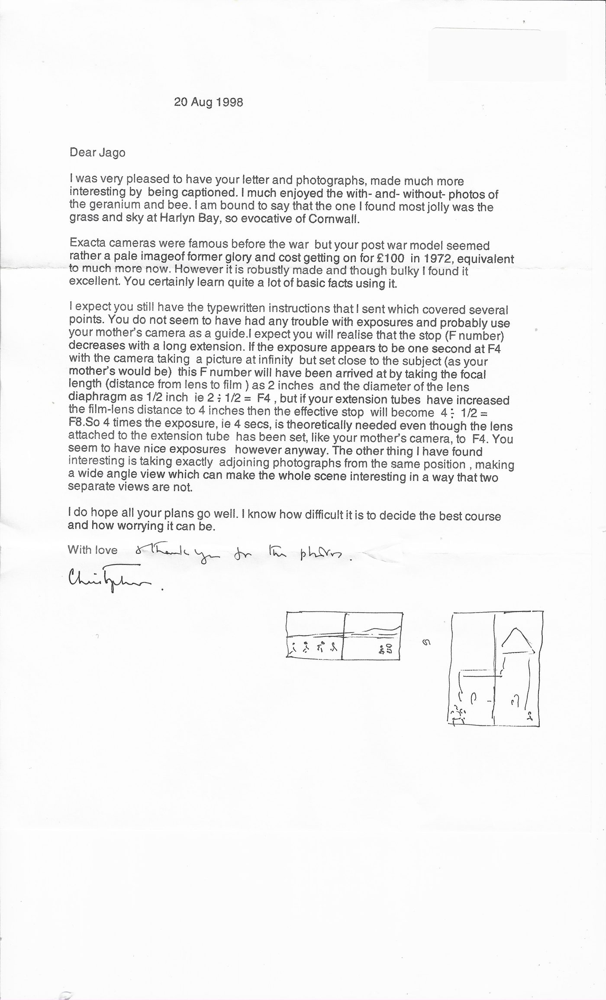
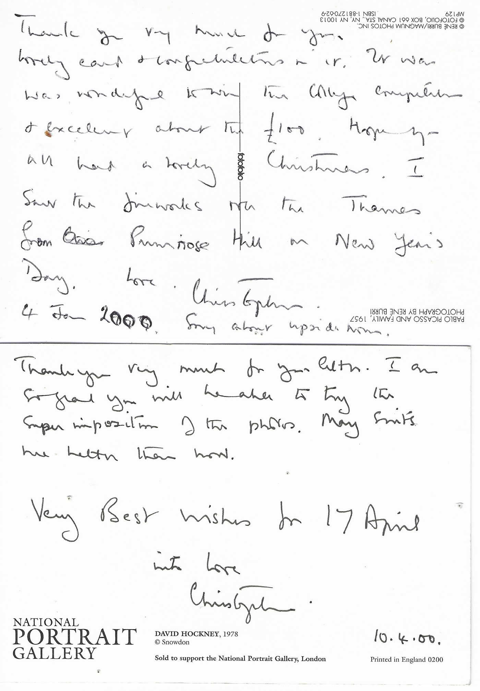
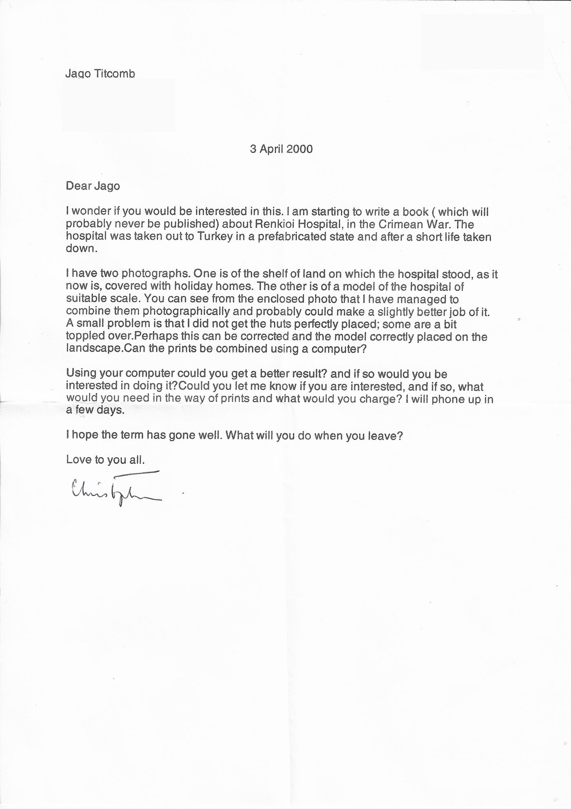
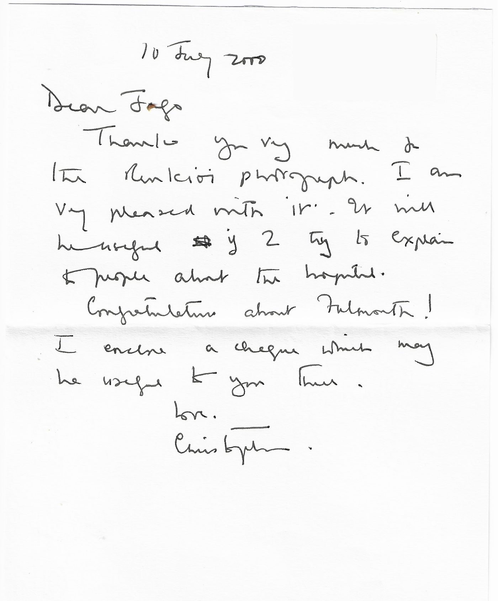
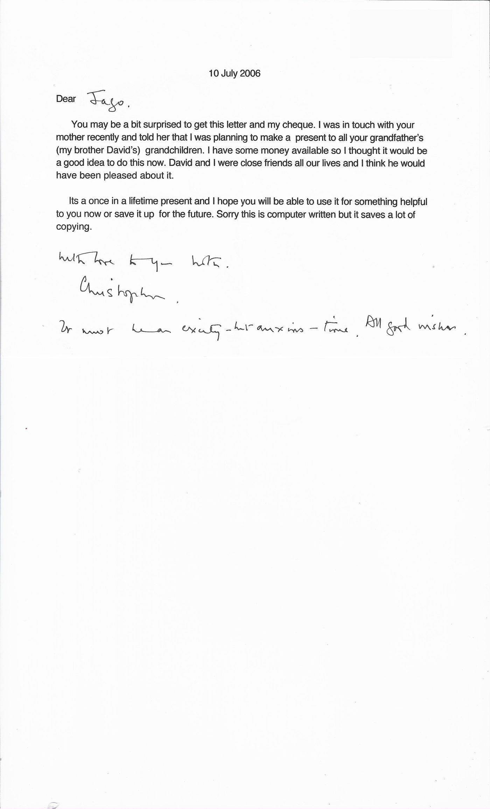

*← [Christopher Patrick Silver](../)*

These are letters and postcards from **Christopher Silver ("Uncle Christopher")** to his great-nephew **Jago** (then Jago Titcomb), written between 1998 and 2006. Christopher was the brother of Jago's grandfather [David Silver](../David-Silver). By then he was a retired geriatrician, a keen photographer and, in his last years, the historian of Brunel's Renkioi Hospital. He wrote from his home on Primrose Hill in London. His letters were typed and signed by hand, always just "Christopher".

Two threads run through them. The first is **photography**: Christopher had given the teenage Jago his old Exacta camera, and coached him by post. The second, in 2000, is the **Renkioi Hospital book**, for which Jago made a digital photo-montage. Each letter is transcribed below, with Christopher's own spellings and emphasis, followed by a scan of the original. Address labels have been blanked out of the scans.

## On Jago's photographs and the Exacta camera — 20 August 1998

*A typed reply to Jago's letter of 4 August 1998, which had enclosed 36 captioned mini-prints from his first two films on the camera Christopher gave him. Christopher added "& thank you for the photos" by hand, and drew two little sketches of his "wide-angle" idea at the foot of the page.*

> Dear Jago
>
> I was very pleased to have your letter and photographs, made much more interesting by being captioned. I much enjoyed the with- and without- photos of the geranium and bee. I am bound to say that the one I found most jolly was the grass and sky at Harlyn Bay, so evocative of Cornwall.
>
> Exacta cameras were famous before the war but your post war model seemed rather a pale image of former glory and cost getting on for £100 in 1972, equivalent to much more now. However it is robustly made and though bulky I found it excellent. You certainly learn quite a lot of basic facts using it.
>
> I expect you still have the typewritten instructions that I sent which covered several points. You do not seem to have had any trouble with exposures and probably use your mother's camera as a guide. I expect you will realise that the stop (F number) decreases with a long extension. If the exposure appears to be one second at F4 with the camera taking a picture at infinity but set close to the subject (as your mother's would be) this F number will have been arrived at by taking the focal length (distance from lens to film) as 2 inches and the diameter of the lens diaphragm as ½ inch ie 2 ÷ ½ = F4, but if your extension tubes have increased the film-lens distance to 4 inches then the effective stop will become 4 ÷ ½ = F8. So 4 times the exposure, ie 4 secs, is theoretically needed even though the lens attached to the extension tube has been set, like your mother's camera, to F4. You seem to have nice exposures however anyway. The other thing I have found interesting is taking exactly adjoining photographs from the same position, making a wide angle view which can make the whole scene interesting in a way that two separate views are not.
>
> I do hope all your plans go well. I know how difficult it is to decide the best course and how worrying it can be.
>
> With love & thank you for the photos.
> Christopher.

## Postcards — 4 January and 10 April 2000

*The first card is a René Burri / Magnum photograph of **Pablo Picasso and family, 1957**. Christopher wrote on it the wrong way up, hence his apology. He was congratulating Jago on winning a college competition and its £100 prize.*

> Thank you very much for your lovely card & congratulations on it. It was wonderful to win the college competition & excellent about the £100. Hope you all had a lovely Christmas. I saw the fireworks over the Thames from ~~Chalk~~ Primrose Hill on New Year's Day.
> Love. Christopher. 4 Jan 2000. Sorry about upside down.

*The second is a National Portrait Gallery card of **David Hockney, photographed by Snowdon, 1978**. Jago had replied to the Renkioi letter below on 6 April, saying yes to the montage and offering to do it for nothing, but explaining that he couldn't start until after his Falmouth interview.*

> Thank you very much for your letter. I am so glad you will be able to try the superimposition of the photos. May [things] be better than now.
> Very Best wishes for 17 April.
> With love Christopher. 10.4.00.

*"Very Best wishes for 17 April" is Christopher wishing Jago luck for his **Falmouth art college interview**, held that day. The word after "May" is hard to read in the original.*

## The Renkioi Hospital commission — 3 April 2000

*A typed letter asking Jago to combine two photographs on a computer for the book Christopher was researching on **Renkioi Hospital**, the prefabricated hospital Brunel designed for the Crimean War and shipped out to Turkey. Christopher had made a rough photographic composite himself. He wanted Jago to do it properly, and to name his fee. The book he thought "will probably never be published" came out in 2007 as* Renkioi: Brunel's forgotten Crimean war hospital *(Valonia Press).*

> Dear Jago
>
> I wonder if you would be interested in this. I am starting to write a book (which will probably never be published) about Renkioi Hospital, in the Crimean War. The hospital was taken out to Turkey in a prefabricated state and after a short life taken down.
>
> I have two photographs. One is of the shelf of land on which the hospital stood, as it now is, covered with holiday homes. The other is of a model of the hospital of suitable scale. You can see from the enclosed photo that I have managed to combine them photographically and probably could make a slightly better job of it. A small problem is that I did not get the huts perfectly placed; some are a bit toppled over. Perhaps this can be corrected and the model correctly placed on the landscape. Can the prints be combined using a computer?
>
> Using your computer could you get a better result? and if so would you be interested in doing it? Could you let me know if you are interested, and if so, what would you need in the way of prints and what would you charge? I will phone up in a few days.
>
> I hope the term has gone well. What will you do when you leave?
>
> Love to you all.
> Christopher

## Thanks for the montage, and congratulations on Falmouth — 10 July 2000

*Handwritten. Jago had delivered the finished Renkioi photograph and, that same summer, won his place at Falmouth to study illustration. Christopher enclosed a cheque.*

> Dear Jago
>
> Thank you very much for the Renkioi photograph. I am very pleased with it. It will be useful [when] I try to explain to people about the hospital.
>
> Congratulations about Falmouth!
>
> I enclose a cheque which may be useful to you there.
>
> Love.
> Christopher.

## A gift to David's grandchildren — 10 July 2006

*A typed letter enclosing a cheque. It was a one-off present Christopher was making to each of his late brother David's grandchildren, in memory of their lifelong closeness. The handwritten postscript was written a couple of weeks before the birth of Jago's daughter.*

> Dear Jago,
>
> You may be a bit surprised to get this letter and my cheque. I was in touch with your mother recently and told her that I was planning to make a present to all your grandfather's (my brother David's) grandchildren. I have some money available so I thought it would be a good idea to do this now. David and I were close friends all our lives and I think he would have been pleased about it.
>
> Its a once in a lifetime present and I hope you will be able to use it for something helpful to you now or save it up for the future. Sorry this is computer written but it saves a lot of copying.
>
> With love to you both.
> Christopher.
>
> It must be an exciting-but-anxious-time. All good wishes.

## See also

- [Christopher Patrick Silver](../) — biography and photography archive
- [David Silver](../David-Silver) — Christopher's brother, and his letters to Jago
- [Anthea Silver](../Anthea-Silver)
