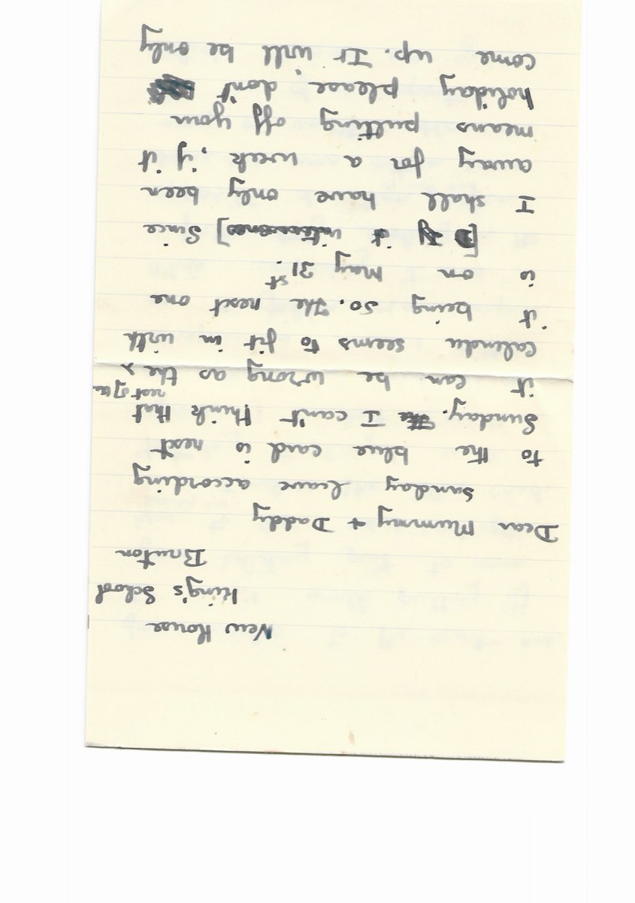
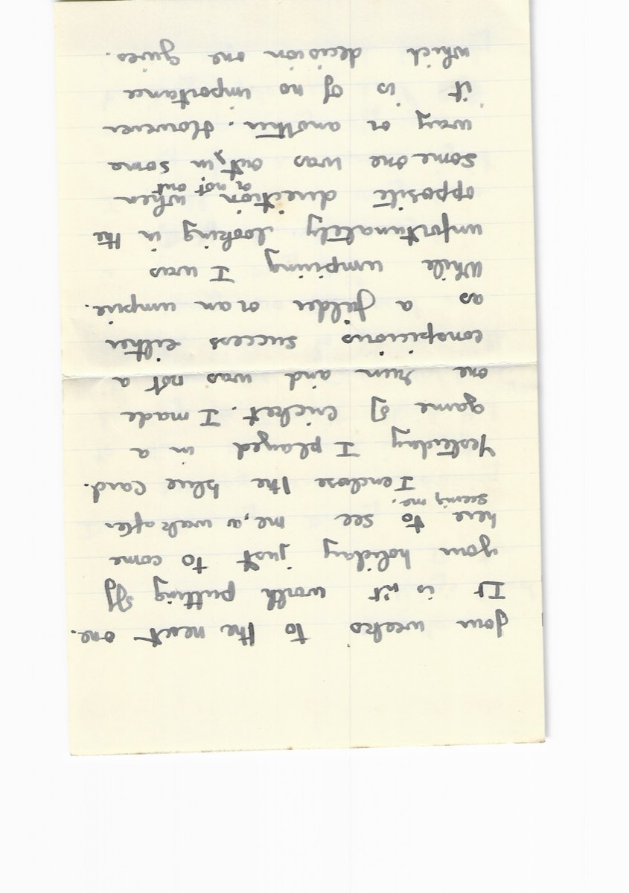
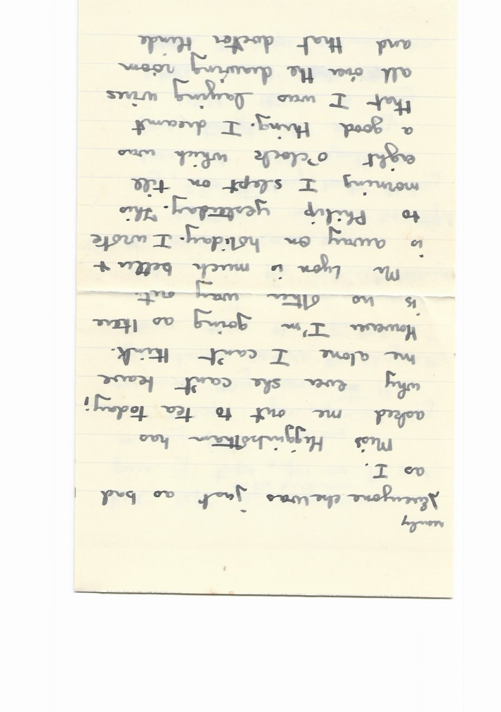
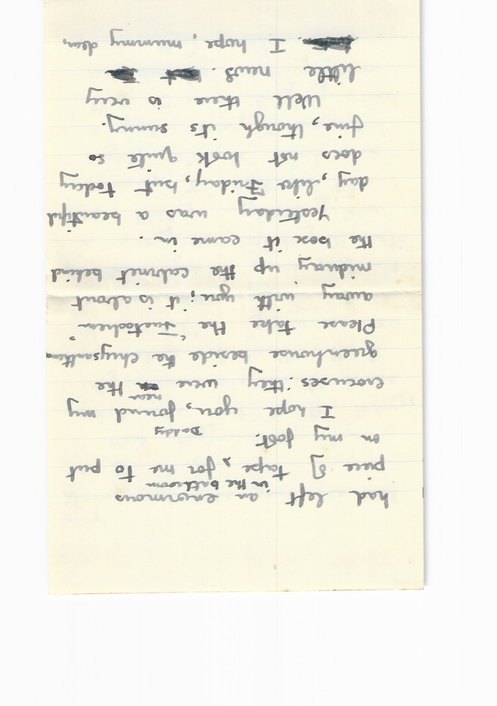
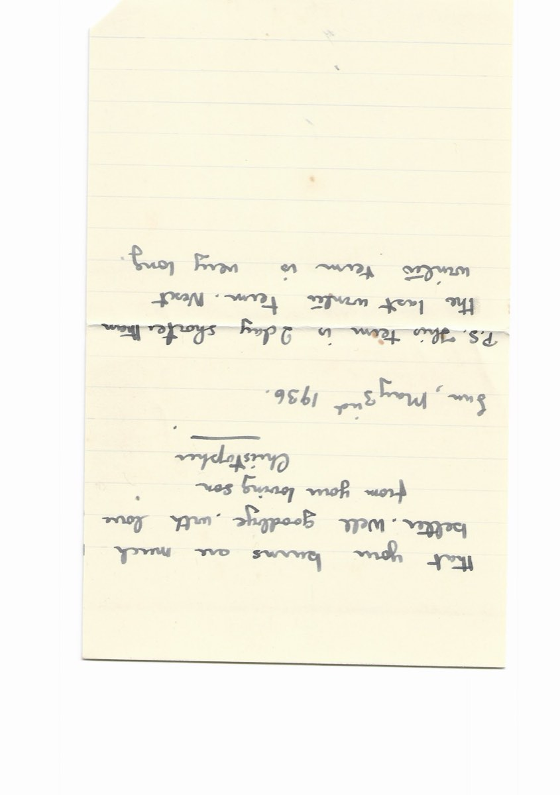
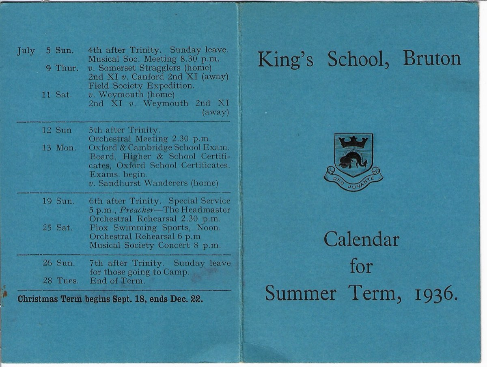
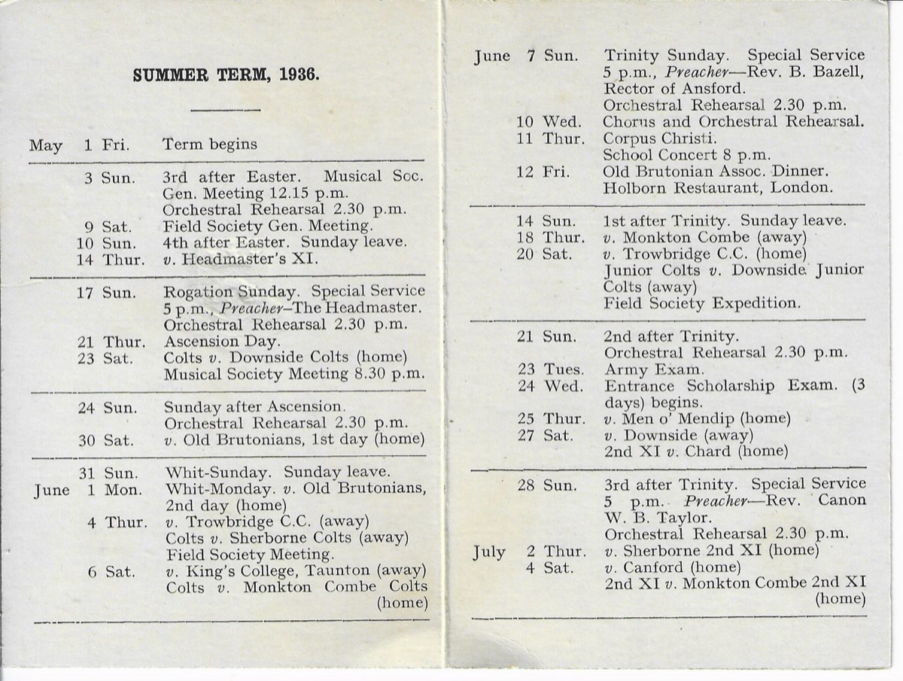

*← [Silver Family Archive](../)*

**Christopher Patrick Silver** (21 April 1920 – 12 November 2012) was a British geriatrician who worked in the East End of London. He was [Jago Silver](Jago-Silver)'s great-uncle — the brother of Jago's maternal grandfather.

**Qualifications:** BM BChir Oxon (1942); MRCP (1948); DM (1954); FRCP (1972)

His Royal College of Physicians obituary is published at [history.rcp.ac.uk].

## Biography
*The following is the biography as originally published between 2005 and 2018, written by Denis Gibbs and Colin Reisner. Published in Brit.med.J., 2013 346 895 and The Times, 3 January 2013.*

Christopher Silver was a geriatrician in the East End of London. He was born in Exeter, the son of [Clifford Marking Silver](Clifford-Marking-Silver), a dentist, and Gladys Lucy Silver née Acott. He was educated at King's School, Bruton, and then Hertford College, Oxford, where he qualified in 1942.

He was a house officer in Sheffield, where it is reported that, when not tending patients, he was tending vegetables in the hospital garden. He then served with the RAMC in North Africa, Italy and India, being demobilised in 1946 with the rank of temporary major. He had arrived in Italy soon after the Anzio landings, but his active service there came to an end when he broke a leg in an accident caused by the blackout. He did gain the dramatic consolation of witnessing the great eruption of Mount Vesuvius from his hospital bed.

After demobilisation he worked at the Radcliffe Infirmary, Edgware General, the London Chest, Mount Vernon and Papworth. In 1952 he became an assistant tuberculosis officer at the London Chest Hospital. There he wrote his doctorate on the use of tuberculin jelly in the diagnosis of TB. When it became apparent that respiratory medicine was oversubscribed for a career, Max Caplin, who had helped him with his doctorate, suggested he might look at geriatric medicine and so, in 1961, Silver became a consultant in this specialty at St Matthew's Hospital in Shoreditch, London.

St Matthew's was a place which hardly seemed to have moved on since the Victorian era, when it was built. With ward names like Dickens and Copperfield, the rows of patients, many confined to primitive beds with high cot sides, would have been a familiar sight in many of the old poor law institutions. With the support of the local hospital management committee, Silver was gradually able to introduce a more modern and rehabilitative approach. He continued to have patients at St Matthew's until the late 1970s, but his locus of work moved east, taking on patients in what became Tower Hamlets.

By 1972 he had in excess of 200 inpatients scattered across the four hospitals, St Matthew's, Bethnal Green, the London (Mile End) and St Andrew's. He managed to give them steadily improving care with the help of a remarkable but rather motley crew of doctors and a highly organised secretary. Together they made sure that no patient got lost – a significant risk with such a widely dispersed service and referrals coming in from so many different sources. His close association with the London Hospital was recognised by his formal appointment there as a consultant in 1968.

Home visits were frequent to assess need and priority for admission. Some of these were formally requested by GPs and paid for as domiciliary consultations. But he was unusual in often visiting in response to requests for admission, even if the GP had not asked for a visit. These informal and unpaid home visits saved many old people from the risks of admission, preserved the scarce resource of hospital beds or ensured that, for those who had to be admitted, there was a consultant opinion and plan even before the patient reached hospital.

He rapidly realised the close overlap between physical and psychiatric disease in older people, and sought to bring the two specialties together. He suggested broadening patient admission criteria for the new ward at the London Hospital (Mile End), so that patients would be under the joint care of himself and a psychiatrist. His proposal was strongly supported by Brice Pitt, then recently appointed as a psychogeriatrician at the London, and so this tolerant and effective assessment ward was set up. It was probably a surprise to both men that the concept was so rarely tried elsewhere.

Despite all the work pressures, he and his indomitable secretary steadily amassed data on all the patients who had been admitted, using a simple punch card system. This was then analysed with the advanced technology of a knitting needle, enabling them to produce papers demonstrating the age, frailty and prognosis of this fairly typical population of patients reaching an inner city hospital geriatric department. He invented a practical test of cognitive ability, **Silver's test**, which was useful in demonstrating the functional losses associated with brain disease and ageing.

In 1978 it was finally possible to appoint a colleague to share the clinical and teaching load. To have the care of about 250 hospital patients cut overnight to 120 must have been a considerable relief for him. Although many consultants in the teaching hospitals viewed geriatric medicine with suspicion and disdain, attitudes at the London steadily warmed, and he, with his colleagues, became important contributors to the medical family, clinical care and teaching at Whitechapel and Mile End.

Christopher was a quiet, thoughtful man. Though shy, he had a welcoming, reassuring face and a wonderful head of hair, never too long, but not well-disciplined either. So it was unsurprising that his family gave him the appropriate name of 'Fluffy'. He put up with the early disparagement of geriatric medicine without rancour, but with the quiet conviction that good medical care for the elderly would come to be seen as important, not only morally, but also for the effective functioning of modern hospitals. That the second ward to be inherited by his department had been named after one of the physicians who had opposed the arrival of geriatrics caused him wry pleasure. He was held in warm affection by those who worked with him and, using his considerable photographic skills, he gathered a gallery of pictures of all his medical teams. To the amusement of those who saw the picture, he arranged a photo montage of one group so that, with him, they were seen to be examining a massive black cat in bed on a ward round. His secretary from his later time at Mile End wrote: 'He was a lovely man and I have very fond memories of working with him and the little things he did. He did so much for the elderly people in Tower Hamlets, and I remember clearly the first day that I met him with his shy little smile. He was a true gentleman.'

In retirement he gave wise advice for several years, in his usual quiet, self-effacing way, to the charity Research into Ageing. He continued to do so until, in his judgement, he risked being too out of touch with medicine.

His wife, Nancy (née Pym), had been a successful classicist and headmistress. On a trip together to visit classical sites in Asia Minor, he had come across the story of Brunel's prefabricated Crimean war hospital at Renkioi. He researched this with his usual patience and thoroughness, and eventually published the results of his enquiries as a book dedicated to Nancy, who had sadly died ten years earlier (*Renkioi: Brunel's forgotten Crimean war hospital*, Sevenoaks, Valonia Press, 2007). Her death had left an understandable hole in his life, but did not detract from his activities. His macular degeneration had improved somewhat with ranibizumab treatment, but reduced vision, atrial fibrillation and, in the summer of 2012, a pelvic fracture, took their toll. He was survived by a son (Paul), three daughters (Eleanor, Angela and Susannah), seven grandchildren and one great grandchild.

*— Denis Gibbs, Colin Reisner*

## Family
- **Father:** [Clifford Marking Silver](Clifford-Marking-Silver) — dentist, Exeter
- **Mother:** Gladys Lucy Silver (née Acott)
- **Wife:** Nancy Silver (née Pym) — classicist and headmistress; predeceased Christopher by approximately ten years
- **Children:** Paul Silver; Eleanor Silver; Angela Silver; Susannah Silver
- **Grandchildren:** seven
- **Great-grandchild:** one (at time of death)

Christopher is the brother of [Jago Silver](Jago-Silver)'s maternal grandfather, making him [Jago Silver](Jago-Silver)'s great-uncle. His father [Clifford Marking Silver](Clifford-Marking-Silver) is [Jago Silver](Jago-Silver)'s great-grandfather on the maternal side.

## Bruton, 1936
Christopher boarded at King's School, Bruton, in Somerset, in New House; his younger brother [David](../David-Silver) followed him there in 1937 (see [The Bruton Letters](../Bruton-Letters)). One of Christopher's own letters home survives, kept in the same bundle as David's. It is dated **Sunday 3 May 1936**, when he was sixteen, and written to his parents at Tresillian in Exeter. It enclosed the school's printed calendar for the Summer Term 1936, the "blue card", which survives with it. In David's later letters Christopher is "Kit"; by October 1939 he was up at Oxford.

Transcribed with his own spelling and punctuation; ~~struck text~~ shows his crossings-out.

> *(p. 1)*
> New House
> King's School
> Bruton
> Dear Mummy + Daddy
> Sunday leave according to the blue card is next Sunday. ~~[struck]~~ I can't think that it can be wrong as the rest of the calender seems to fit in with it being so. The next one is on May 31st.
> ~~[D If it inconvenience]~~ Since I shall have only been away for a week, if it means putting off your holiday please don't ~~[struck]~~ come up. It will be only
>
> *(p. 2)*
> four weeks to the next one. It isn't worth putting off your holiday just to come here to see me, a week after seeing me.
> I enclose the blue card.
> Yesterday I played in a game of cricket. I made one run and was not a conspicious success either as a fielder or an umpire. While umpiring I was unfortunately looking in the opposite direction when some one was out, or not out, in some way or another. However it is of no importance which decision one gives.
>
> *(p. 3)*
> nearly Everyone else was just as bad as I.
> Miss Higginbotham has asked me out to tea today; why ever she can't leave me alone I can't think. However I'm going as there is no other way out.
> Mr Lyon is much better + is away on holiday. I wrote to Philip yesterday. This morning I slept on till eight o'clock which was a good thing. I dreamt that I was laying wires all over the drawing room and that doctor Hinde
>
> *(p. 4)*
> had left an enormous piece of tape in the bathroom, for me to put on my foot.
> I hope you Daddy found my crocuses: they were ~~on~~ near the greenhouse beside the chrysanthemums. Please take the "Justochem" away with you; it is about midway up the cabinet behind the box it came in.
> Yesterday was a beautiful day, like Friday, but today does not look quite so fine, though its sunny.
> Well there is very little news. ~~[struck words]~~ I hope, mummy dear,
>
> *(p. 5)*
> that your burns are much better. Well goodbye, with love from your loving son
> Christopher
> Sun, May 3rd 1936.
> P.S. This term is 2 day shorter than the last winter term. Next winter term is very long.

**The Summer Term 1936 calendar** — a folded blue card, "King's School, Bruton — Calendar for Summer Term, 1936", with the school crest and motto *Deo Juvante*:

> May 1 Fri. Term begins
> 3 Sun. 3rd after Easter. Musical Soc. Gen. Meeting 12.15 p.m. Orchestral Rehearsal 2.30 p.m.
> 9 Sat. Field Society Gen. Meeting.
> 10 Sun. 4th after Easter. Sunday leave.
> 14 Thur. v. Headmaster's XI.
> 17 Sun. Rogation Sunday. Special Service 5 p.m., Preacher—The Headmaster. Orchestral Rehearsal 2.30 p.m.
> 21 Thur. Ascension Day.
> 23 Sat. Colts v. Downside Colts (home). Musical Society Meeting 8.30 p.m.
> 24 Sun. Sunday after Ascension. Orchestral Rehearsal 2.30 p.m.
> 30 Sat. v. Old Brutonians, 1st day (home)
> 31 Sun. Whit-Sunday. Sunday leave.
> June 1 Mon. Whit-Monday. v. Old Brutonians, 2nd day (home)
> 4 Thur. v. Trowbridge C.C. (away). Colts v. Sherborne Colts (away). Field Society Meeting.
> 6 Sat. v. King's College, Taunton (away). Colts v. Monkton Combe Colts (home)
> 7 Sun. Trinity Sunday. Special Service 5 p.m., Preacher—Rev. B. Bazell, Rector of Ansford. Orchestral Rehearsal 2.30 p.m.
> 10 Wed. Chorus and Orchestral Rehearsal.
> 11 Thur. Corpus Christi. School Concert 8 p.m.
> 12 Fri. Old Brutonian Assoc. Dinner. Holborn Restaurant, London.
> 14 Sun. 1st after Trinity. Sunday leave.
> 18 Thur. v. Monkton Combe (away)
> 20 Sat. v. Trowbridge C.C. (home). Junior Colts v. Downside Junior Colts (away). Field Society Expedition.
> 21 Sun. 2nd after Trinity. Orchestral Rehearsal 2.30 p.m.
> 23 Tues. Army Exam.
> 24 Wed. Entrance Scholarship Exam. (3 days) begins.
> 25 Thur. v. Men o' Mendip (home)
> 27 Sat. v. Downside (away). 2nd XI v. Chard (home)
> 28 Sun. 3rd after Trinity. Special Service 5 p.m. Preacher—Rev. Canon W. B. Taylor. Orchestral Rehearsal 2.30 p.m.
> July 2 Thur. v. Sherborne 2nd XI (home)
> 4 Sat. v. Canford (home). 2nd XI v. Monkton Combe 2nd XI (home)
> July 5 Sun. 4th after Trinity. Sunday leave. Musical Soc. Meeting 8.30 p.m.
> 9 Thur. v. Somerset Stragglers (home). 2nd XI v. Canford 2nd XI (away). Field Society Expedition.
> 11 Sat. v. Weymouth (home). 2nd XI v. Weymouth 2nd XI (away)
> 12 Sun 5th after Trinity. Orchestral Meeting 2.30 p.m.
> 13 Mon. Oxford & Cambridge School Exam. Board, Higher & School Certificates, Oxford School Certificates. Exams. begin. v. Sandhurst Wanderers (home)
> 19 Sun. 6th after Trinity. Special Service 5 p.m., Preacher—The Headmaster. Orchestral Rehearsal 2.30 p.m.
> 25 Sat. Plox Swimming Sports, Noon. Orchestral Rehearsal 6 p.m. Musical Society Concert 8 p.m.
> 26 Sun. 7th after Trinity. Sunday leave for those going to Camp.
> 28 Tues. End of Term.
> Christmas Term begins Sept. 18, ends Dec. 22.

> [!scan]- Scans (7)
> 
> 
> 
> 
> 
> 
> 

## Letters
Between 1998 and 2006 Christopher wrote to his great-nephew Jago about photography, and about the Exacta camera he had given him. In 2000 he asked Jago to make a digital photo-montage of Renkioi Hospital for his book. → [Letters from Christopher Silver (1998–2006)](Christopher-Silver/Letters)

## Published work
- **Silver's test** — a practical cognitive assessment test he devised, useful in demonstrating functional losses associated with brain disease and ageing
- *Renkioi: Brunel's forgotten Crimean war hospital* (Valonia Press, Sevenoaks, 2007) — a history of Brunel's prefabricated hospital in the Crimean War, dedicated to his late wife Nancy

## External links
- [Royal College of Physicians — Christopher Patrick Silver] (obituary, published 2005–2018)

## Photography

Christopher Silver was a keen and accomplished photographer throughout his life — his biographers note that *he gathered a gallery of pictures of all his medical teams* using his *considerable photographic skills*. His archive, preserved on glass plates (Ilford Gaslight, Mezzotone, Isozenith, Special Rapid and Kodak varieties) and Kodachrome colour slides, spans roughly four decades and ranges from intimate family photographs in the Exeter garden to grand tours of North America and wartime documents of India and Vietnam.

The glass plates were scanned by his great-nephew **Basil Macdonald** in 2025. In total, 229 photographs survive across ten countries and locations. Many subjects remain unidentified — if you recognise anyone or can date a photograph more precisely, please add notes to the relevant page.

### The 1937 Selfridges photograph
One photograph stands out for its precise datability: a stunning image of [Selfridges on Oxford Street](Christopher-Silver/UK#London-—-Selfridges) decorated for the coronation of George VI in May 1937. The elaborate allegorical sculptural installation — with the royal cypher GR and the inscription *GOD SAVE THE KING* — was a famous landmark of that summer. CPS was 17 years old.

### The 1961 North America tour
In 1961, CPS and his wife Nancy undertook a grand tour of North America, shooting in Kodachrome colour. The route ran from Halifax, Nova Scotia westward through Toronto, Niagara Falls, Philadelphia, Washington DC, New York and Mount Vernon, then west through Colorado (Idaho Springs, Denver, Central City), Salt Lake City, and across to British Columbia — the Fraser Canyon, the North Thompson River valley, Vancouver, and Victoria. Thirteen photographs survive of Niagara Falls alone.

### Photography subpages

| Location | Photographs | Notes |
| --- | --- | --- |
| [Christopher Silver/Cornwall](Christopher-Silver/Cornwall) | 10 | Falmouth, Mousehole, Lizard Point, Trebarwith Strand, Gannel. Glass plates. |
| [Christopher Silver/UK](Christopher-Silver/UK) | 38 | Exeter (family home, 23 photos), Whitby, Rievaulx, Tewkesbury, Selfridges, Suffolk, Ravenglass, Campbeltown, and more. |
| [Christopher Silver/India](Christopher-Silver/India) | 6 | Bombay street scenes and Bombay Racecourse. RAMC service, c.1944–46. |
| [Christopher Silver/Canada](Christopher-Silver/Canada) | 37 | 1961 Kodachrome. Halifax, Toronto, Regina, Fraser Canyon, North Thompson River, Vancouver, Victoria. |
| [Christopher Silver/USA](Christopher-Silver/USA) | 28 | 1961 Kodachrome + glass plates. Niagara, Philadelphia, Washington DC, New York, Colorado, Salt Lake City, Mount Vernon. |
| [Christopher Silver/France](Christopher-Silver/France) | 8 | Carcassonne, Banyuls-sur-Mer, Elne, Collioure. |
| [Christopher Silver/Wales](Christopher-Silver/Wales) | 7 | Caernarfon Castle, Tenby, Aberystwyth, Rheidol Valley. |
| [Christopher Silver/Ireland](Christopher-Silver/Ireland) | 2 | Killiney Bay, County Dublin. |
| [Christopher Silver/Vietnam](Christopher-Silver/Vietnam) | 3 | Fish drying scenes; Saigon street scene. Possibly c.1945–46. |
| [Christopher Silver/People](Christopher-Silver/People) | 23 | Portraits and groups. Most identities unknown — can you help? |

## Published work
- **Silver's test** — a practical cognitive assessment test he devised, useful in demonstrating functional losses associated with brain disease and ageing
- *Renkioi: Brunel's forgotten Crimean war hospital* (Valonia Press, Sevenoaks, 2007) — a history of Brunel's prefabricated hospital in the Crimean War, dedicated to his late wife Nancy

## External links
- [Royal College of Physicians — Christopher Patrick Silver] (obituary, published 2005–2018)

## See also
- [Letters from Christopher Silver (1998–2006)](Christopher-Silver/Letters)
- [Jago Silver](Jago-Silver)
- [Clifford Marking Silver](Clifford-Marking-Silver)
- [Tamsin Titcomb](Tamsin-Titcomb)
- [Anthea Silver](Anthea-Silver)
- [Family History](Family-History)
