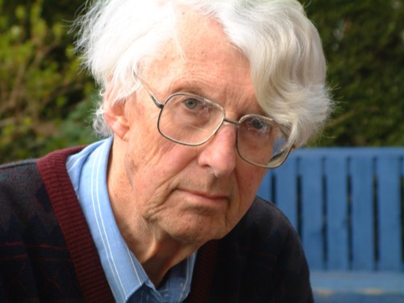

*← [Silver Family Archive](./)*

**David Rodney Silver** (2 January 1924 – 19 April 2003) was an architect, a wartime RAF engine fitter, and, by his grandson's account, a frustrated artist. He was one of the six children of Clifford Marking Silver, a dentist in Exeter, and Gladys Lucy Acott. His siblings were James, Lavender, Philip, [Christopher Patrick](Christopher-Silver/) and Rosemary. He married [Anthea Leigh](Anthea-Silver), whom he met at architecture school in Bristol, and they had three daughters, Tamsin, Bridget and Candy. He was Jago Silver's maternal grandfather, known to the family simply as **Grandpa**.

David and his brother Christopher were, in Christopher's words, *"close friends all our lives."* Christopher photographed him as a young man (see [People](People)), and three years after David's death he made a gift to every one of David's grandchildren in his memory.

---

## Exeter, and the war

David went to Exeter School of Art for about two terms before joining the RAF. He was accepted for aircrew with 6/36 vision in each eye, but was barred from flying when the eyesight standards were raised for night fighters. Instead he spent four years overhauling and test-running the Rolls-Royce Merlin engines of Spitfires and Hurricanes. His service number was 1587757.

He illustrated the job for his grandson in the margin of a letter:

> I didnt maintain Rolls Royce Merlin aeroplane engines in Spitfires and Hurricanes without being trained by the RAF and practising it for four years in the war — and they set high standards. Its a million years ago but they were beautiful engines to test run. The tails would lift up in the air and the noses go into the ground if you didnt have enough weight on the tail. To start with I had to sit on the tail — (on the ground) but then later they got womens auxiliary air force (WAAFS for short) to do it. I used to test run the engines and look back at the poor things hanging on where I used to, like this. Just to reassure you there were chocks under the wheels and the brakes were on, but I can tell you the wind force was terrific on the poor girls faces. … There was a fable in the RAF that, once, a girl had gone up on the tail of an aircraft and been flown round Blackpool Tower clinging on for her very life — I dont believe it but it made a good story.

The only aircraft he ever flew in was a B-17 Flying Fortress, as a passenger, a few days after the war in Europe ended.

## Architect

After the war David trained at the RWA School of Architecture in Bristol on a grant, and met Anthea there. Both of them qualified as architects. He spent most of his career in the civil service. One of his projects was a very large London building for British Telecom. Its design famously outran its own technology. One floor was specified 16 feet high, with reinforced flooring, to carry the giant computers of the day. The building took so long to design that by the time it went up, the specially strengthened floor was no longer needed.

David was an exceptional draftsman, and the only one of his brothers who did not become a doctor. Jago believes he would really have liked to be an artist or illustrator. In that family and generation, architecture was just about respectable and art was not. In retirement he went to watercolour classes at the town hall in Wadebridge, and his letters are full of pen sketches.

## Wadebridge

David and Anthea lived for many years in Wadebridge, Cornwall. He loved the county:

> Cornwall being — thank goodness! — unlike anywhere else: when we had lunch to-day there was an inch of rain water on the terrace outside — now there's blue blue sky coming out between the clouds — I shall never go away — I wouldn't live anywhere else — for all the tea in China! as they used to say when I was small.

In the late 1990s Jago helped Grandpa set up his first home computer. Jago drew up a spec sheet for a 486 PC in January 1998 and wrote him a user guide for Word, Paint Shop Pro and printing in June 1999. Grandpa gave him a model boat, which still sits on Jago's mantelpiece, and an old silver Akai tape deck.

---

## In his own words

David wrote often to Jago, and later to Jago and Alex (now his wife), between about 1995 and 2002. The letters are erudite, rambling and very funny. They break off constantly for little drawings, and towards the end they quietly record his failing memory. The extracts below are transcribed from the originals, with his spelling and emphasis kept.

### The war and after (c. 2001)

Written after Jago had been on a flight. It is David's fullest account of his war.

> Dear Jago and Alex, Please forgive my writing paper, I have just sunk into an arm chair and at 77 can go no further in search of something better — at least I can keep to the line. …
>
> I understand you have been flying. I have never done the up to date kind. The last aircraft I ever flew in was a four engine bomber B17 — a Flying Fortress — we were flying for roughly seven hours. … Our gun positions on each side were open with no guns because the War HAD ENDED THREE DAYS EARLIER. We looked a little apprehensively down but not a gun was fired. … My eye sight let me down. I had been accepted for aircrew with 6/36 in each eye but the standards had been raised for night fighters and I was barred from flying. I learned all about how to overhaul the engines instead. Its been slightly useful since — particularly with motor bikes. So I have seen Germany from above (and France waving) but that's all. We loved the French. We were sorry for the Germans, we hated the Nazis with black fury.
>
> I was 21 years old. I don't remember the month I left the Air Force but I started at the RWA School of Architecture in the autumn term on a grant. Boy! was it lovely? No prickly uniform. No getting up at 6.0am and being free and the work being free. …
>
> I think the war smashed my concentration up … I was more interested in Anthea than the exams. … I went like mad to see as much of her as I could and passed the greater part of my finals.
>
> By the time we were married and Tamsin and Bridget were arriving I was going to an office and doing architectural work for other people not me. … I got £8-00 a week!
>
> So thank your lucky stars there wasn't a war. My part of the century was tricky when I was young: 1914 war, 1918 peace, 1939 war, 1945 peace, and I started in 1924. …
>
> The sun came out — the flowers opened and the world was free to love each other. we did. …
>
> I am very glad you are getting on so well with all your plans and I hope that you have a wonderful time. Time is precious. With lots of love, David.

### On writing, and prunes (c. 1996)

This one is typed. A long essay-letter that sets off from a single word.

> Writing is a very measured way of communicating. It would only take a second to say what I have written and so because it takes longer to write there is longer to think what you are going to say …
>
> In writing — with the chance to write again — to destroy and to re-write, to correct and prune — there is time to reflect. The very words you write can draw attention to their universal meaning. How can 'prune' for instance which suddenly looks strange to spell — mean two things.
>
> How can the same prune which someone may occasionally eat be the same word as what you do to a bush? The answer is in History because your language is part of the fabric of history. …
>
> … it was a good many years before I found that all that I had learned about English, Latin, and German was about people, and all that I had learned about people was history, and geography was where it happened, and what influenced it to happen, and climate was about how we grew things and eat them. More recently it is dawning on us that animals are not a kind of side show for our amusement but are probably our history too. …
>
> Its fairly unusual to have ten highly intelligent grandchildren, to have ten affectionate grandchildren is even luckier. I recommend you to hang onto your brother and sister and cousins — they are a rewarding group of people to have not only as family but as friends, for all your life. With much love from Grandpa.

### Brittany, and the Eden Project (May 2001)

Written in purple ink, after a family holiday on the north coast of Brittany.

> Brittany was marvellous … Quite different — not like Cornwall - not like England but special. The sea stretches to out there for ever. …
>
> I talked to people in bad French. They talked back in bad English. We laughed. they laughed. I loved them — I never expected to. I dont expect its the same everywhere — this was their 'Cornwall' so what else would you expect. I am still crazy about Cornwall.
>
> … Christopher came down for a wink and a sausage roll before going back to London. We went to see the Eden Project. He wheeled it and was very pleased he had seen it — sort of collecting 'in' things, I thought it was impressive because it was a whole valley (felt like it walking round) … I must stop or Anthea will think I have taken root and start watering me with the house plants. Much love to you both. David.

### From my bedroom window (c. Christmas 2000)

Thanking Jago for a millennium book, and written in his first year at Falmouth.

> It's Sunday morning and it looks like a lovely day and poor Anthea has a terrible cold so I am up in my bedroom "Tidying it" — and the windmills are being a "backdrop," stationary, and the clouds are doing the Movie bit. …
>
> I enjoyed seeing all your photographic work. Poor Christopher is stuck in 1940 with his photography … he's only just moving on to 'roll films' instead of 'plates' (glass negatives) …
>
> Anyway I am very pleased that you are enjoying Falmouth. I absolutely loved EXETER ART SCHOOL … I had to go off into the Air Force next stop. … four years — yuck! The architecture school was my escape. …
>
> Must stop. I came up here to clean and tidy my bedroom and not catch germs — it doesn't look any different from when I got here — funny! love to you both, David.

### A handmade notebook (Christmas 2001)

Jago and Alex made him a notebook covered in reindeer calf skin. He thanked them in a mixture of languages.

> Mes Enfants, Je vous aime beaucoup, et j'aime bien la petit livre que vous avez donné à moi. C'est marveilleuse. Das buch is herrlich and also I like it. I like particularly the fine reindeer calf skin from which it is covered especially because I know it is the work of artists who would never stoop to murder a fine reindeer to make me a note book but have so contrived his beautiful hide by magic captured from the shine in a silver mirror of their beautiful eyes. Thank you so much.

---

## Last words

David developed vascular dementia in his last years and died on 19 April 2003 in a nursing home in Padstow. When Jago visited him there, Grandpa still recognised him. Jago showed him his first published illustrations, the *Titanic Tales* feature in the April 2003 issue of *Cornwall Today* magazine. Grandpa said he wasn't at all surprised Jago had been published already:

> as you were always brilliant at drawing

They were the last words he spoke to Jago. Around the same time Jago was drawing another *Cornwall Today* commission, *Terror Was His Middle Name*, and he based one of its characters on his grandfather's face.

The family still keeps **Grandpa Silver's birthday, 2 January**, in the shared family calendar.

---

*Compiled by Jago Silver from family papers and David's letters, 1995–2002.*
