*← [Silver Family Archive](./)*

Four years after the last of [The Bruton Letters](Bruton-Letters), [David Silver](David-Silver) was writing home again, this time as **LAC Silver D.R.**, a Leading Aircraftman at **No. 14 School of Technical Training, RAF Henlow** in Bedfordshire, the RAF's school for engine fitters. These four letters from **1946** are to his parents, the Exeter dentist [Clifford Marking Silver](Clifford-Marking-Silver) and his wife Gladys, at **Tresillian** in West Avenue, Exeter, the house that had been wrecked in the Exeter Blitz four years earlier.

The war is over and the mood is peacetime. David files a vee-block to a thousandth of an inch, plants stonecrop and French marigolds outside his hut, and goes on drawing all the time: the train window, the plants on his handlebars, an American electric mixer from *Life* magazine. He watches the **Victory Parade** on the newsreel ("The Wrens and the army marched much the best. The Waaf looked awful So did the RAF. as usual."). He sends his mother a watercolour of **Stevenage**, just named the first New Town, which he thinks a "very good example of how unattractive ribbon development can be". He also collects his first canvas boards from Heffer's in Cambridge, "dying to try my hand at oils when I get home". And in a postscript he asks for a photograph to go with **an application to London University**, the first sign of the architecture training that became his career.

**About the transcription.** The letters are transcribed with David's own spelling and punctuation. ~~Struck text~~ shows his crossings-out, [?] a doubtful reading and [square brackets] describe drawings and layout. Page breaks appear as *(p. n)*. Most of the letters are undated, so each has been dated from postmarks or the events he mentions; the evidence is given in italics under each heading. The March letter's small sheets were scanned overlapping, so only part of it can be read. One page of the summer letter is missing, and the comic story from *Punch* that he copied out in it is summarised, not transcribed. The scans for each letter are in the collapsible **Scans** box beneath it.

---

## 1946

### 01. Thursday 28 March 1946

*Headed "Thursday" from Hut 441, 2 Wing; the envelope, addressed to "Mrs Silver", is postmarked HITCHIN 9.30 AM 29 MCH 1946 (a Friday).*

> *(envelope)*
> Mrs Silver
> Tresillian
> West Avenue
> Exeter
> Devon
> [2d orange + ½d green King George VI stamps; postmark HITCHIN HERTS 9.30 AM 29 MCH 1946]
>
> *(p. 1)*
> [Overlapping sheet, top:] ...11.40 ... Twenty minutes to go and my pass would be invalid and the last special train left at 10.30.
> [Main sheet:]
> 1587757 LAC Silver D.R.
> Hut 441. 2 Wing
> 14 S of T.T.
> RAF. Henlow
> Bedfordshire.
> Thursday
> Dear Mummy + Daddy
> Not this week end 28, 29th, but the next week end if Christopher is still at home I shall come home again.
> It hangs in the balance whether I shall get a 36 or a 48, if it's a 48 I shall come home any way.
> I had a rotten journey back. I was due in by midnight you know. Well I caught the first part of the 4.55. at 4.40 at the Central.
>
> *[One or more pages missing here.]*
>
> *(p. 2)*
> [Top of the underneath sheet:] ...let me know how much it cost when you get the bill. Forty something shillings I should think. Shall sell old bicycle when I've painted front mudguard. ~~Somebody~~ Somebody thought I'd get six pounds for it. I shall put up an advertisement for offers over £4 10s. The dynamo's worth 25/- (said he in defence ~~from~~ against the outburst by his elder brother) I feel confident in support from Wiggs ~~with~~ with her great business experience when I ask for £4 10s
> with lots of love
> your loving son
> David.
> [Second sheet, showing below:] We stayed there [?] twenty minutes and held up the traffic, then on we went again. The train stopped out in the country near no station, the rear light had gone out, it had to be changed. Off we went again. Next time we stopped because someone pulled the

*Notes:* Incomplete. These are small folded sheets and were scanned overlapping, so only the first page, part of the last page and glimpses of the pages under them are visible; the rest of the letter (the full story of the journey back) was not scanned. "Christopher" is his brother Kit; "Wiggs" also appears in the Bruton letters. A "36" or "48" is a 36- or 48-hour pass.

> [!scan]- Scans (3)
> 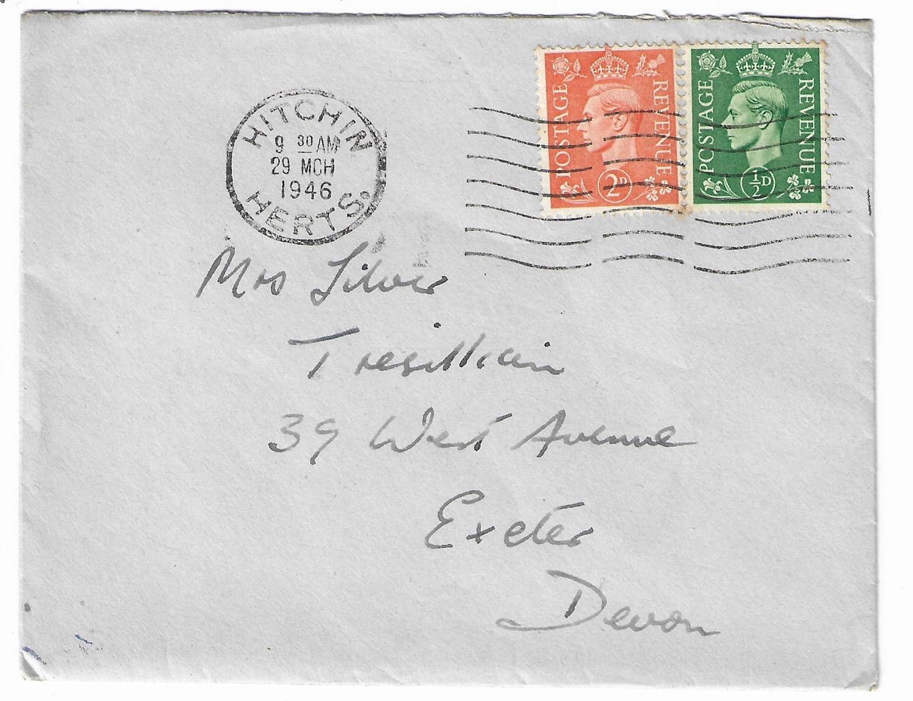
> 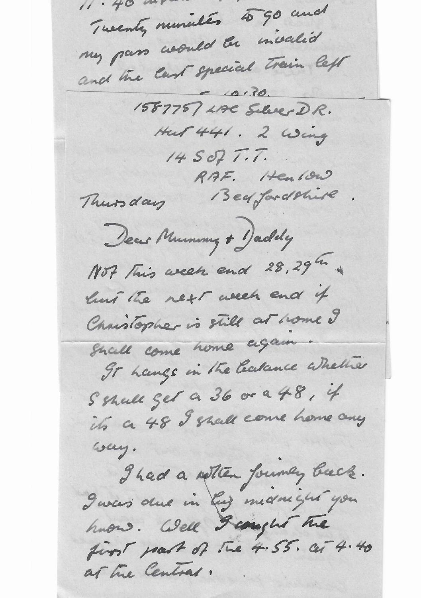
> 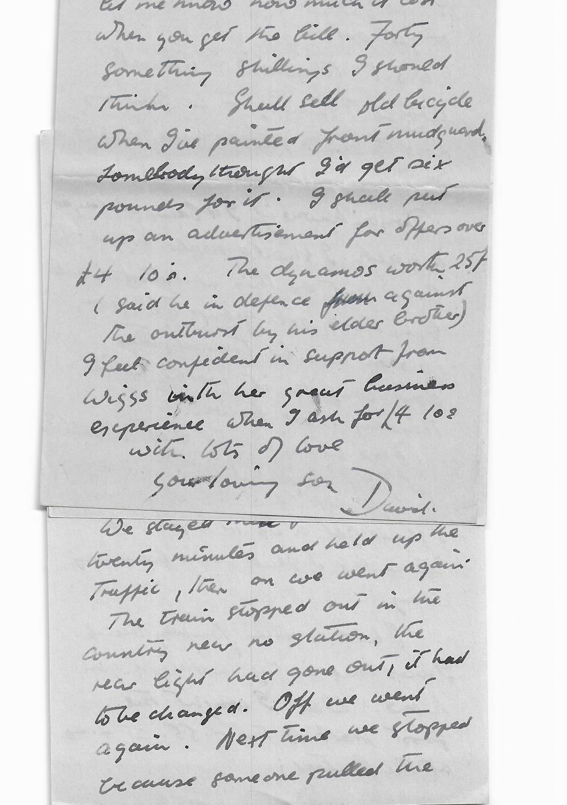

### 02. Saturday 15 June 1946

*Headed "Saturday" from Hut 515; the envelope, to "C. M. Silver Esq", is postmarked HITCHIN 9.30 AM 17 JNE 1946. The holiday "on Thursday … because it was the King's birthday" was Thursday 13 June 1946, and the Victory Parade he saw on the newsreel was on 8 June 1946.*

> *(envelope)*
> C. M. Silver Esq
> Tresillian
> West Avenue
> Exeter
> Devon.
> [2½d blue King George VI stamp; postmark HITCHIN HERTS 9.30 AM 17 JNE 1946; slogan cancel "DON'T WASTE BREAD — OTHERS NEED IT"]
>
> *(p. 1)*
> [Added at top left, in blue ink:] I saw the victory parade on the News. The Wrens and the army marched much the best. The Waaf looked awful So did the RAF. as usual.
> 1587757 LAC Silver D.R.
> Hut 515
> 14 S of T.T.
> RAF. HENLOW
> Beds.
> Saturday.
> Dear Daddy and Mummy
> The train James saw me off in disgorged a few passengers at Taunton and I got a very comfortable seat next to the window. The carriage had those big dining car windows and I looked out at the view as far as about Westbury when I read some more of "Emma" which I don't like as much as some of the other books by Jane Austen.
> Just after Taunton as I noticed to my right a large memorial
>
> *(p. 2)*
> on a wooded hill. The Wellington (?) memorial was further down the line towards Exeter so I wondered what this other one was.
> Further on on the edge of Salisbury Plain there is one of those White horses - well it wasn't - it was green! It must have become overgrown with weeds.
> Just near Slough I looked out of the right hand window again and saw a great building shining in the sunlight away to the right. I may be making an awful howler but never before having seen it, I thought it must be Windsor Castle, it looks a bit like a G.W.R. poster I've seen of it.
>
> *(p. 3)*
> Since I haven't the slightest idea where Windsor is I may be entirely wrong. The special train was very slow and would go off down side lines, from London to the camp. I didn't get to bed until 1.0 am.
> Now as regards those plants - They are doing splendidly they looked less fatigued from their journey than I felt. I put the stone crop in between some blocks of brick like this
> [Drawing: a low kerb of bricks with a clump of plant growing in the gap between two blocks, labelled "stonecrop".]
> I watered it and it's risen up so that there is a golden head peeping out from between the blocks of
>
> *(p. 4)*
> brick. The Begonia (Is that how you spell it or is it ~~Bygonia~~ Bygonia no drowning act) is flourishing.
> The marigolds look a little yellow though with the exception of one they are all standing up.
> On Thursday we had a holiday from 10.am onwards because it was the King's birthday.
> So I went to Hitchin (NOTE HITCHIN) and bought some Lobelia and French Marigold plants. They were meant to be 1½d each but I bought them for 1d each. They have all started flowering in fact they did not appear to notice ~~[illegible]~~ the move.
> The French marigolds are curious looking objects.
>
> *(p. 5)*
> They have those leaves the smell of which you dislike so much Daddy. I rode back like this:
> [Drawing: a hand holding a tray of seedlings flat on a cycle's handlebars as he rides.]
> The box is now filled with earth and I am raising a packet of seed in it I forgot to sow earlier.
> The garden doesn't look bad now. Everybody admires the stone crop. Nobody notices the poor little Bygonia and everybody refers to the Lobelia as Forget-me-not which disconcerted me a little at first.
> They suggested that they should all club round to pay for the plants but as they didn't cost much I dissuaded them. It was nice of them anyway.
>
> *(p. 6)*
> I did think of going to London but it costs as much as to come home if you do anything at all. The attraction was the victory floodlighting etc (which end to-day) and the Sadlers wells ballet as usual.
> I think of that drive we had round Woodbury quite often.
> We are doing filing this week we have lost a lot of time by having a holiday on the King's birthday. This week's fit is not too bad it's the one at the end of the course I don't like.
> [Drawing: a vee-block — a block with a V-shaped channel and a matching V-shaped piece above it.]
> This is this week's one. To + or - .001"
> So far I've made a rectangle and shall cut it on Monday.
>
> *(p. 7)*
> I saw Bette Davis in the Corn is Green the other day. It was not bad and she acted very well but a bit like you would expect from the author Emlyn Williams - a bit Welsh and depressing.
> My seeds are coming up in the garden just the first two leaves candituft, nasturtium, ageratum cornflower (double).
> I started to stain some Whatman on a board as I thought I might do some painting but now great black clouds have obscured the sun and there is no contrast.
> I saw a splendid invention for you, Mother, in the American Magazine "Life" but I am
>
> *(p. 8)*
> afraid not obtainable here.
> [Drawing: a stand mixer — motor head on a pillar, twin beaters in a bowl on a base.]
> It is an electric egg beater "with a governor controlled motor" It says "Dial your own pudding" "Just a flick of the finger gives you Golden Glory etc apparently there is a dial which you adjust to decide the speed of beating. It's made in "many distinctive colors"
> Well I am afraid for us it's only a dream of the future.
> I was waiting in a small queue at the church army canteen in Hitchin for some tea on that Thursday holiday
>
> *(p. 9)*
> and had been standing for a while when I noticed a Dutch airman sitting on the step. I sat down ~~too~~ (The step I am referring to is in the canteen's back garden) I felt like saying something to him after we'd been there some time but not wanting to talk about the weather decided not to. He had been standing next to me on parade that morning.
> [Continued in blue ink:] While I was debating with myself about saying something he said isn't it a lovely day? [Incidentally there isn't a point to what I am telling you so don't wait for it]
> We had a very interesting (to me anyway) conversation over tea. He spoke English without accent and had been here 18 months. I liked him he might
>
> *(p. 10)*
> have been in some Dutch picture what I mean is that he has a dutch looking face. I did. He told me a lot about Holland, has been home on two leaves since the end of the war.
> I wonder how those ants are getting on in ~~their~~ their D.D.T. home.
> Next weekend I am on duty I am afraid.
> Well that's about the lot for now.
> Did you notice Harold Warrender has finished doing the Quiz now?
> with lots of love
> your loving son
> David.
> [Written up the right-hand margin:] P.S. I see that I need a photograph of myself not more than 3" x 3" to put in with that application for London University.

*Notes:* "James" is his brother James. "14 S of T.T." is No. 14 School of Technical Training, RAF Henlow; the fitting exercise he draws, a vee-block filed to ±.001 in, is part of the engine fitter's course. The film is *The Corn is Green* (1945). The P.S. about an application to London University is the first sign of his plans after the RAF.

> [!scan]- Scans (11)
> 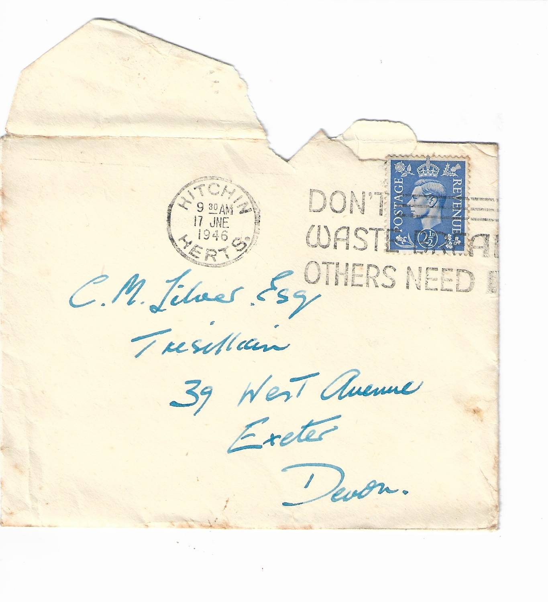
> 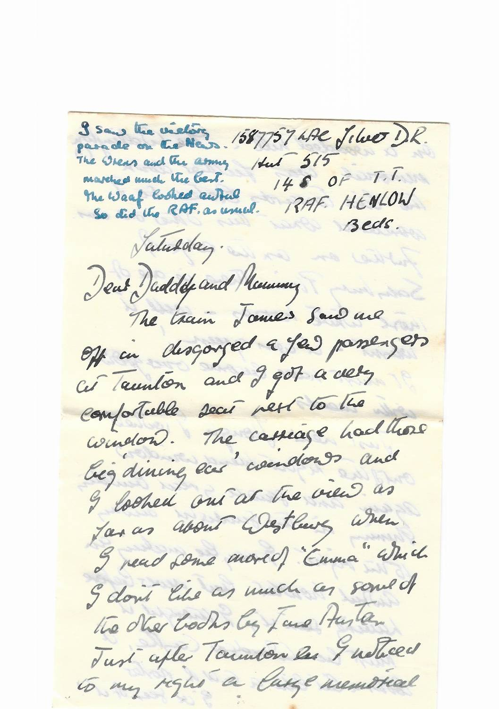
> 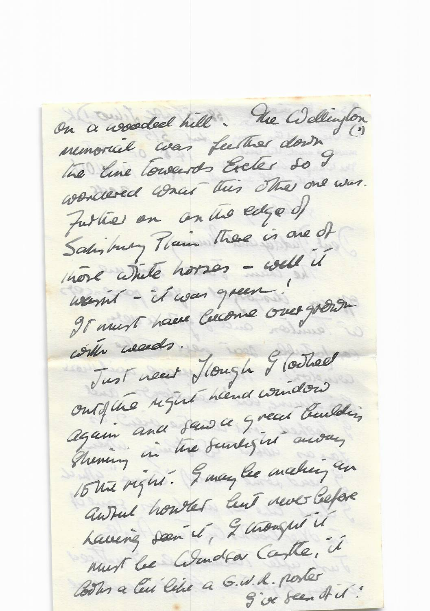
> 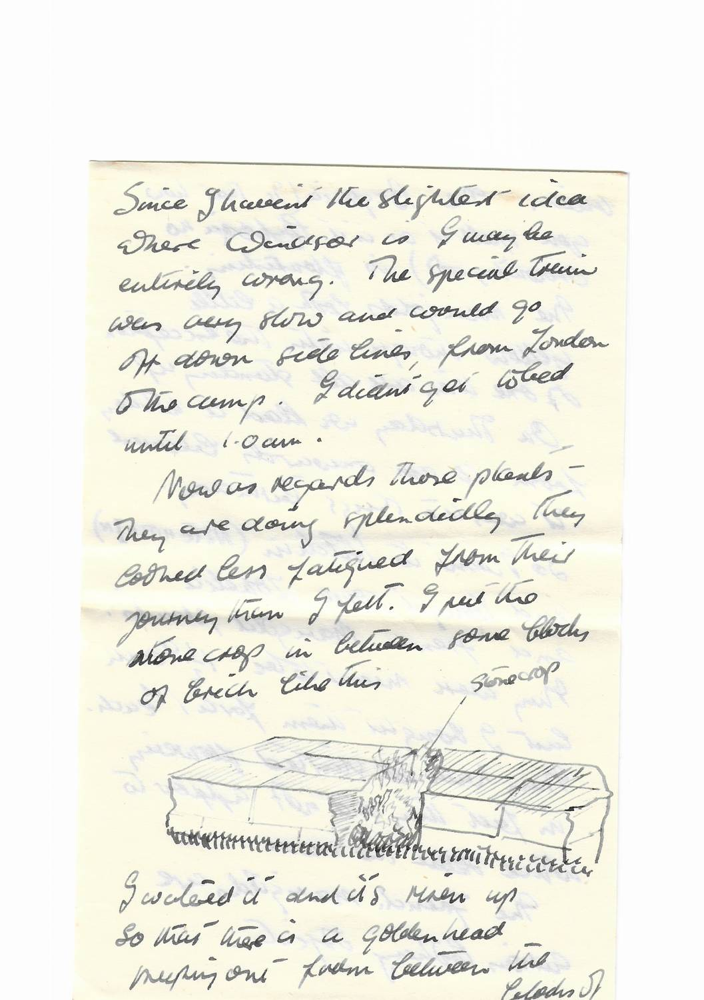
> 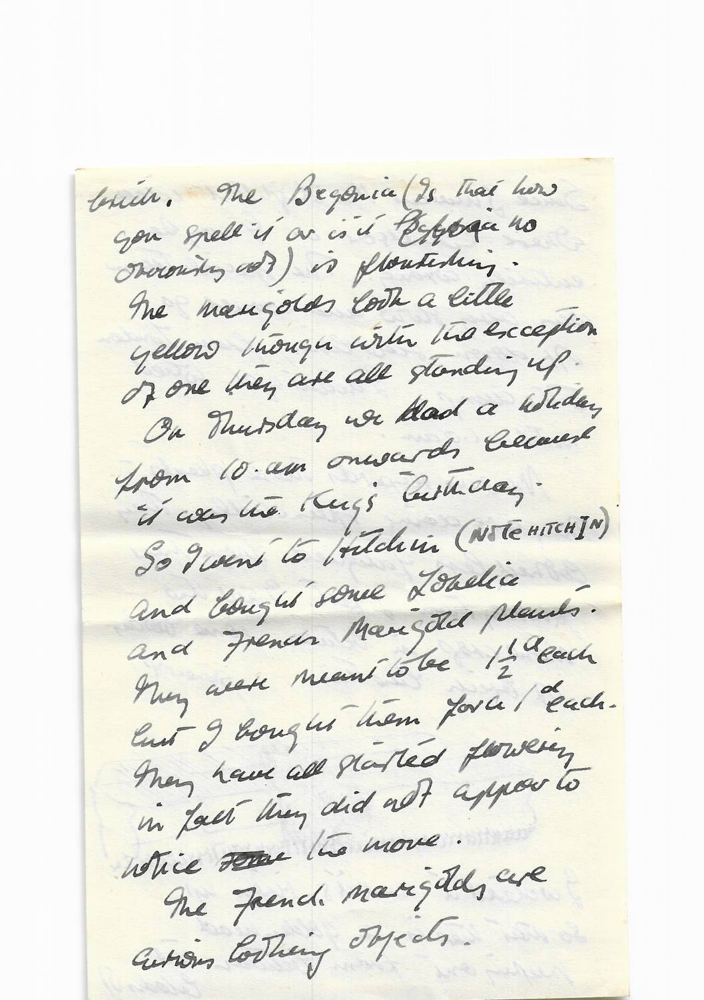
> 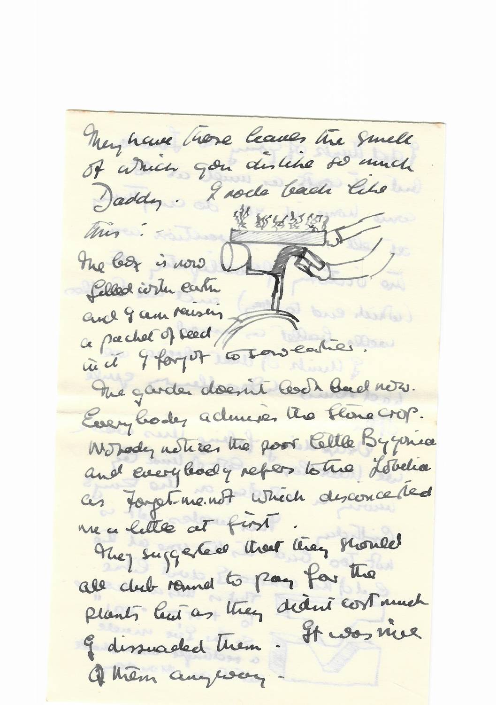
> 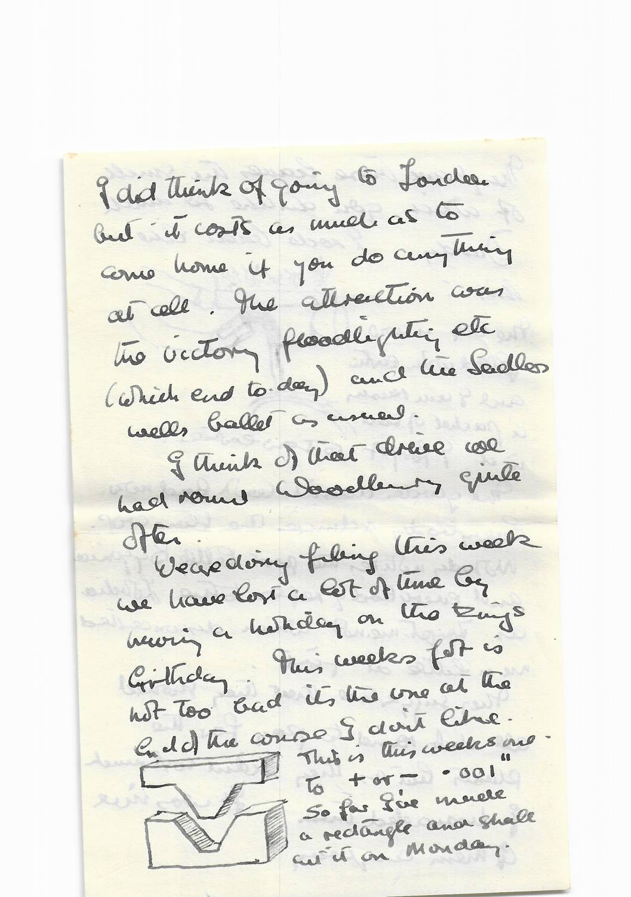
> 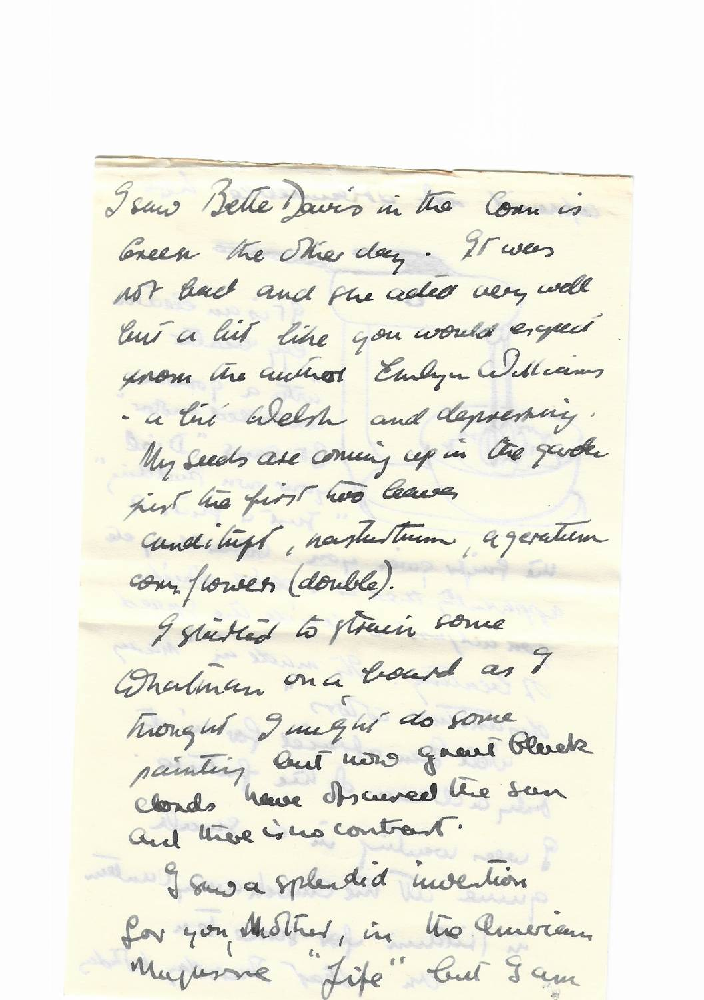
> 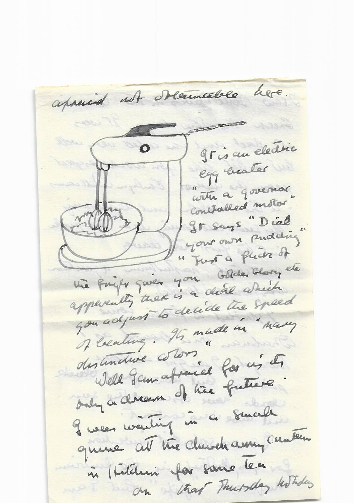
> 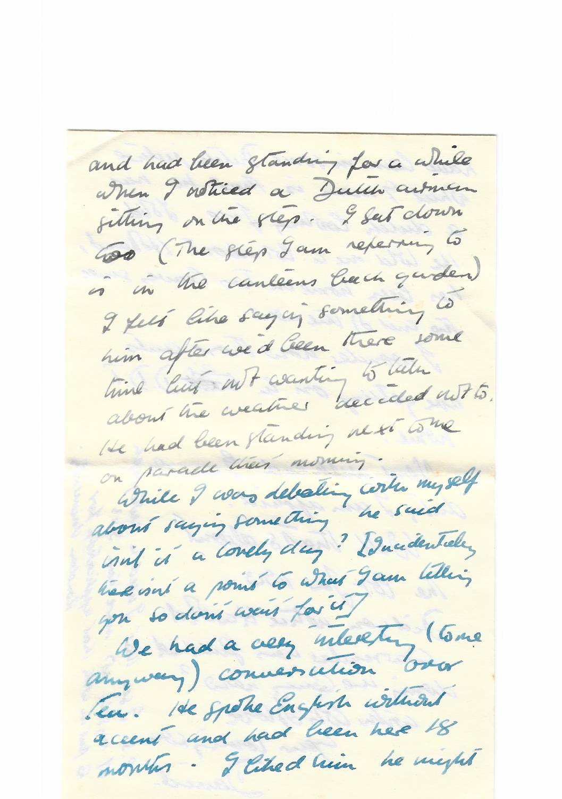
> 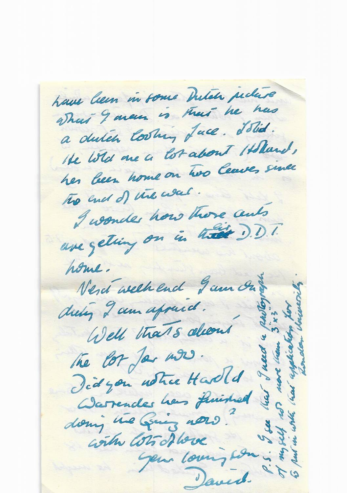

### 03. c. 19 June 1946, a birthday letter to his mother

*Undated, from Hut 515. His mother's birthday was 22 June (see Bruton letter 33). He mentions the airliner carrying Laurence Olivier (and, he says, his wife) and the Old Vic company home from New York, a Pan Am Constellation whose engine failed and caught fire before it belly-landed at Willimantic, Connecticut, on 18 June 1946, and a sketch done "last Sunday afternoon" (16 June).*

> *(p. 1)*
> 1587757 LAC Silver. D.R.
> Hut 515
> 14 S of TT
> RAF HENLOW
> BEDS
> My dearest Mummy
> This is to wish you many happy returns of your birthday I hope you have a lovely day. It must be very nice to have Auntie Muriel with you.
> I enclose with this letter a not very good water colour sketch I did last Sunday afternoon near "Stevenage" the place the government want pulled down, looking at it I don't blame them.
> It's all that is loathsome in a small recently built country town. All the houses are ugly and were built within the last thirty years or so and form
>
> *(p. 2)*
> a very good example of how unattractive ~~ribbon~~ ribbon development can be. Further it is long on the main road and there is a constant procession of cars through its main street so that shoppers have to cross the stream of cars.
> It was one of those afternoons where it's fine somewhere else if you know what I mean. The sky reflected the sunshine elsewhere.
> I hope you like the little ballet books. The Ryvita has no particular connection with your birthday as it would have come along anyway.
> James wants me to see him off to Switzerland at Victoria on Sunday but I am on duty I'd like to but can't.
>
> *(p. 3)*
> The weather here has been stormy but not as bad as yours according to Daddy's letter.
> Did you see that the engine of the airliner in which Laurence Olivier and his wife were travelling dropped off and they had to make a safe but uncomfortable landing. I can't imagine how it could. What a big car Uncle Basil has but a good one I think. Well, Mummy dear if I am to wrap this up I must hurry up. I have a gaslighter (electric) for you but have broken it so must first repair it)
> Lots and lots of love
> your loving son
> David.
> P.S. don't do anything to the vacuum cleaner and don't buy a new one. Should get leave in 4 weeks

*Notes:* Stevenage had just been designated Britain's first New Town (the New Towns Act was going through Parliament in 1946), hence "the place the government want pulled down". "Auntie Muriel" is presumably the Muriel to whom Edwin Acott wrote in 1942. The back of the last sheet is blank.

> [!scan]- Scans (3)
> 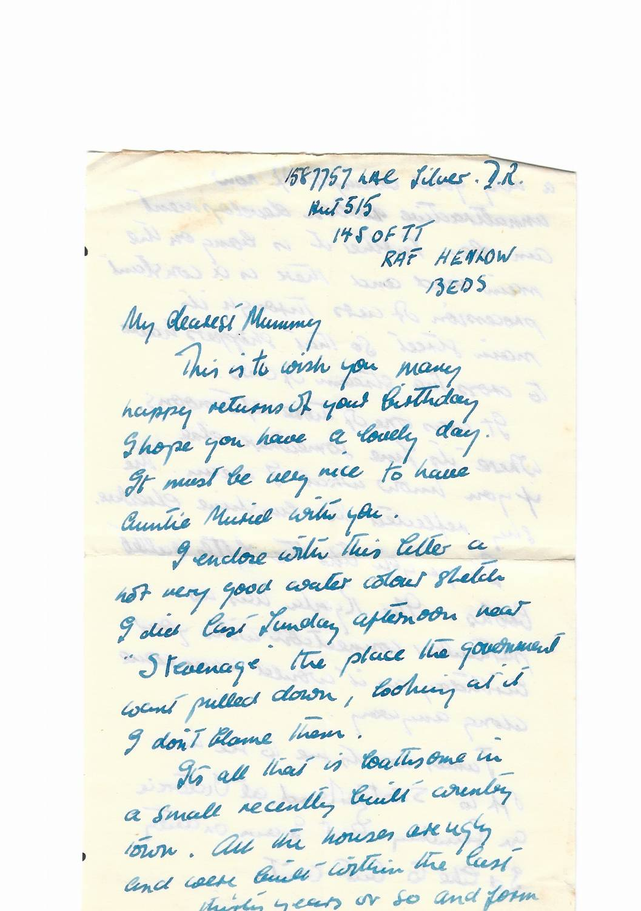
> 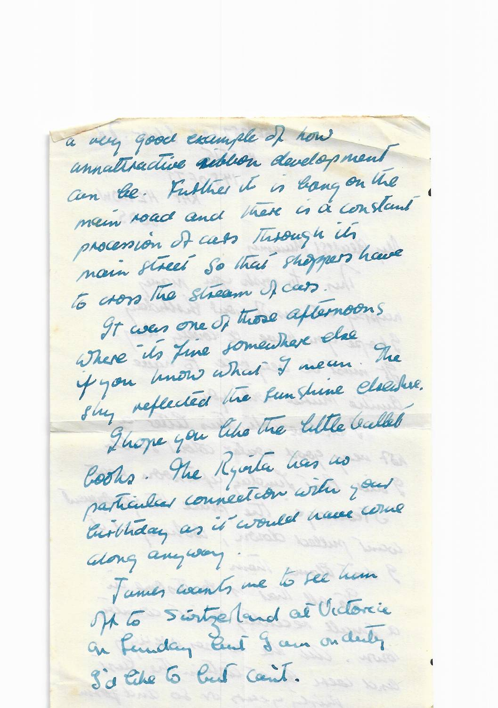
> 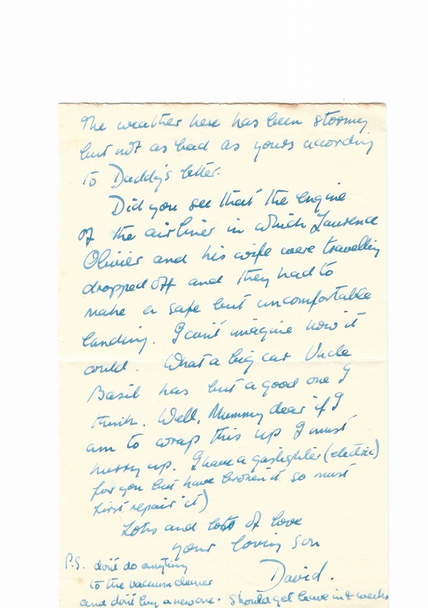

### 04. A Friday, summer 1946 (his parents on holiday by the sea)

*Undated, from Hut 515, "B" Sqdn. His parents are away by the sea, at a place he has sketched himself (the birthday letter says he expected leave about four weeks after mid-June), so probably July–August 1946.*

> *(p. 1)*
> 1587757 LAC Silver. D.R.
> Hut 515
> "B" Sqdn
> 14 S of T.T.
> RAF HENLOW.
> Friday
> My dear Mummy & Daddy
> I hope you are having a lovely time at the sea and that it isn't very cold. I have been listening to the weather reports on the wireless (yes - we have one now). It seems as though it must have been wet at first.
> I keep thinking of you and of the various places I sketched when I was there.
> I have accumulated most of my water colour equipment now but somehow feel unable
>
> *(p. 2)*
> to settle down to paint anything, I think it must be the weather.
> I went up to Cambridge by one train and came down by the next on Saturday. It was in answer to a post card from Heffer's telling me that my esteemed order (it reminded me of Honeywood) for - Canvas boards 15 x 11 was now ready for me to collect. I collected them - They are just what I wanted and hoped them to be and I am dying to try my hand at oils when I get home. James wrote to me from Great Missenden and I'd like to see him as he asked
>
> *[One or more pages missing here.]*
>
> *(p. 3)*
> house obviously hope.
> While they are in the deepest grief (put on) because the train has been found broken in pieces at the bottom of the waterfall, in walk Woolcott & Spencer B. Radford & N. Wayne.
> They are very keen on finding the body of Mr Barraclough. ~~They~~ Spencer climbs onto a roof to look into a Mr Grey's room (he's a criminal with a north country accent). He slips up and falls on his back on the flat roof of the coal house. Woolcott standing below reaches up and his ~~[illegible]~~ hand encounters Spencer's face - supposing Spencer to be up much higher on the roof he shouts to him that he has found the body.
>
> *(p. 4)*
> Last week's instalment closes, they having mistaken the window and having drawn a blank, ~~they~~ ~~[illegible]~~ ~~preparing~~ then they prepare sandwiches in the kitchen late at night for some adventure on the morrow. They prepare them with a bread knife which after Woolcott has cut himself on it he recognises as the fatal weapon used before. While he's looking at it a man rushes in, asks to borrow the knife and rushes out with it laughing. The occupants of the house had earlier decided that they must dispose of the non-criminal girl.
> That's as far as we've got so far, I hope that it hasn't bored you and it hasn't
>
> *(p. 5)*
> been too rambling.
> Here's the story from Punch
> [David then copies out in full a humorous short story from Punch, "The Portrait", running over this page and the next three. It is not transcribed here because it is a published piece rather than David's own writing; his handwritten copy can be read in the scans. In summary: the narrator, at a picture exhibition, finds a much-criticised surreal portrait and is about to dismiss it as a likeness of no one when he notices the lady sitting beside him on the bench is plainly its sitter.]
>
> *(p. 6)*
> [Continuation of David's copy of the Punch story "The Portrait" (not transcribed; see scan). The narrator blurts out "It's marvellous… a speaking likeness - how did you come to be like that?" and apologises for the rudeness.]
>
> *(p. 7)*
> [Continuation of David's copy of the Punch story "The Portrait" (not transcribed; see scan). The lady, half machine, explains that her mother was a late-Victorian lady and her father "a bicycle, a lady's bicycle, you know".]
>
> *(p. 8)*
> [End of David's copy of the Punch story "The Portrait" (not transcribed; see scan). The lady remarks that the force of gravity is "quite superseded now", and the narrator, bewildered, changes the subject to the artist.]
>
> *(p. 9)*
> [End of David's copy of the Punch story "The Portrait" (not transcribed; see scan): the lady glides away on wheels instead of feet, with a farewell snort on her bicycle horn, and the moral is never to say a portrait is like nothing on earth until one is quite sure.]
> + + +
> By Jove I've got writer's cramp but once started I had to finish I hope it won't take weeks to wade through. It seemed very funny to me the first time but now I don't find it at all amusing. I hope you do. It reminds me of Picasso.
>
> *(p. 10)*
> I think I must draw the scene.
> Hoping that ~~If~~ you don't send telegrams to my C.O. that I've gone off my head after reading all this, I'll finish this interminable letter off.
> with lots of love
> hoping you are having a lovely time
> your loving son
> David.

*Notes:* At least one page is missing after p. 2, where he began retelling a radio thriller serial starring Basil Radford and Naunton Wayne (as "Woolcott and Spencer"). Pages 3–4 finish that retelling; pages 5–9 are his handwritten copy of a comic story from *Punch*, "The Portrait", which is summarised rather than transcribed because it is a published piece, not his own writing (it can be read in the scans). Heffer's is the Cambridge bookshop and art supplier; "Honeywood" is probably a firm or shop the family knew.

> [!scan]- Scans (10)
> 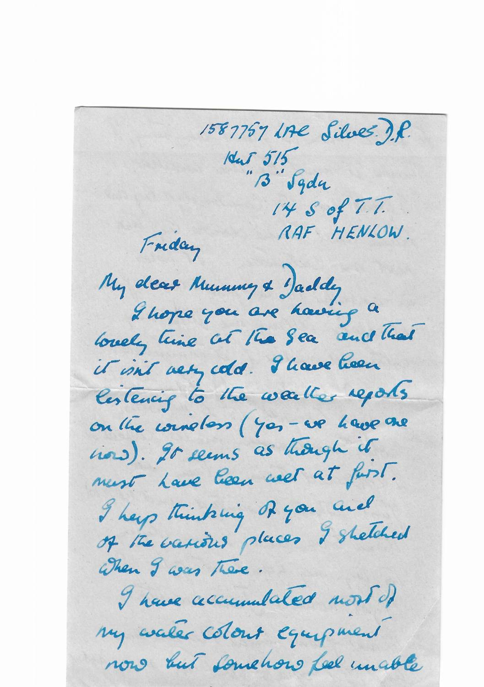
> 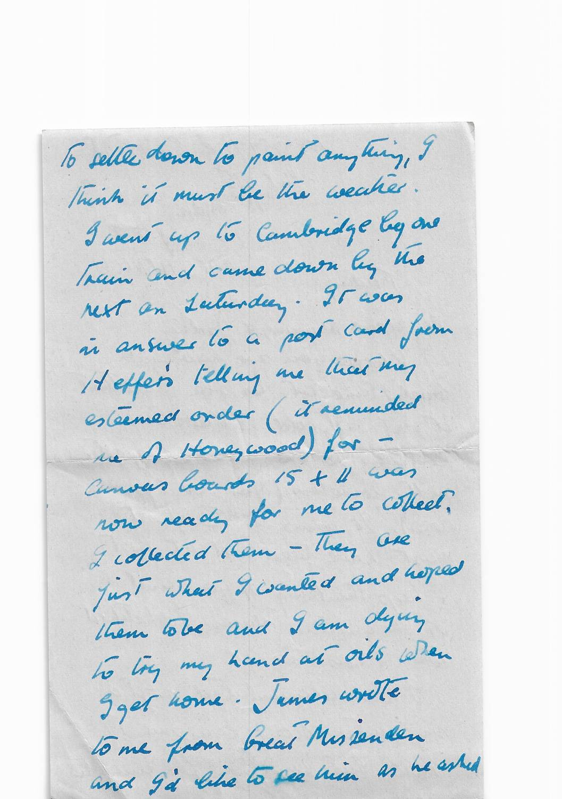
> 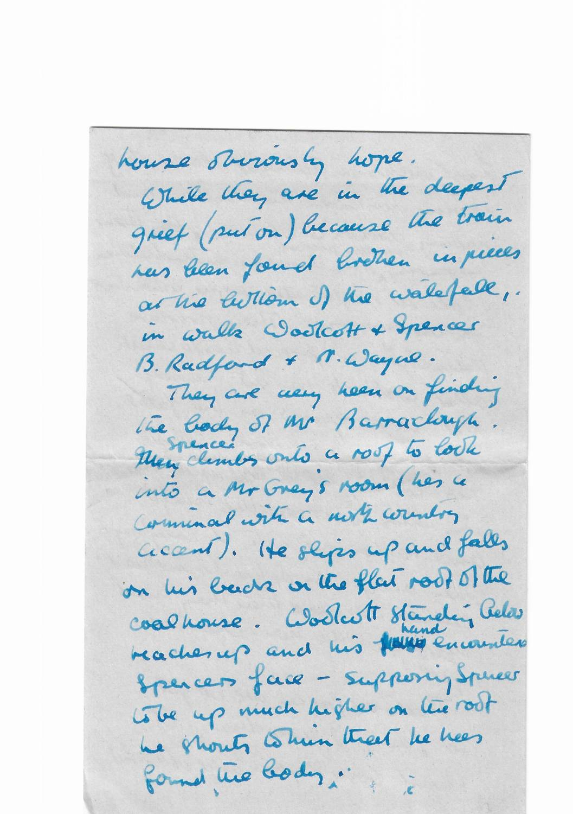
> 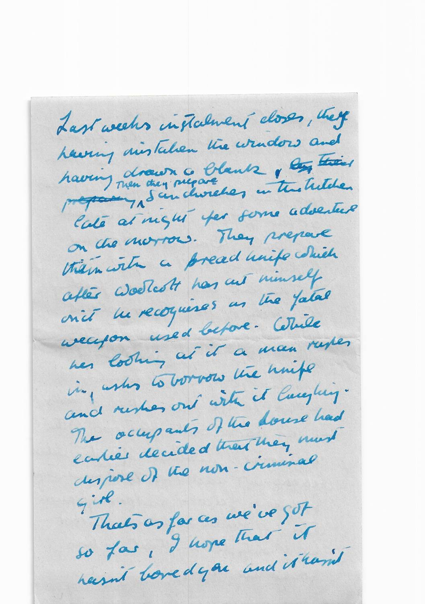
> 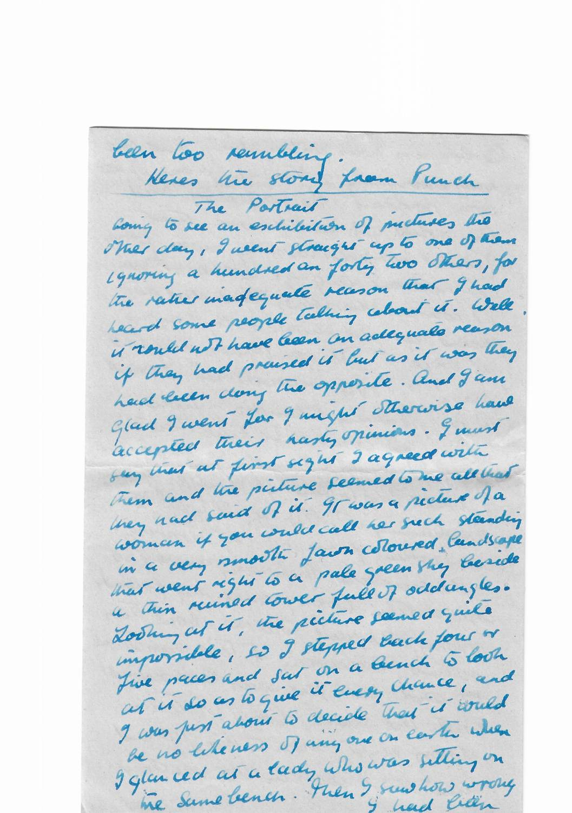
> 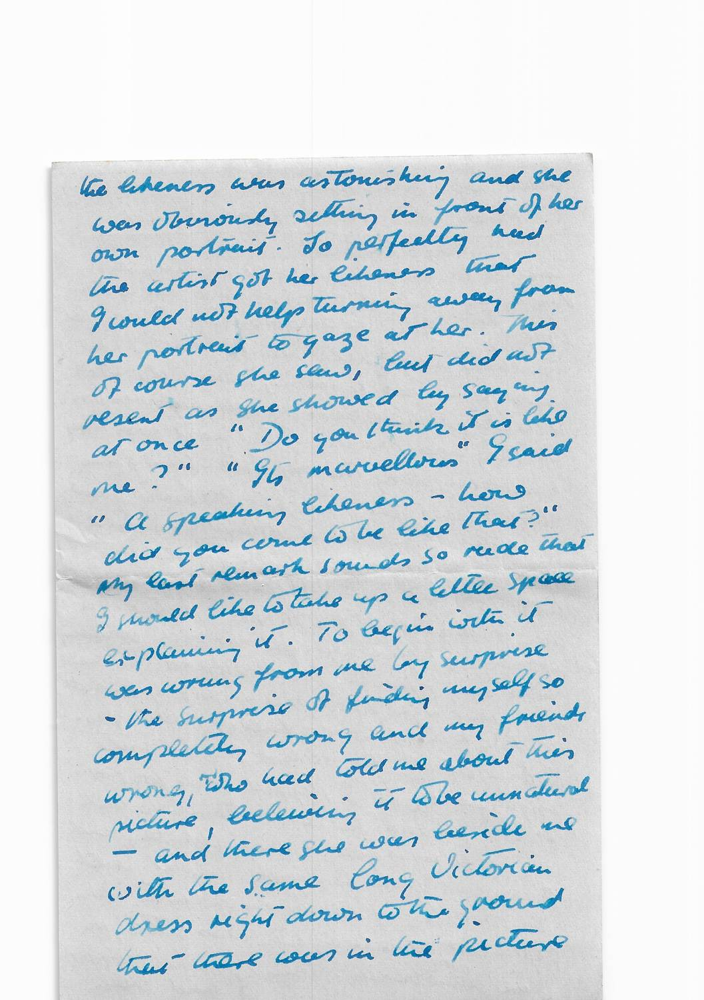
> 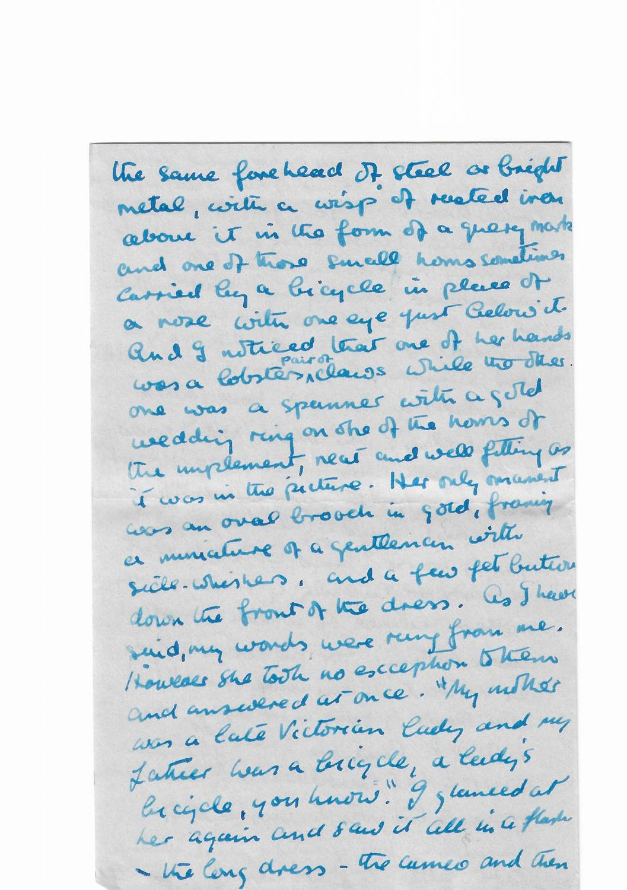
> 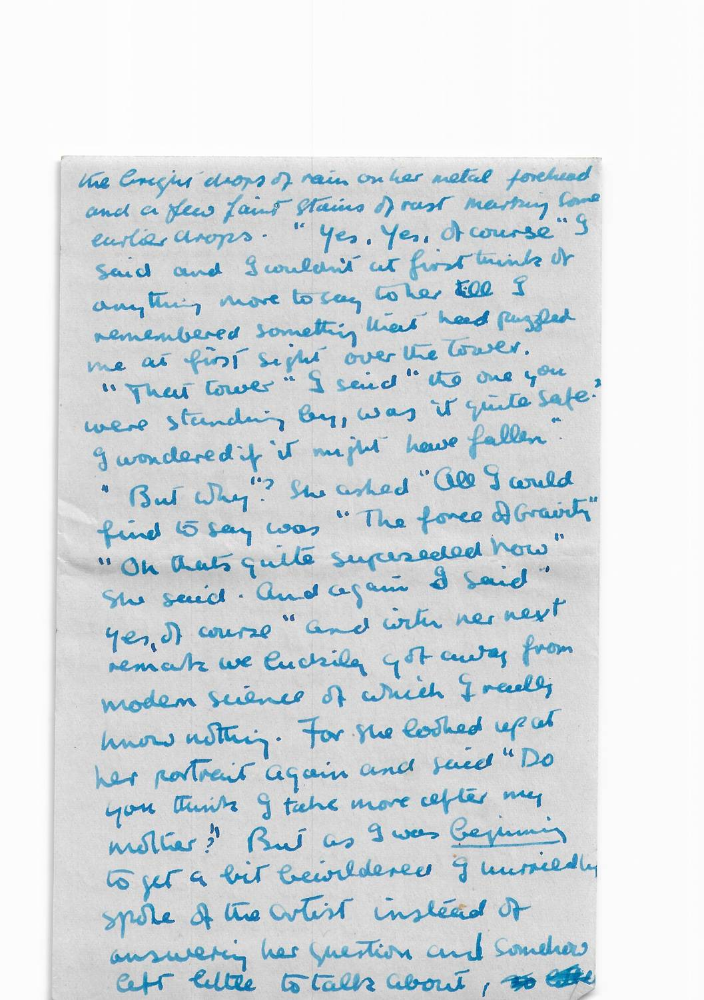
> 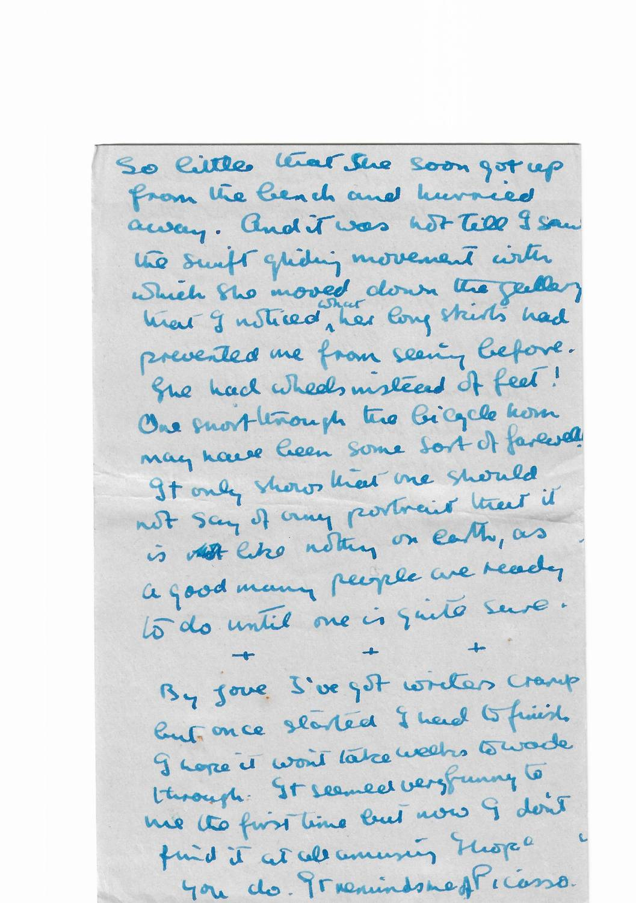
> 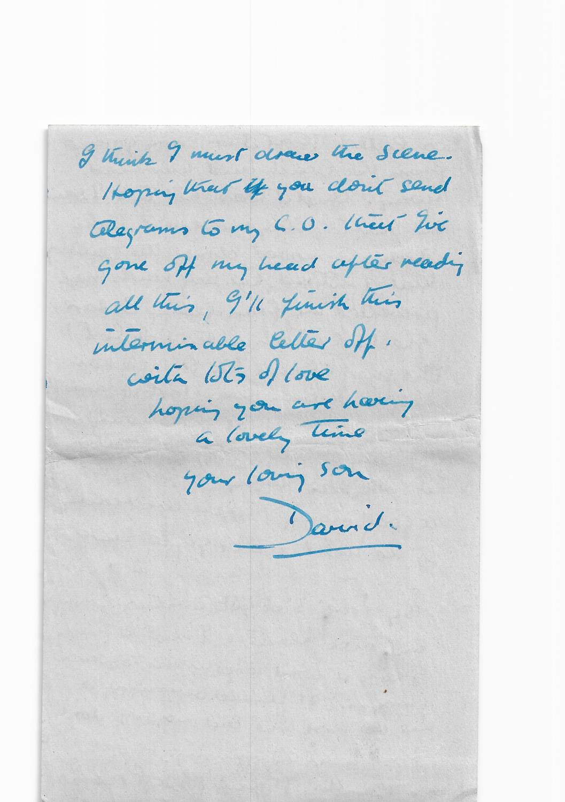
