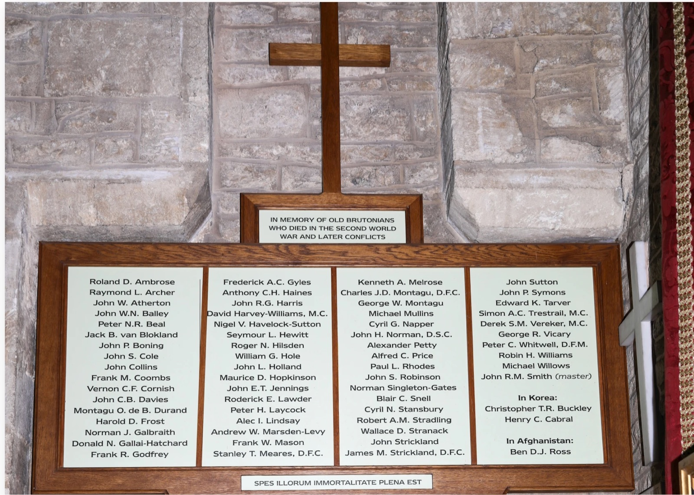

*← [Silver Family Archive](./)*

**King's School, Bruton** (today **King's Bruton**) is a boarding school in Bruton, Somerset, founded in **1519** by Richard FitzJames, Bishop of London, with his nephew Sir John FitzJames and Dr John Edmondes, and refounded by **Edward VI in 1550**, which is where "King's" comes from. Its motto is *Deo Juvante* ("with God's help") and its emblem a dolphin, taken from the FitzJames coat of arms. Its magazine is *The Dolphin*.

[Christopher Silver](Christopher-Silver/) ("Kit") boarded there until 1938, and his younger brother [David Silver](David-Silver) from September 1937 to June 1942, both in **New House**. In 1936, during Christopher's time, a rare 1297 copy of **Magna Carta** was found in the school's archives. During and after the war the school grew from about 100 boys to over 250. David's letters home from these years are transcribed in full in **[The Bruton Letters (1937–1942)](Bruton-Letters)**.

## On the school war memorial

The school's memorial **"In memory of Old Brutonians who died in the Second World War and later conflicts"** (motto *Spes illorum immortalitate plena est*, "their hope is full of immortality") lists 69 names from 1939–45, one master (**John R.M. Smith**), two from **Korea** and one from **Afghanistan**. Checked against David's letters, about ten names belong to boys he knew or wrote about, mostly the senior boys of 1938–39. Apart from Stansbury and Cabral these are surname matches only: the same surname, at the same time, in a school of about 100 boys.

**Strongest matches**
- **Cyril N. Stansbury.** In September 1938 David lists the prefects for Kit, and Old House includes **"Stansbury C.N."** The initials match exactly ([letter 19](Bruton-Letters#19-a-sunday-at-the-start-of-the-autumn-term-september-1938)).
- **Henry C. Cabral** (Korea). In September 1939: *"Cabral who lives in Portugal has not yet returned, he must be having an awfully exciting time if he is returning"* ([letter 36](Bruton-Letters#36-saturdaysunday-at-the-start-of-the-autumn-term-september-1939)). Lt **Henry Chapman Cabral** (b. 24 Dec 1928), whose father was Portuguese and mother English, was educated in England, commissioned into the Gloucestershire Regiment in 1949 and died a prisoner in Korea on 26 November 1951. He would have been only ten in 1939, but the same letter says there was "a complete prep school at the sanatorium", so he may have been one of the junior boys. Otherwise David means an older brother.

**Senior boys David names**
- **Roland D. Ambrose:** a New House (David's own house) prefect in September 1938 ([letter 19](Bruton-Letters#19-a-sunday-at-the-start-of-the-autumn-term-september-1938)).
- **John C.B. Davies:** a New House prefect in 1938 ([letter 19](Bruton-Letters#19-a-sunday-at-the-start-of-the-autumn-term-september-1938)), back for the old boys' match in March 1940 ([letter 49](Bruton-Letters#49-sunday-3-march-1940)). Davies is a common name, though.
- **John E.T. Jennings:** an Old House prefect in 1938 ([letter 19](Bruton-Letters#19-a-sunday-at-the-start-of-the-autumn-term-september-1938)). In October 1938 he was giving a lecture on X-rays, which David went to because "it will probably be rather funny" ([letter 20](Bruton-Letters#20-sunday-30-october-1938)).
- **Raymond L. Archer** and **Peter H. Laycock:** both Old House prefects in September 1939 ([letter 36](Bruton-Letters#36-saturdaysunday-at-the-start-of-the-autumn-term-september-1939)).
- **Michael Mullins** and **John H. Norman, D.S.C.:** speakers in the school debate of October 1938, just after Munich, on *"The Price of Peace has been too high"*. Mullins seconded the motion and Norman led the opposition, which won about 37 to 11 ([letter 22](Bruton-Letters#22-a-sunday-october-1938)).

**Possible**
- **John P. Boning.** In September 1939 David tells Kit that *"Boning major died in the holidays of Bronchitis"* ([letter 36](Bruton-Letters#36-saturdaysunday-at-the-start-of-the-autumn-term-september-1939)). An illness death would not be on a war memorial, so John P. may be **Boning minor**, the younger brother.
- **John R.M. Smith (master).** A **Mr Smith** ran music in David's time, including the Musical Society trips to Bournemouth, and spoke in a 1938 debate ([letter 18](Bruton-Letters#18-summer-term-c-july-1938-two-weeks-before-the-end-of-term), [letter 11](Bruton-Letters#11-a-sunday-near-the-end-of-a-spring-term-c-193839)). Smith is too common a name to be sure.

*Not yet confirmed against Commonwealth War Graves Commission (CWGC) records, except Cabral.*
- [Henry Chapman Cabral 1928–1951 — British Historical Society of Portugal](https://www.bhsportugal.org/library/articles/henry-chapman-cabral-1928-1951)
- [History of King's — King's Bruton](https://www.kingsbruton.com/about-us/history-of-king-s)
