*← [Silver Family Archive](./)*

Two years after leaving [Bruton](Bruton-Letters), [David Silver](David-Silver) was **AC2 Silver D.R.**, an Aircraftman with the **Servicing Flight at RAF Little Horwood**, near Bletchley in Buckinghamshire. These are the earliest of his RAF letters to survive, both written to his parents at **Tresillian** in Exeter in the weeks before and on the day of the Normandy landings.

In the first, back from a 48-hour pass, he cycles across London between trains for the first time: Waterloo Bridge, the Strand, Trafalgar Square ("my old shipmate"), and Westminster Bridge, where Big Ben strikes six "with its BBC voice. I wondered whether you were at that moment listening to it down in Exeter." Then he finds that all 48-hour passes have been cancelled, "so no more flying visits I fear till after Hitler's fall".

The second is a **D-Day letter**. He began it on the Monday evening, 5 June 1944, and stopped when the Tannoy called blackout time. He picked it up again at noon on Tuesday 6 June: "Now to-day I cannot continue with my original theme as the long awaited day has come." He tips a plate of custard over himself listening to the 12 o'clock news ("So much for world affairs"), expects the Germans to retaliate, and breaks off because "there is a noise from heaven like the droning of a thousand bees."

**About the transcription.** The letters are transcribed with David's own spelling and punctuation. ~~Struck text~~ shows his crossings-out, [?] a doubtful reading and [square brackets] describe drawings and layout. Page breaks appear as *(p. n)*. The scans for each letter are in the collapsible **Scans** box beneath it. His later RAF letters are from [Oulton (1944–45)](Oulton-Letters), [Oakington (1945–46)](Oakington-Letters) and [Henlow (1946)](Henlow-Letters).

---

## 1944

### 01. A Monday, c. May 1944 (back from a 48-hour pass)

*Undated ("Monday"). He has just returned from a 48 at home via Waterloo and London to find "all 48hr passes had been cancelled … till after Hitler's fall", the ban on leave before D-Day. In the next letter (5–6 June 1944) he has visited the Whitehall map shop that he plans to visit here, so this one comes first: probably late May 1944.*

> *(p. 1)*
> 1587757 AC2 Silver D.R.
> Servicing Flight
> R.A.F.
> Little Horwood
> Nr Bletchley
> Bucks
> Monday.
> Dear Mummy & Daddy
> I got here according to plan. Arrived at W'loo at about 4.10 pm about 25 minutes late.
> Took bicycle myself from guards van and through barrier, and rode along a route many times already mentally rehearsed. I crossed W'loo bridge, first disappointed at the smallness of the Thames then surprised at its size from midway across. (one way traffic only).
> Up Kingsway and Southampton Row across Euston Road to the Station, deposited bike in left luggage office and pack and respirator in Forces Free Cloak Room.
> I had already consumed the
>
> *(p. 2)*
> very nice sandwiches for lunch and so went into the Y.M. at Euston for a cup of tea and three splits with strawberry jam on.
> Then free of all impedimenta I decided to visit the Strand already interested by crossing Waterloo bridge. I travelled by tube, incidentally having sought out from the Y.M.C.A information bureau the only shop known to them left that sells maps.
> It is in Whitehall and I shall visit on the next possible week day. ~~It~~ Having examined rather hurriedly the Charing Cross Station (very interesting early Norman!)
> I went to Trafalgar Sq where I looked at my old shipmate and passed on to Westminster Bridge this I partially crossed to obtain a good view of the
>
> *(p. 3)*
> houses of parliament time had marched on and it was now almost six o'clock. I looked up at the clock which I supposed was Big Ben and thought it much larger and more elaborate than I had supposed. As if to prove its identity it struck 6 o'clock with its BBC voice. I wondered whether you were at that moment listening to it down in Exeter.
> I had given myself till 7.10 to go round after which time I must be back at Euston. I went down Bird Cage Walk by the edge of St James Park, surveyed the Buckingham Palace, crossed what appears to be called the Green Park, went down to the right towards Piccadilly Circus across, up Shaftesbury Avenue right turn to Leicester Sq. tube back to Euston.
>
> *(p. 4)*
> collected luggage and bike which I installed in the waiting train.
> Had three glasses of SDI lemonade straight off. Got in the train and left on time at 7.40.
> Arrived at Bletchley at about 8.59. The train was so long I wasn't at platform so had to walk up it. My bike was in guards van at back so was afraid I should lose it. The guard however moved train forward for my bike and a pram (Strong man wasn't he? [Drawing: a little figure pushing a railway carriage along.])
> Then visited Y.M at Bletchley for supper of chips beans bread and butter and tea, (quite decently done) Then off by ~~B~~ bicycle to arrive in at about two minutes past ten.
>
> *(p. 5)*
> Please forgive bad writing and disjointedness, etc, I am in a hurry to write this as have little time. On arrival found to my sorrow yet in a way to my satisfaction that all 48hr passes had been cancelled. With satisfaction, because I had just got mine in in time. So no more flying visits I fear till after Hitler's fall.
> Also unfortunately day passes finish the hour you leave camp the following day. i.e. if I leave at 5 pm on Friday I have to be back by 5 pm Saturday. That's a rotten trick as the hours between 5 pm and bed time Saturday are no use to them and you go out again directly you're booked in.
> It ends my hopes of seeing Arthur I fear, or probably unless trains very suitable.
>
> *(p. 6)*
> Please tell Kit that I hope he will soon be out of that place and back at home
> I am so sorry that this letter is so scrappy.
> with lots of love
> your loving son
> David.

*Notes:* "W'loo" is Waterloo. The "old shipmate" in Trafalgar Square is Nelson. Arthur, at Chelmsford, appears again in the Oakington letters, and Kit (Christopher) seems to be in hospital or some other institution ("out of that place").

> [!scan]- Scans (6)
> 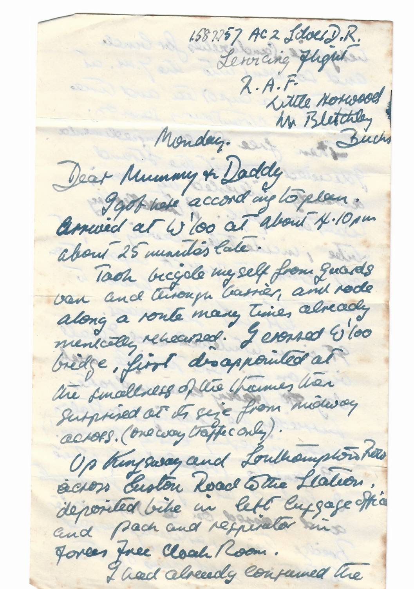
> 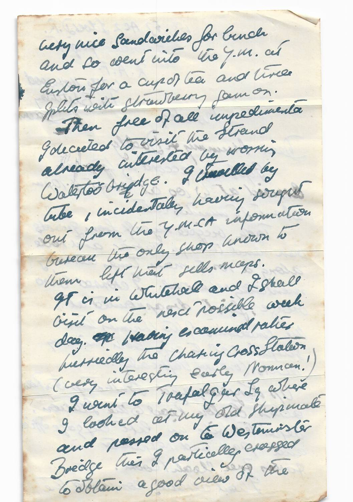
> 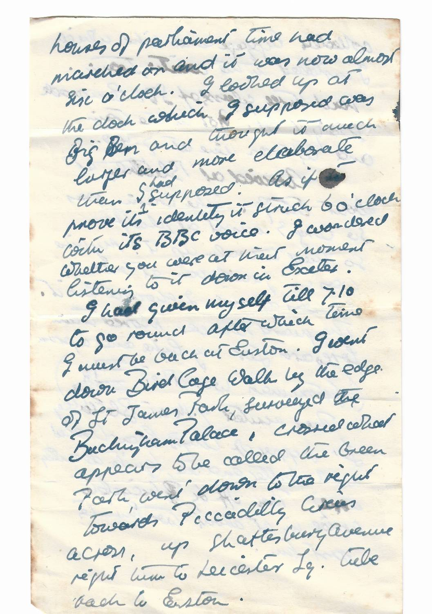
> 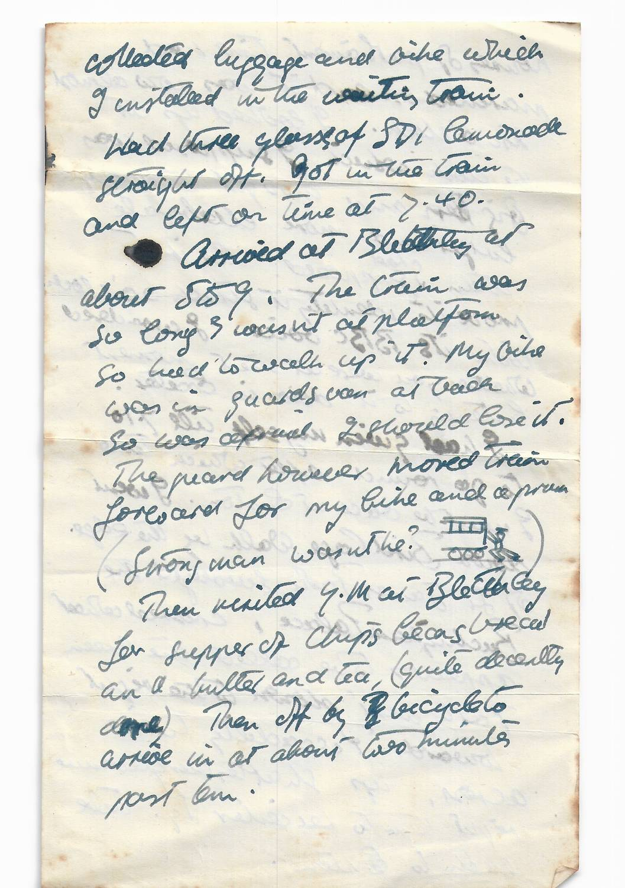
> 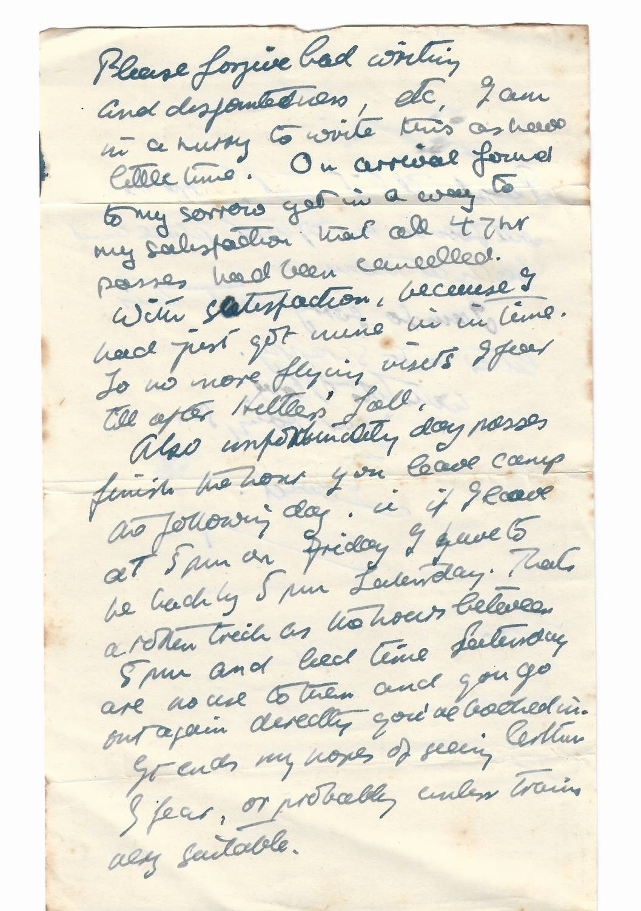
> 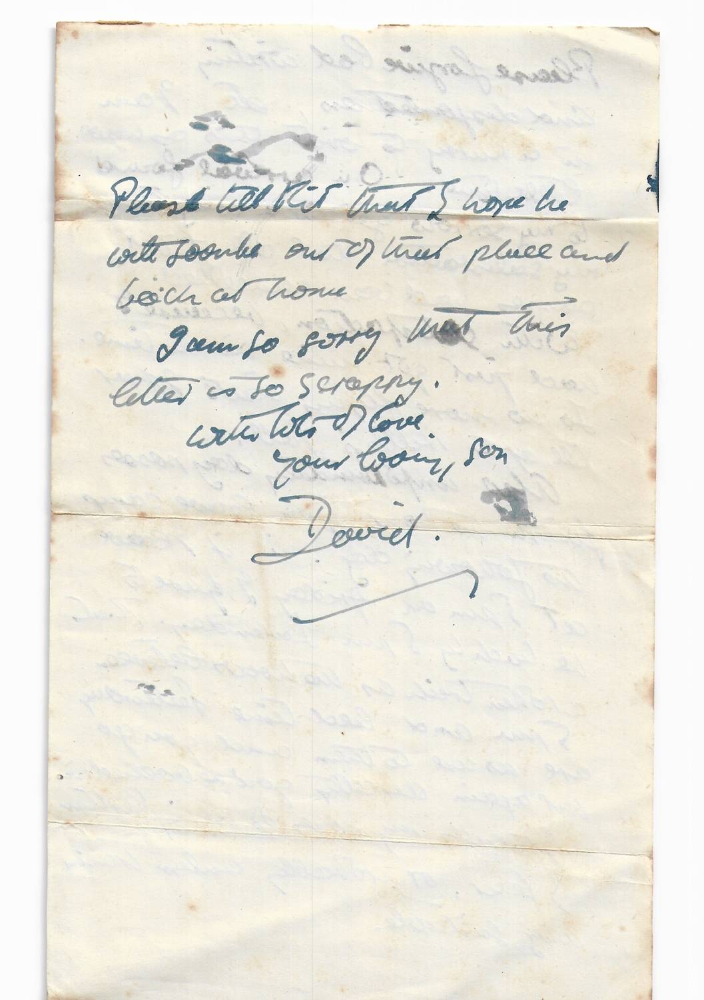

### 02. Monday 5 – Tuesday 6 June 1944 (D-Day)

*Begun "Monday" at blackout time and continued "Tuesday 12.25 noon" as "the news of the invasion filtered through"; he "didn't know we were in Rome till last night" (Rome fell on 4 June). The envelope, to C. M. Silver Esq., is postmarked BLETCHLEY 7 JNE 1944.*

> *(envelope)*
> C. M. Silver Esq.
> Tresillian
> West Avenue
> Exeter
> Devon.
> [2½d blue King George VI stamp; postmark BLETCHLEY BUCKS 2 PM 7 JNE 1944, with wavy-line machine cancel. Flap torn open.]
>
> *(p. 1)*
> [Top left:] Please forgive the oil on this page
> [Doodle below it: "~~oooo~~ oooo" and "11,000", with a dashed line running across to the address.]
> 1587757 AC2 Silver D.R.
> Servicing Flight
> R.A.F.
> Little Horwood
> Nr Bletchley
> Bucks.
> Monday.
> Dear Daddy & Mummy
> This letter I fear will either be delayed or very short as it is almost blackout time and some of our curtains will not draw.
> First of all thank you very much for the letter, Mummy dear. Don't bother about that great parcel for a while if it is not convenient.
> I wonder if Kit got his map and whether it was of the least use
> I asked at the Y.M.C.A. information bureau where you could get maps of Italy and they said there was only one address they knew of which would be any good -
>
> *(p. 2)*
> I saw Kit's map in a shop on the way down Tottenham Ct Rd. Then having arrived at Whitehall I found this other shop which only had a very highly coloured small scale map, I don't think it was any better.
> That incidentally was on my day off which I can definitely have from any hour convenient to the same hour the following day. So I could easily go and see Arthur as the train service to Chelmsford is very frequent. What shall I do, write to them? I wonder if they are there on a Friday.
> That's when I get my next one and the following week I am on duty and can't leave camp at all for the whole week but the week after that I might be able to fix a day. I was under the impression that Diana was still at school in Westmorland what does she do, wasn't there something about occupational therapy or is it my imagination?
>
> *(p. 3)*
> To return to my visit to London, in many ways it was unsatisfactory but I thoroughly enjoyed it nevertheless. It cost a lot and I didn't do such an awful lot when I got there but it was worth it.
> In the morning I set off by bike to Bletchley. I chained my steed to a cycle rack on the platform and caught the 9.15. getting in, non stop, at about 10.15.
> I walked down to James Grose in Euston Rd to see if I could get a part for my Sturmey Archer 3 speed hub which was broken. I couldn't. I set off in search of Winsor & Newtons in Rathbone Place off Tottenham Court Road, but must have passed it and forgot to look and was too lazy to return. I don't really remember much what I did except that I went to Regents Park, viewed the outside of Madame Tussauds (~~living~~ life-like wax studies of Monty! Stalin!) Somehow went down upper Harley Street All this is disjointed. I forget the order I did it in.
>
> *(p. 4)*
> Tuesday 12.25 noon.
> So far I got and no further when the Tannoy announced "It is now 2300 hrs and blackout time".
> Now to-day I cannot continue with my original theme as the long awaited day has come. This hot weather has caused a lot of flies on the ceiling. But that's beside the point. The news of the invasion filtered through and people kept dashing up and saying "the allies are invading and the Germans are in Berlin" which is considered a huge joke.
> On top of the news of the Germans defeat in Italy it seems too good to be true.
> Now is the time to keep your gas-masks handy!
>
> *(p. 5)*
> I don't know whether I shall be altering my address. There is good reason to suppose that I shall be so don't worry if there should be any period, longer than usual, between my letters. That statement implies no meaning other than it expresses so don't try to read anything between the lines which isn't there.
> Thank you very much for the long parcel of note-books which I received at lunch time. I was listening to the 12.00 news as I was getting my lunch and I had a plate with a piece of pudding on it covered in custard. I was so interested in the news that I put the plate right on the edge of the table, where, much to everyone else's amusement and my own chagrin it fell down turning over in the air and covering me with custard So much for world affairs.
>
> *(p. 6)*
> I am in the Y.M.C.A. writing this and wondering what will happen next, the Germans are going to retaliate I am certain. Somehow I wish we hadn't gone at them point blank. I didn't know we were in Rome till last night.
> We can get no newspapers and have very few wirelesses.
> My bike has a yellow number on it's back mudguard.
> Well I ought to have been at work ages ago and there is a noise from heaven like the droning of a thousand bees. [Drawing: a small aircraft, with the note "(I expect it has many)".]
> So goodbye till I write again.
> { I spent the morning moving four and 6 gallon cans from one place to another. }
> With love
> your loving son
> David.

*Notes:* Kit (Christopher) had asked for a map of Italy. David writes that there is "good reason to suppose" his address will change, and tells his parents not to read anything between the lines. The "droning of a thousand bees" is the aircraft going over on D-Day.

> [!scan]- Scans (7)
> 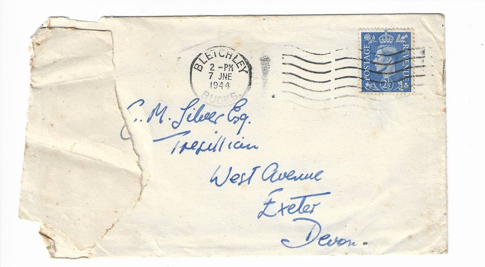
> 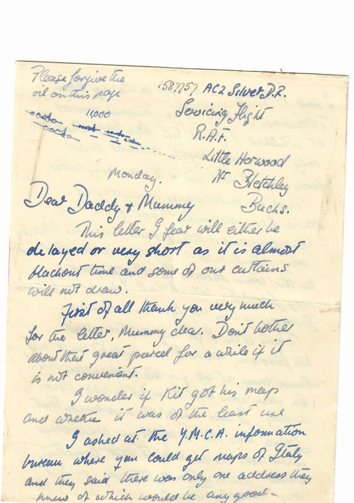
> 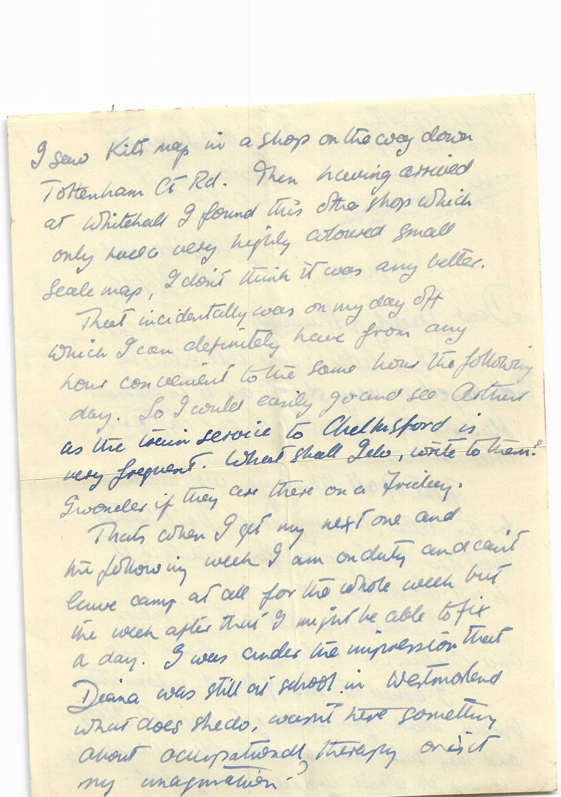
> 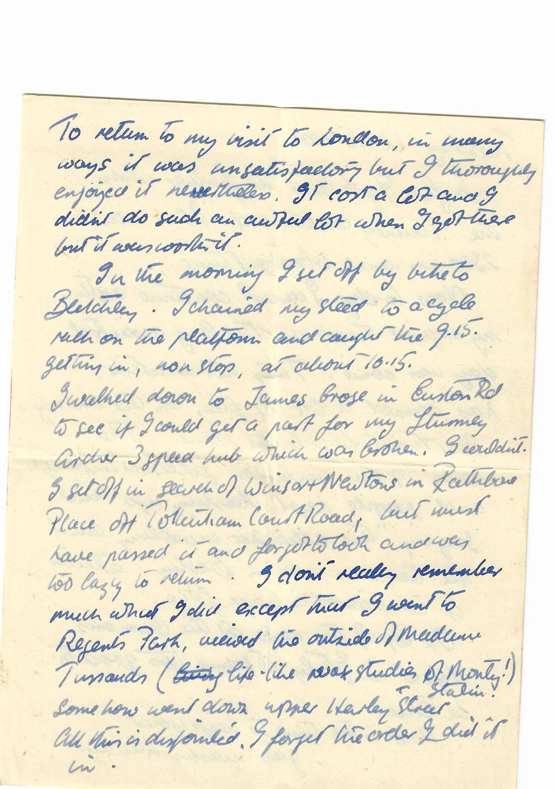
> 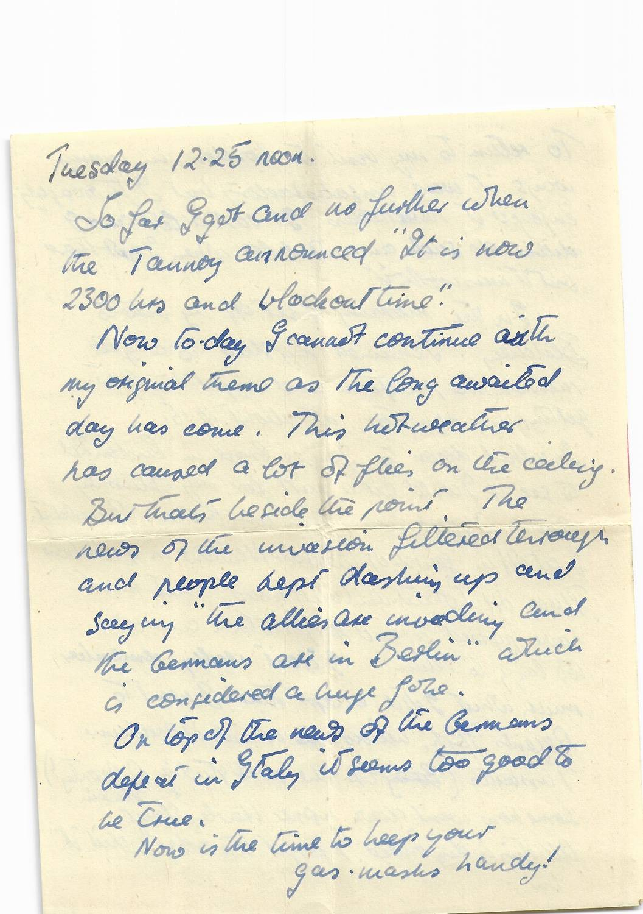
> 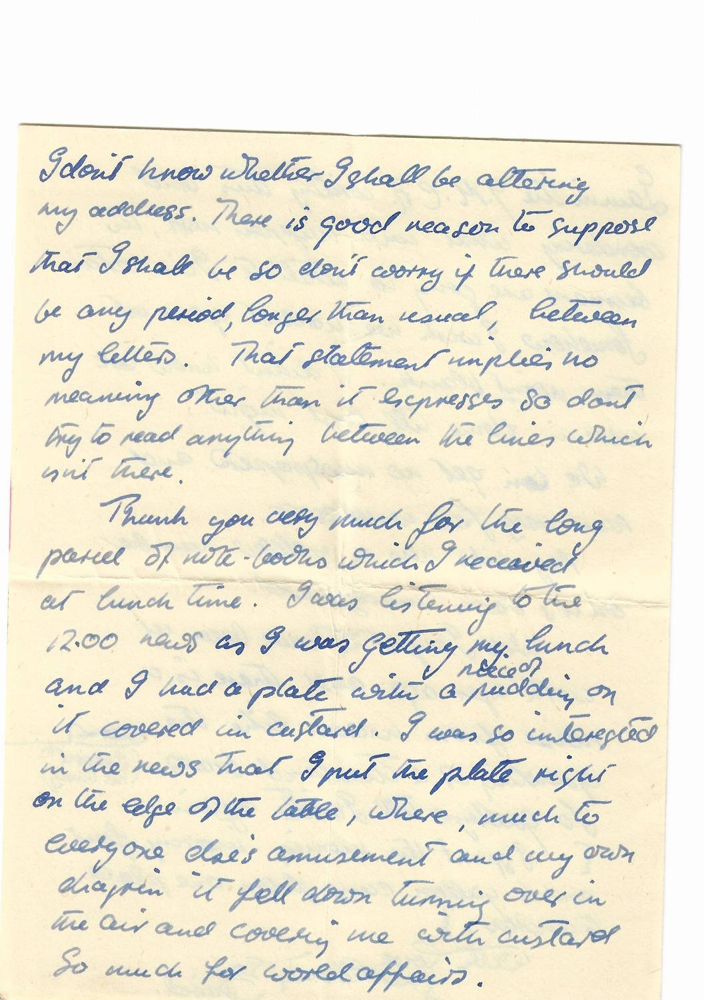
> 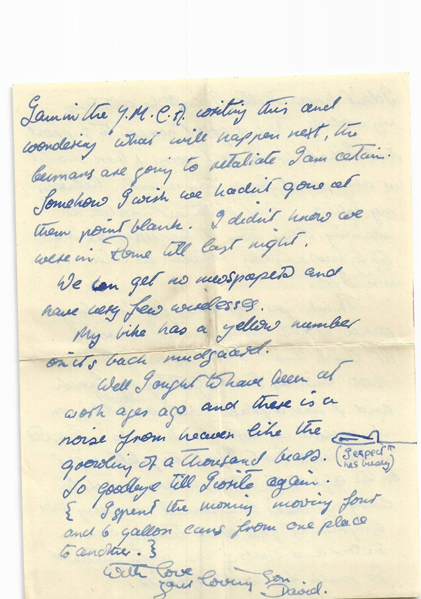
