*← [Silver Family Archive](./)*

A week after D-Day, [David Silver](David-Silver) arrived at **RAF Oulton**, near Aylsham in Norfolk, as **AC2 Silver** of 1699 Flight, a unit that trained crews on the B-17 Flying Fortress. These thirteen letters to his parents at **Tresillian** in Exeter run from June 1944 to Easter 1945, between his [Little Horwood letters](Little-Horwood-Letters) and his [Oakington letters](Oakington-Letters).

This is the year he set out to become an architect. On the education officer's advice he writes to the R.I.B.A. In August a **War Office correspondence course in the History of Architecture** comes through, with a Cambridge lecturer as his tutor, and through the autumn and winter he buys a drawing board and T-square in Norwich, draws Egyptian temples in a borrowed office in the evenings, and wishes he had more time: "it would take me a year to do a couple of months work at peace time speed." By day he sits "in the mud on a tin can under a tarpaulin", hates being an AC2, and longs for a commission in meteorology.

He cycles the Norfolk lanes, counts poppies and skylarks' nests, and is moved by Norwich Cathedral. He finds his hut-mates talk only of "football, riveting, aeroplanes, and beer". He hitch-hikes back from leave through the night on petrol lorries and a milk lorry, "seated on a churn". He hunts Norwich for a birthday present for his mother and is defeated by a shop assistant with a green jug. He draws the coast at Treknow, where his parents are on holiday, to settle an argument about a headland. And he imagines what record he would ask for if he were posted overseas: a voice saying "This is Exeter, Exeter St David's, the train standing on No 1 platform is for Torquay, Newton Abbott and Plymouth."

**About the transcription.** The letters are transcribed with David's own spelling and punctuation. ~~Struck text~~ shows his crossings-out, [?] a doubtful reading and [square brackets] describe drawings and layout. Page breaks appear as *(p. n)*. Most of the letters are dated from the events he mentions; the evidence is given in italics under each heading. One sheet is missing and two pages were damaged in scanning. A letter from RAF Cosford and two pages from his Bruton schooldays, which were filed with these, are given at the end. The scans for each letter are in the collapsible **Scans** box beneath it.

---

## 1944

### 01. Saturday, c. 17 June 1944 (just arrived at Oulton)

*Headed "Saturday Night". His first letter from Oulton, "after several days of shunting around" since leaving Little Horwood (where he expected a new address on 6 June), and censored (censor's signature at the foot). He has nothing for his mother's birthday (22 June), so probably Saturday 17 June 1944.*

> *(p. 1)*
> 1587757 AC2 Silver D.R.
> 1699 Flight.
> R.A.F. Oulton
> Aylsham
> Nr Norwich
> Saturday Night. Norfolk.
> Dear Daddy & Mummy
> Having just telephoned you I am now going to write a letter. After several days of shunting around I seem to be settled in and now I must try to get this letter censored and off to you. I expect your letters will be censored to me as well.
> I am so sorry that you got those note books back again just after sending them, could you hang on to them for the time being.
> Writing a lot of letters isn't very popular round here, probably because it means censoring a lot. Anyway I owe one to Mr Martin, James, Nanny, Kit
>
> *(p. 2)*
> and the Newhouse matron who wrote and told me that two of my companions in the study had been killed in the war.
> I mustn't mention any service matters but it doesn't really matter as I loathe everything to do with the service anyway. The country round about is beautiful, very much more so than I had expected and it is very much more wooded.
> I regret my movements about only in one respect, no sooner have I really settled in and got comfortable than I have to start all over again.
> My bicycle though feeling its ten or possibly eleven years of life is going quite well and saves me a good deal of rather dull walking.
> To-day I picked a sprig of honeysuckle which I have in my button hole (pocket). I am sure that the inmates of my hut none of whom I have ever seen before
>
> *(p. 3)*
> think that I am rather peculiar because I like reading and flowers. However it's nothing to what I think of them so I don't really care. If I had only my painting materials there would be some marvellous landscapes, but anyway I am in need of new brushes and more paper, both of which are practically unobtainable so it doesn't matter. There are a number of very good architectural subjects round about.
> Aylsham is a very very small town, it calls itself a town but it is no larger than Bruton. However it does boast a cinema, a very large number of "pubs" a post office, stationer, two chemists and perhaps most prominent of all, at least to the nose, a fish and chip shop, which should I want it, I could easily find from at least ten miles away.
>
> *(p. 4)*
> Cromer is ten miles from Aylsham, whether it is in a defence zone or anything like that I know not.
> I miss my regular day off ~~[struck]~~ and the possibility of future visits to London. I spent such a long time evolving wonderful schemes to occupy my free time, all to no purpose. Perhaps one day I shall go to Norwich but however interesting it may be it can never take the place of London.
> I did see Song of Bernadette at the New Gallery, I had a very good seat in the Dress Circle and thoroughly enjoyed it.
> There is a music circle here very different from the last which I used to look forward to very much. Nevertheless though the music is lighter and the technical arrangements to say the least - unusual - I enjoyed it, particularly the commentary
>
> *(p. 5)*
> given by a Squadron Leader in between records.
> There doesn't seem to be the usual well equipped reading room which I always used to like, here. However I will say that the R.A.F. do pretty well on the whole with regard to books and films and perhaps I was spoilt on my last station.
> In a few minutes I shall go to bed as my eyes are becoming so "hazy" that I can scarcely see the page. This happens to me, not infrequently nowadays, and I attribute it in part to the R.A.F. glasses which are not as good as my own. There are no baths here which I consider a very poor show. However if I was over the other side of the channel, there would be no beds as likely as not.
> It's about time we finished this
>
> *(p. 6)*
> war so that I can get in some of my time in the army of occupation prior to demobilization!
> I must do my laundry up before I go to bed so must stop now before the lights go out. I am afraid I have nothing for your birthday my dear Mummy, and if I had I should have to have it examined by the censor and would not be allowed to send anything with it by way of a note How irritating it is! as it makes one feel like a criminal. Fancy if I bought you a book or a picture it would have to be examined for security reasons! I shouldn't be surprised if censorship cuts down the number of parcels for the post office better than any poster campaign
> with lots of love
> your loving son
> David.
> [Bottom left, censor's signature:] E. Butt[?]

*Notes:* The Newhouse matron (his house at Bruton) had written to tell him that two of his old study companions had been killed in the war. Mr Martin was a Bruton master. *The Song of Bernadette* he saw at the New Gallery cinema in London before leaving.

> [!scan]- Scans (6)
> 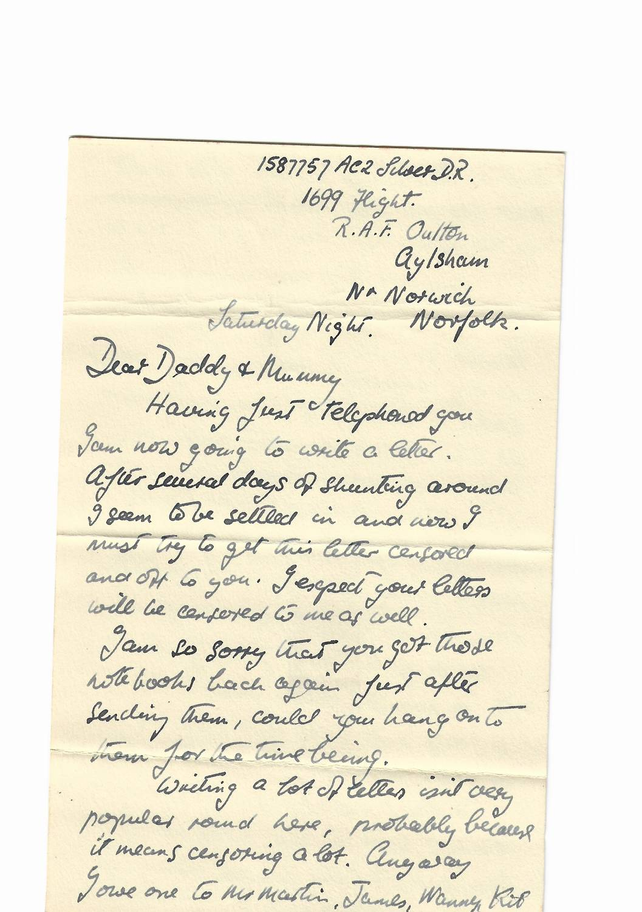
> 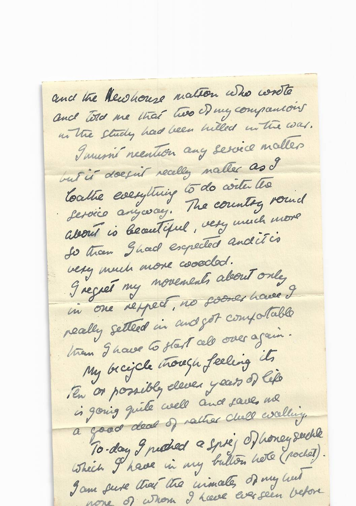
> 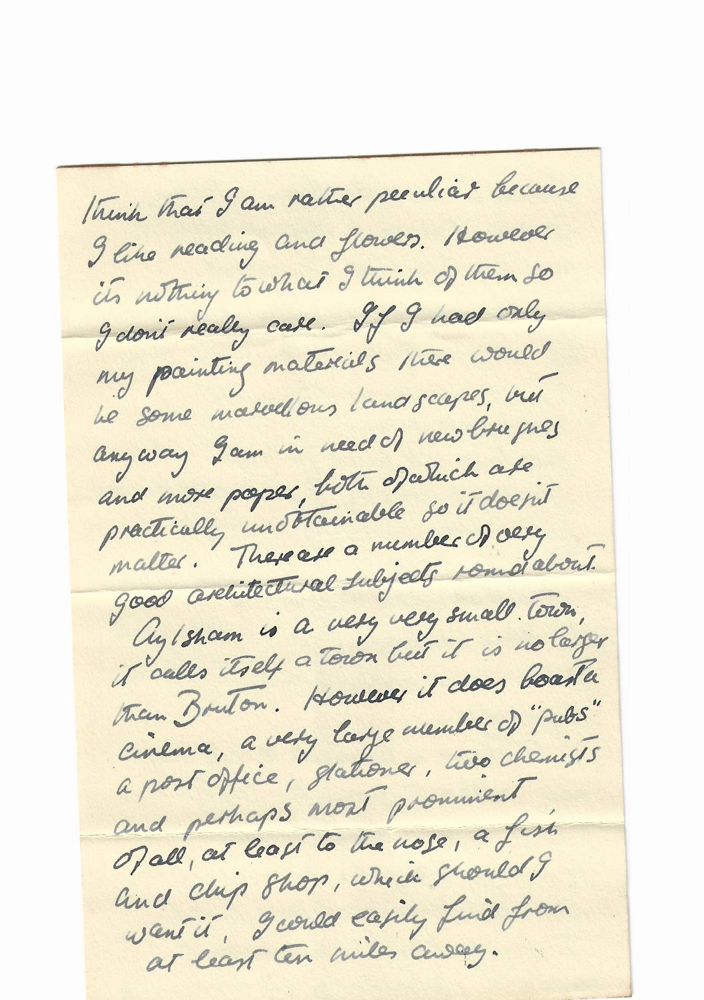
> 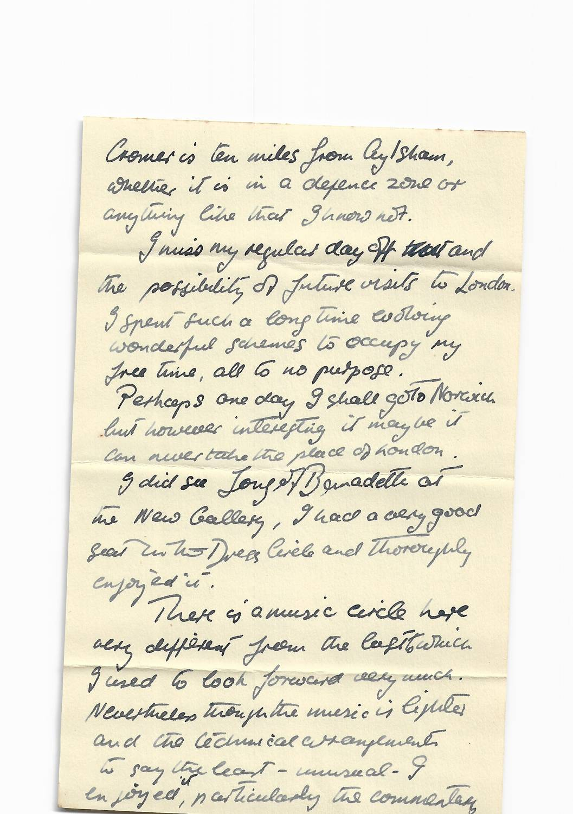
> 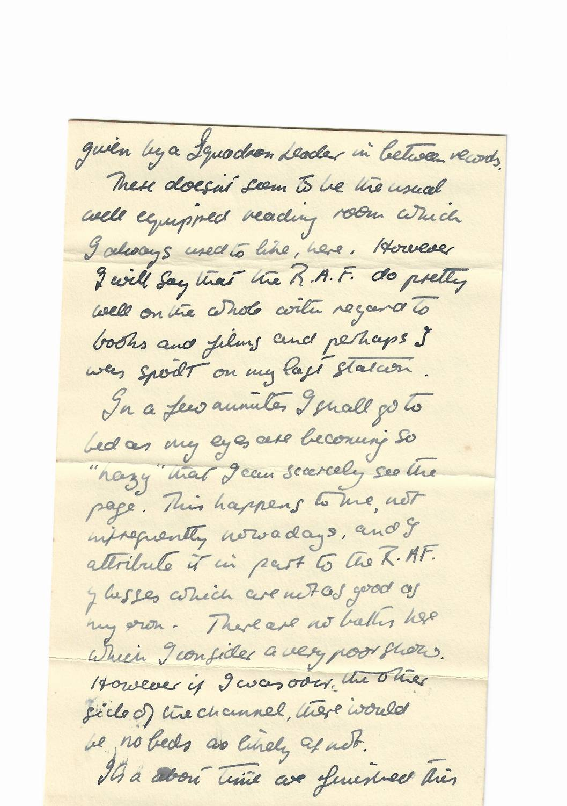
> 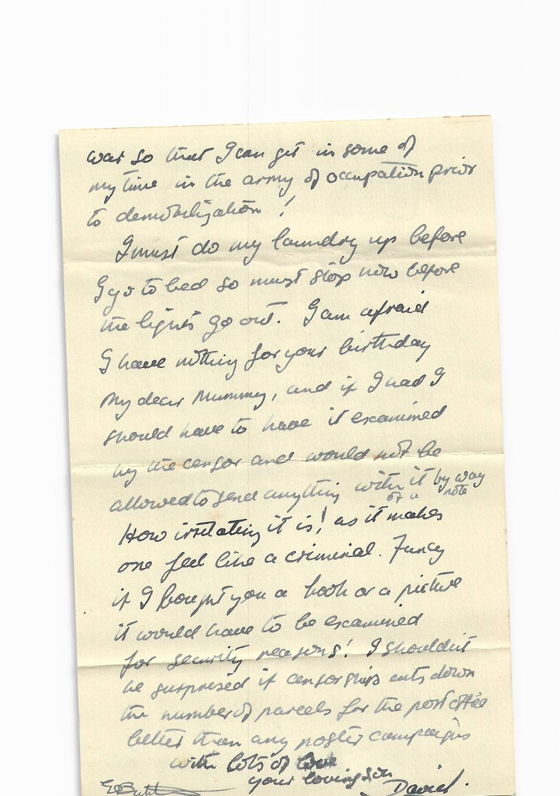

### 02. Tuesday, c. 20 June 1944: a birthday letter to his mother

*Headed "Tuesday", wishing his mother "many happy returns of your birthday" (22 June), on good notepaper. Kit is at home with her. Probably Tuesday 20 June 1944.*

> *(p. 1)*
> 1587757 AC2 Silver D.R.
> 1699 Flight.
> RAF Oulton.
> Nr Norwich
> Norfolk.
> Tuesday
> My dearest Mummy
> This letter is to wish you many happy returns of your birthday. I am writing to-day to make certain that it gets to you in time.
> I do hope that you have a lovely birthday and I am so glad that Kit is at home with you to celebrate it. I have nothing for you I am sorry to say as it seems very difficult to get anything from here. Had I only known that I shouldn't always have the advantage of London shops I should have bought you a present ages ago.
>
> *(p. 2)*
> I tried in Norwich yesterday but although it is an old town and one would expect good book shops etc I don't seem to have seen any there.
> It seems to consist of a castle, river, a number of music shops, three forces canteens and a lot of americans overshadowed by a lovely cathedral. I didn't really look at anything I wanted to, when I got there as one seems to be wrestling with one way streets and light signals and Americans directly you get into the rather narrow streets. I went into an antique shop that had a lot of glass in its window and asked if he had any sets of tumblers of good ordinary glass, not cut glass. He had grey hair, a greyish moustache (the man in the shop) a grey suit but no tumblers.
> Then I went into a sort of Colson's
>
> *(p. 3)*
> on a smaller scale, where there were some passable tumblers of ordinary thin glass, I asked if there was a set of them and the woman seemed immediately to have an insane desire to fetch the jug from upstairs. I foolishly tried to calm her, it only affected her more deeply and she rushed off upstairs to search for the jug.
> Downstairs a doubt was creeping into my mind about the tumblers. I began to dislike them. In my mind's eye I saw Daddy with a disgusted look on his face putting one down on the table after drinking from it. I decided to have nothing further to do with glass. On reaching this decision the woman came downstairs
>
> *(p. 4)*
> brandishing a horrible green jug. "This isn't the one" she said by way of defence as she met my eye "This is a green one like it". I thought, what's the good of that, to myself and decided to go. But she wouldn't let me, she entreated me to wait while she sent for the plain one. It was rather hot and she had horrid teeth and the green jug looked horrible so I said I'd rather not. She looked a little hurt and said that perhaps I could come in and see it later before they closed at 5.30 pm. I said that it was possible and made my escape. At 5.30, coward that I am, I was sitting in a very nice seat, in Norwich's ABC cinema, watching my old friend Spencer Tracy.
>
> *(p. 5)*
> He was in a film with a very un-promising name. "A guy named Joe". It was only Spencer Tracy's name that attracted me, but though impossible and very weak in parts, I thoroughly enjoyed it. My mental ability is on the decline and I think very possibly on my discharge from the air force I shall seek sanctuary in Exminster! I find life rather dull, a triple cold and very lacking in knowing anybody worth knowing. The whole of the time I have been in the air force I've scarcely met a soul who was in the very least bit worth talking or listening to.
> They will talk about such terribly uninteresting subjects as, football riveting, aeroplanes, and beer. None of which subjects really interest me.
>
> *(p. 6)*
> I picture you picking flowers in the garden on a lovely summer day, perhaps the most becoming occupation of any. I do hope it's fine on Friday for you.
> Do tell me what you would like [torn away]. I liked Ca[mbridge? torn away] good shops and was nice, rather like Exeter was once. I wish I had a lovely book of paintings or poetry for you. I should like to do some more painting, I miss it rather.
> I think we shall finish with Germany soon.
> With lots and lots of love
> your loving son
> David.

*Notes:* Colson's was the Exeter department store. "Exminster" is the Devon county mental hospital, a family joke. A strip of tape has torn away part of two lines on the last page; "Ca…" is probably Cambridge, which he passed through on his way to Oulton.

> [!scan]- Scans (6)
> 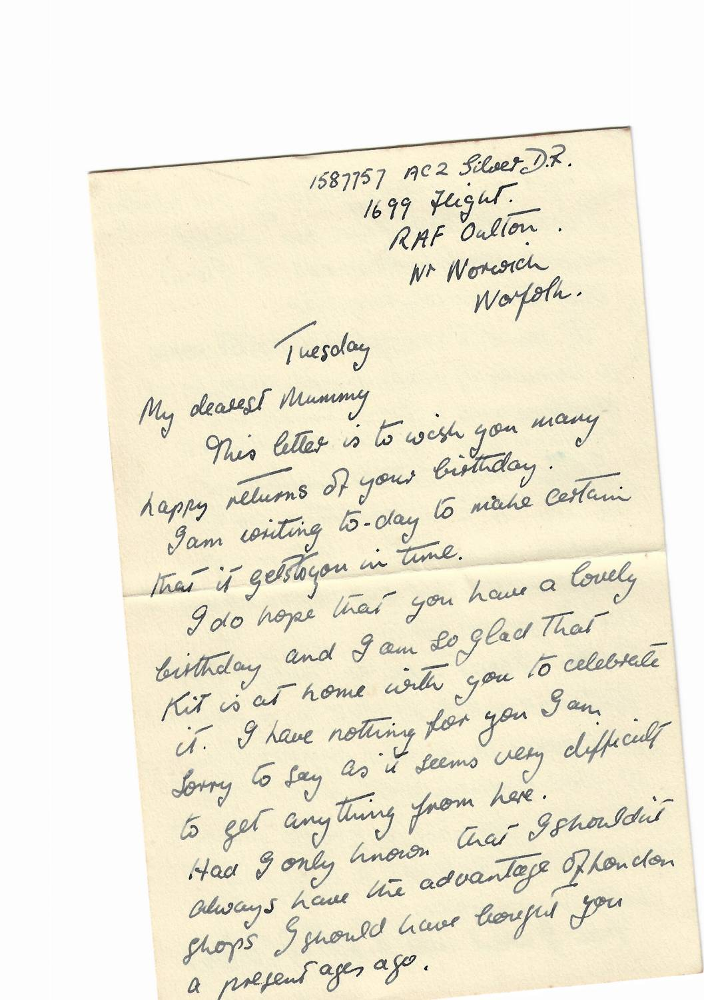
> 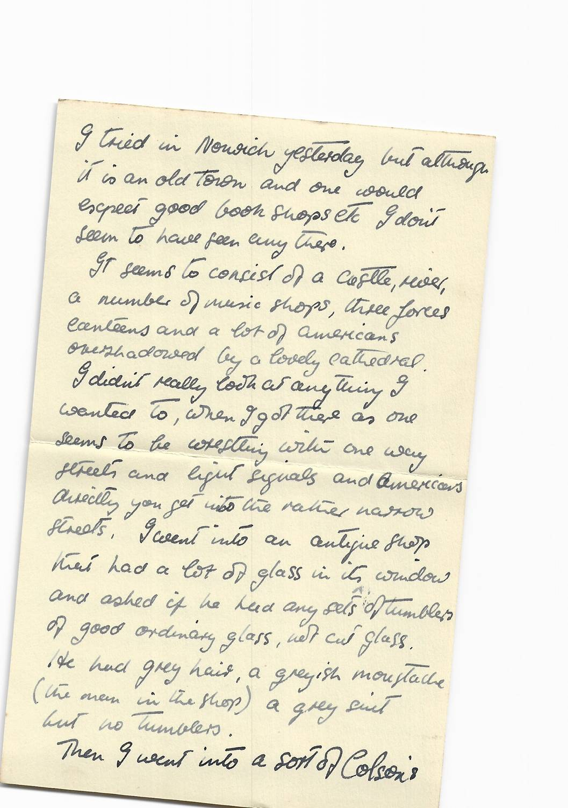
> 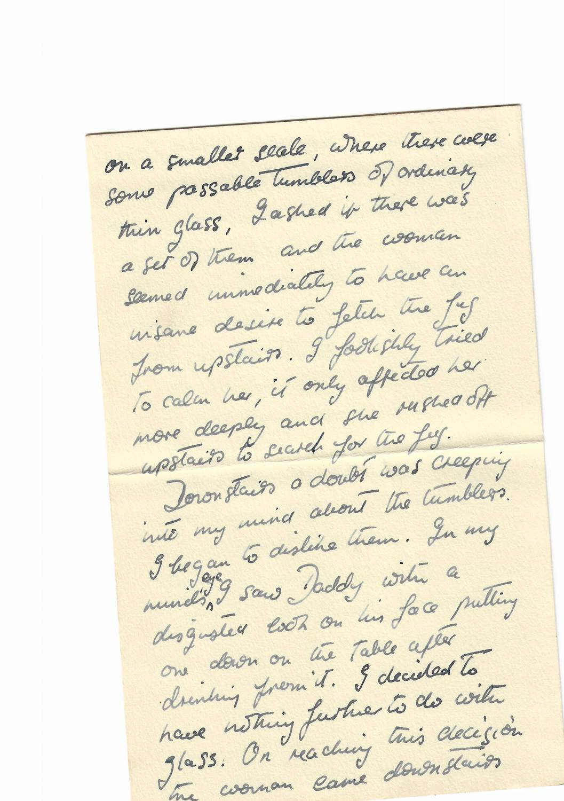
> 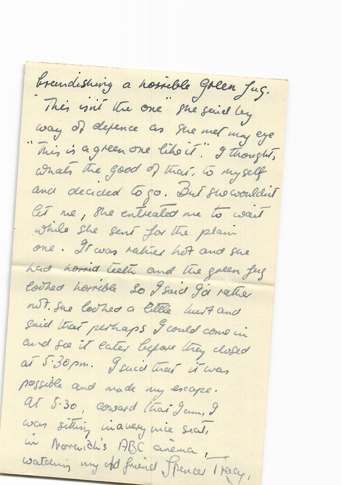
> 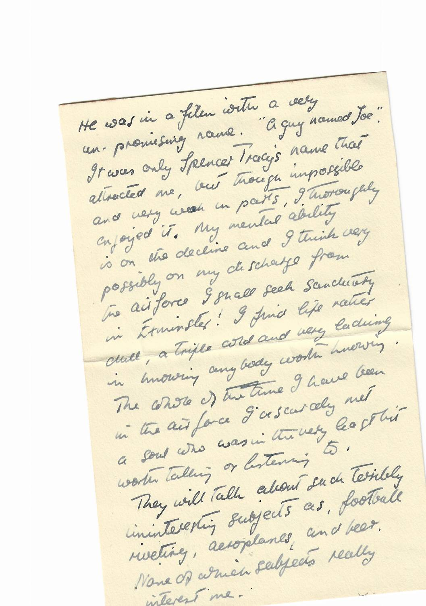
> 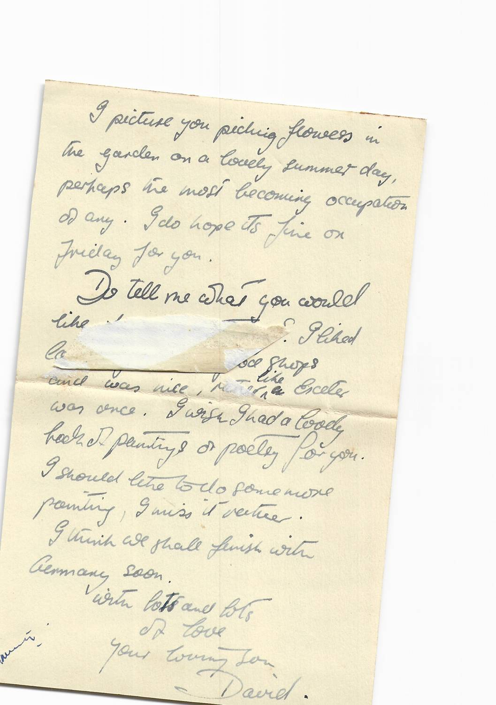

### 03. Thursday to Wednesday, July 1944

*Begun "Thursday" and added to on a "Monday" and a "Wednesday" ("it must be well over a week"); "Considering that this is July and the East Coast".*

> *(p. 1)*
> 1587757 AC2 Silver D.R.
> 1. [sheet number]
> 1699 Flight
> R.A.F. Oulton
> Nr Norwich
> Thursday. Norfolk.
> Dear Daddy & Mummy
> My mind begins to turn to Summer Holidays again. Sometimes I almost catch the sound of the sea but it's really the wind stirring the tree tops close to my hut.
> Talking of summer holidays - I did have a bathe the other day which I quite enjoyed although a large piece of inland water does not compare favourably with the Atlantic breakers.
> Thank you so much for your
>
> *(p. 2)*
> letters.
> The poppies in this part of the world have been marvellous, covering whole fields. I have known of one skylark's nest, one partridge's, and two house martins. In fact I've watched the progress of the young birds as they've grown larger and larger.
> Today all the colours are so vivid that if you close your eyes they leave a burning impression on your mind. They are the colours which you never believe to be possible in Dufaycolor. I see a notice about sketching and photography but as far as I can make out it only applies
>
> *(p. 3)*
> [Sheet number:] 2.
> at any rate as far as sketching is concerned to military objectives R.A.F., army, and naval things. I doubt very much whether anyone objects to my drawing trees.
> The library must have opened just after I arrived, as now it seems to be fairly well under way. I can see Punch and the Sphere and other magazines and papers almost any evening. They have asked for volunteers to help in opening the library ~~[struck]~~ in the evening so I gave in my name as ~~[struck]~~ the only way you can get any idea of what's happening in the outside world is by living in the reading room.
>
> *(p. 4)*
> Monday.
> I enjoy riding round the country in the evenings and have ridden about a hundred and twenty miles this week past. There's a one inch map in the reading room which is very useful. Unfortunately owing to Defence Regulations, naturally, the East Coast is a restricted area. So there are a lot of places which I should like to go to which are 'verboten'. I hope to go to Wroxham which as far as I know is all right. It's only about 10 miles from Aylsham. As you know Aylsham is fairly close to me here.
> I should like to go to Norwich some time and see all the things worth seeing, but I don't know enough
>
> *(p. 5)*
> [Sheet number:] 3.
> about anything to know what to see. I wish I knew some more about architecture I've written to the secretary of the R.I.B.A. on the advice of the education officer. I wanted to find out about War Office Postal Courses to prepare for R.I.B.A. exams. It is possible, I find to take both the intermediate and final examinations if one is a registered probationer of the R.I.B.A. The trouble is, ~~what~~ about the preliminary exam? Had I only known this at first I might have done something different at the Art School to prepare for it. The real trouble is that they ought to have known all about it and to have suggested it in the first place.
>
> *(p. 6)*
> There seem to be no more good sable water colour brushes in the world.
> I can't think to what "scene in the hairdresser's" you refer, Mummy dear, in speaking of a drawing in your letter. I remember the people with egg shaped heads and ~~[struck]~~ am so glad that at last someone appreciates the joke which I remember thinking at the time was very funny. (It must be two years ago.)
> Please tell Christopher that he is welcome to paint 100 ft square pictures with my materials if he so wishes. I am so glad he does take the opportunity of a spot of painting as I know of nothing whatever in the world that is so pleasing or so utterly
>
> *(p. 7)*
> [Sheet number:] 4.
> satisfying.
> Has he taken a look at the book which I showed him when I was last at home, The twenty five shilling one about Water Colour painting, I am sure he would find it very interesting and at once encouraging and at the same time agonizing in its excellence. (because one can't paint as well)
> The woods are marvellous round here and were it near home I could spend many a happy day covering yards of Whatman.
> There is a good shop in Norwich but it has not decent brushes although it has imperial sheets of paper.
> I do hope Christopher does some drawing and painting as it
>
> *(p. 8)*
> make me feel a little as if I am; if I can hear of his experiences.
> I still find some colours very perplexing and difficult to distinguish from others. I find that whereas I was writing this in a crowded Naafi I am now alone so conclude that I am late for work - it is lunch time.
> The music circle has failed me or Ensa who supply the records. I wondered what was wrong with Ensa and now I find that it is run by Naafi which is the rottenest organization and the most incompetent I have ever come across in the whole of my life.
>
> *(p. 9)*
> Ensa gave a free showing of "The Young Mr Pitt" here. It was just about all it was worth as the film broke down five or six times and the sound track was very poor. It must have given people who hadn't seen it properly a very poor impression. Properly shown it's one of the best I've ever seen.
> Considering that this is July and the East Coast I am disappointed in the weather. I thought Exeter was the only place with hot steamy thundery weather.
> I am now drinking a mixture of coffee and tea as I omitted to wash my cup free of tea this morning and inadvertently had some coffee poured on top of it. It makes no difference however, one can only ever tell that it's coffee because it costs 1½d instead of a 1d
>
> *(p. 10)*
> [Sheet number:] 5.
> Please tell Captain Silver that I am sorry he is still anchored to the sofa by his plaster hoof and that I hope he will soon be able to do without it. I remember drawing a leg with the bones in it once but don't remember much about it except that I drew the toe bones like this (from the side) [tiny sketch] which seems to have been very simple. Benjamin West made paint brushes out of cats fur - you say in your letter Mummy, I hope that the cats round Oulton won't look very bald in the near future.
> I've just finished the Sea Tower by Hugh Walpole, I can't say I thought it very good. Hugh Walpole is always exactly the same and although this book is present day instead of "30 years ago" his favourite time, it is written exactly as if it were "30 years ago"
> This is a rotten letter isn't it? I keep being ~~interpted~~ interrupted.
>
> *(p. 11)*
> [Top:] P.T.S. [?]
> Wednesday
> You must be wondering when on earth you'll get a letter from me by now as it must be well over a week. It's my fault as you have to get letters censored on the way to work before 9 a.m. and I keep forgetting to put this one in, so I add a bit more on each time.
> I'll post it by nine a.m. tomorrow.
> I should think my teeth need looking at as nothing has been done to them since I left home. I've now read "the Director" by L.A.G. Strong. It was very well reviewed I believe, in the Sunday Times. It's quite good but not as good as I expected and the end is rather disappointing. It's about an extraordinary film director in Ireland and smacks a little of George Birmingham though it isn't funny.
>
> *(p. 12)*
> If (this) is like (the rest of Norfolk), I like it. [The two phrases circled, with arrows.]
> I did see Felicity some time ago but have only a very sort of Ponds Vanishing cream impression of her. I could get to Chelmsford via Ipswich but am not allowed to as it is banned.
> Fancy Dinah being accepted for the WRNS. at least - I mean fancy her being old enough I should think the W.R.N.S. is about the best of the womens services to be in - at least I never see them sitting outside pubs drinking beer with Americans. She ought to get a commission if she's old enough.
> What's the matter with me, why can't I get one? I hate being an AC2 and I feel perfectly certain that I could do meteorology or photographic intelligence. What in the world they put me in such a totally unsuitable job for I don't know.
> It seems a long time since I was at home
> with lots of love
> your loving son
> David.
> P.S. Have seen Mrs Cavendish's cows [?]

*Notes:* He numbers the sheets 1–5. Sheet 5 ("Please tell Captain Silver…") has been placed after the coffee page: the order of the unnumbered last sheets is uncertain. "Captain Silver" with his "plaster hoof" is Christopher (Kit), then laid up with an injured leg. "I still find some colours very perplexing and difficult to distinguish from others" is his own note of his colour vision. He wants a commission in meteorology or photographic intelligence.

> [!scan]- Scans (12)
> 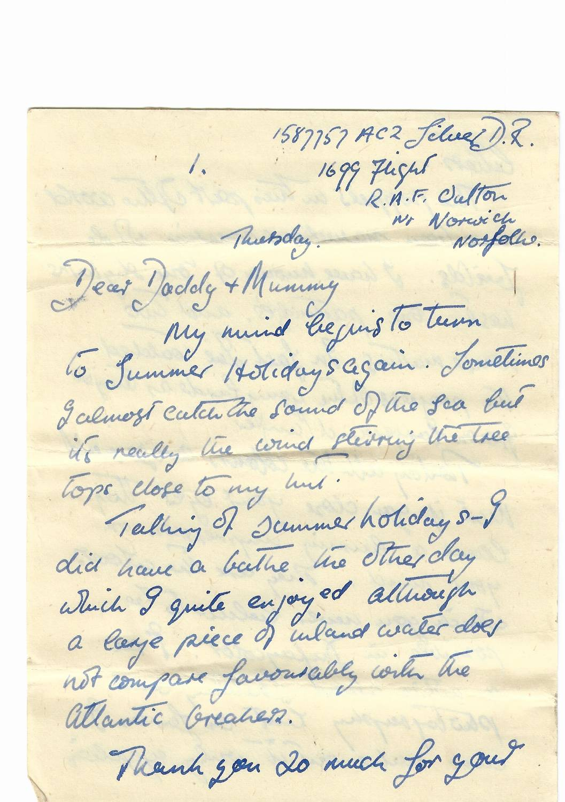
> 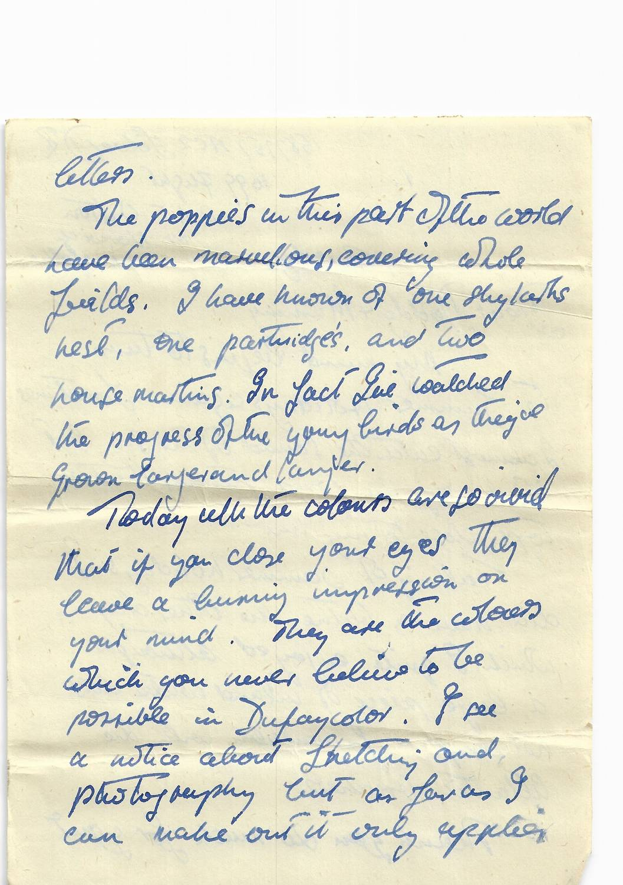
> 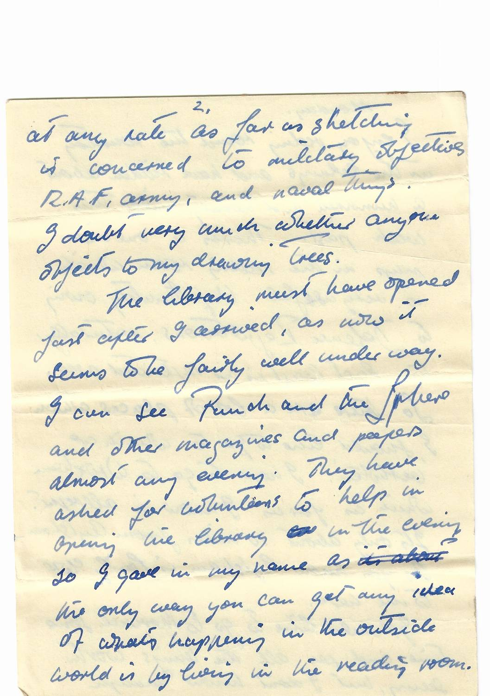
> 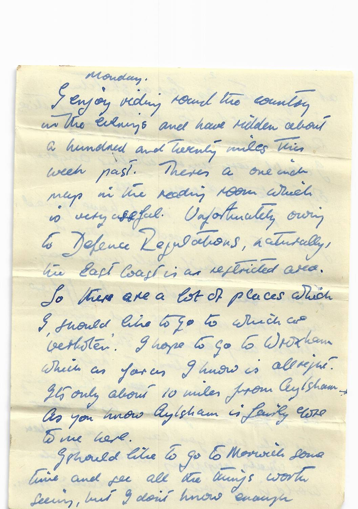
> 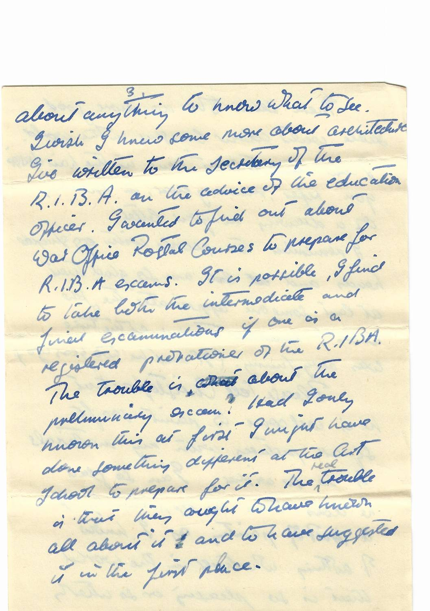
> 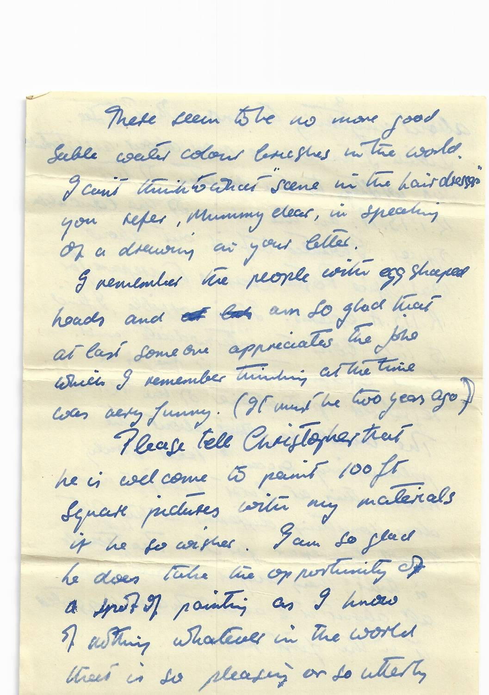
> 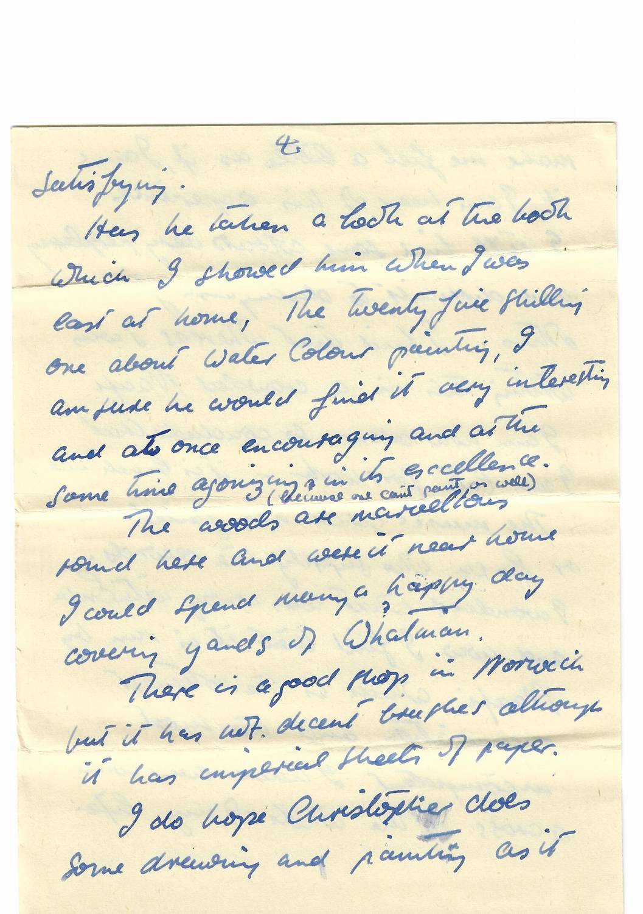
> 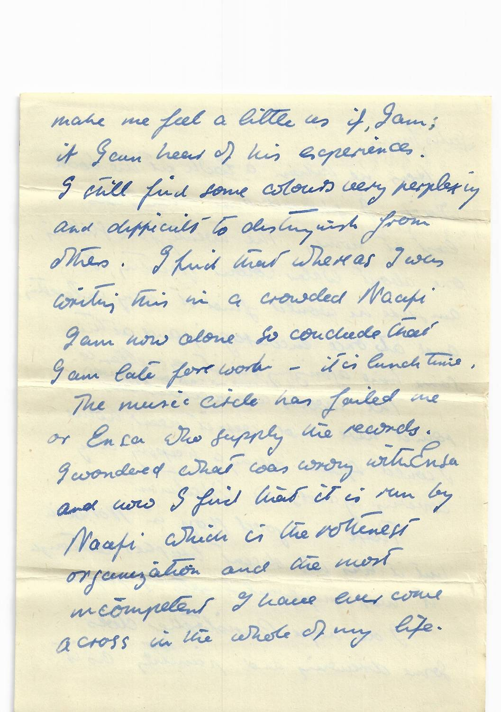
> 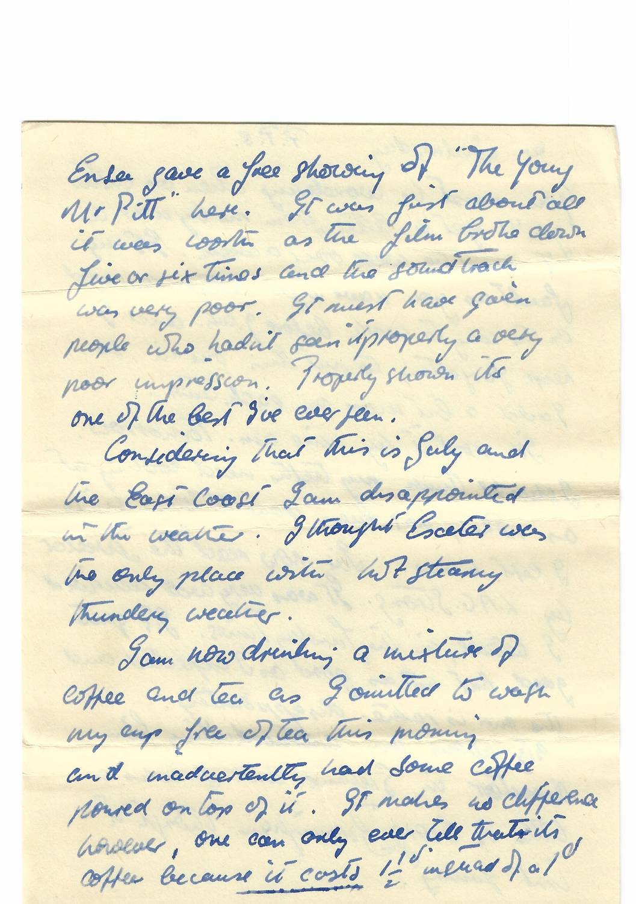
> 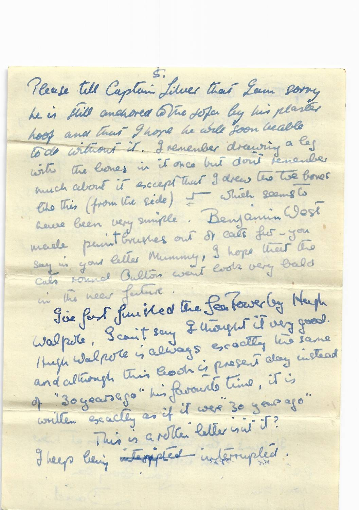
> 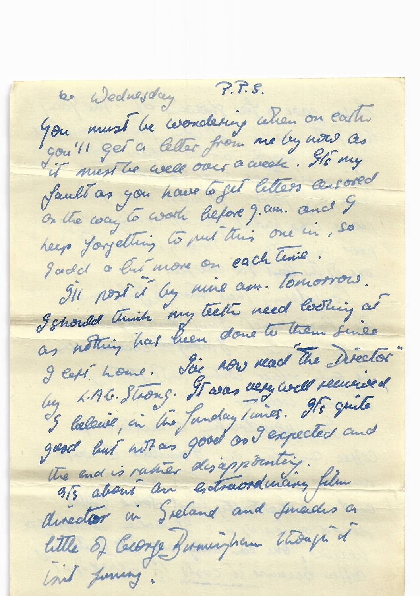
> 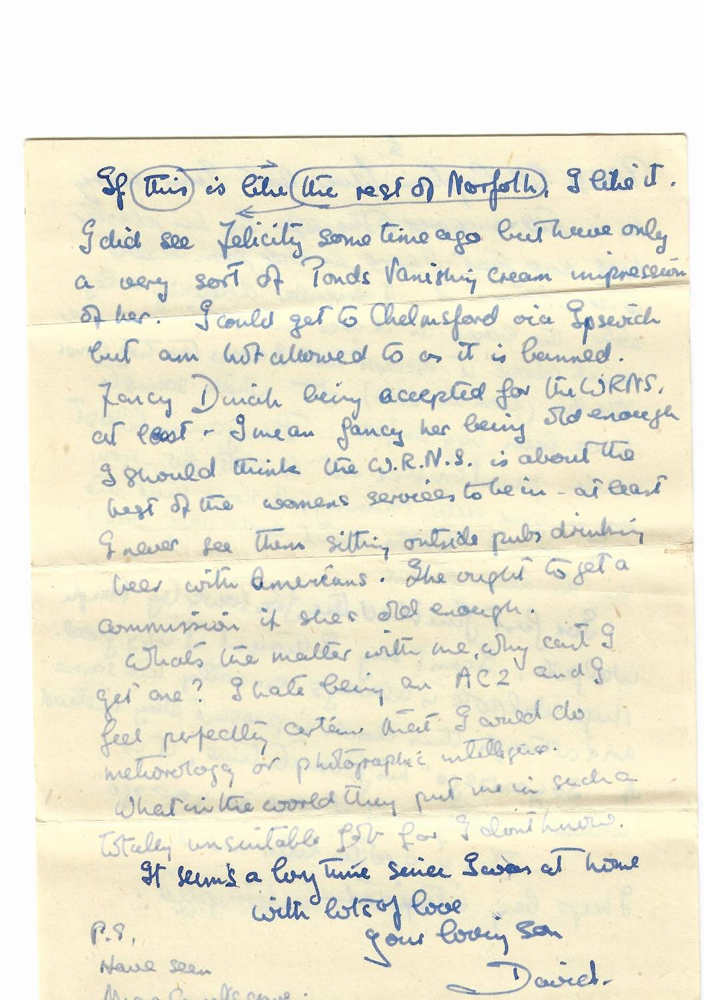

### 04. c. late August 1944 (incomplete)

*The first sheet is missing (probably the empty scan 0 133) and the letter breaks off at the end of sheet 8. He has nine days' leave "from after duty hours on the 6th of November 11 weeks or so hence. That is a Monday" (6 Nov 1944 was a Monday), so written about 21–23 August 1944, just back from leave.*

> *[One or more pages missing here.]*
>
> *(p. 1)*
> 2.
> I didn't find that out until too late and so took the 12.50 to Waterloo. It was timed to get in at twelve minutes past five My, last but one, train for Norwich leaving L.P. St at 5.6.
> In despair I turned to the Argosy to take my mind off wondering whether I should be late. I had read it all before!
> The train owing to delays did not reach Waterloo until about 5.45. The last train until 10 pm had left for Norwich. I got my pass signed to say that my train was late (I might have caught the five to six to Norwich if it hadn't been late) I took the first train to Ipswich arriving there at about 8.45.
>
> *(p. 2)*
> That's as far as it went. 3.
> I then started to hitch hike from Ipswich to Norwich. I got two petrol lorries which carried me between them about 15 miles, and one lift in a private car of about 5 miles. After that I got stuck, nobody would risk stopping to pick one up at 11.30 at night although they saw me. It was more of a hike than a hitch and I walked to Diss Station where I caught the original ten o'clock from London at 2.10 am I arrived at Norwich at just after three. I was supposed to be back at midnight.
> I then had a further fourteen miles to go. I went to the R.T.O. They signed my pass to the effect that the next train was 9. AM.
>
> *(p. 3)*
> 4.
> and gave me a ticket for a bed at a hostel run for services caught between trains at night. I slept three hours, arose, and by means of an american lorry an R.A.F. van and a milk lorry (seated on a churn) I reached Oulton by 8.am. I explained my difficulties omitting the hitchhiking to the S.P.s and rightly, they let me go without a word. If the train hadn't been late I should have been back by 9.30 pm the previous night.
> It was lovely to come home and here is some more good news. All being well
>
> *(p. 4)*
> 5.
> I shall get nine days leave as from after duty hours on the 6th of November 11 weeks or so hence. That is a Monday.
> I suppose by then Christopher will have gone? I hope not.
> It's wonderful to have something to really look forward to.
> Now some more good news my War Office course for History of Architecture has come through, My first papers, and I am to be the pupil of an F.R.I.B.A. lecturer to Cambridge University etc. etc He will henceforward deal with all my work and all correspondence will be between ~~him~~ he and ~~me~~ I ? his name is L. Stuart Stanley. MA FRIBA MTPI etc
>
> *(p. 5)*
> 6.
> The war office will supply the text books. In his first letter he urges me to get on with the course as quickly as I can. If I put enough time into it I should complete it in about 6 months, it's the longest of six in preparation for the intermediate exam.
> - It rains and pours -
> He suggests additional text books which I might buy so I've ordered them from Wheatons by post. One I have not ordered is the one Christopher has called Statham's History of Architecture and I wondered if I might borrow it.
>
> *(p. 6)*
> 7.
> If I could I might be able to get on with the first paper right away instead of waiting for the W.O. textbook. I am going to ask the Salvation Army for a cupboard to keep my things in as I don't want them all messed up in the hut.
> I keep thinking of those plums sitting on that plate and of how nice a subject they were to paint. I hope that Christopher will continue his painting as I shall be most disappointed if I don't see him go on improving his washes at the same rate at which he was the other day.
>
> *(p. 7)*
> 8.
> I do hope that if you do manage to take a holiday the weather will not break up completely.
> I did enjoy going to Pygmalion Mummy dear, with you and I am so glad that you were able to see it. Isn't the news good? We are going to beat the Germans before the new year, or very soon after. Then you won't have any more black out and perhaps there'll even be a petrol ration.
> This course will take the dullness out of the winter evenings. I hope it isn't very cold this winter.
> I wish I had cut the hedge.
> I am afraid I shall transfer all my interest from my work
>
> *[One or more pages missing here.]*

*Notes:* His War Office correspondence course in the History of Architecture has come through; his tutor, L. Stuart Stanley FRIBA, lectured at Cambridge. Statham's *History of Architecture* is the book Christopher had. *Argosy* was a fiction magazine. Diss is the Norfolk station where he caught the London train at 2.10 a.m.

> [!scan]- Scans (7)
> 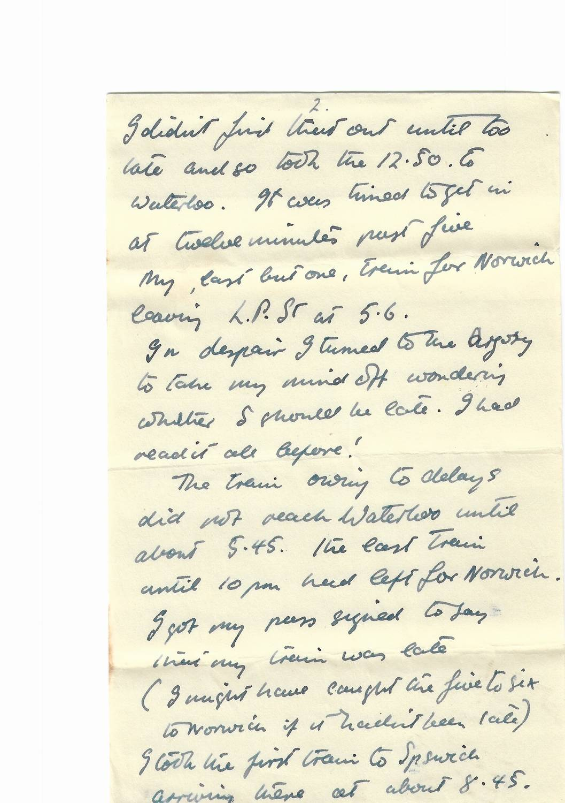
> 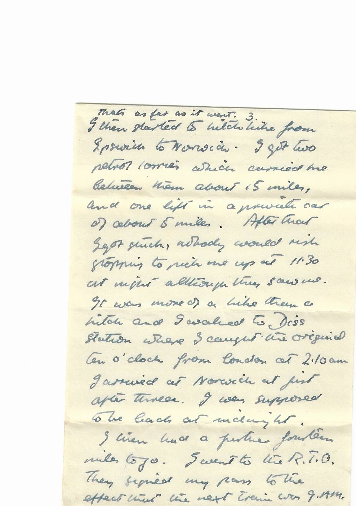
> 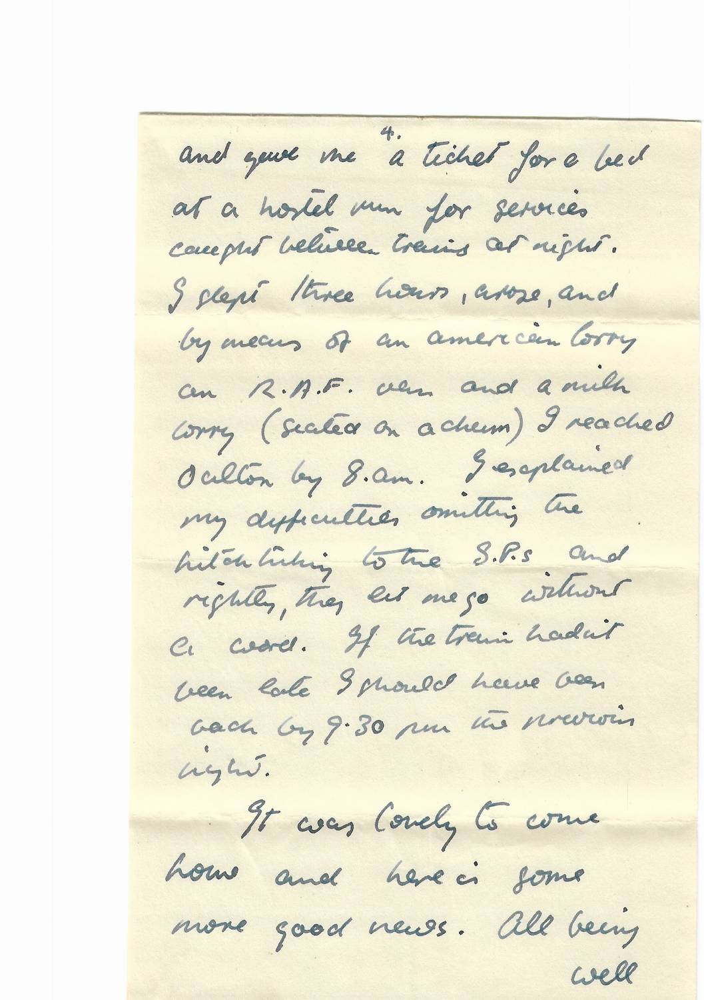
> 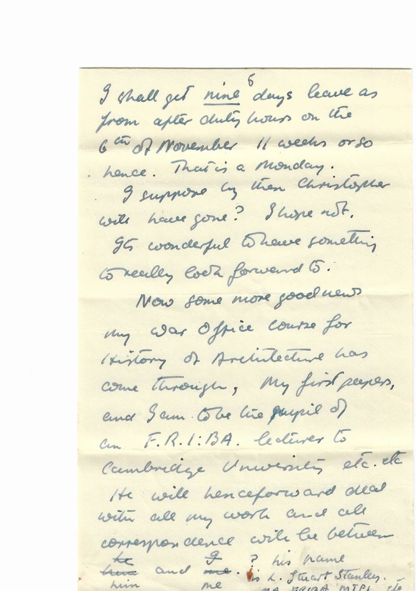
> 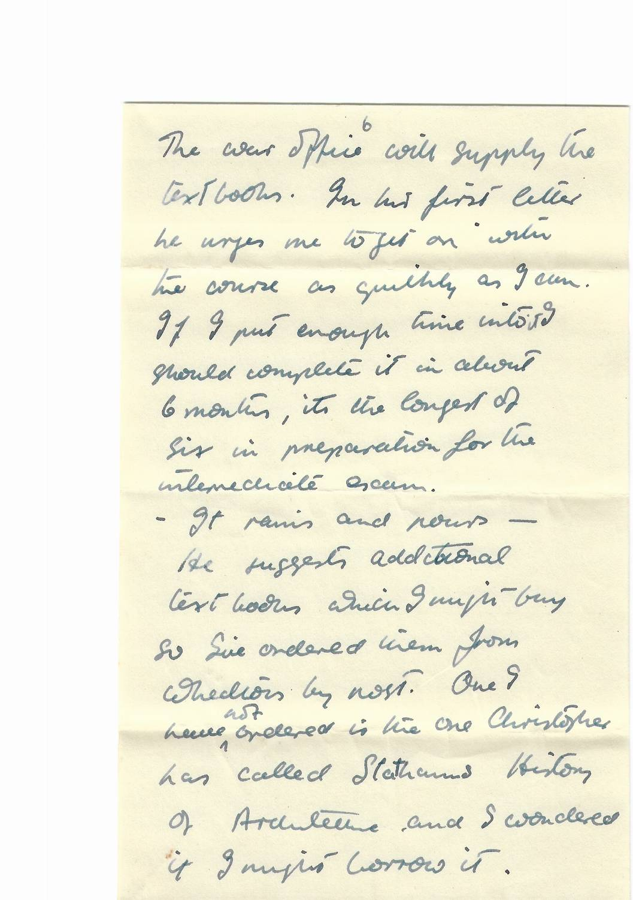
> 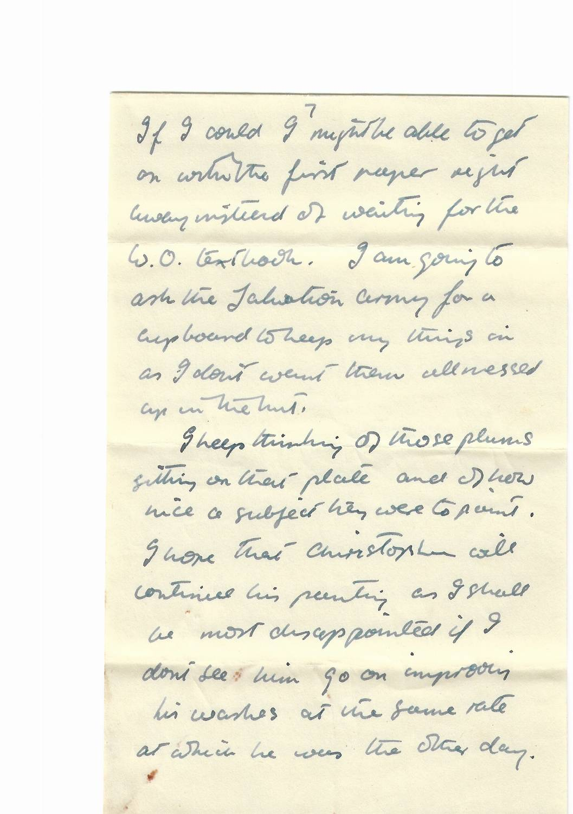
> 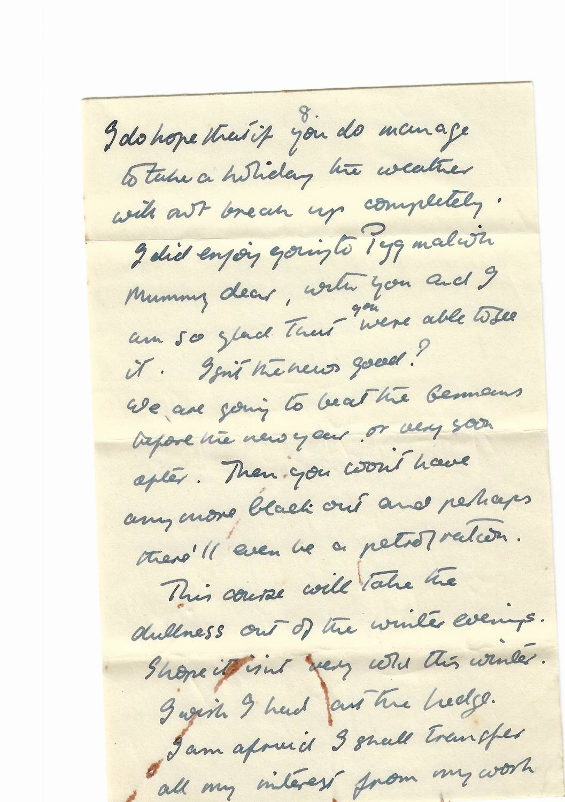

### 05. Friday 1 – Sunday 3 September 1944

*Headed "Friday": the Allies "are crossing into Belgium" (2–3 September 1944), and it is "66 days till I come home" (to 6–7 November). The Sunday postscript says censorship from the station has just stopped and the coastal ban is lifted.*

> *(p. 1)*
> 1587757 AC Silver D.R.
> 1699 Flight
> R.A.F. Oulton
> Nr Norwich.
> Friday.
> Dear Daddy and Mummy
> Thank you very much for the parcels letter etc.
> I went to Norwich on Monday to see whether I could get a drawing board, T square, books and cartridge paper. I got the cartridge paper. I have to get a permit for the board I can't get the T square till I know the size of the board and I've ordered the books. Christopher's book is one of the ones recommended for the course.
> I had lunch in a jolly nice restaurant which I had noticed on previous visits.
> There was a combined atmosphere of Elands and the antique shop in
>
> *(p. 2)*
> [Top half illegible: scanner fault.]
> exhibition of Ballet Design. The original sketches for ballets scenery etc. It is a travelling exhibition and should it come to Exeter it is really well worth seeing. It was interesting to see the different mediums used - from pen and wash to poster colours. The latter were very popular, probably because you can paint out mistakes and they give an appearance of solidity
>
> *(p. 3)*
> That museum is worth a visit every time I go to Norwich.
> Cromer, Sheringham, Yarmouth, all are open now that the ban has been lifted. If I get a chance I shall have a look at Sheringham.
> Of course just because I want to get on with this course now I've had more work than ever.
> I had a letter from Lavender yesterday, she seems to be pretty busy.
> I think that it's a matter of weeks now before Germany collapses. According to the headlines to-day they are crossing into Belgium by the time you get this they will be further on still. I see you wish no use for the shelter after Christmas.
> 66 days till I come home, just over nine weeks. All the books instruments etc were quite right thank you Mummy dear.
> With love
> your loving son
> David.
>
> *(p. 4)*
> Sunday. Postscript.
> Owing to censorship I still haven't posted this letter and now its come through that all censorship has stopped from here so you should get letters from me more regularly.
> Thank you very much, Daddy, for your letter, received yesterday. How awful about the blackout but I am glad you weren't prosecuted. Do you know the C.C.?
> The newspapers seem to be racing the wireless with the news, places seem to fall to us more quickly by newspaper. I find, by the way, that I could quite easily go to see Uncle Herbert or Phil on my day off or [?] fortnight since the coast's bans off.
> I'll examine your house, should you require expert architectural knowledge! I can't get on with my course because the books haven't come through.
> I am glad the tomatoes are doing well and also that the lawnmower still works after my efforts. Love David.

*Notes:* The top half of the second page (scan 0 40) is lost to a scanner fault. Elands was an Exeter bookshop. "The C.C." is the Chief Constable: his parents had nearly been prosecuted over the blackout.

> [!scan]- Scans (4)
> 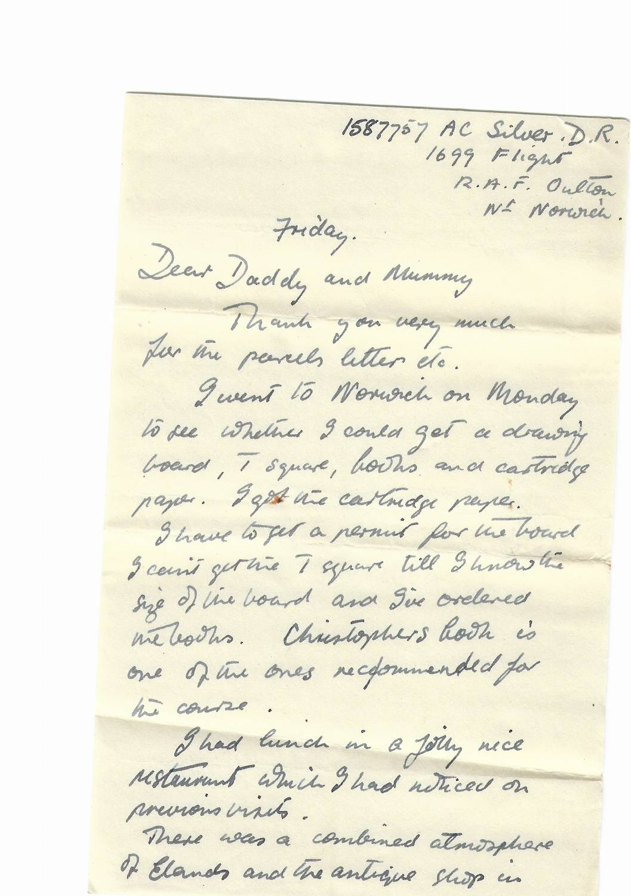
> 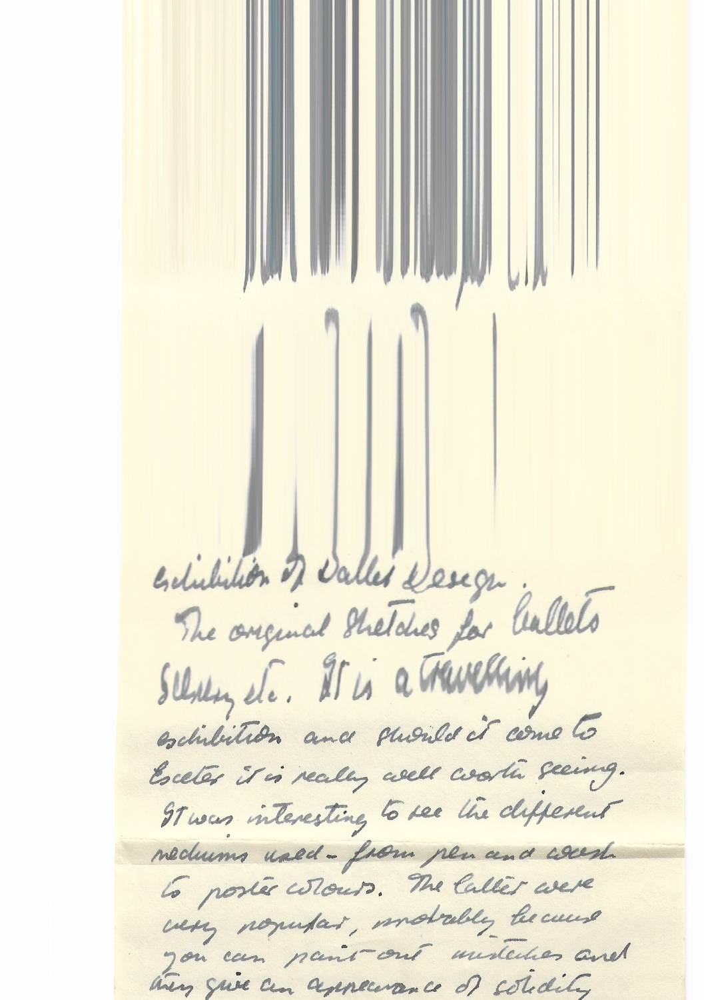
> 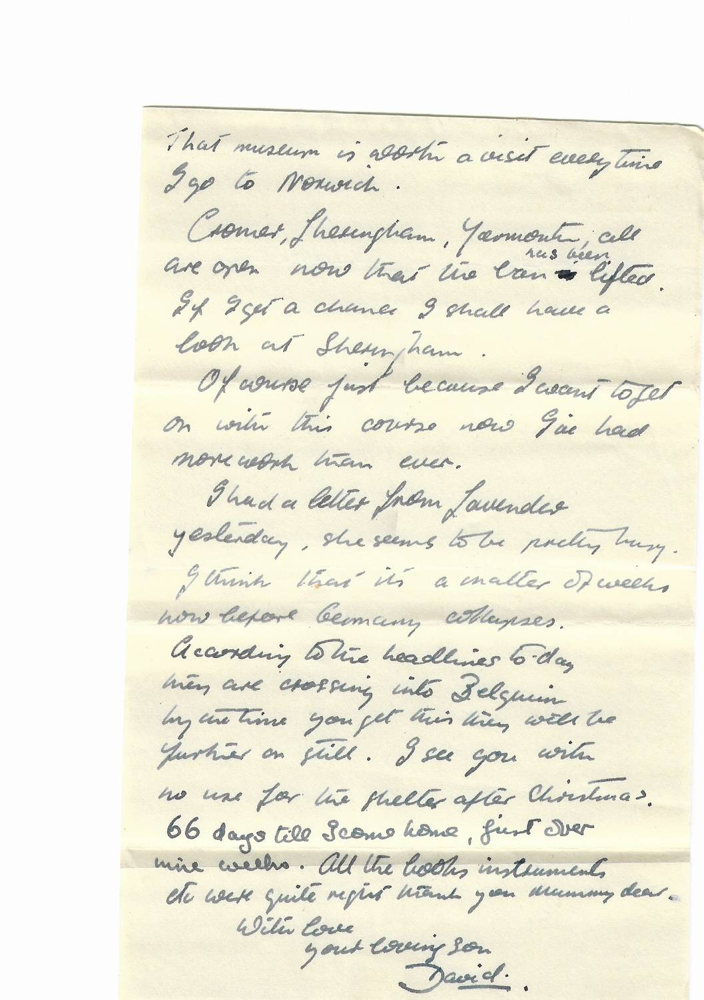
> 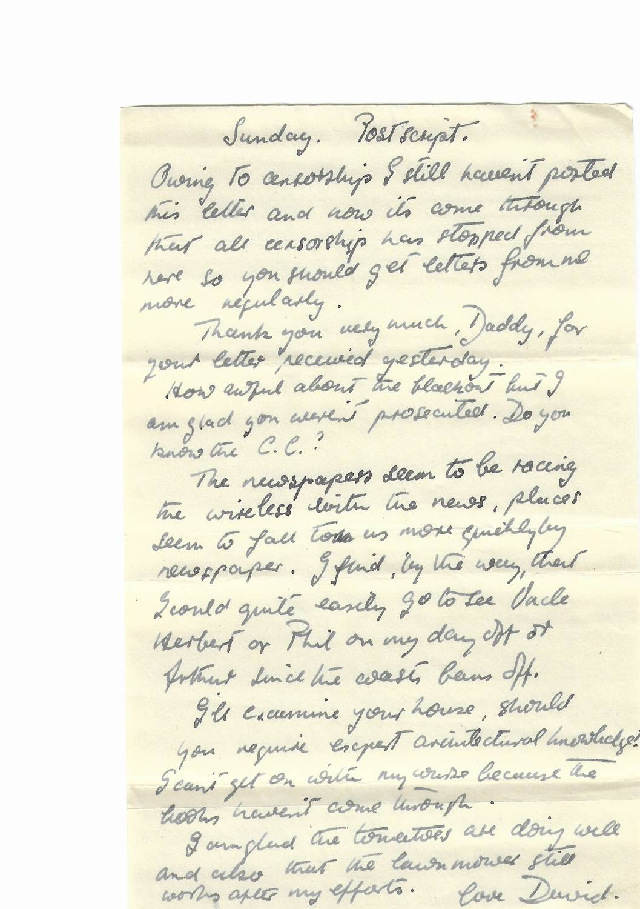

### 06. A Monday, c. mid-September 1944

*Headed "Monday". About four weeks after his first course paper (late August); the newsreel of the fighting in Paris (liberated 25 August); "autumn is creeping in". Probably mid- to late September 1944.*

> *(p. 1)*
> 1587757 AC Silver D.R.
> 1699 Flight
> R.A.F. Oulton.
> Monday
> Dear Mummy & Daddy
> Thank you very much for your letters. What a mess of things the War Office are making about Kit's leg. I hope he isn't doing more than he ought, ~~too quickly~~, so that he's ready, as it doesn't seem too quick at getting better anyway and that would make it worse.
> I have never had the text books (Banister Fletcher's History of Arch:) from the W.O. yet for my course and as they said I should let them know within four weeks of the time I had my first paper if I hadn't started or they would assume that I'd given up, I've bought the book after a great deal of going to Norwich. It was worth it and will be of value to me always whatever I do.
>
> *(p. 2)*
> It is extremely interesting and I think you'd like to see it very much.
> I think I've got a good chance of leaving this job and getting a better one ~~[struck]~~ through the Education Officer's assistance. I'll know definitely later but at present it's meant to be kept under my hat. [Drawing: a forage cap.] (what a hat!)
> I've started wheezing at night after being out in the rain all day and getting soaked. So I got some medicine from the M.O. as it kept me awake, he said he thought it was slight asthma ??? (I didn't say I thought he was cracked) and he gave me two little tablets to take at night Ephedrin ½ gr and Phenobarb ½ gr anyway I slept very well last night and the wheezing has stopped. I am to take it for four days. I forgot to tell you that Ensa played "She Stoops To Conquer" here and it was very good indeed. I also haven't mentioned that I saw "This Happy Breed" and I would recommend it very highly indeed. It's Noel Coward's it's English and it's in Technicolor. It is really very very good and miles above any film I've seen for a long time.
>
> *(p. 3)*
> Though not anything the same in type it is of the same standard to me as "Gone with the Wind" "The Young Mr Pitt" "Pygmalion" etc. It is simply the story of a family between 1919 and 1939 It's very real and is really more like a play than a film perhaps because the people seem to be real people and are not so very well known as film actors. I don't know whether you'd like it, I should think you would. I saw the fighting in Paris in the News with it and it was very exciting and absolutely horrible and not a bit your kind of News, Mummy. I noticed the Parisians were using Sten guns and that was taken before the Allies reached Paris.
> After two or three days of cloudburst-sort of rain it is lovely again although it feels up here as if the autumn is creeping in. The air is very very cold in the morning and turns one's hands quite [blue?] on the backs.
> [I did?] a sketch the other day but it [wasn't v]ery good.

*Notes:* Banister Fletcher's *History of Architecture* was the standard text. The M.O.'s diagnosis of "slight asthma" is the first mention of it in the letters. *This Happy Breed* (1944) is Noël Coward's film; the bottom corner of the last page is folded over, so a few words are guessed.

> [!scan]- Scans (3)
> 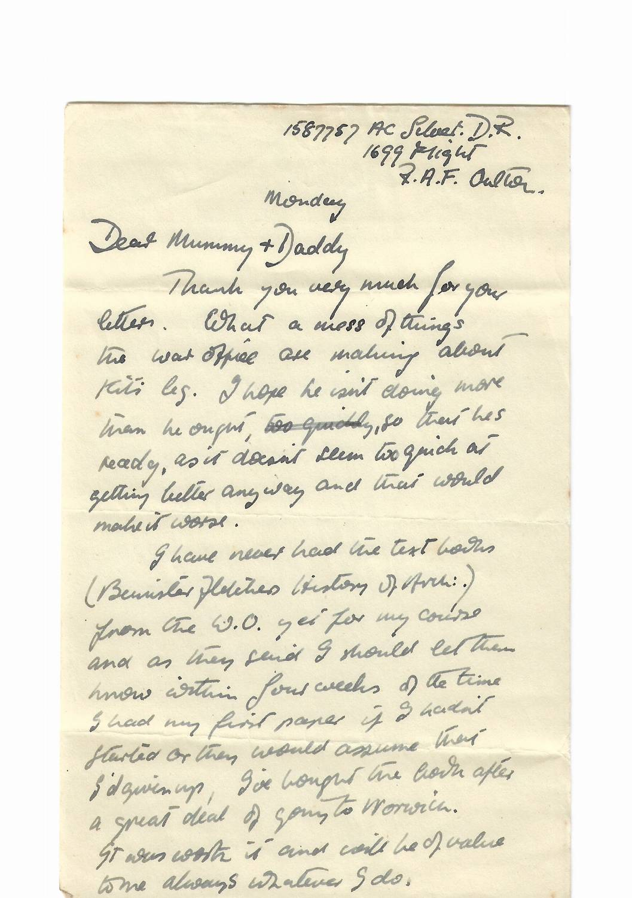
> 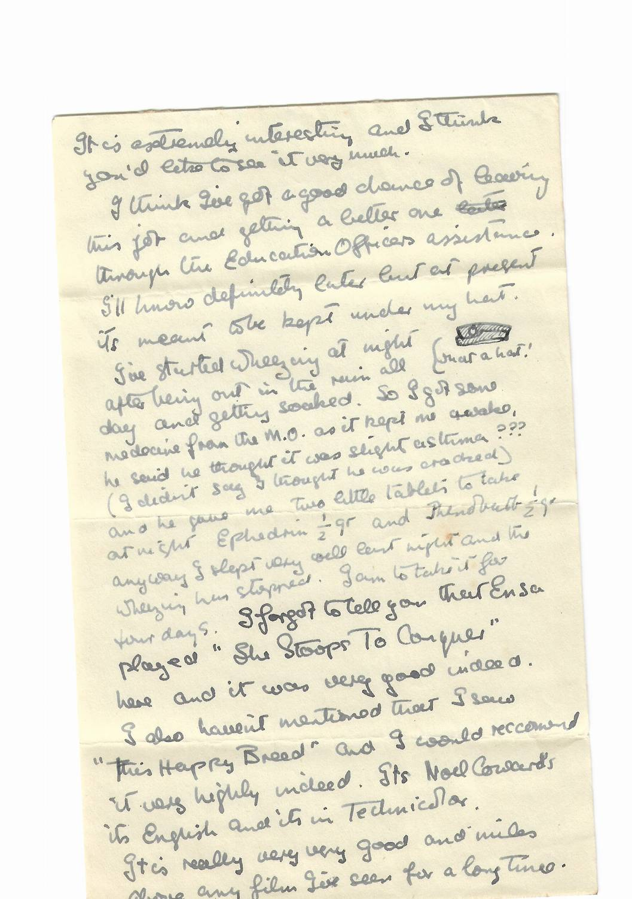
> 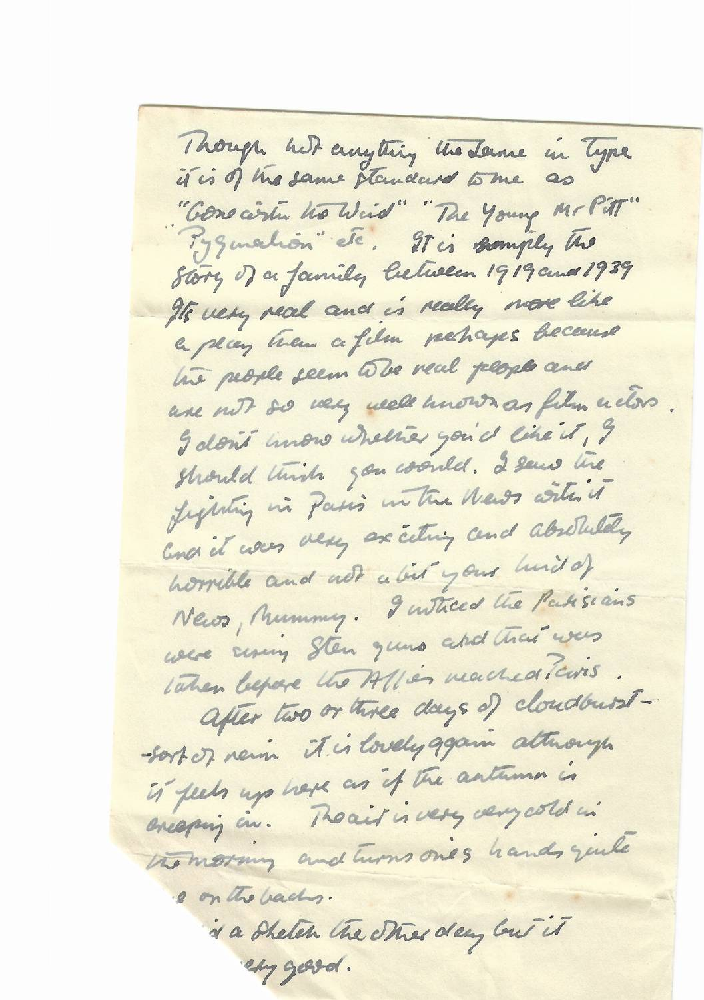

### 07. Sunday 8 – Wednesday 11 October 1944

*Dated "8/10/44", with an addition dated "11/10/44 Wednesday". His parents are on holiday at Treknow, near Tintagel, and are expected home on Saturday.*

> *(p. 1)*
> 1587757 AC Silver D.R.
> 1699 Flight. R.A.F. Oulton
> Nr Norwich - Norfolk
> 8/10/44.
> Dear Mummy & Daddy
> About this headland you drew Daddy I imagine it's this one*.
> [Sketch map, labelled "map view": the coast at Treknow/Trebarwith — the hotel and the "way to beach", a hut and a pool by the shore, Gull Rock offshore, a rock, West Bay with "way up cliff" and "way down", and the headland marked *.]
> Of course I don't remember what size it appeared from here+ where I think you meant Kit drew it from and where I also drew it but there seems to be a great difference in the apparent nearness between your picture Daddy and mine. That's the reason why Mummy finds difficulty in placing my picture. You see I drew mine like this first
> [Sketch: his picture drawn as a view framed in a rectangle — the headland and sea beyond, the bathing pool in the foreground, and the "way down".]
>
> *(p. 2)*
> and then I cut out the top left-hand section because I had had to rush the rest of it and I didn't like it, and so what you've seen at home was just that long left hand top section.
> If I had originally intended that to be the centre of my picture as, Daddy, you drew it in your sketch it would have been different (just like the difference in perspective between a photograph taken with a telephoto lens and an enlargement out of an ordinary photograph - I think?)
> I thought of King Arthur's Hall and what a mistake we made by going in there, the other day.
> The trains are much better now and I consider that I could get home for leave with a bit of luck by ~~6.15~~ 4.46 p.m. Southern instead of midnight. It all depends on early chits to draw one's pass. It could mean leaving here at 7.28 am.
>
> *(p. 3)*
> It's eight weeks to my leave.
> Have you got a hat yet Daddy? They are not rationed I believe.
> I still don't know whether I've been accepted as a probationer of the RIBA and I've never had my School Certs back I shall write to them if I don't hear within a week or two. They acknowledged my letter and application so they must have got the certificates.
> I am glad you didn't get summonsed as it would be silly now the black-out is being dropped. Have you been allowed to relax or lifted it in Exeter or will you be?
> I must go back to work now, it's midday.
> With lots of love
> ~~[struck]~~ your loving son
> David.
>
> *(p. 4)*
> 11/10/44 Wednesday.
> I am now able to add a little more to this letter. On Monday I went to Norwich, here there is a Naafi Club, just opened. For a change it really is quite good, about the first good thing I've ever seen, come from the Naafi.
> It was a large department store or clothes shop I should think but was blitzed. Anyway here is the ground floor
> [Sketch plan of the ground floor: entrance, lift, shop, cloak room, "hairdresser showers etc", and a "W.V.S. information bureau".]
> One enters a large ~~[struck]~~ hall via swing doors, in front is a shop rather like ~~[struck]~~ Wymans or Smiths on a big station selling cigarettes haircream razors combs etc. to one's left is an information bureau selling stationery etc.
> In the middle of the room is a tall man with white coat
>
> *(p. 5)*
> as worn by film bartenders.
> In the cloak room which is only seen over a broad counter lives another super-man in white coat (only rather more antiquated).
> Passing patriotically past the glass lift shaft just behind the shop one goes up stairs (3" pile on stair carpet) to the next floor. From this floor and in fact from any upper floor one can look down into the hall as one looked in Dellers down to the bottom. Every where here are long sofas and deep armchairs and little tables with magazines [sketch: a lounge with sofas, armchairs, little tables and hanging lamps]
> at one end a dance floor with couples revolving half heartedly to the strains of a programme of Victor Sylvester's
>
> *(p. 6)*
> dance records put on, on the internal broadcasting system.
> Passing upwards to the next floor one finds a cafeteria very much like any modern restaurant. If you look over the balcony down to the ground floor on the roof of the shop is a map of Norwich. In what may have been once the bargain basement notices informed me that the games rooms and the "Tavern" were to be found, I didn't find them. The whole place is decorated in pale and navy blue There is a great deal of paint a number of inferior "Christmas card" sailing ship pictures and a lot of lights like this [small sketch of two cylindrical hanging lamps]. It is supposed to have cost £20,000
>
> *(p. 7)*
> Working it out I should think that the furniture and carpet cost the most as the rest of it is just paint and clever decoration. The doors are painted like this [small sketch of a door, half dark, half hatched, above a skirting].
> Any way it really is quite good but people feel a bit bitter that it's taken the Naafi five years to give them anything worth having. With all this super furniture etc the food is still as bad as ever.
> I saw Bing Crosby in "Going My Way" in which he is a Roman catholic priest and I thought it was quite good.
> There is such a lot of architecture and such a little
>
> *(p. 8)*
> time and nowhere to go to work but I keep on plugging away but it would take me a year to do a couple of months work at peace time speed.
> We have just got a wireless in the billet and so I've begun to realise how we are getting on with the war.
> I notice that the Liberal party advocate that people whose training for the professions has been interrupted should be demobilized quickly.
> I think I had better address this letter to home as I expect you will be going home on Saturday Sorry such a mixed letter
> with lots of love
> your loving son
> David.

*Notes:* The map shows the coast at Treknow: Gull Rock, the bathing pool, West Bay and the headland his father and Kit had drawn. "It's eight weeks to my leave" does not fit the November leave (four weeks off), so that page may belong to an earlier letter. King Arthur's Hall is in Tintagel. The new Naafi Club in Norwich occupied a bombed department store. Victor Silvester was the dance-band leader.

> [!scan]- Scans (8)
> 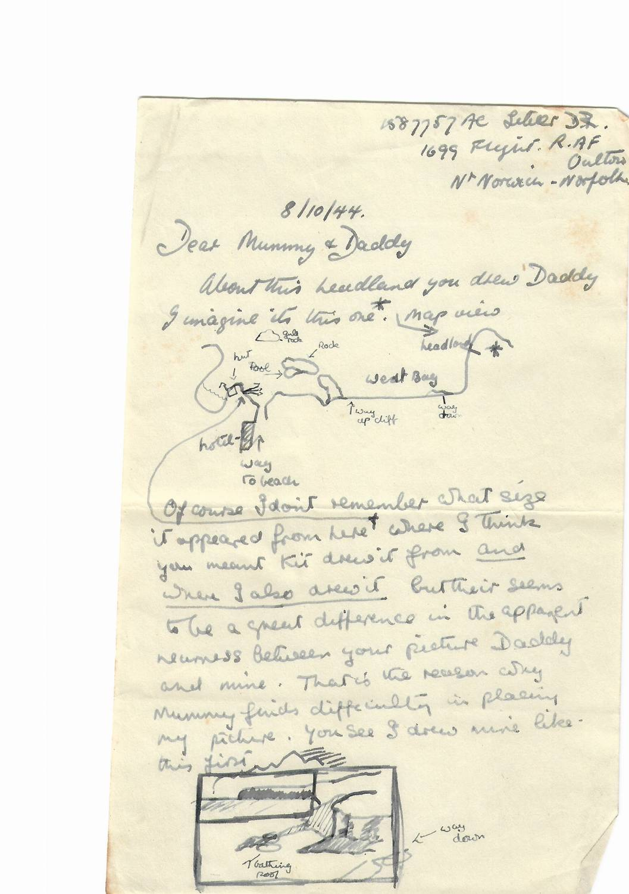
> 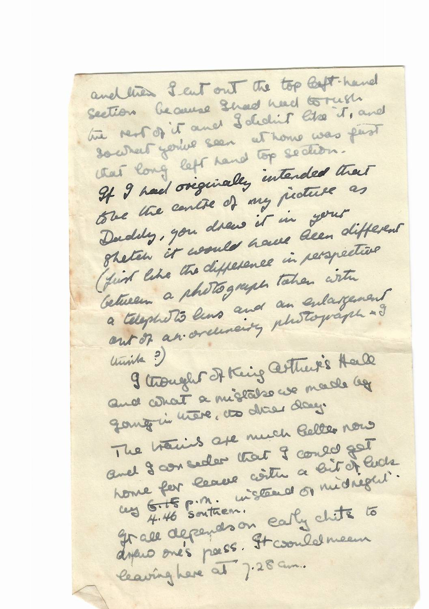
> 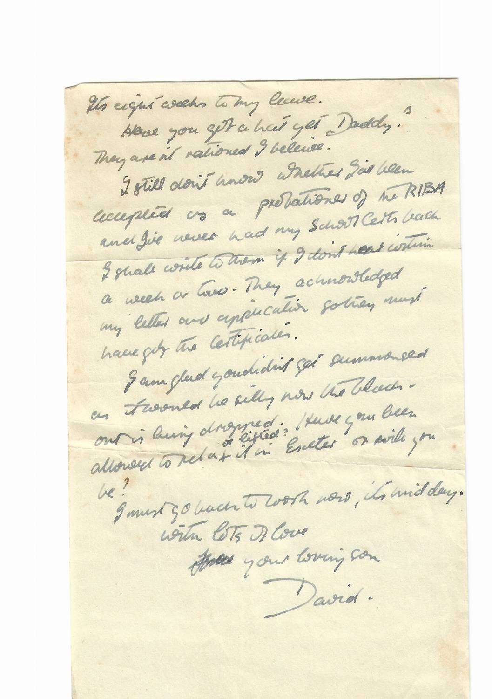
> 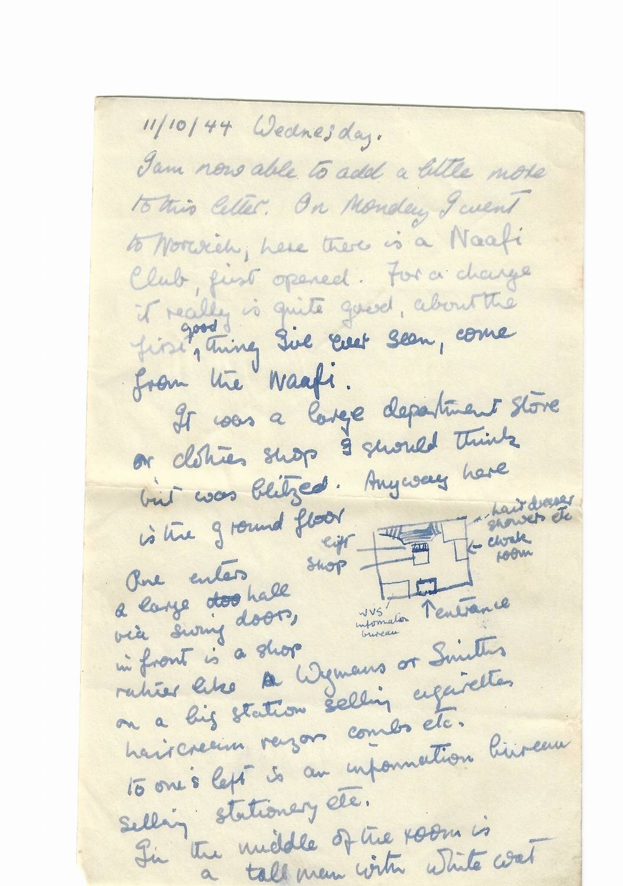
> 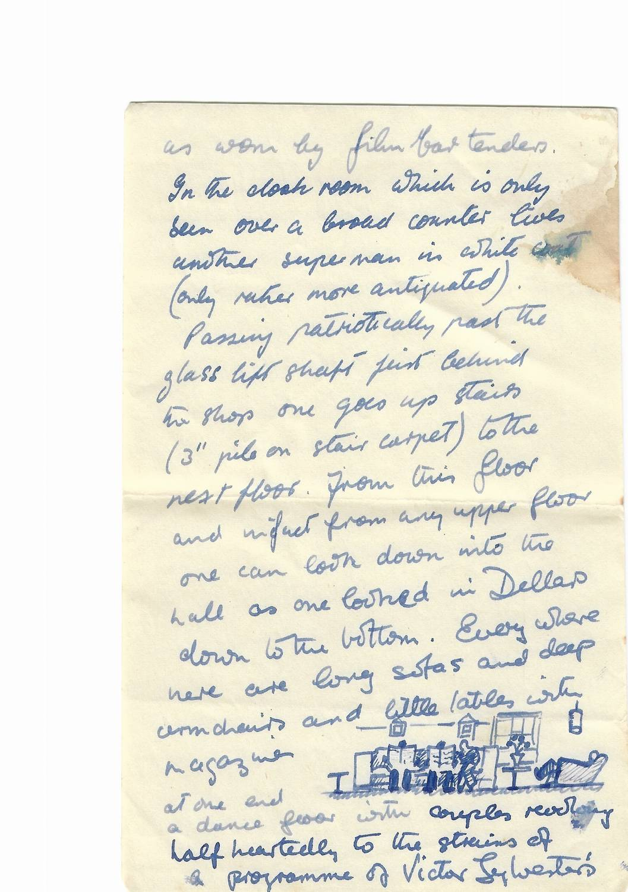
> 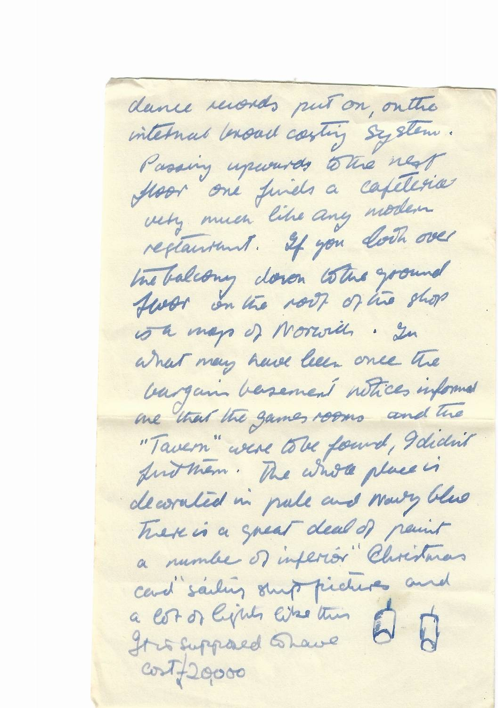
> 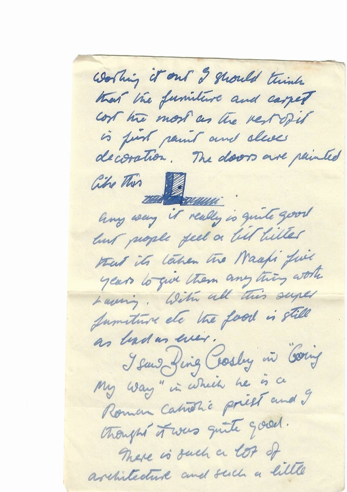
> 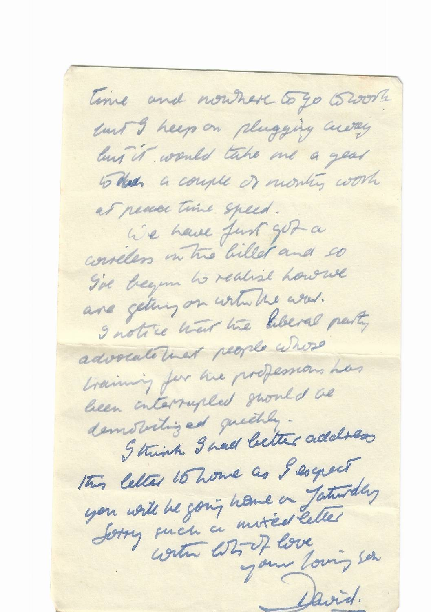

### 08. Saturday 21 October 1944

*Dated "Saturday 21st" (21 October 1944 was a Saturday). His leave is "a fortnight next Tuesday" (7 November), and the countdown he draws at the foot of the last sheet runs "24 Tues", "31st Oct Tues", "7 Nov. Tues".*

> *(p. 1)*
> 1.
> 1587757 AC2 Silver
> 1699 Flight
> R.A.F. Oulton
> Nr Norwich.
> Saturday 21st
> Dear Mummy and Daddy
> Thank you very much for your letters. I wonder how long after reporting in writing Christopher will have to report in person. My leave is a fortnight next Tuesday and I am beginning to get excited about it all ready.
> On Wednesday night I got away early and went to Aylsham to see "Goodbye Mr Chips". I was so glad that at last I had the chance of seeing it. It was every bit as good as you have described it to me and I thoroughly enjoyed it. It reminded me of Bruton somehow and of Mr Lyon. I really much like Robert Donat and he's very clever in being able to act both the part of a young man and that of an old [man.]
>
> *(p. 2)*
> 2.
> I saw him in "The Young Mr Pitt" in which he also grew old as the film progressed.
> The Naafi club makes going to Norwich much more enjoyable and (though I shouldn't say this) it is very pleasant to see the self confident Americans come into the hall and be asked to leave again. They are not admitted unless accompanied by a member of one of our forces.
> Last Sunday-Monday night I was up the whole time from 7.0 am Sunday - 10 am Monday, so I was able to sleep the rest of Monday till 4.30 pm.
> I have three penguin Shakespeares and one of them is "Romeo and Juliet" I noticed something that would I think appeal to you Daddy. It was a reference to the queen of the fairies
>
> *(p. 3)*
> 3.
> "Sometime she gallops o'er a courtier's nose, And then dreams he of smelling out a suit" I looked up what it had to say about "suit" in the back of the book and this is what I read.
> "Suit means both "fine clothes" and a petition usually asking a favour, the pun is not uncommon" - and now comes the part I thought you would like - "Once Sir Roger Williams appeared before Queen Elizabeth to present a petition, wearing untanned boots. "Pooh! Williams, how your boots stink" said the Queen. To which he replied "Tut, Madam, it is my suit that stinks not my boots."
> My architecture course is almost more than I can manage as though it is not difficult it requires such a great deal of time.
>
> *(p. 4)*
> 4.
> Last night I spent two hours on drawing the side elevation of an Egyptian Temple, just a small sketch and this together with my notes takes me so much time I hardly have time to even prepare the essay questions in the paper; Still, the fact that I am learning a little is, I suppose, some good. I am afraid the chap who corrects the papers must get tired of waiting for my answers. I suppose I get about 12 hours a week at it altogether which is really very little. I've got a book out of the library called "Let there be Sculpture" by Epstein. It is very interesting. Do you ever remember a fuss about some carved figures on the front of the B.M.A. building in the Strand about 1908 which broke out again about 1936?
>
> *(p. 5)*
> 5.
> I am hut orderly this morning and am waiting for the inspecting officer to come round, so having collected all the ancient newspapers up and made the hut presentable I've got time to write this.
> There are ~~also~~ all sorts of attractions now particularly on Thursday nights, German classes, French classes, Music Circle (improved) Theatre Trips to Norwich, transport provided to the Theatre Royal (~~this~~ next week "Pink String and Sealing Wax") Somehow with the architecture and various duties I never seem to be free to go out, so I make up for it by a whole day out on my day off.
> I could be in London by a quarter past ten of the evening before my day off, so really I could get home
>
> *(p. 6)*
> 6.
> or to Arthur, if I wanted to but it's really rather expensive and tiring. If I wanted to particularly I could get from 5 to 6 in the morning until eight minutes to six in the evening at home but it would cost me a small fortune and unless my leave was stopped or something, I wouldn't bother. The journey to Philip would entail going to Peterborough, this seems to be a bad route from what I've heard, but the only one.
> Well by now you must have settled down at home again with a whole new series of events and scenes to call up at will to your mind, your mental batteries recharged.
> The officer has been round and made no comment favourable or otherwise, he asked me where we
>
> *(p. 7)*
> 7.
> kept our coke. I said that it was brought in each night, sufficient for one night at a time. He asked me where we got it from, I told him truthfully that I didn't know. I inquired after he'd gone and am glad I didn't know ~~[struck]~~ when he asked me. Apparently it's removed from an A.M. works dept heap used for the workmen who build the huts, - after dark!* If I possessed an autocycle or motor bike or car I should be allowed a ration of petrol to drive home on my leave. The Sergeant in charge of me etc has a motor bike which he has just taken completely to pieces, cleaned repainted and put together again.
> One chap who lives in Norwich an AC like me drives his own SS. into the camp every day to work.
> [Inserted above "after dark", with an asterisk:] (note - the workmen don't build the huts after dark)
> * this is called reading between the lines!
>
> *(p. 8)*
> 8.
> He drives home again at night accompanied by as many people as the car will hold, bound for the Norwich.
> I am getting a bit sick of my job again and am going to make an attempt to get out of it soon.
> It rains all day and I sit in the mud on a tin can under a tarpaulin.
> The wireless in this billet suffers from the same trouble as ours at times It will hold its nose as it speaks and roar and vibrate. It hasn't been so cold just lately and the wind though strong not so icy.
> Skegness was many many times colder than this and we had no heating or hot water. I hate to think of that place, it was horrible.
> Austin are going to ~~producing~~ produce an over head valve engine for their cars
>
> *(p. 9)*
> 9.
> after the war, this should make them better than ever, more power, less revs, less oil, less petrol. Did I tell you I've driven a David Brown Tractor quite a lot? it has the same gate for gear changes as the Austin had.
> Somebody has an electric iron in the billet now so I should be able to come home with creases in my trousers.
> Well I won't write a book so I'll finish off now.
> With lots of love
> your loving son
> David.
> P.S. may I have Lavender's and Phil's and Nanny's addresses please.
> [Drawing across the foot of the page: a countdown line marked "24 Tues", "31st Oct Tues" and "7 Nov. Tues", with a train at the right-hand end and the house at the left: the days to his leave.]

*Notes:* He numbers the sheets 1–9. The Epstein figures are those on the British Medical Association building in the Strand (1908), mutilated in 1937. He had been at Skegness ("many many times colder than this") before Oulton. "Reading between the lines": the hut's coke came from the Air Ministry works heap.

> [!scan]- Scans (9)
> 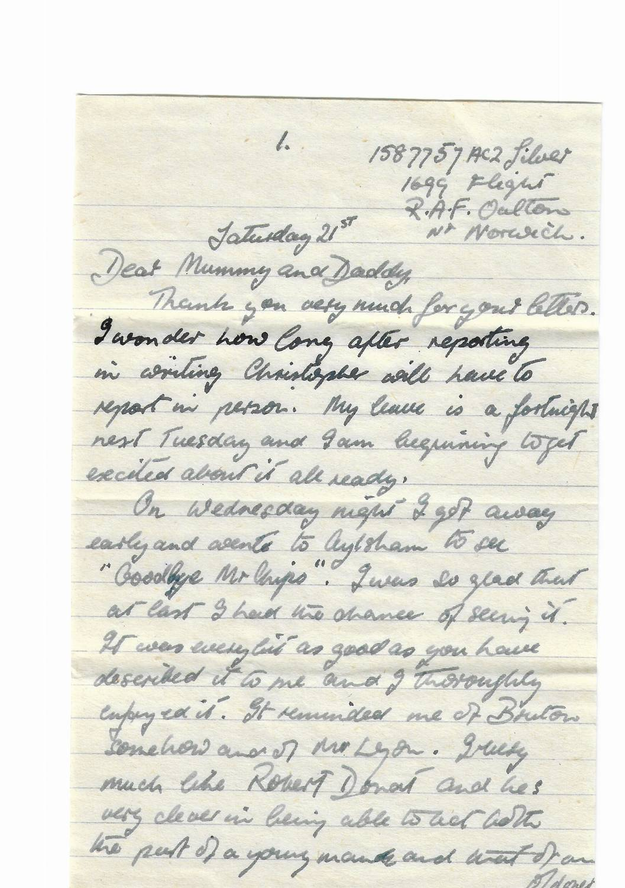
> 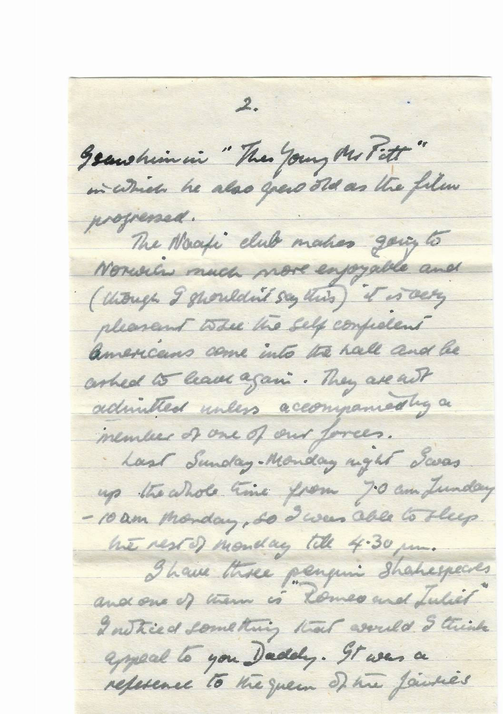
> 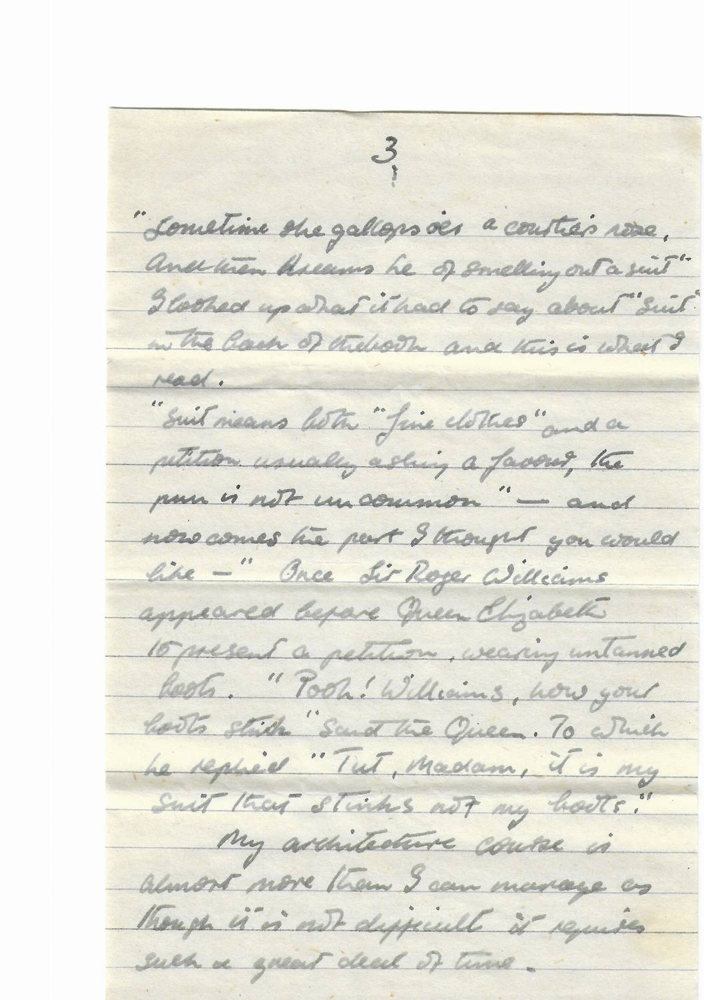
> 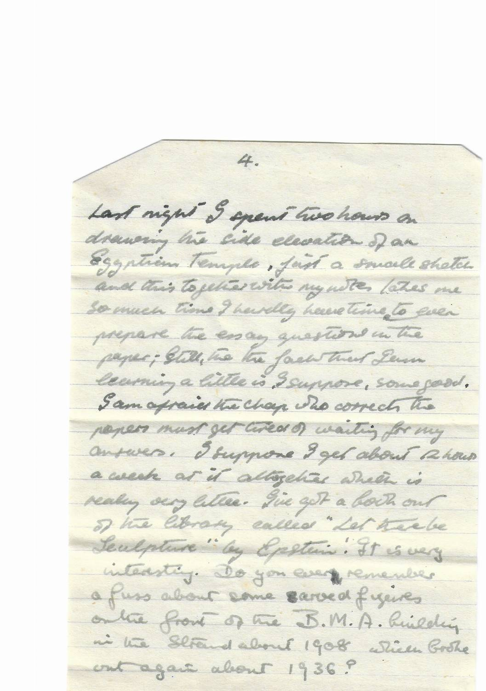
> 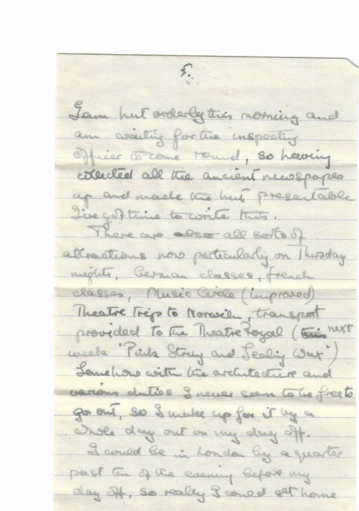
> 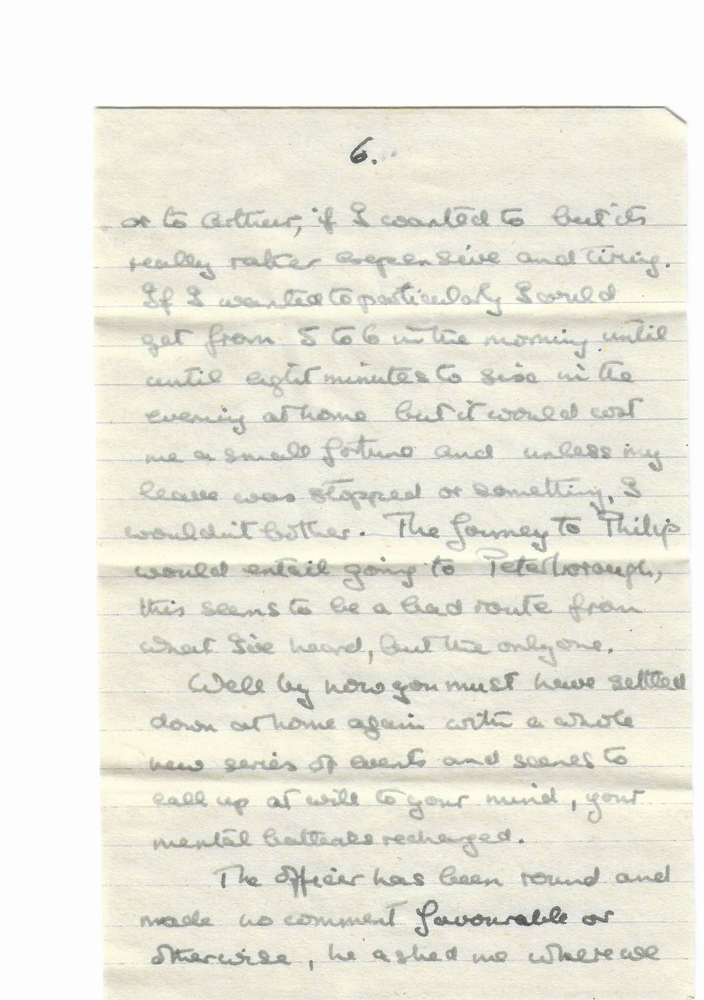
> 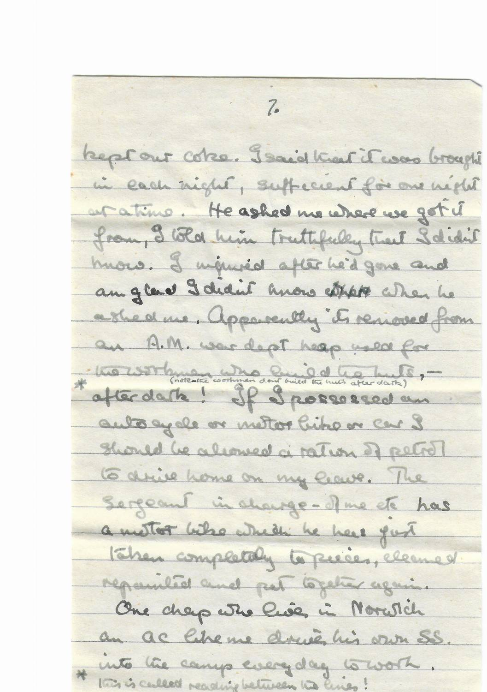
> 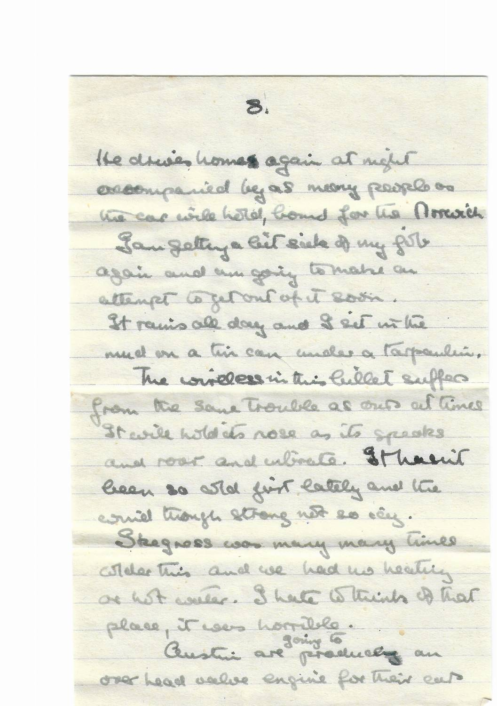
> 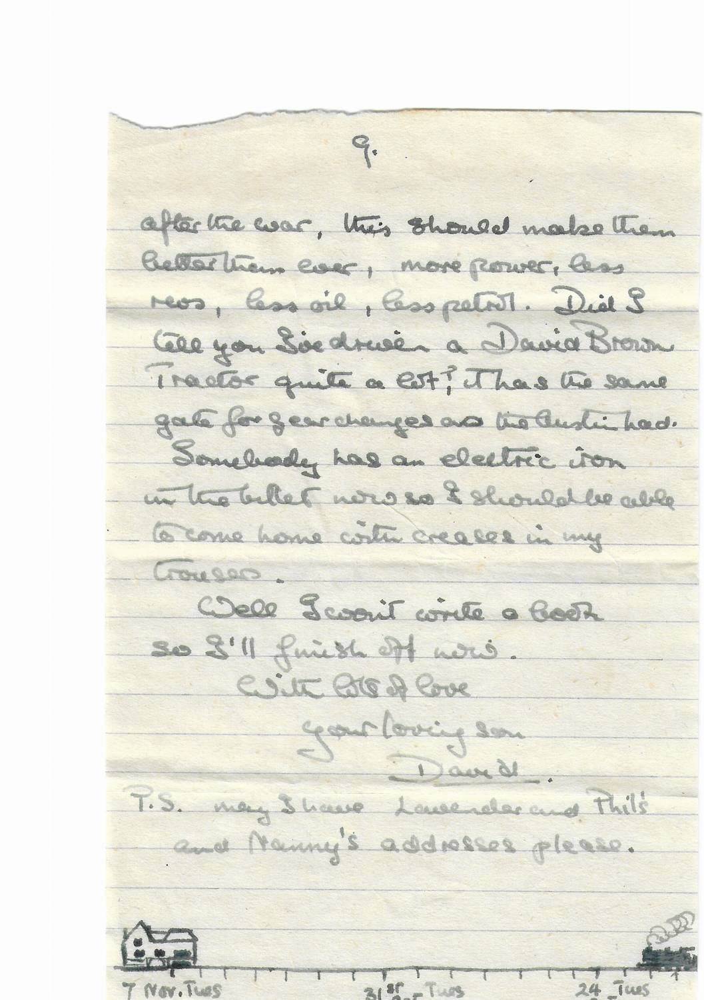

### 09. Saturday 28 – Tuesday 31 October 1944

*Begun "Saturday" and continued "Tuesday": "A week today … I hope to be at home, until the Thursday, nine days later" (leave from Tuesday 7 November). *Pink String and Sealing Wax*, "next week" at the Theatre Royal on 21 October, is now "this present week".*

> *(p. 1)*
> 1587757 AC2 Silver
> 1699 Flight
> R.A.F. Oulton
> Nr Norwich.
> Saturday.
> Dear Mummy and Daddy
> As you expected I received your letter Daddy at lunch time to day. Fancy Mrs Thelford [?] hardly knowing Wiggs, has she got bad sight? Wiggs doesn't seem to have altered to that extent to me.
> I am glad that Christopher has not done so badly as regards somewhere to live. I could easily pop down and see him on my day off if he didn't object to my uniform. I could go to "Newnham House" if he ever has a day off. (I could work my day off to whatever day I wanted I think).
> The theatre at Exeter seems to follow the programme of the theatre here at Norwich.
>
> *(p. 2)*
> They had Arsenic and Old Lace about the week before last, Floradora last week, and Pink String and Sealing Wax this present week. I don't know what's on next week but I think it will be on at Exeter the following week when I am at home at this rate.
> As regards your pictures I recognise two definitely and one partially. Now I've just got the most difficult I think
> No 1. is the picture of a deer painted in brown apparently on glass above the mantelpiece
> No 2. The most difficult portrays Hetty standing in the doorway with Mrs Head behind her saying farewell.
> No 3. Represents the pig on the mantelpiece
> No 4. is Gull Rock but I can't quite place the position it was drawn from I should think it was from the rocks which separate Wat Bay [?] from the Strand [?] beach
>
> *(p. 3)*
> Tuesday
> Here I am again on duty in the evening by the telephone. Yesterday while trying to undo my fountain pen cap, I had the misfortune to snap the barrel in half. Then in a Naafi "nail" pen on poor quality Naafi paper. I've decided my broken pen would be preferable. A week today at this time (6.30) I hope to be at home, until the Thursday, nine days later. You'll probably be seeing me quite early in the evening but I'll let you know at the last minute as once more it depends on the signing of an early chit to permit me to draw my pass before 5 o'clock. [I believe I've got an old U/S fountain pen at home which I could rob for a new body]
>
> *(p. 4)*
> It will be so lovely to come home and the thought hardly leaves my mind all day so that the hours pass so slowly. I am afraid I shan't be seeing you at Christmas, though.
> Oh, here comes some work over the 'phone .... No, cancelled again.
> I had an inoculation yesterday and my arm is a bit swollen and stiff to-day but I hope it will be all right by tomorrow. I am at last finishing "Vanity Fair" having read several books at the same time. I didn't go to Norwich yesterday but did a lot of washing, tidying, darning etc instead - it was very dull.
> My application for leave has gone in, it won't be long now.
> I am afraid Arthur can't have many quiet nights.
>
> *(p. 5)*
> There is a thermos flask of hottish rather unsweetened coffee sitting on a table near me and a boiling hot stove in the middle of the room. With luck I shall be able to pack up and go to bed in my billet later on.
> I've just seen a ridiculous joke.
> [Drawing: a sailor with a kitbag on his shoulder stands before a seated officer at a desk, in front of a door marked "O.M." (the Medical Officer). The sailor says: "Sir I feel a sharp pain between my shoulder blades as if a knife were sticking into me." A dart sticks out of his back. Caption, boxed: "It's meant for a dart!"]
> It doesn't seem very funny now
> Well sorry there's no news but I'll be seeing you next week
> with love
> your loving son
> David.

*Notes:* His parents had sent four little pictures for him to identify, from the holiday at Treknow. Christopher was now living at "Newnham House". Arthur, at Chelmsford, was in the path of the V-2 rockets. The O.M. door in the cartoon should be M.O.

> [!scan]- Scans (5)
> 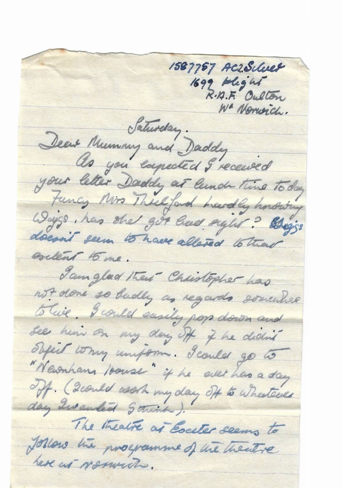
> 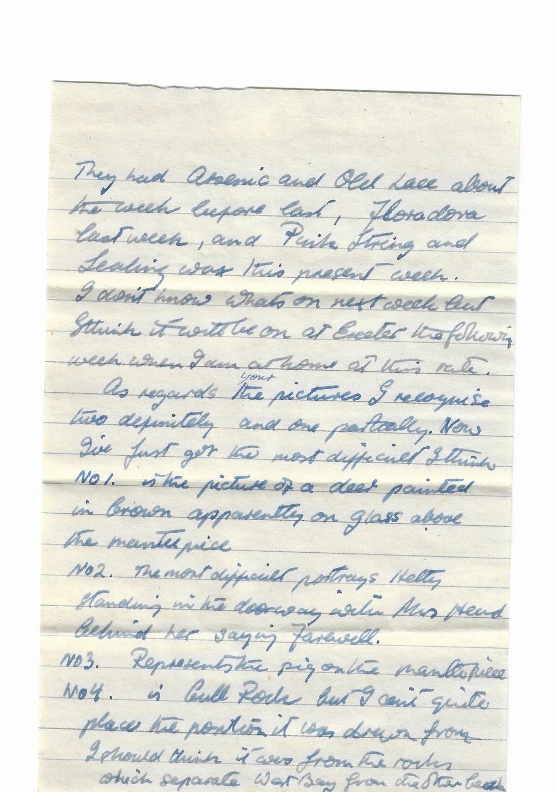
> 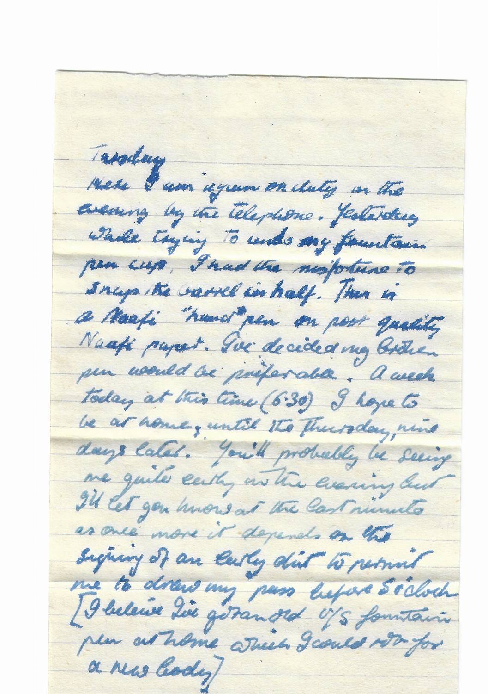
> 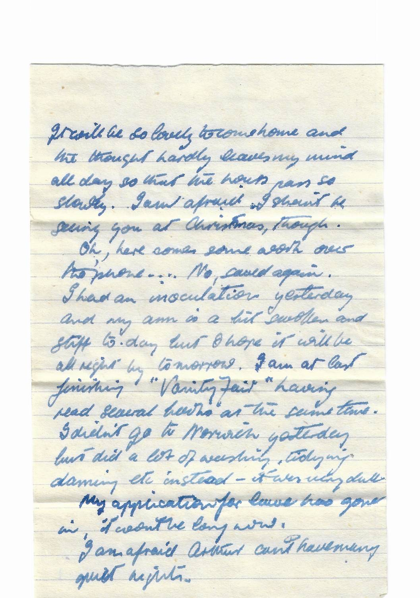
> 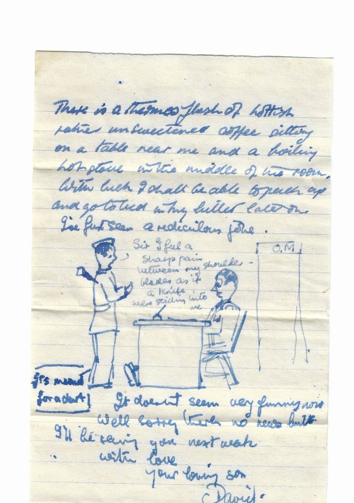

### 10. Saturday 18 – Thursday 23 November 1944 (back from leave)

*Begun "Saturday", the first weekend after his nine days' leave (7–16 November), and finished on the following "Thursday".*

> *(p. 1)*
> 1587757 AC. SILVER. D.R.
> 1699 FLIGHT
> R.A.F. OULTON
> N.R. NORWICH
> Saturday.
> Dear Daddy and Mummy,
> Here am I sitting out in the hut again, which used to be the subject of such speculation. It's pouring and has done ever since I got back.
> I was very glad of the little book you got me, Daddy, as Stendhal [?] did not last very long. When I got to London at about eleven, after a journey in which I couldn't sleep because some Americans made such an awful noise in my compartment, I found that the service to L.P. Street had ceased but the ordinary tubes were still running so I decided it would be ~~better~~ best to go to Tottenham Ct Rd change onto the central line and so to L.P Street.
>
> *(p. 2)*
> This worked out quite well but I was surprised to see the bunks which line the tube stations were mostly occupied at many stations. Arrived at L.P St at just before twelve and went to the Y.M. where I had a cup of tea and your provisions Mummy dear, which were very good. I saved one sandwich for later. Then I went to the platform on which my train was waiting and after getting in attempted to sleep. I didn't succeed and after about an hour the train filled up and the lights came on and people talked a lot. [I forgot to say, whilst lying in the dark on the seat full length, I suddenly was tempted to eat a sandwich and finding one in the tin in my pocket
>
> *(p. 3)*
> started to eat it. I was rather sleepy and tried to decide what it was. I thought it was cheese at first with onion in it and no cheese flavour. When I came to properly I realized that I was consuming some of the delectable mock duck which I had already sampled]. Well anyway the train moved off without mishap dead on time and I arrived in Norwich about 5.30 after some rather short and disturbed patches of sleep for me. I decided that as I had to be in camp by 8.0 I had better start off for the opposite side of the city. It was pitch dark and I was glad I had my cycle lamps with me. [incidentally I forgot my new pump and braces]. I got onto the Aylsham road but only succeeded in
>
> *(p. 4)*
> stopping one car which was only going three miles and was no use to me.
> I rushed everywhere trying to find some mode of conveyance but could get nothing. Taxis were not obtainable and would have been very expensive. Finally at TEN PAST EIGHT I got a lift on a lorry which took me right to our guardroom. I got there at twenty five to nine, dripping wet, and gave in my pass (with much anxiety, being thirty five minutes late) the S.P. (Service Police) never said a word. I was changed and at work in an oilskin at 9.30. I got three quarters of an hour's sleep in the dinner hour and some later in the afternoon and really didn't feel too bad at all.
>
> *(p. 5)*
> Thursday.
> Somehow I never came to finishing this letter off and have now had to cut out some remarks which I wrote on Saturday which are out of date.
> It was lovely to come home for more than five minutes and I enjoyed our various excursions so much to Teignmouth and to "the White Cliffs". That gramophone was well worth doing to me I hope perhaps you use it sometimes but I bet you don't after you spent so much of your time on it Daddy.
> Thank you very much for the parcel, Mummy dear, which I received on Tuesday.
> I've had such a ~~bit~~ stroke of luck. Do you remember I mentioned I had met a sergeant who is also doing architecture
>
> *(p. 6)*
> Well, he asked me to share his office with him in the evening and I've been there two nights so far. It's much better than anywhere else I've had before. There's a table, a fire, a leather armchair, drawing pins ink and he and I pool our books and instruments. He is in a trade which I was offered but turned down not knowing what it was - Compass adjuster It carries three stripes and group I
>
> *(p. 7)*
> (The ~~[struck]~~ highest pay). He is six months younger than I am but looks older. I don't much like him but he seems quite agreeable and his office is nice!
> He wants me to go to Norwich with him next week so I am urgently planning an excuse not to go.
> I went to Norwich today (Thursday) and saw "Rebecca" with Laurence Olivier and Joan Fontaine which is I believe an old film reissued. It was directed by Alfred Hitchcock and was ~~[struck]~~ awfully good, it ranks amongst the best I've seen.
> It showed at one time a part of the south coast of France which I imagine was genuine and
>
> *(p. 8)*
> [Top of page lost. The text can be partly made out, mirror-wise, where it shows through the blank back of the sheet (scan 0 83):]
> [It] did remind me of Cornwall. About your sketches Daddy, I look at it as a very good water colour in the [?] … which I mentioned and he said that he couldn't do it for a fortnight, he looked at the outside of it. Another person [?] … watch, as it was he said quite a very expensive watch. He said that the … of which the case is made was of a special kind and was not … in many watches but was found only used in very expensive watches. Another person also of the same trade told me that there was at present a racket in selling good American … watches.
> [Legible at the foot of scan 0 81:] watches. Another person … the same trade told me that there was at present a racket in selling good american c…
>
> *(p. 9)*
> any way unless I hear from you to the contrary I will wait for the fortnight and then take it to this man who is reputed to be very good and to have been as far as I can make out quite a good class watch maker in civilian life.
> It's a pity I didn't do more to that lilac but anyway I settled the hedge. Do you think Mummy dear I could sometime have that very old and greasy pair of service braces I left behind by accident in my room also if possible the short black bicycle pump in the hall table which I forgot. It's in the case in the middle of the hall table. If I don't go on the course I'll be seeing you in thirty nine days. With love your loving son, David

*Notes:* Most of the page about the watch (scan 0 81) is lost to a scanner fault; its text was partly read from the mirror-image show-through on the back of the sheet (scan 0 83). The "mock duck" was a wartime vegetarian sandwich filling. "The White Cliffs" is probably the cliffs at Ladram Bay or Beer. The sergeant compass-adjuster's office became his evening "study".

> [!scan]- Scans (9)
> 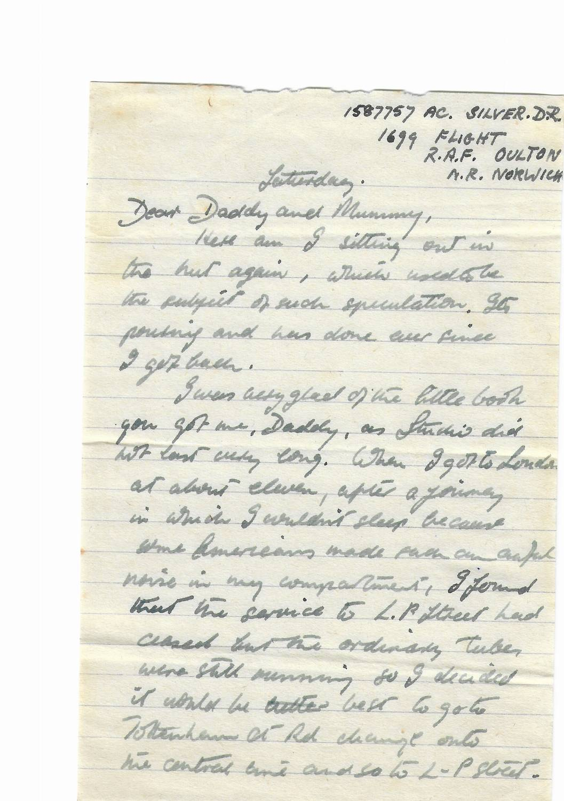
> 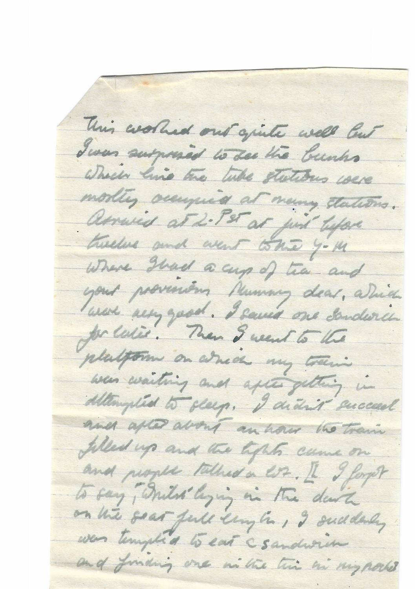
> 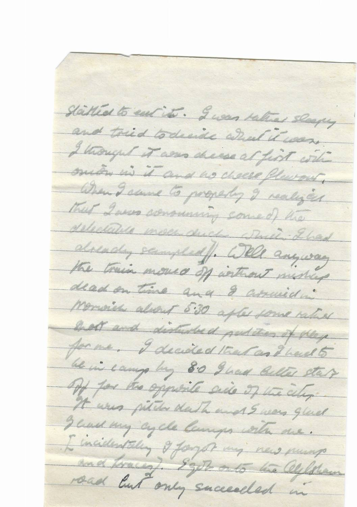
> 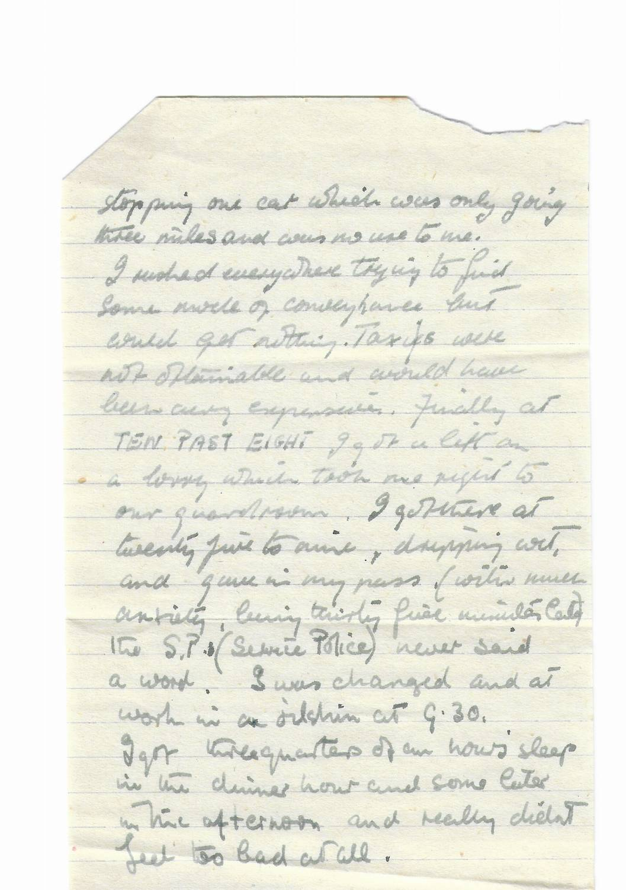
> 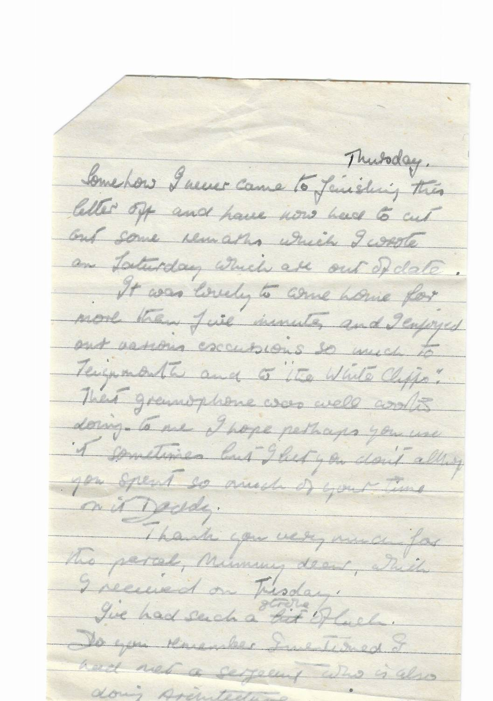
> 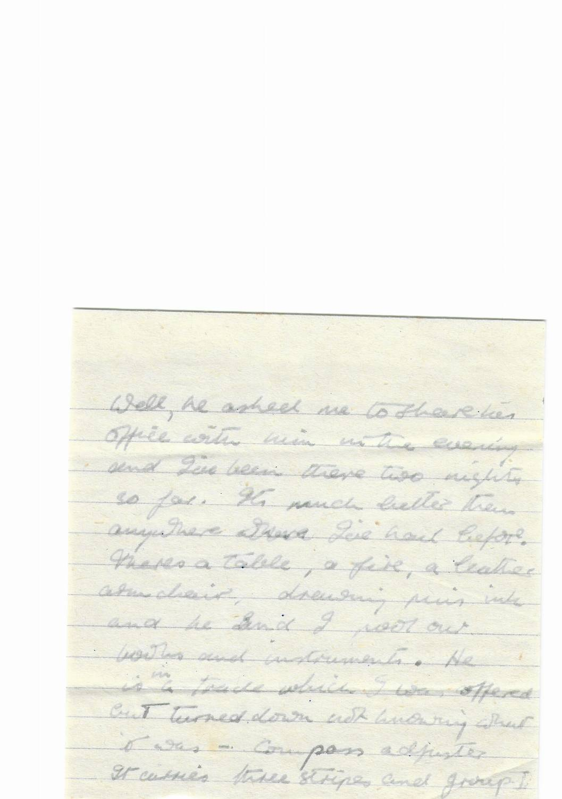
> 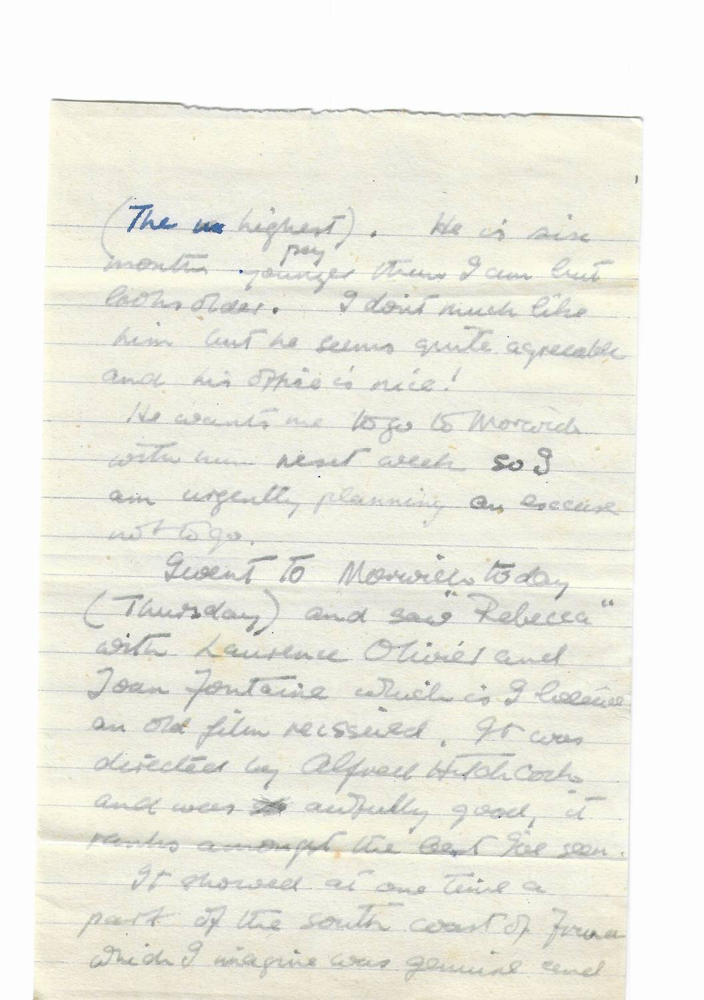
> 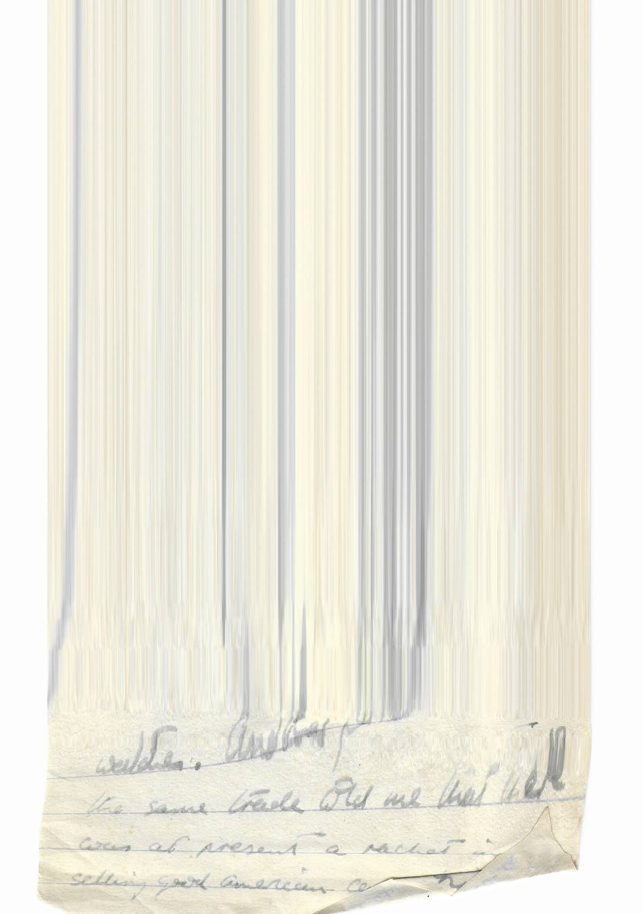
> 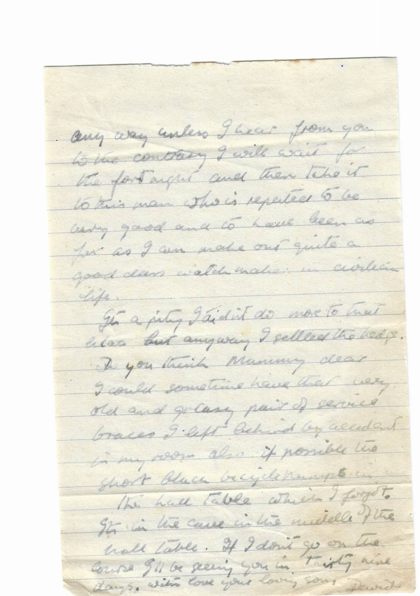

### 11. Friday 1 – Saturday 2 December 1944

*Dated "Dec. 1st" and continued "Saturday". The last four pages ("How do you like this writing paper?") are an extra sheet sent with it: Christmas presents and "next leave … in 30 days" fit the same week.*

> *(p. 1)*
> 1587757 AC Silver. D.R.
> 1699 Flight.
> R.A.F. Oulton
> Nr Norwich.
> Dec. 1st
> Dear Mummy and Daddy
> Thank you very much for your letters the bicycle pump and the braces.
> I am so sorry that I never looked in the air raid shelter, particularly after you mentioned it. I can't think however I forgot. I could have done it that last day easily.
> What a lot of water too, I could kick myself. I don't like to think of you without a serviceable shelter although as a matter of fact judging by the past year or so I don't think you need worry. Would the N.F.S. pump it out? I dare say they might jump at it as they can't have much to do but how would they get a pump round there. I suppose they could lay a pipe from the front garden where the pump would be.
>
> *(p. 2)*
> I am writing this letter in my newly acquired "study". The other chap has just gone to the Salvation Army Canteen and I with presence of mind have avoided the need for going with him by having something to eat before at the Naafi.
> The dental officer's name is K. W. Mays. I went to see him as I had a very painful ulcer in my mouth at the front which didn't get any better and made mealtimes miserable. It was about this size O and slightly yellow in colour and was just in front of my two front bottom teeth [tiny sketch: lower lip, ulcer, tooth].
> He put some stuff on it, told me to come back again if it hurt and I went. It went too. He was quite pleasant and I see where all the dental equipment goes. It would have done credit to your surgery. I can still find the place where the ulcer was but it hurts no more. Other people had told me how he'd got rid of ulcers for them. He looked at my teeth and used a probe on one or two but never a word said he.
>
> *(p. 3)*
> Saturday
> I am glad I didn't post this letter as I got yours to day. What a muddle the gardener made of that business about the Laburnum and Lilac. I am glad you scored off him over the apple crop. Incidentally he gave me an 'Ahple' just before I went. I never eat it, I don't know what I did with it.
> How just like James to send you all that glass. What would you like for your birthday and Christmas, Mummy dear, there aren't any nice little books anywhere. I believe the Exeter shops are better than the Norwich ones. The shopping centre has not much been affected by the bombing here either. I've thought of a little experience which might amuse you and forgotten to put it down several times. I had it on the way back from Norwich last week. I got into the bus which was almost full. The seats are not as in our buses but are in one long line facing
>
> *(p. 4)*
> inwards with their backs to the windows. There was only one place vacant up at the end and I went to this. An oldish farmer-looking man moved up a little and made a place for me. Notice, he was on my right. I sat down and as is my subconscious custom swung my left leg across my right knee. This would have been all right if his habit had been the same as mine but it was in fact the reverse. He swung his right leg across his left knee. His right foot and my left foot met in mid air between us. There was a fairly loud thud as boot met boot. The rest of the bus shared the entertainment and he and I both smilingly apologized to one another. For five minutes after this I had to suppress hysterical giggles inside me as I re-told the story in my mind ready to write in this letter. Perhaps it won't amuse you but I thought it rather funny
> with lots of love. David.
>
> *(p. 5)*
> How do you like this writing paper? I could get you some if you want.
> I had a look at the shops on my day off and could find nothing suitable for Christmas for anyone. No good books, although there were stacks of useless ones. They were mostly of the "How to keep Bees" and "A Hundred Handy Hints on Hens" variety.
> There were other books but nothing really worth having. The architecture though temporarily renewed with another lease of life is difficult with no one to correct you as you draw. That year at the art school though not as useful as it would have been in peace time else where nevertheless had its points. I would never have had the courage to start on a course like this before it.
> I have not heard anything about this
>
> *(p. 6)*
> met. course yet but have not lost all hope. I think I'll get a commission in the end if the war is long enough as I fear it will be, but I can't imagine how or what in. I seem to be more confident now than I was when I first came into the RAF and I feel as if I could order anybody about and not stand any nonsense if I wanted to and not just be able to order public school boys but anybody.
> It used to embarrass me when people noticed that I didn't speak in the same way as they did but now I don't care a straw what they think and I am not interested in anything my companions have to say. It's funny but I feel a lot better able to look after myself.
> But at the same time it's made me a lot less confident ~~[struck]~~ as a civilian so that I am awfully self conscious if I go into a restaurant or anything like that. However this isn't exactly news but the trouble is that there isn't any I just go on being here and nothing happens
>
> *(p. 7)*
> that I can tell you about.
> We've had a day or two of not bad weather but now it's going stormy again.
> I don't know whatever I'll do if and when I get posted from here as I have so much equipment in the way of drawing boards T squares books etc. I could get home on my day off for from 12.0 midnight till 5.0 the next evening and I could but it would be rather expensive for so short a time, it's about 600 miles home and back. I have visiting Philip and Kit in mind but so far have not had a chance of seeing the time table. I wonder if Kit would hate it if I did in uniform. I do wish I could get a commission. If only there were the courses I could get one in my own job.
> I am afraid this is a very
>
> *(p. 8)*
> poor letter. If I get my next leave it will be in 30 days time, not so long, if I am not posted on a course before then. What a rotten interview that was at Penarth. I've seen people since who'd been there, whom an officer interviewed, I wish he had me.
> If you were sitting here with me you'd be amazed at all you can see and hear. The cigarette lighter manufacture is doing well hundreds of new lighters leave the R.A.F. lighter manufacturers daily also wooden engines, small blackboard and easels, parrots that swing on a bar and other toys, the station is in full production. Air raid shelters are packed with big red wooden engines such as Christopher and I used to have. Somebody's children will have a good Christmas this year as they are well made and brightly painted in standard R.A.F. dope!
> I'll close down now I think
> With love
> your loving son
> David

*Notes:* The N.F.S. is the National Fire Service. "That rotten interview … at Penarth" was presumably his aircrew or commission board. The station's Christmas toys (wooden engines, swinging parrots) were made from scrap and painted in "standard R.A.F. dope".

> [!scan]- Scans (8)
> 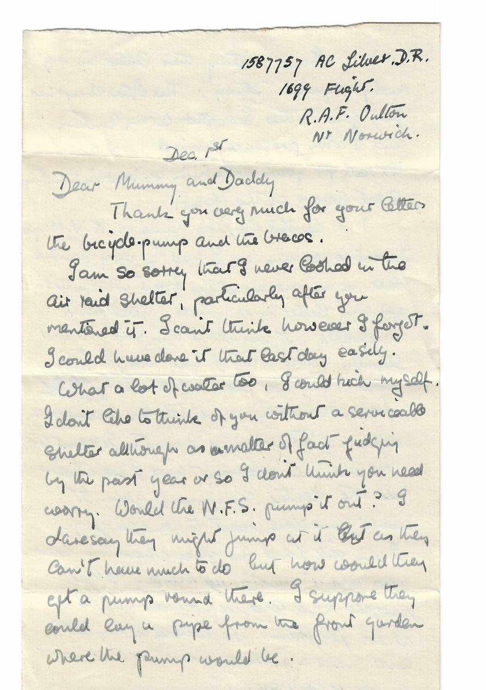
> 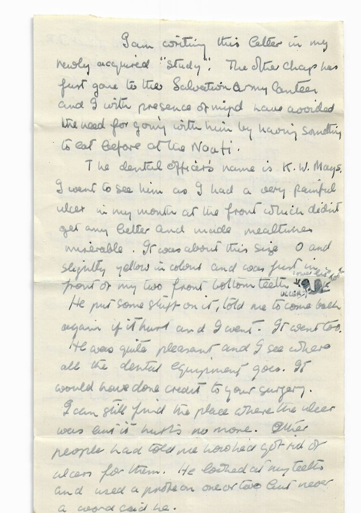
> 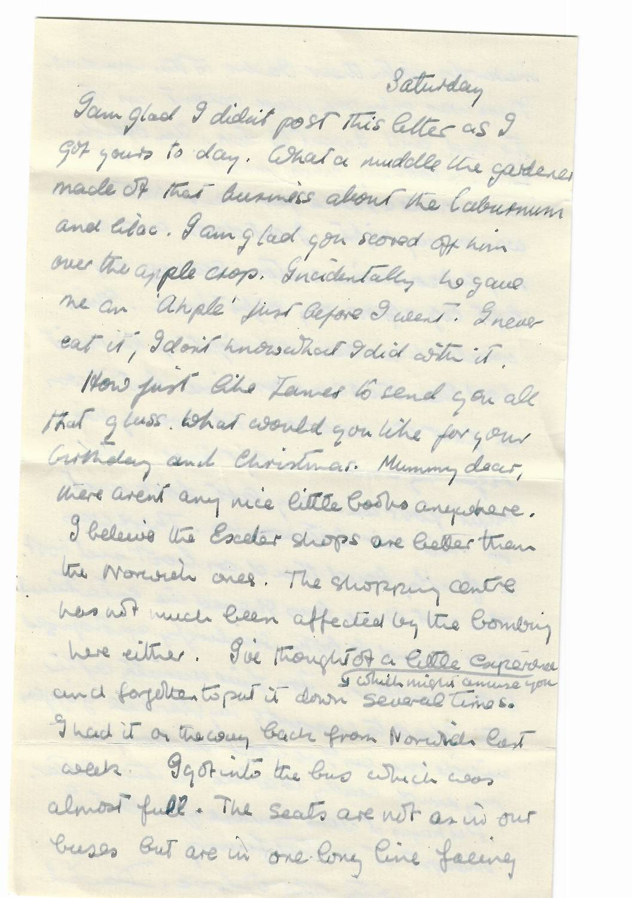
> 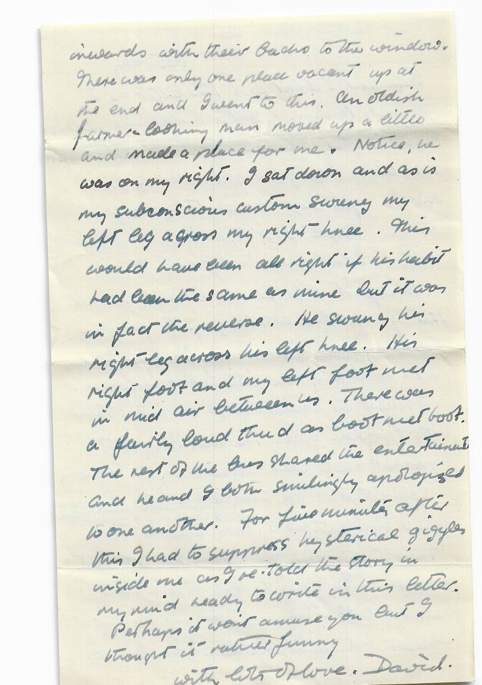
> 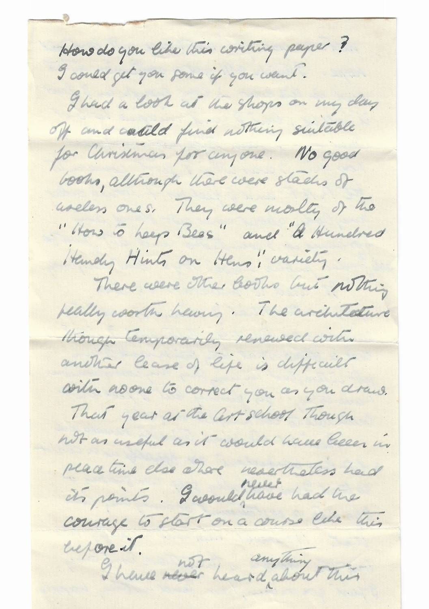
> 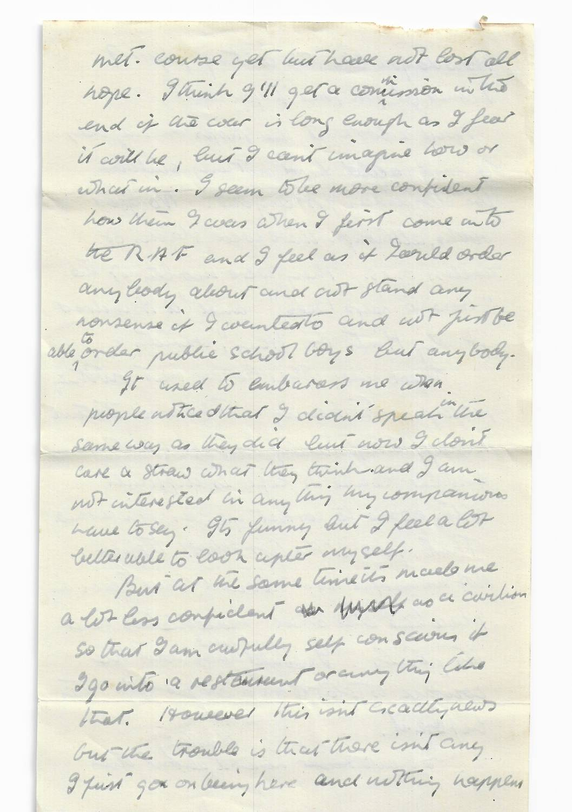
> 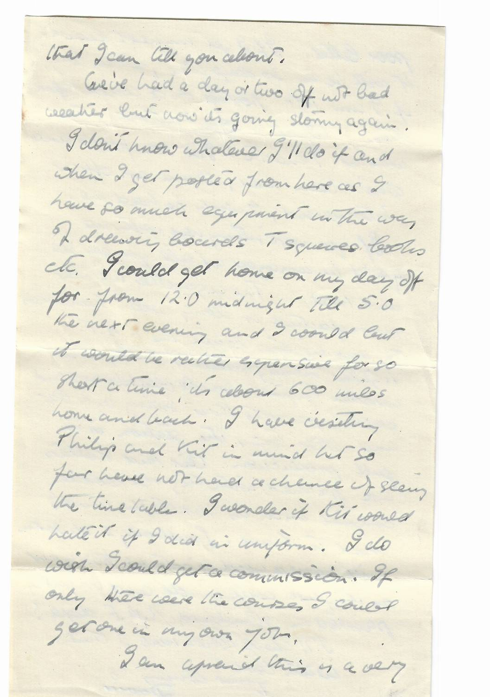
> 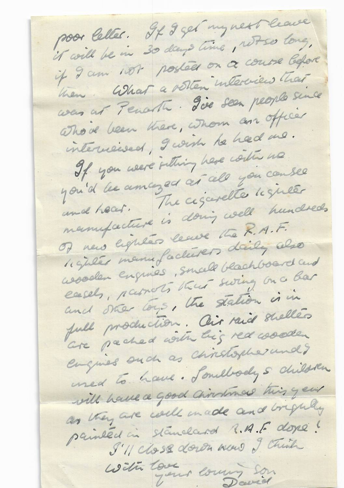

## 1945

### 12. Tuesday – Thursday, late January 1945 (snow)

*Headed "Tuesday" and "Thursday". He has applied for leave from 7 March and will hear "about February 8th (Phil's birthday)"; "How the Russians are going ahead" (the Vistula–Oder offensive, from 12 January); roofs off and four-foot drifts (the great snow of late January 1945). Probably 23–25 January 1945.*

> *(p. 1)*
> R.A.F.
> Oulton.
> Tuesday.
> Dear Daddy & Mummy
> There doesn't seem to be much news this week. The chief thing is that I've applied for leave for March 7th for nine days. We had to fill in a form at short notice and so I pushed it forward as far as I dared. I hope this won't clash with anything. I think I'll get it then all right.
> The Education Office has organized a room, with a fire for those on correspondence courses (I seem to be the only one who works at his) and so I've abandoned the compass adjuster's office to my relief as his reminiscences were getting to be more than I could bear.
> I suppose you're having the same weather as us. We've had roofs off due to the wind and four foot drifts of snow
>
> *(p. 2)*
> Thursday.
> Still snow hard-packed on the road sometimes 8" thick and in deep drifts in the fields. Snowing again now. I am once more in the hut which once proved such a mystery to you, I don't expect to stir outside again to-night. It was bitterly cold and damper this morning.
> I shall know definitely whether my leave will be granted for March 7th about February 8th (Phil's birthday). I quite expect it to be. My application for meteorologist has gone through to Records Office and so it rests with them. I shall stir them up via the meteorologist office if I don't hear anything soon.
> How the Russians are going ahead. Talking of going ahead I wish I could get on with my Architecture. I am lucky if I get four nights a week free.
> No doubt you have seen things in the paper about 90% of the R.A.F going overseas. I think that there's little doubt that I shall be among them and I imagine it will be in the first half of this year so that's one of the reasons why I am pushing my leave
>
> *(p. 3)*
> back as early as I can in the quarter. This leave will be the third week in the quarter and so you see I am not doing badly considering my first leave was the 12th and last week in the quarter.
> I am doubtful whether I shall get another one in after that before I get embarkation leave but if I do it will be in the middle of May. I heard something on the wireless to-day about recordings for forces overseas ~~forces~~ it went something like this "Now here is a recording specially made for Cpl John Smith in Ceylon. He asked for "thrushes singing in the rain, so here it is" etc It made me wonder what I'd like if I was out there and I decided upon a very much less romantic thing. I thought I'd like to hear a voice saying "This is Exeter, Exeter St David's, the train standing on No 1 platform is for Torquay, Newton Abbott and Plymouth, This is Exeter, Exeter St David's" etc I always like hearing that as I dash out of the train and hurry along through the crowd of people jostling to get out and think how to them it's just another station.
>
> *(p. 4)*
> The snow is getting again quite fast. Last night I went down to open the library at the spot which used to be another mystery to you. Another chap went with me on his way to the music circle. We came off twice (we were riding bikes - in case you didn't know and thought we were riding horses) The roads are very treacherous. So Wiggs has moved again I should think she's a bit chilly where she is now, anyway you'll be able to tell pretty well what sort of weather she's getting.
> I want to try to save £50 this year if I can which will make my total capital about £125 I think.
> I wish I got more drawing practice although from what I can make out other architectural students are not for the most part exceptionally good at freehand drawing but for that matter there are not a lot of architects who are really good at design. Did I tell you I got two good books by The E.U.P. on roofing and constructional details, quite cheap too on good paper,
>
> *(p. 5)*
> I am getting quite thrifty in my old age and know my own mind a lot better than I used - the effect of looking out for yourself I suppose in the R.A.F.
> I see Tommy Handley has 'flu.
> I didn't go to Norwich on my day off but did a lot of things like tidying up my belongings (which are very numerous and live mostly under my bed) and seeing the Education Officer about the library which is in a shocking state some books having been out since July. I wish I could have a go at putting it right but there's a regular person who does it in the day time.
> I get so fed up with wasting time with nothing to do sometimes during working hours yet not being allowed to go away and get on with my own work. I have now a waterproof one piece suit with a zip fastener down the front.
> [Sketch: a figure in the one-piece suit.]
> Well that's about all for now
> with lots of love
> your loving son
> David.

*Notes:* The pages were scanned out of order; the reading order is 127, 130, 129, 131, 132. The E.U.P. is the English Universities Press. Tommy Handley was the star of ITMA.

> [!scan]- Scans (5)
> 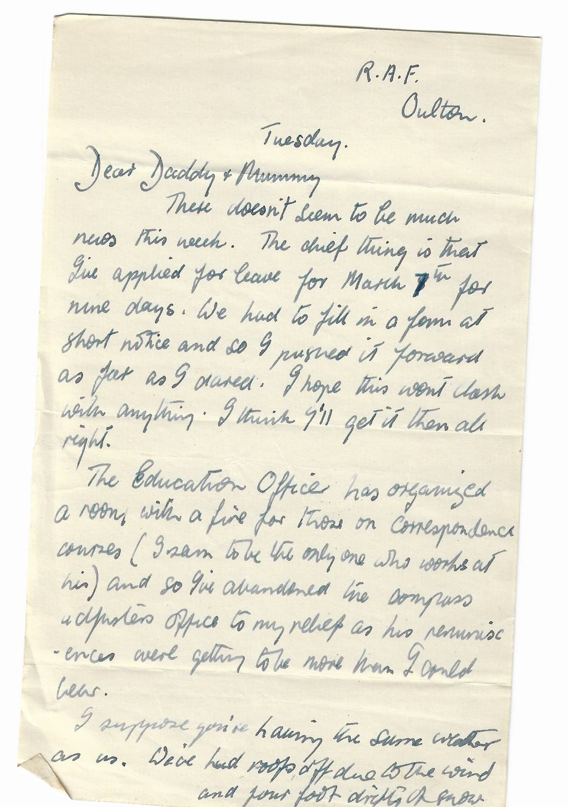
> 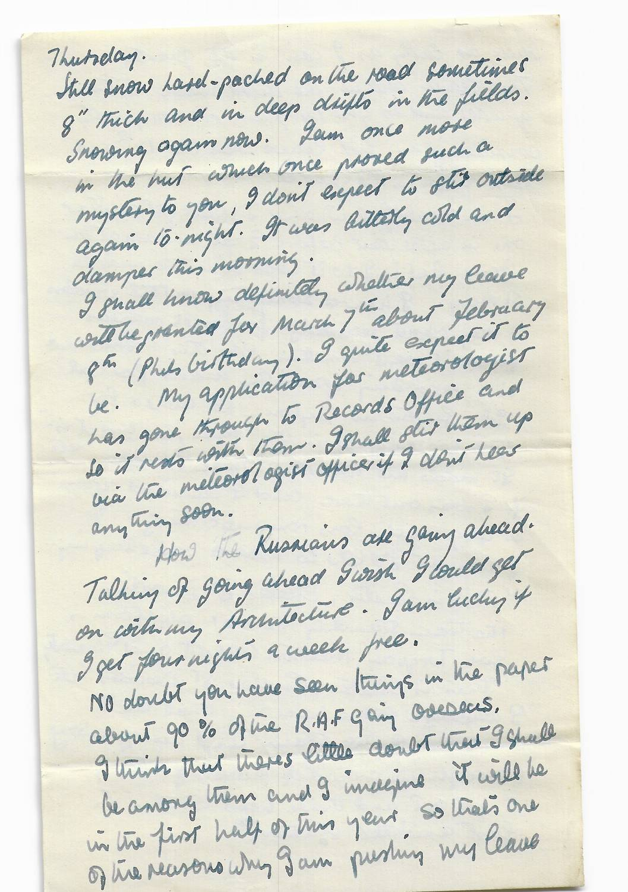
> 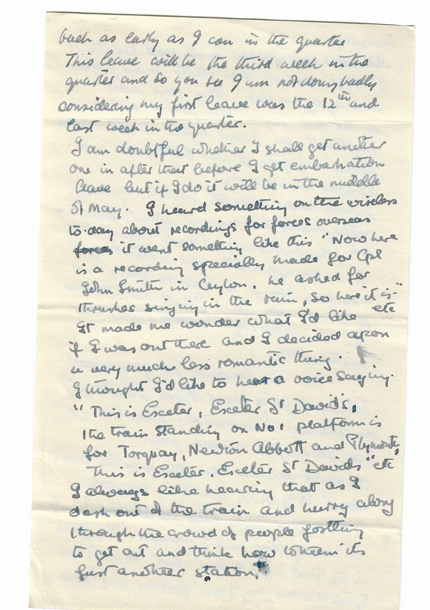
> 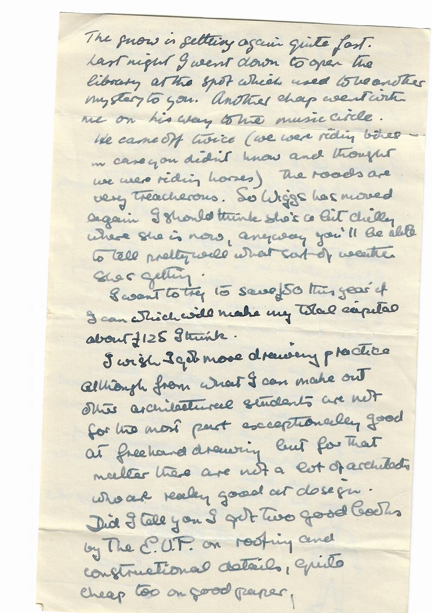
> 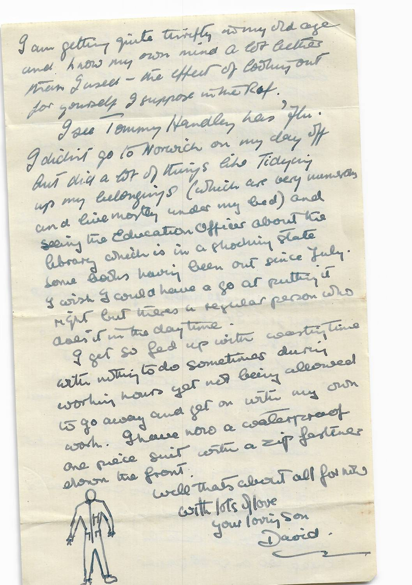

### 13. Saturday 31 March – Easter Sunday 1 April 1945

*Headed "Saturday" ("April 3rd" pencilled at the top in another hand, probably the date received). "A Happy Easter to you"; he took Communion "this morning" (Easter Day, 1 April 1945) and "it's an hour less tonight" (double summer time began on 2 April 1945). His parents are at Treknow: the envelope he sent there, postmarked TINTAGEL 5 AP 45, was redirected home (scan 0).*

> *(p. 1)*
> [Pencil, top left, in another hand:] April 3rd.
> 1587757 AC Silver D.R.
> 1699 Flight
> R.A.F. Oulton
> Nr Norwich.
> Saturday.
> Dear Mummy and Daddy.
> Thank you for your letters and thank you very much for going into all that trouble with addressed envelopes etc Daddy. I've posted the bank a receipt. I've copied yours but ~~[struck]~~ I put a good fingerprint slap in the middle of your example so I sent one of my own instead.
> James wrote to me as well for which I must thank him. By now you must be at Treknow and I do hope you are having a lovely time the weather is very 'March' here now. It alternately rains and shines and there's a pretty strong gusty wind. I know my pictures so well in my mind that I think of the views in them quite easily without having to stretch my imagination
>
> *(p. 2)*
> A week ago I went to see a film in the station cinema called "The Uninvited" It was a ghost film and very good in its own way. It would have suited us very well although perhaps Mummy it might have made your hair stand on end. The suspense in some parts of it was so great that everybody writhed about in agony.
> On Tuesday I went to Norwich on my day off. I did myself very well. I booked a ticket for the Norwich to camp special bus which leaves Norwich at 10.30. I then set off for Norwich. I got one short lift to be followed by another one which carried me right into Norwich to a local bus stop. It was an R.A.S.C. lorry, they are pretty good tous and always pick us up if they can.
> I reached Norwich at one having left camp about twelve, good going!
>
> *(p. 3)*
> I had lunch in St Andrews Hall, Norwich City Services' Canteen. Then I went to "Western Approaches" and the "Twilight Hour" which were on together at the Regent.
> I had heard a good deal about "Western Approaches" and found it, as I expected, excellent. It was in 'restrained' Technicolor and the sea looked lovely. It was a real sea too not a studio sea. It was a full length film and was made by the Crown Film Unit. ~~[struck]~~ It dealt with a convoy and some men in an open boat who had been torpedoed. There were no professional film actors as far as I know in it.
> I meant to see an exhibition of Polish Art in the Castle Museum but was too late and found it shut. I did a round tour, passed the cathedral, and arrived at Stuart Hall where I heard a lecture
>
> *(p. 4)*
> by Eric Newton (Sunday Times Art Critic) on 17th and 18th century Art.
> I am almost sure that he was the strange looking gentleman who was sheltering from the wind at the end of the Starcross pier in a tin waiting room just before we got that steamer to Exmouth last November Daddy. He was of very unusual appearance and quite suited to being an art critic, with a rather gaunt hollow cheeked pitted looking face of uncertain mottled (not by drink) colour and with a very nice rich sort of voice.
> His lecture was illustrated by lantern slides and was very good indeed. There were about 200 in the audience of this rather small hall. It was rather like being in the Guild Hall. He told us about Tintoretto, El Greco, Velazquez
>
> *(p. 5)*
> Rembrandt and various others.
> He lectures every Tuesday (a course of ten lectures) and I shall try to go again. I enjoyed it very much so that the time flew and it didn't seem long enough.
> I had a bath in the Y.M. after this. This I followed up by having a cup of coffee in the canteen and watching a whist drive which didn't seem a great success. Most of the players reminded me of friends from Spurfield [?] who had evidently been supplied by the Y.M. to play the forces.
> I hadn't been sitting there very long when an old man with a dish cloth appeared and I had to hold my cup saucer and plate in mid air while he laboriously wiped underneath. I felt that this was perhaps ~~[heavily struck]~~ a hint to go so I withdrew to the safety of the reading room.
>
> *(p. 6)*
> Anyway the bun I had been eating was of such a poisonous nature and the woman playing whist in front of me, dressed in a navy blue turban and sailor trousers was of such a horrible appearance that I should have gone in any case.
> * * * * *
> The war is nearly over, we have been given out instructions on what we can do by way of celebration when the armistice is announced. The Church Army has also started selling cream buns which may be taken as a much surer sign that the war is almost over.
> * * * * * * *
> A Happy Easter to you.
> I should think it will be pretty brisk down by the sea as we've had a gale warning two days running now. I dare say the white horses are out, I hope it keeps fine for you.
>
> *(p. 7)*
> There is a lot of preparation going on for post war education in the R.A.F.
> I expect you went to church to-day in the little church next door or perhaps to Tintagel although I bet the telegraph wires were humming on that road. I went to Communion this morning in camp. Last time I went I was the only one, this time I suppose there may have been fifteen or twenty.
> I think a lot of the womens services will be disbanded and demobbed with the end of Germany.
> It seems a lot more than 2½ weeks since I saw you.
> Well it's an hour less tonight so I think I'll turn in now. 10.45.
> With lots of love
> your loving son
> David.

*Notes:* *Western Approaches* (1944) is the Crown Film Unit's Atlantic convoy film. Eric Newton was the art critic of the *Sunday Times*. Starcross pier is on the Exe estuary, where the ferry runs to Exmouth.

> [!scan]- Scans (7)
> 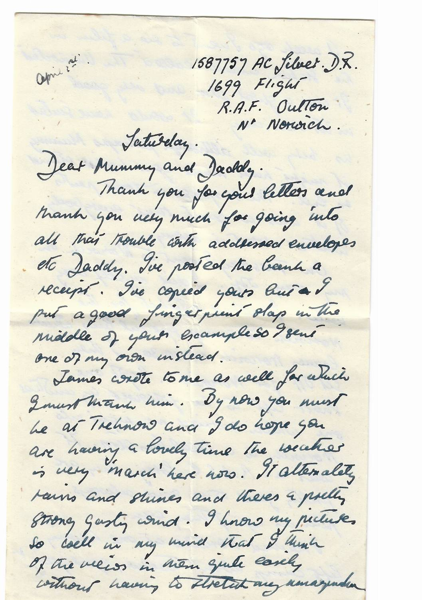
> 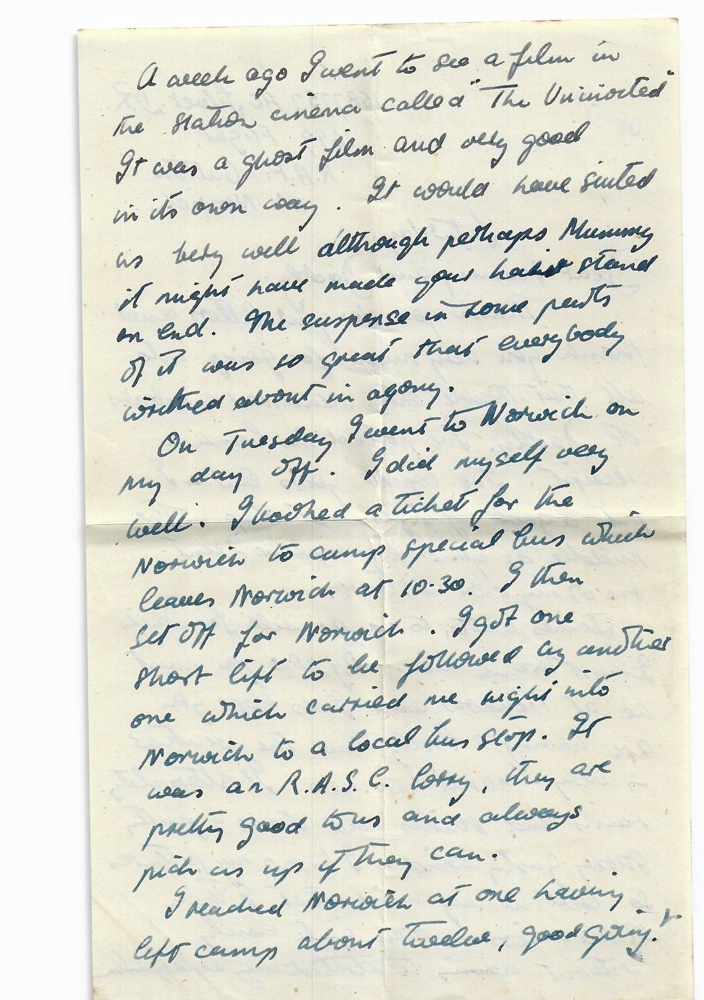
> 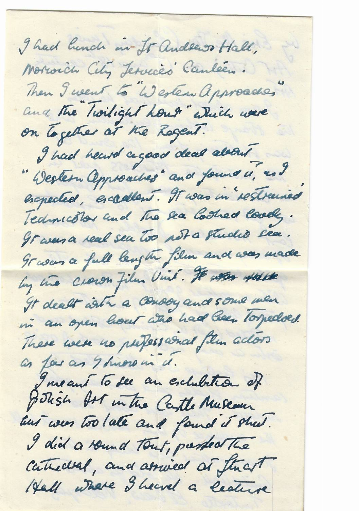
> 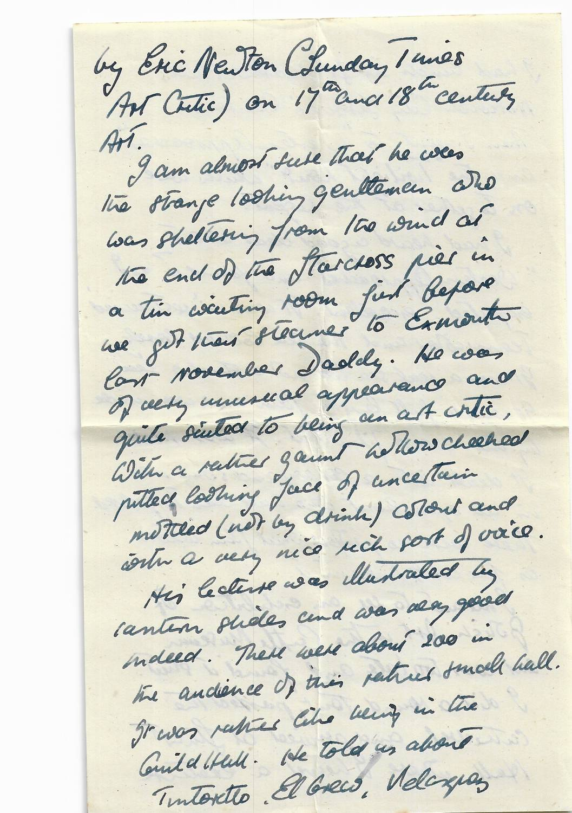
> 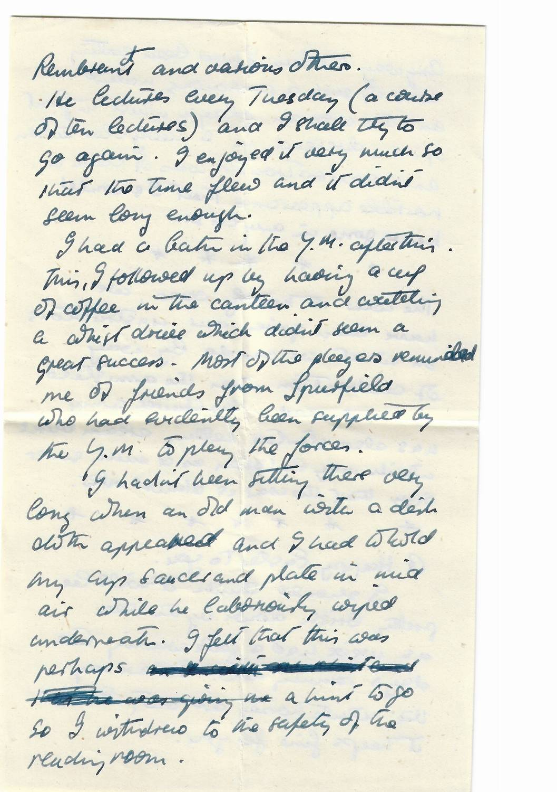
> 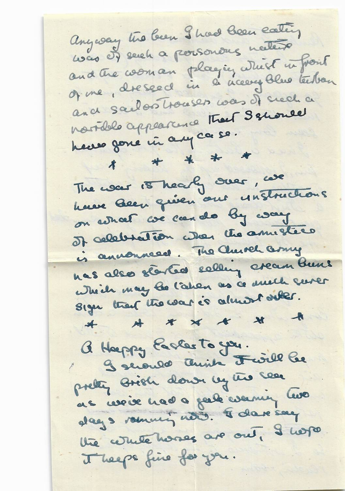
> 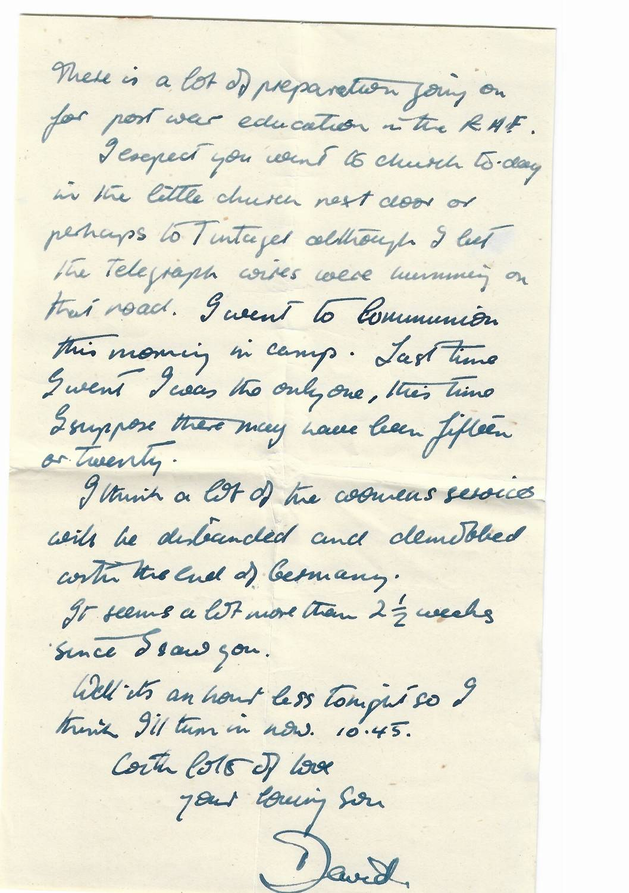

## Envelopes

Two scans of envelopes filed with the Oulton letters. Three are from Oulton, two of them with the "R.A.F. CENSOR 529" stamp; one is postmarked NORWICH 3 DEC 1944, and one was sent to his parents at Treknow and redirected (TINTAGEL 5 AP 45). One is from his Bruton schooldays.

> *(envelope)*
> [Top left:] Mr & Mrs C. M. Silver / Tresillian / West Avenue / Exeter / Devon. [2½d blue King George VI stamp, wavy-line cancel with diamond; marked "Privilege" top left; boxed "R.A.F. CENSOR 529" stamp and censor's initials]
> [Top right:] C. M. Silver Esq. / Tresillian / West Avenue / Exeter / Devon. [2½d blue stamp; postmark NORWICH NORFOLK 3 DEC 1944]
> [Bottom left:] C. M. Silver Esq. / Tresillian / West Avenue / Exeter / Devon. [2½d blue stamp; postmark illegible]
> [Bottom right:] Mr & Mrs Silver / ~~c/o Mrs Hearst~~ [?] / "Tresillian" ~~Heightley~~ [?] / West Avenue ~~Treknow~~ / Exeter ~~Nr Tintagel~~ / Devon ~~Cornwall~~. [2½d blue stamp; postmark TINTAGEL CORNWALL 4.45 PM 5 AP 45 — first addressed to his parents on holiday at Treknow near Tintagel and redirected home to Exeter]
>
> *(envelope)*
> [Top left, back of an envelope:] Certified Private and family matters only. [signed, illegible] / certificate's code number: [blank]
> [Top right:] Mrs Silver / Tresillian / West Avenue / Exeter / Devon. [two 1d red + ½d green King George VI stamps; postmark illegible]
> [Bottom left:] Mrs Silver / Tresillian / West Avenue / Exeter / Devon. [2½d blue stamp, wavy-line cancel with diamond; boxed "R.A.F. CENSOR 529" stamp and censor's signature]
> [Bottom right:] C. M. Silver Esq / Tresillian / West Avenue / Pennsylvania / Exeter / Devon. [2½d blue stamp; postmark BRUTON SOM… 15 … — probably from David's Bruton schooldays rather than Oulton]

> [!scan]- Scans (2)
> 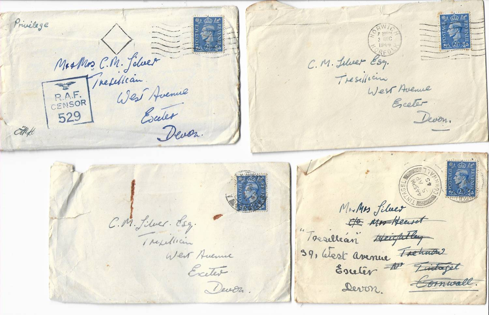
> 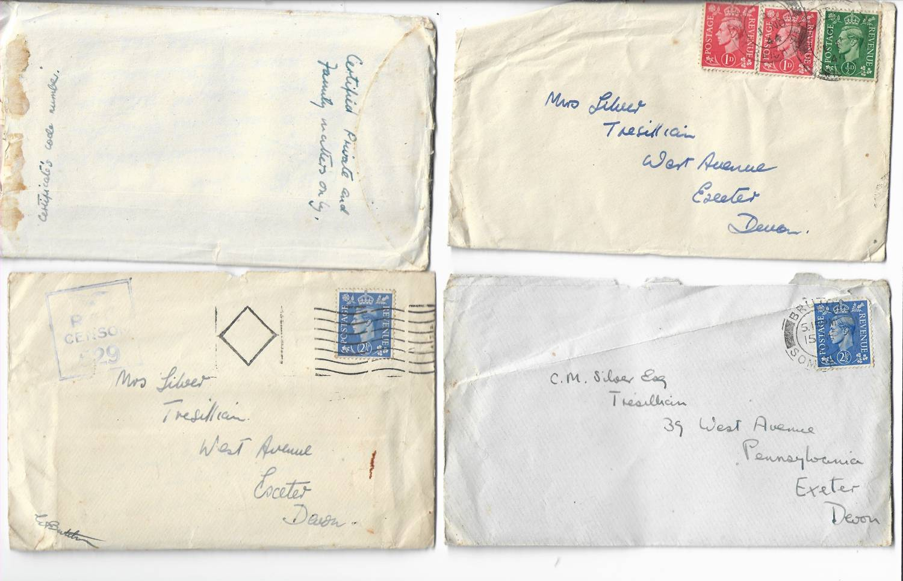

## A letter from RAF Cosford

A letter from RAF Cosford, near Wolverhampton (an earlier posting, probably early 1944), filed among the Oulton scans. He has just come back from a 48-hour pass home; "48 hrs on March 4th" is noted at the head and the foot. It will move to its own page when the Cosford letters are transcribed.

> *(p. 1)*
> [Top left:] You Must Not let you know who IN. [?]
> [Below:] 48 hrs on March 4th
> [Top right:] Please address Kit's airgraph and post it next time you get a minute to do so. Cosford.
> Tuesday
> Dear Daddy & Mummy
> I got back here in time by the last train from Wolverhampton.
> I arrived at Bristol about a quarter of an hour late and not knowing which platform my train left from enquired of my old friends the R.T.O. there being no porters about.
> Never again! must be my motto. There were two or three air force people all enquiring about trains to Cosford. I could scarcely believe my ears as I came in on hearing them told that they would not be able to reach Cosford until the next morning.
>
> *(p. 2)*
> They went out and just to make certain I asked again. They told me the same. The 6.55 for Birmingham would leave No 12 platform but there would be no train leaving for Cosford until morning. I began to experience a slight sinking feeling but determined to ask the railway officials. At the Booking Hall I was stopped by the R.A.F. service police. To my relief it was only to ask whether I was the chap they had told to go to No 14 platform because if so, it wasn't No 14 it was No 12. Poor chaps!
> I patiently explained that I wasn't although it struck me the policeman looked as if he didn't believe me.
> I asked if we were allowed to use the civilian enquiries office and I was [?] we are not.
>
> *(p. 3)*
> He became quite genial and directed me to it, asking me later whether I had found out all I wanted there.
> The railway official was of the opinion that life was one big joke and the R.T.O had been invented to make him laugh. He informed me that I could reach Cosford by 12.35 a time I had never heard of before. I told him about the Exeter Enquiry Office and he looked it up again. This time he got a different result and mentioned the trains I already had in mind. Much relieved I caught the 6.55. It was nearly a near thing at B'ham as the other train was waiting.
>
> *(p. 4)*
> however after everybody in our train had panicked and rushed across the bridge to the other side and got into the train, it waited about ten minutes for the train I would have come on at 4.20. Whether or not this made its connection I don't know but anyway I was glad I had taken the early one as it eliminated a certain amount of nervous strain.
> The train to Wolverhampton was very fast and I changed stations there and caught the next train to Cosford having forty minutes to catch it in.
> Over and over again it was worth coming home. I am so glad I did and thank you very much Daddy for paying for the fare and also for the money.
>
> *(p. 5)*
> All the people in my hut were confident that I should not get the connections and that I should not have any time at home. They thought I was mad to go - but that's because they are all Scots. I ~~[struck]~~ think that the feeling about madness is mutual.
> I keep thinking of it all and how lovely it was and being so pleased that I dare think about coming home again as it is not so far off. I still think it's four weeks Daddy, but I'll find out definitely before I post this letter.
>
> *(p. 6)*
> I bet you've noticed this crest isn't in the middle of the page by now Daddy! It's only a Naafi block.
> Mummy, everything was lovely and I am enjoying thinking about the hot water bottle so don't be sorry about that as now I shall always remember that incident and the occasion will stand out in my memory because of it.
> I shall have to cut that hedge again Boss. The soil here is light and strangely, red. James says it new sandstone or something and that Devon is clay on old sandstone.
> I am on magnetos they are awful. I feel twice as good as I did before I went home, as if I'd had a lovely holiday, well I have really!
> with love
> your loving son
> David.
> [Bottom left:] 48 hrs on March 4th

> [!scan]- Scans (6)
> 
> 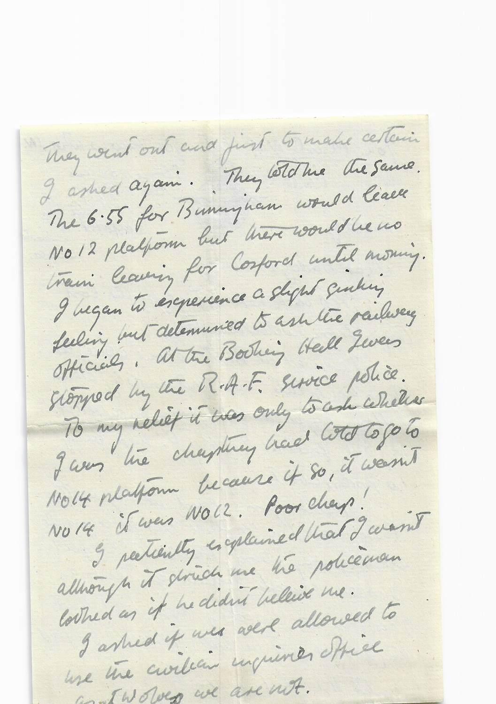
> 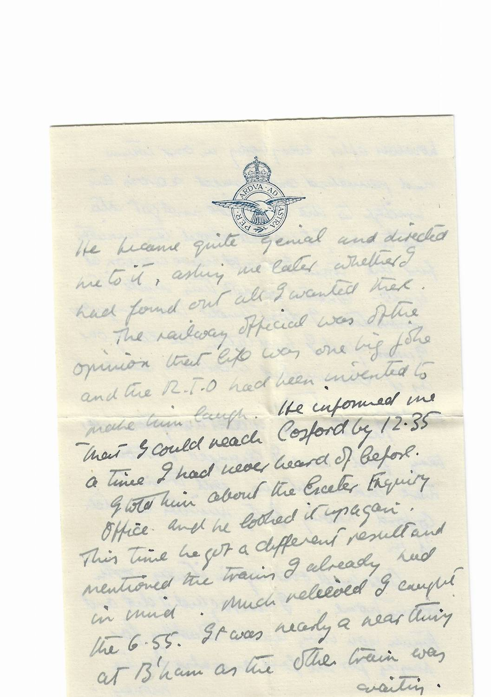
> 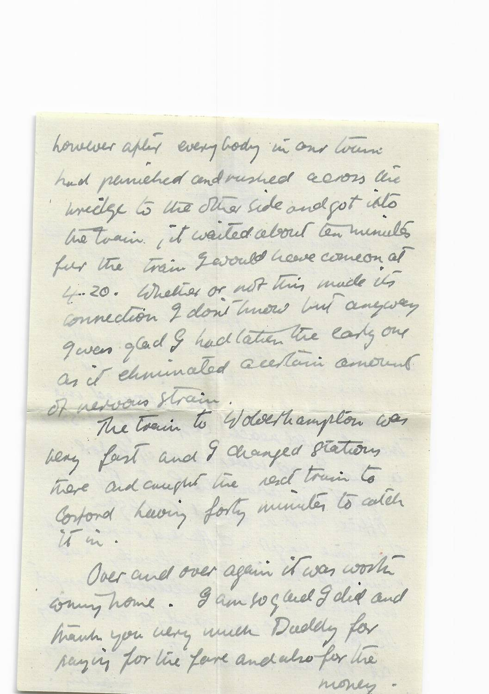
> 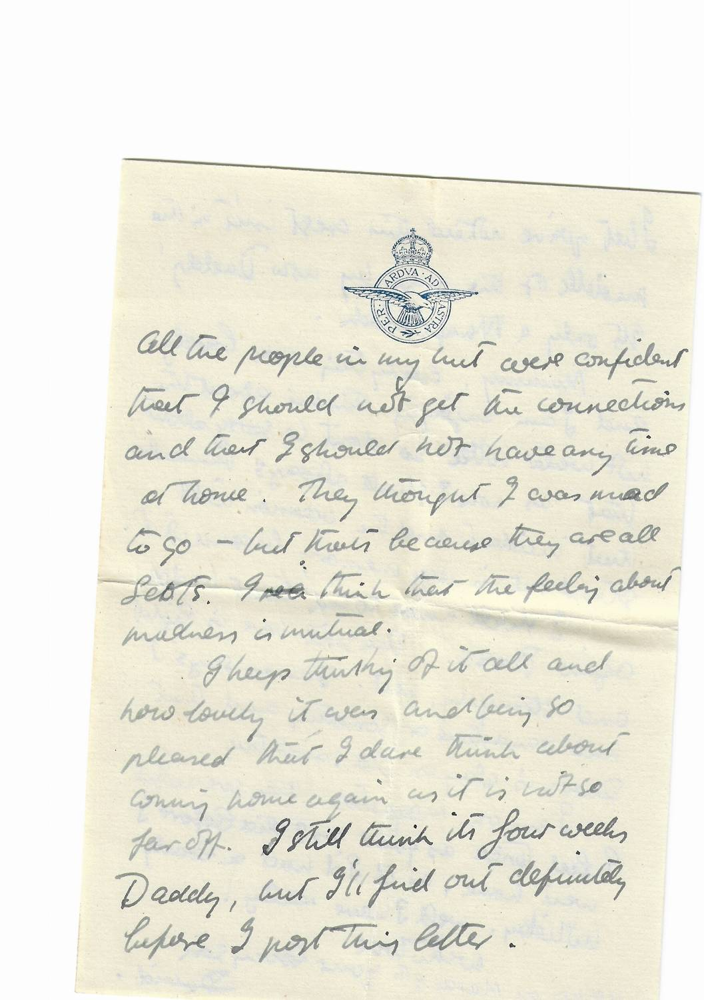
> 

## Two pages from Bruton

Two loose pages from David's schoolboy letters from King's School, Bruton (see the Bruton letters), filed among the Oulton scans: the end of one letter, and a page about the headmaster showing prospective parents round.

> *(p. 1)*
> brush my hair quite a lot as we have firework displays in the dormitory to see who can make the best sparks jump off his hair.
> I go for quite long ~~[struck]~~ rides now, can you tell me anywhere worth going to within a radius of 15 miles of here?
> Thank you very much for all the food and things you brought up on Sunday, and the jellies and drinks were the nicest I have ever had on a Sunday leave. Must stop now I'm afraid there isn't much news.
> with love
> your loving son
> David
> [Bottom left:] I see that Jubilee went down somewhere off our coast.
>
> *(p. 2)*
> He shows the school off to people who may send their sons here like a beastly guide book, and every one loathes the sight of him. While I'm writing this, in the library he has come in with two parents and a minute prep school boy. The boy looks as if he might like to sink through the floor ~~[struck]~~ and I don't wonder because his mother goes into ecstacies over the most trivial things and the beak eggs her on telling her of the beauties of Batcombe and Brewham and they never think for a second whether the wretched boy cares two hoots for Batcombe church tower or not. I wish Tom was headmaster.
> You will be glad to hear that I

> [!scan]- Scans (2)
> 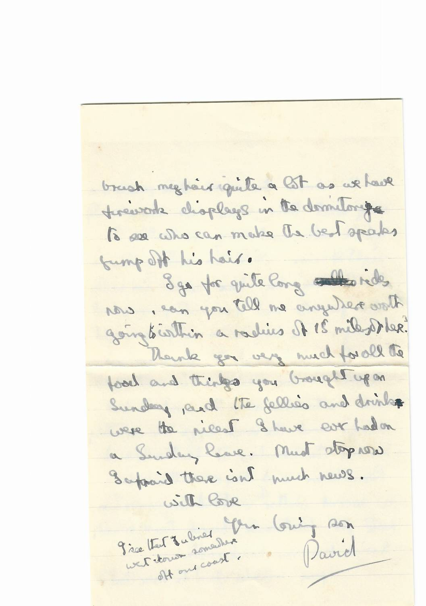
> 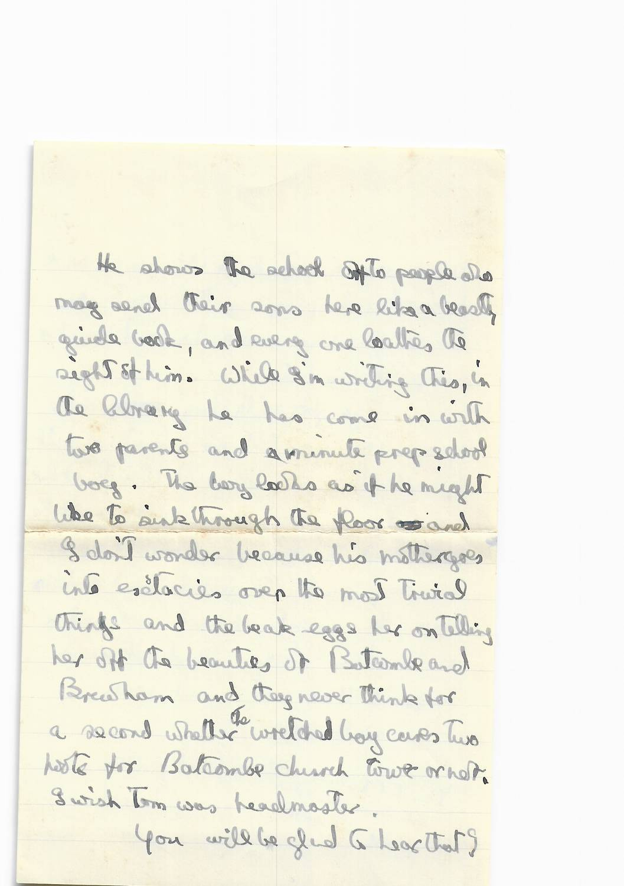
