*← [Silver Family Archive](./)*

The last of [David Silver](David-Silver)'s RAF letters come from **RAF Wellesbourne Mountford**, near Stratford-upon-Avon, in June and July 1947, as he counts down to his release on **9 July 1947**. They are to his parents at **Tresillian** in Exeter, a year after his [Henlow letters](Henlow-Letters).

He spends his last weekends in London: Cotman's and De Wint's sketchbooks at the V&A, the Tate crowded with "men with velvet trousers and beards", Big Ben from his bed at the Westminster Y.M.C.A., and **Oklahoma!** at Drury Lane, which he describes for his mother's birthday down to the "Paul Nash clouds" of the backdrop. He takes a dancing lesson in a Stratford house "with a not very good wood Doric column porch" and writes it up like a play. And on his last Sunday before demob he walks with his brother Christopher to the Rollright Stones, where their picnic is "1 egg sandwich (squashed), ¾ lb cherries (also), ⅓ lb chocolates (ditto), two bottles of fizzy lemonade, no opener" against Christopher's six small sandwiches, cake, an orange, sixteen plums, red currants and two Mars bars.

**About the transcription.** The letters are transcribed with David's own spelling and punctuation. ~~Struck text~~ shows his crossings-out, [?] a doubtful reading and [square brackets] describe drawings and layout. Page breaks appear as *(p. n)*. The scans for each letter are in the collapsible **Scans** box beneath it. His RAF letters begin at [Skegness](Skegness-Letters) in 1943.

---

## 1947

### 01. Friday 20 – Sunday 22 June 1947: a birthday letter to his mother, and Oklahoma!

*Headed "Friday", wishing his mother many happy returns (her birthday was 22 June), with a "super postscript" dated "Sunday June 22nd" from the Nuffield Centre, London, describing *Oklahoma!* at Drury Lane the night before.*

> *(p. 1)*
> [Top left:] Please forgive the fingerprints that seem to have crept onto this page.
> 1587757 LAC Silver. D.R.
> R & I Section
> R.A.F. Wellesbourne
> Mountford
> Warwickshire.
> Friday
> My dearest Mummy
> Many happy returns of the day. I hope you have a lovely birthday and a fine day and feel quite well.
> I wish very much that I could have been at home but being a week day I am afraid it's not possible.
> I hope you like the book on Glass I feel sure that you will as I think it's just the book you would have chosen yourself.
> I am sorry to hear you've been in bed but hope it's been a good rest.
> You will be able to have "Oklahoma" second-hand from me when I get home I have a ticket for to-morrow night (Saturday - the Theatre Royal, Drury Lane)
>
> *(p. 2)*
> I was in London last weekend and shall be there again next (to-morrow).
> I saw the actual sketch books of Cotman, Peter de Wint, Gainsborough and some others - Turner - I am sorry he should have been first - at the S. Kensington Museum of Arts. Also beautiful pots of all variety, Chinese English - everything Bristol, Worcester, Derby up to modern day Wedgwood and also carvings in Alabaster.
> Coming back last Saturday from a news film of the Isle of Man T.T. races (I arrived in London too late for anything longer) I found a great many French people with tricolour sort of clothes and rosettes and flags all standing waving their arms outside the Central Hall Westminster. They had been to some meeting and some were singing the Marseillaise. They seemed very pleased with life. There was a Cockney ~~[struck]~~ ice cream man with a barrow right in the middle of them shouting "Choc Ices - Lovely Choc ices - only the
>
> *(p. 3)*
> 2.
> very best, Lidy:"
> The Y.M.C.A. Westminster Services Club where I was staying (for the first time) was next door and from my bed I could see Big Ben and listen to his voice in the night, quite close.
> I am telling you all this back to front for it was on Sunday afternoon that I saw the sketch books, the morning being spent in looking in Foyles (book shop) window and walking in Regents Park.
> My release of which the date was uncertain is to be definitely on the ninth of July a Wednesday so I'll be home for the week end, I think, of the 12th July. That is about 3 weeks hence I start winding up my affairs here and getting cleared on the 3rd July.
> I am glad I brought the dancing shoes. Somebody else who has lessons arranged me a lesson on yesterday night at 7.0. I had a rush to get to Stratford where it was. It was in a red brick house built about 1840? 50? with not very good wood Doric column porch and a solid look about it
>
> *(p. 4)*
> It was built in a quiet street off the main road. and it might look a bit like this if you couldn't see very well and you felt a bit queer.
> [Drawing: a tall narrow house in a side street, with a columned porch and steps, seen in steep perspective.]
> Next to it was another house set back with a board outside marked "Nursery School". My house had a small brown board not terribly well painted in script "The Sylvia Atkinson School of Dancing". I wondered if Miss Atkinson would be another "Rouser" or as she would have called her-self Röser or Razer.
> I rang the bell three times at which a man like the man in Wolters in type opened the door asked me in to take a seat
>
> *(p. 5)*
> 3.
> in the hall of a rather well furnished and well kept private house. He told me that Miss Illey (that's correct) would come down in a minute but she was just ~~coming to~~ finishing somebody else's lesson. He disappeared behind a door marked "private - Miss Atkinson". I sat down and looked around. I found that the house was joined to the Nursery school and that I could see a door connecting it through a very neat kitchen (all oil cloth and shining pans). Presently there was a noise of people coming out of a room upstairs (anyone would think with all this detail that I was setting the stage for some great drama) and downstairs came a man in a very woolly sports coat and a girl in a dress half between rose and orange.
> I decided to stand up. This all strikes me as being very funny as I write it so that I keep laughing and the person opposite me on another bed (I am in my hut) who is laboriously darning a sock with an electric light bulb to fill it up - he looks at me as if I were mad.
> [Along the foot:] I think using an electric bulb for darning is more eccentric than laughing personally
>
> *(p. 6)*
> Miss Illey then wished me good evening and said that she would be with me in a minute and I suddenly realised that they had no manager here like Miss Couldridge's Charles and that from the sudden tightening of the atmosphere and digging in pockets by the sports coat that there was to be a settling of accounts so I surveyed the oil cloth kitchen to the ~~accompanied~~ accompaniment of much chinking of half crowns.
> Then I found myself explaining that I had some dancing shoes with me just as I seemed to be about to be spirited into a quick step with my boots on. There was a cloak room downstairs but I didn't have to change them there because I was put in a corner on a ~~range~~ row of chairs to change them while Miss Illey sorted the records.
>
> *(p. 7)*
> 4.
> The room was a good sized room for a private house, ~~[struck]~~ half as big again as our drawing room and dining room put together with a good floor and horrible thing, - long mirrors the whole length of two walls. It had a high ceiling, some chairs at the edges, a view of trees from the window and the Shakespeare Memorial Theatre.
> Miss Illey (what a queer name) was about twenty two very easy to talk to and a good teacher. I spent half an hour gracefully revolving to the strains of Victor Sylvester. I was pleased to find I remembered things I had forgotten and astonished to find that I had forgotten things I thought I remembered. I enjoyed it very much, more so in retrospect and am looking forward to going on your birthday at 7.30 pm
>
> *(p. 8)*
> Of Mrs and Miss Atkinson (I find there are two) I have seen nothing.
> I have a strong suspicion that Miss Illey looks after the children in the Nursery School during the day and teaches dancing at night as she showed me how to let myself in next time through the nursery school front door and through a room with a nice piebald rocking horse.
> I have it in my power to acquire a good (not stolen) Raleigh bicycle for Christopher badly painted but otherwise good for £3. I shall have to consult him, I have a cycle ticket so could take it home for nothing if he wanted it.
> Well that's about all for now My dearest Mummy and I do hope you have a happy birthday With lots of love
> your loving son David.
>
> *(p. 9)*
> 1./ This is to be a super postscript for which I have been holding the presses for nearly 36 hours.
> Sunday June 22nd.
> The Nuffield Centre
> Wardour Street.
> I am using Lord Nuffield's ink, isn't it nice of him to put a pot out for me to use. I have to give you the latest information about this week end.
> I engaged a Taxi with three others which bore us swiftly to Leamington to catch the 11.28 to London via Oxford. It left Oxford at 12.42 passing through Reading and I think it must be the train Kit catches home, as it connected with a West of England train.
>
> *(p. 10)*
> 2/ supplement.
> I arrived in London at about 2.30 and having secured the last empty bed in the Westminster Club, I went and had lunch (a little delayed) and then went and looked at the shops where having a certain book on pottery in mind I found myself in Charing Cross Road looking in Foyles again. I then looked for a stationer a large envelope and a post office and the result you should see at about the same time as this letter. Then I went and had tea (where I am now) and then to Drury Lane at a quarter to seven.
> I went up the steps and into a ? foyer ? filled with people in evening dress and other people in utility rig. I was naturally not wearing either so felt quite all right.
>
> *(p. 11)*
> 3/ Supplement.
> I deposited my overcoat heavily laden with all the equipment I couldn't get in my pack in the cloakroom. It nearly broke the man's arm lifting it over the counter. He said it was a little warmer to-day I agreed and wondered whether you tipped him. However it said sixpence on the ticket so I put down sixpence and he thanked me as if it were a pound.
> I was then sold a programme which I will try to remember to enclose together with my week before last's ration ticket which I am sorry I forgot to give you. I was conducted to my seat the last row (L 5) but with a very good view nevertheless of the whole stage from rather an aerial angle. The curtain rose after a little of the usual sort of music and a good look round on my part.
> The good look round ~~[struck]~~ took in that there were sixteen boxes, that it
>
> *(p. 12)*
> 4/ supplement.
> was an ideal subject to draw; that the woman sitting next to me had a horrible refined cockney accent; and that there wasn't a lot of leg room.
> The curtain rose on a scene set in Indian territory according to the programme (now Oklahoma).
> On the left was a wood house (white) with a central chimney a verandah with a jagged edge like those toy stations we have. [tiny sketch of the zig-zag edge] On the right was a tin hut with a bent chimney pipe [tiny sketch] and in the background very nice stylized fields behind white palings in bright pink, green and brown against a bright blue sky with two of Paul Nash's clouds one above the other in the distance.
> Seated on a stool in the middle of the stage was a stout farmer's wife (rather a jolly type) like the lead one
>
> *(p. 13)*
> 5/ supplement.
> with the blue coat we had. She was working something that I take to be the Oklahoma version of a butter churn. I can't go all into the story or the action as it would take too long but let it suffice to say that after this entered a man dressed as the ideal cowboy with a wide brimmed hat, a colossal Oklahoma accent (they call a farmer a "furmer") and a tendency to go off into little hornpipes as he sang. Later a girl in a white frock of about 1900 style came in (the clothes were pretty) and then about 30 cowboys all singing. All with open neck shirts and neckerchiefs and different ~~[struck]~~ coloured trousers. All very liable to bounce from one side of the stage to the other like india-rubber. Their energetic displays lasted throughout the whole 3 hours of the show
>
> *(p. 14)*
> 6. supplement.
> The audience I am sure if they were like me felt quite limp. I got rather cramped up but I enjoyed it very much.
> At the end I think they got nine curtain calls and had to sing three encores. They looked very pleased but the last encore looked to me as if they had just kept going to the curtain fall and on the encores they could hardly manage to keep going at all. I think they were more tired than they showed.
> Well to-day here I am in the Nuffield centre writing this and this afternoon I shall go to the Tate Gallery.
> Well that's about all for now, I'll tell you more about Oklahoma when I see you
> lots of love
> D.
> [Bottom left:] Can't get the programme in, will bring it.
> [Bottom right:] I forgot to say the most important thing of all I liked the music awfully and knew it quite well. It's been on the wireless for ages

*Notes:* *Oklahoma!* opened at the Theatre Royal, Drury Lane, on 30 April 1947. Miss Couldridge (also written Coleridge in the Cosford letters) had been his dancing teacher. Cotman and De Wint were watercolourists whose sketchbooks he saw at the V&A. The Nuffield Centre was a club for the forces in Wardour Street.

> [!scan]- Scans (14)
> 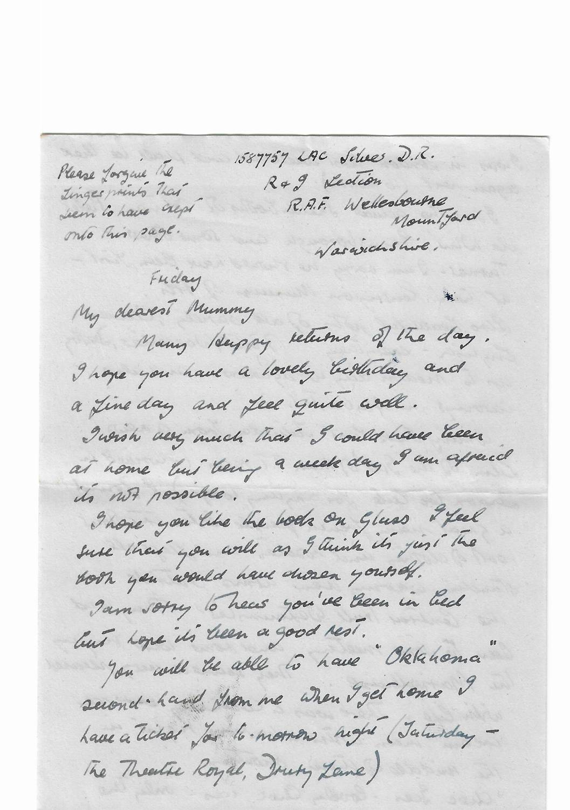
> 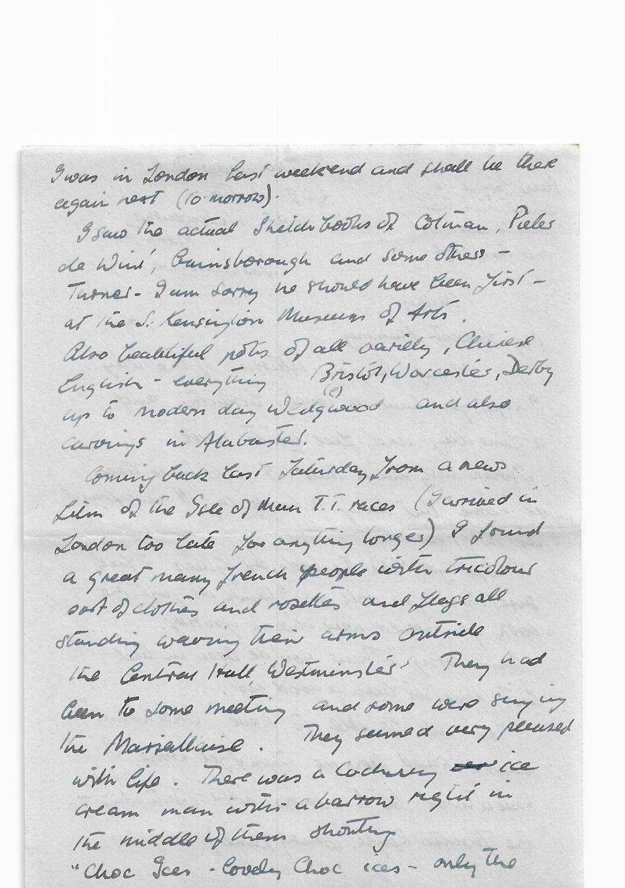
> 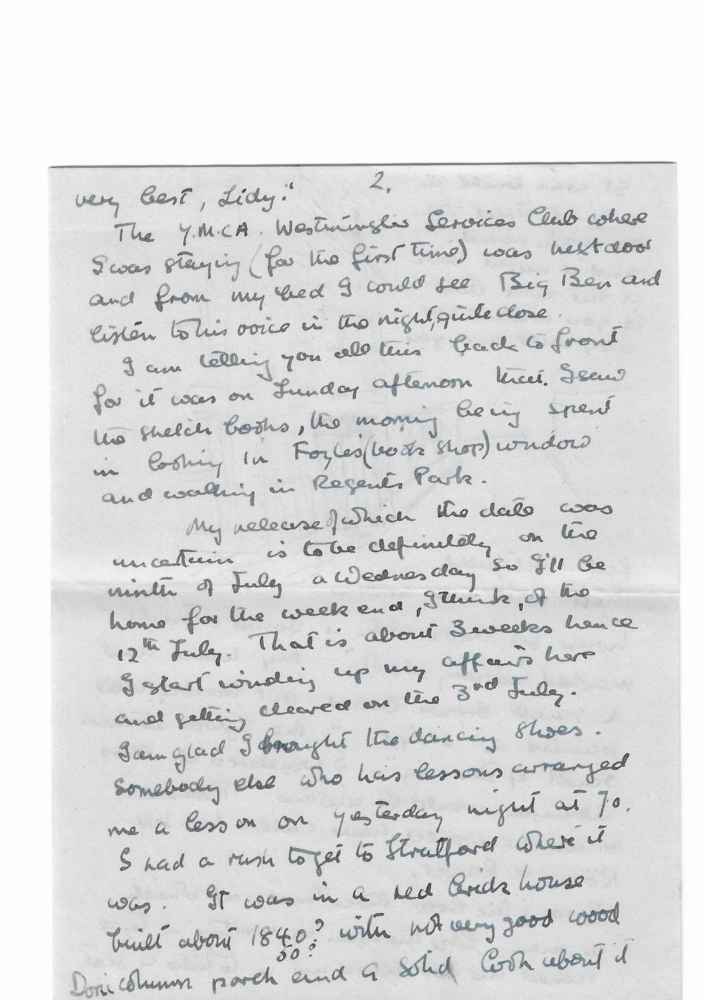
> 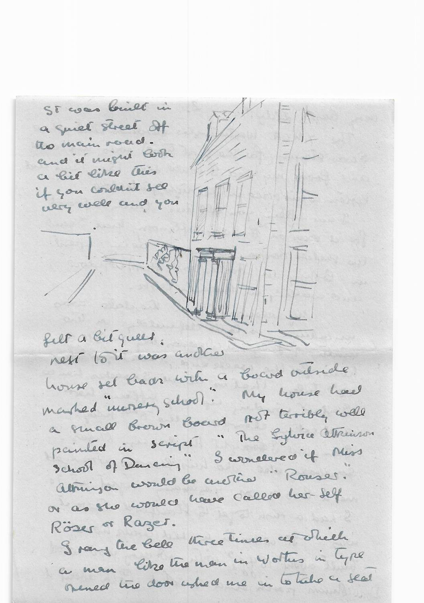
> 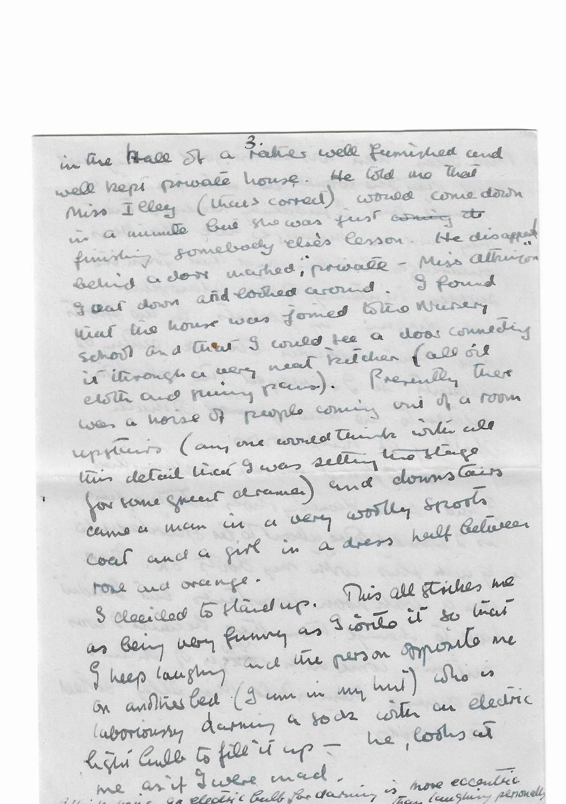
> 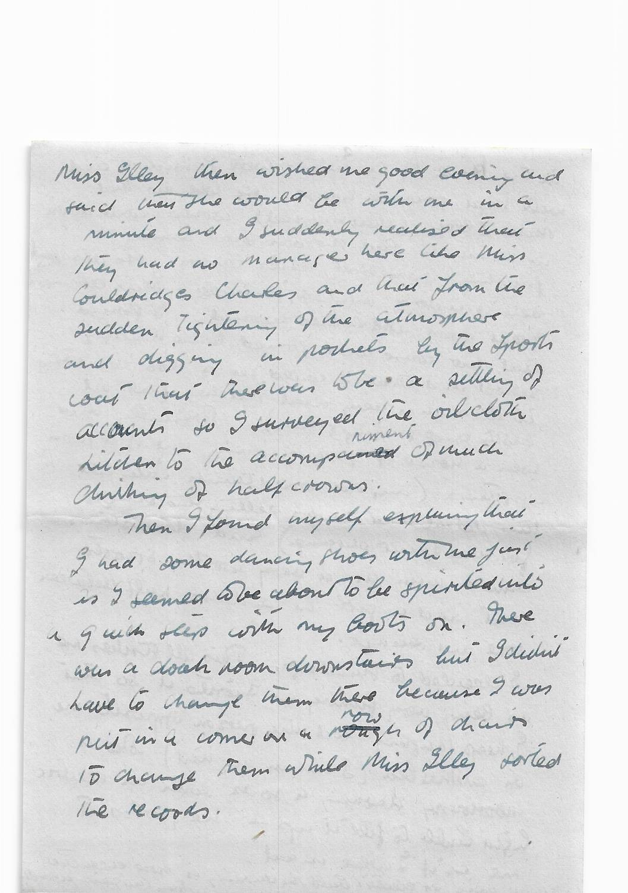
> 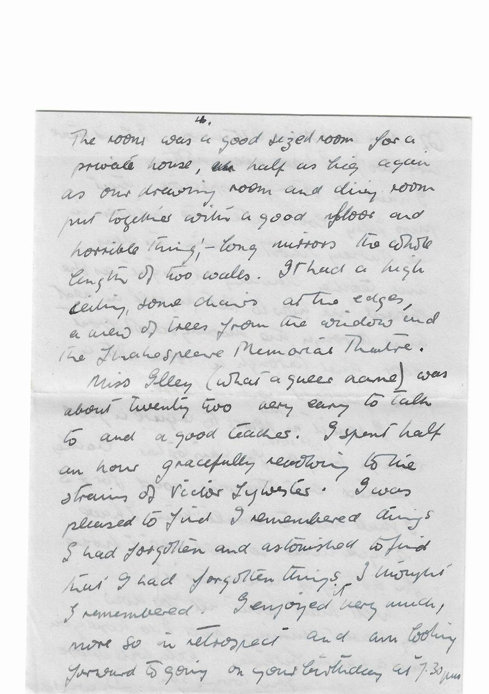
> 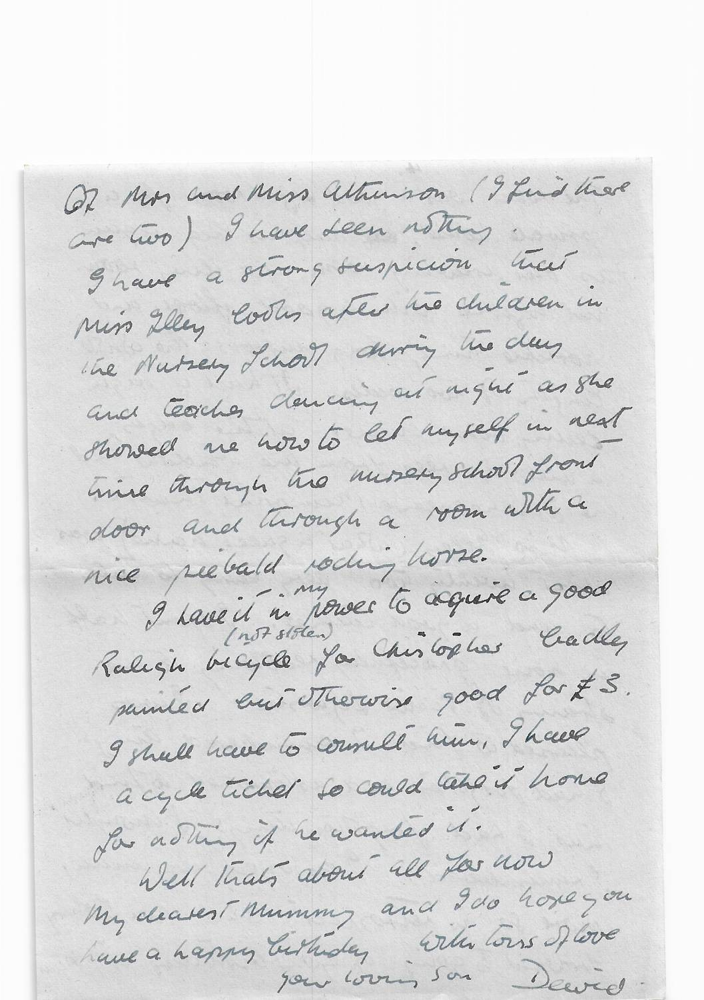
> 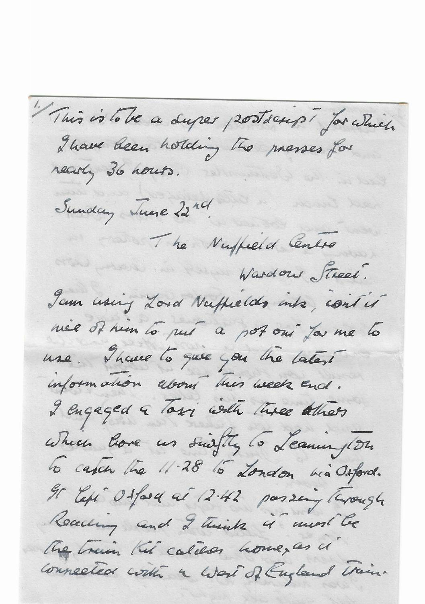
> 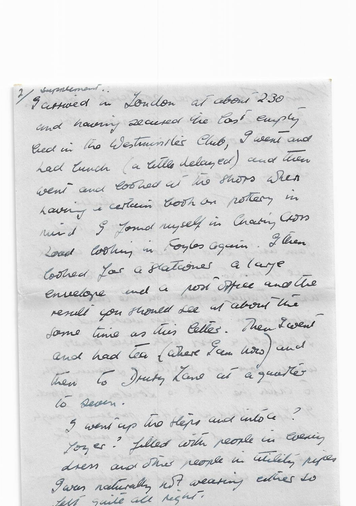
> 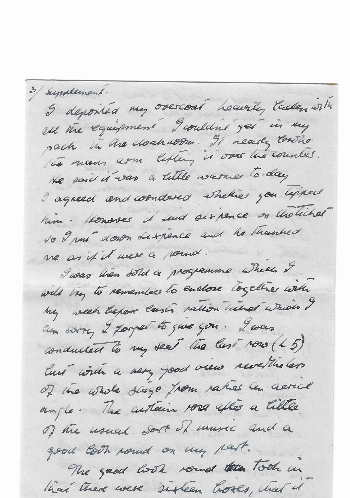
> 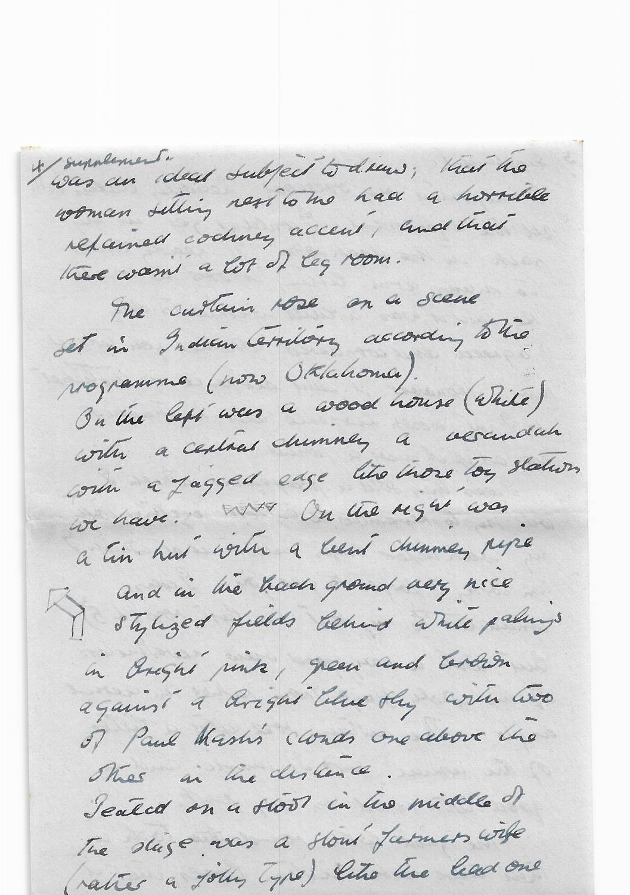
> 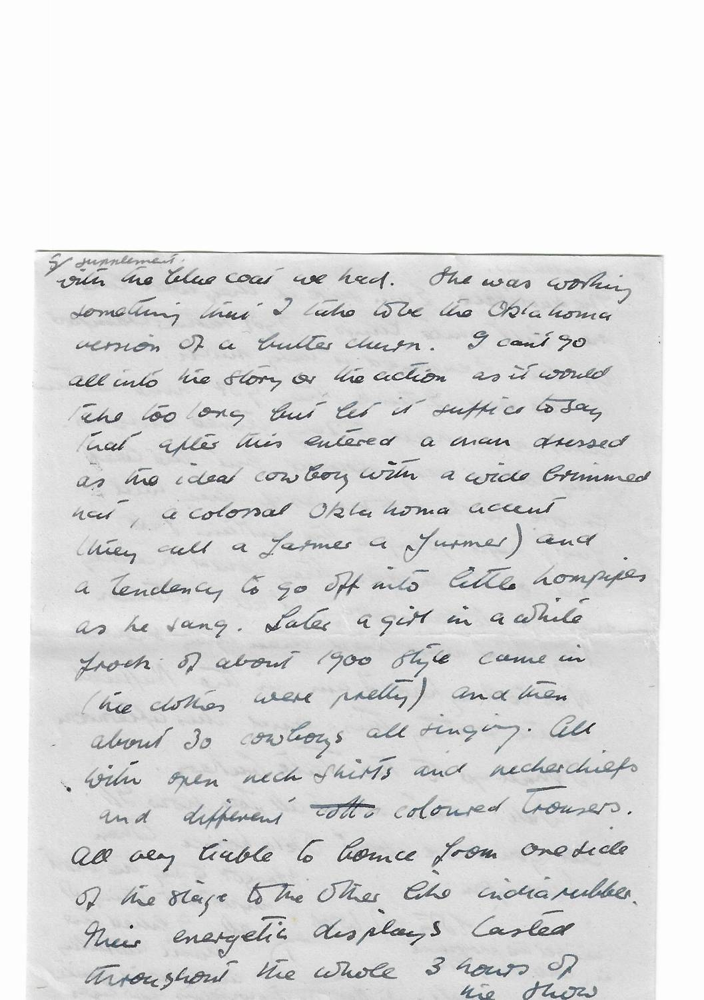
> 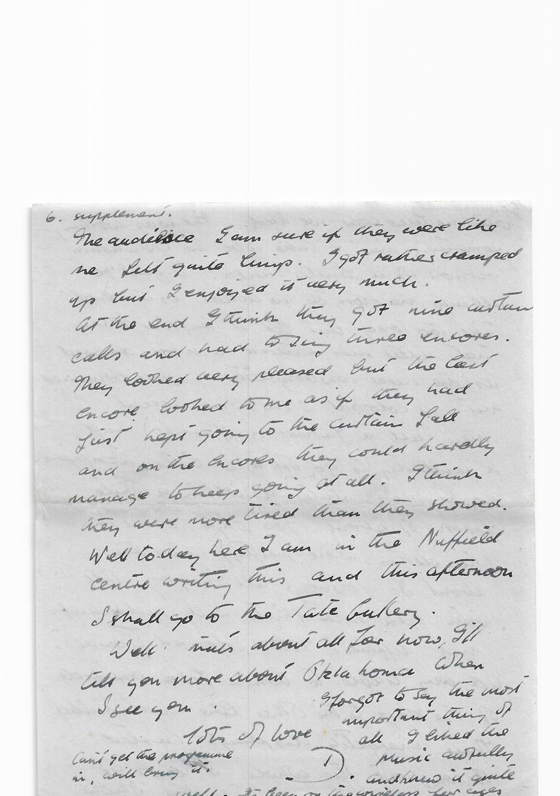

### 02. Sunday, c. 29 June 1947 (ten days to demob)

*Undated. He went to the Tate "last Sunday" (22 June), goes to the demob centre at Kirkham "Wednesday 9th July (the Wednesday after next)", and is "Only ten days until I am a civilian". An envelope postmarked WARWICK 1 JLY 1947 fits.*

> *(p. 1)*
> 1.
> 1587757 LAC Silver.
> [Civilian under Training]
> Wellesbourne.
> My dear Daddy & Mummy
> Thank you very much for your letters I am glad you liked the books, Mummy.
> I have received a reply as a result of my sending that questionnaire form to The Council of Industrial Design.
> When I filled it in I didn't want to specify any particular form of industrial art but said that I would like information about all the subjects and particularly about ceramics. The ceramics idea was only because it seemed to me an interesting subject.
> The reply I got which I will enclose has seized on the small sentence I put in about ceramics.
>
> *(p. 2)*
> Do you know where the Burslem School of Art is? I feel as if I must be very ignorant not to know as they evidently think I would know. Is Burslem a place and is the school at it? or is it just the name of the school. I think it might be in London?
> Last Sunday after writing to you Mummy, in the afternoon I went to the Tate Gallery. I enjoyed it very much. There were rather a lot of people there, men with velvet trousers and beards and family men with children hanging onto either hand, and fat men with newspapers asleep in the seats in the middle of the gallery. Then there were women who stepped back on one foot and tilted ~~[struck]~~ their heads on one side and said "I like it because it's - it's so intense isn't it?"
>
> *(p. 3)*
> 2.
> and there were people on a closer circuit than you so that they were passing in front of you at about 2 feet from the picture.
> The pictures were all British except for a few earlier ones which I think were put there because the British pictures had been influenced by them. These other pictures were impressionist, mostly French and amongst them was that very famous very hot looking picture all squiggles of countryside and a mountain by Van Gogh. There were also pictures by Manet, Camille Pissaro, Picasso, Matisse. The British pictures were by Sickert, John, Nash, Piper, Sutherland, Utrillo (British?) and a great many others, all modern. All very interesting and all hardly visible through other people's fast moving and non transparent heads.
> On the way to the station I saw some people all staring up at a fire engine's
>
> *(p. 4)*
> ladder which was very high and almost reached a high attic window about ~~[struck]~~ six storeys up.
> Halfway up was a man in civilian clothes, on the roof was a platform with some people who waved to people below. By the fire engine were N.F.S. men, policemen, an ice cream man and a lot of ordinary looking people. The road was roped off and a large crowd were being moved back at the far end rope and my end the people were also being kept back by a rope. The ice cream man kept pushing his barrow back up the road and wheeling it down again towards the fire engine.
> Here's the clue - on the pavement at the foot of the ladder were some men and a ciné camera on a tripod pointing upwards - they were making a film - but the sun wouldn't come out!
>
> *(p. 5)*
> 3.
> Up on the platform above the roof was a dummy man with his legs dangling over the edge.
> I waited a while to see what would happen but the sun didn't come out and we had to move back such a long way that in the end I went off and caught the train instead.
> On Monday evening I went to Stratford for my dancing lesson. I have learnt quite a lot of new things. I can see that if I had learnt for the same time here as I have at Miss Couldridge's I should know much more.
> That Sunday when Kit's train was late starting, mine was late in the morning too. I am glad to hear about the drive and will be able to turn some of the energies originally expended in turning spanners into digging the drippings up.
> I shall be glad to see Philip in August.
>
> *(p. 6)*
> Christopher is buying that bike and I am hoping to meet him at Long Compton on the borders of Oxfordshire next Sunday. There is a circle of Druid's stones, seventy I believe at this place.
> I shall go to the demob centre on Wednesday 9th July (the Wednesday after next) and may be home by the Thursday night or Friday morning. It's Kirkham near Preston, Lancs.
> The Air Force determined to get the last duty out of me possible have fixed me in camp this week. From last Friday night to next Friday night I am on Crash Guard.
> This is not the correct name for the duty I perform which is really Duty Crew but in this half baked place everything is different.
>
> *(p. 7)*
> 4.
> I have to sleep at Flying Control in the Tower on the airfield and to be ready to deal with any aircraft night or day that might arrive. Of course on Friday night, the first night two aeroplanes arrived at 9.30 pm a Harvard (RAF) and a civilian Airspeed Consul.
> The Consul contained two civilians who had chartered it to go to the Stratford Memorial Theatre. The airways company have to pay the air force a fee for landing. I don't feel somehow that I came into the air force to service civilian air taxis. Both aircraft took off at about 11.45 pm. I can't get out of camp and must be within earshot of the Tannoy. It's Sunday afternoon and I've just washed tons of clothes - well perhaps not tons but a considerable weight. When I hung them up to dry the line broke and I had to wash them again -
>
> *(p. 8)*
> The week before last we had practically nothing to do on three days. On last ~~Thursday~~ Tuesday we had to work until 8.30 pm (starting at 7.45 am). All this and when the glider pilots are trained many of them are demobbed and many of them are made redundant and take up other duties.
> Well that's about all for now
> with love
> your loving son
> David.
> Only ten days until I am a civilian I'll let you know definitely when I am coming home.

*Notes:* The Council of Industrial Design had suggested the Burslem School of Art (in Stoke-on-Trent) after he mentioned ceramics. Wellesbourne was training glider pilots. The Airspeed Consul was a civilian air taxi chartered to the Stratford Memorial Theatre.

> [!scan]- Scans (8)
> 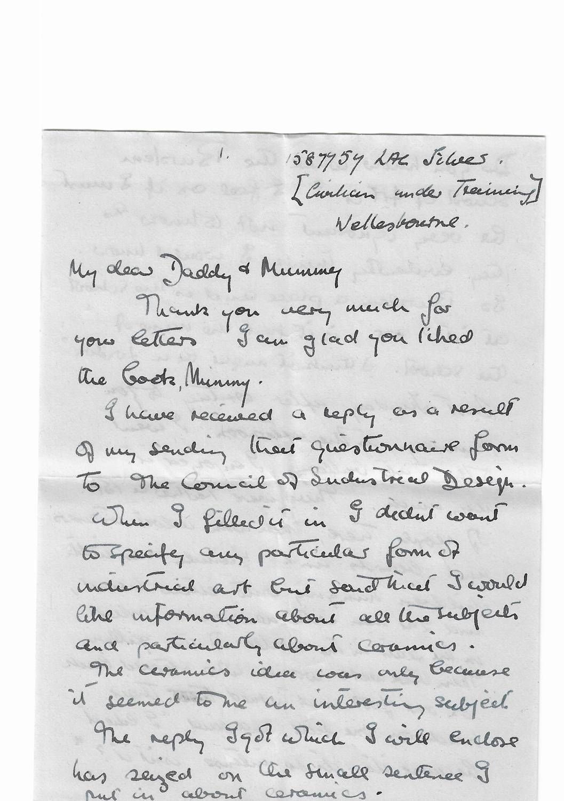
> 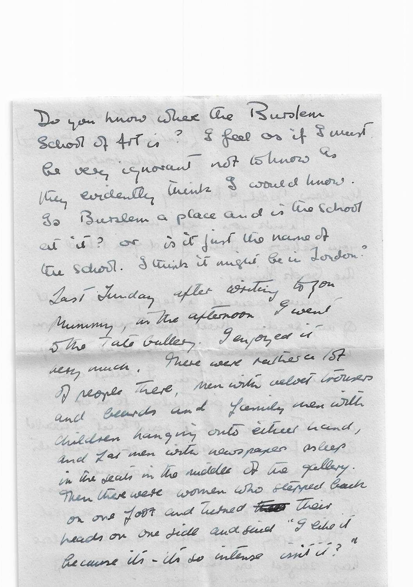
> 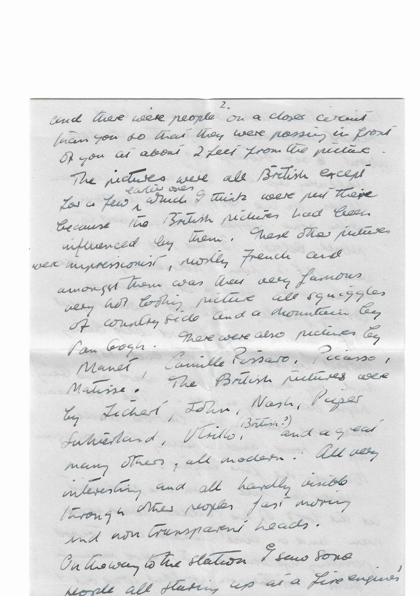
> 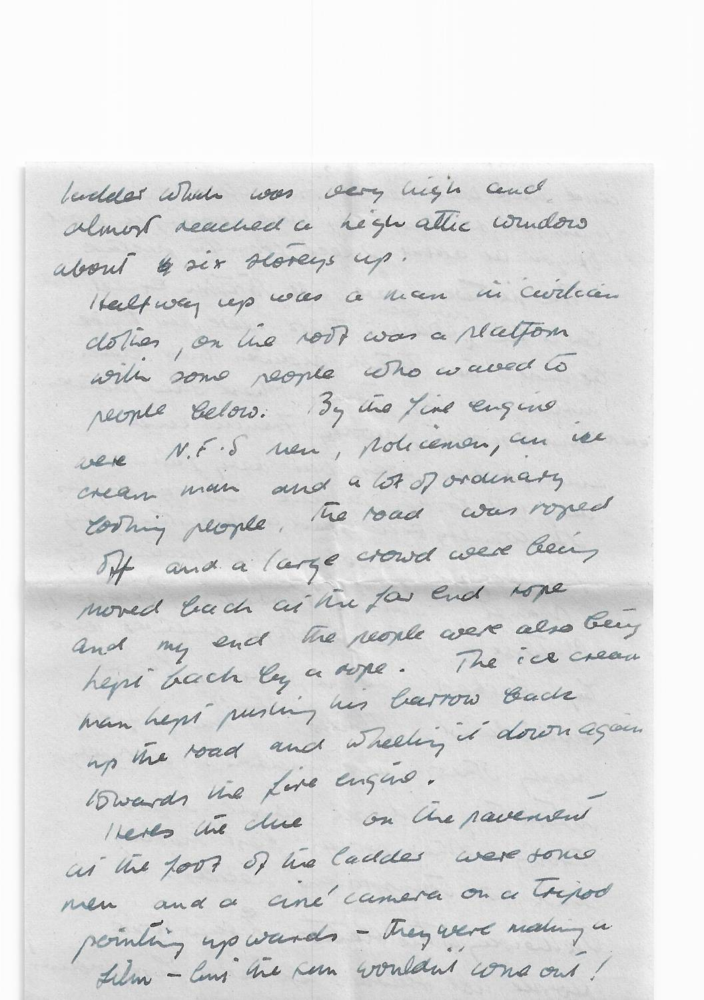
> 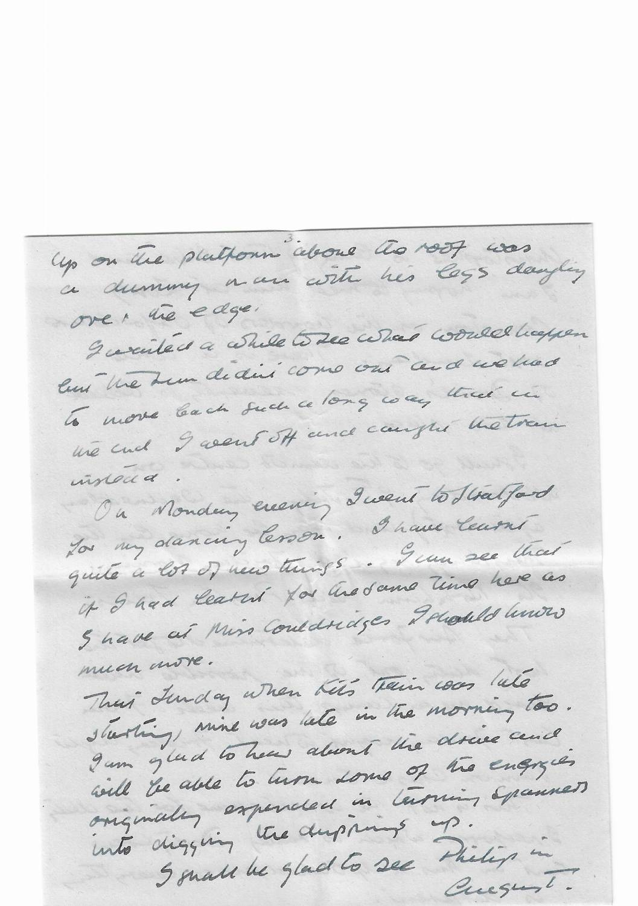
> 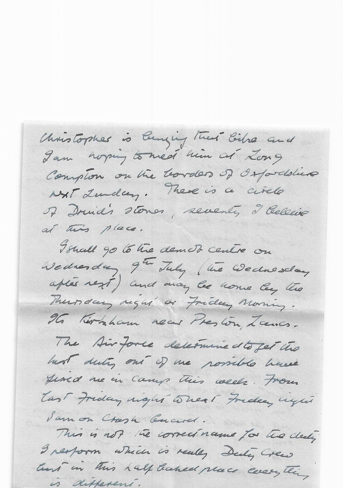
> 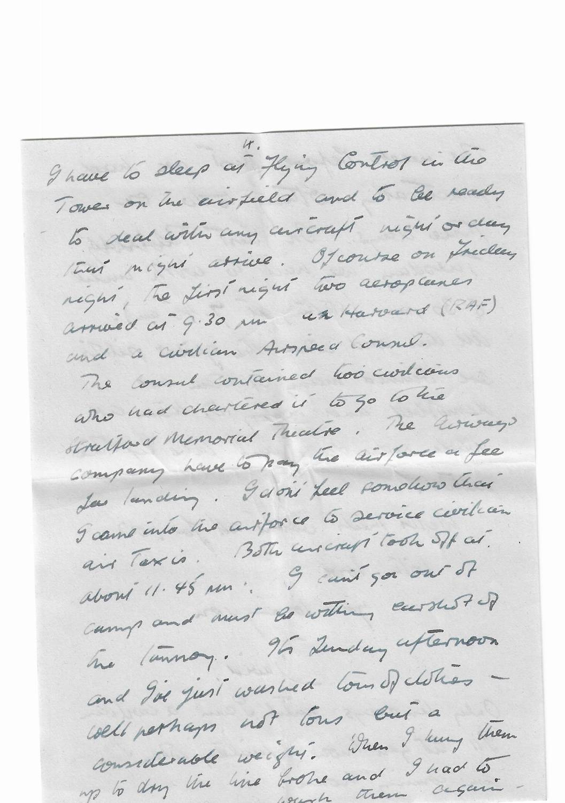
> 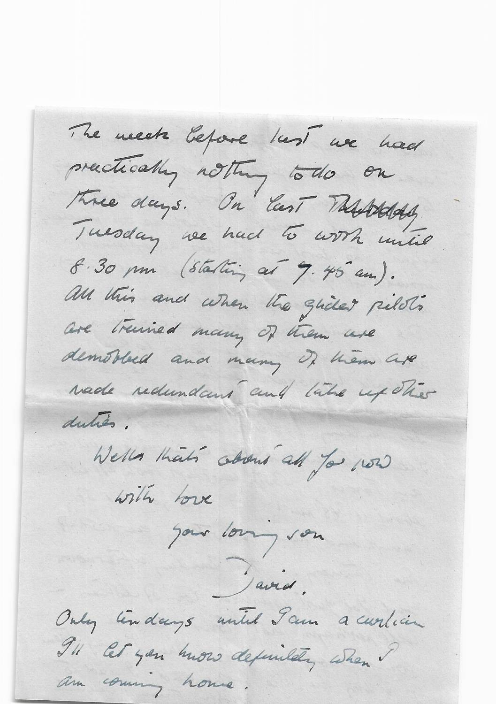

### 03. c. Monday 7 July 1947 (a walk with Christopher to the Rollright Stones)

*Undated; describes meeting Christopher at Long Compton "next Sunday" as planned in the previous letter (Sunday 6 July). He will send Christopher's bicycle on "tomorrow night" and be home early on Friday after his demob. An envelope postmarked WARWICK 8 JLY 1947 fits.*

> *[One or more pages missing here.]*
>
> *(p. 1)*
> There is a 'bus strike and the Midland Reds and Stratford Blues (not a regiment - two 'bus companies) are only operating a skeleton service.
> However my 'bus and Christopher's 'bus are to be part of the skeleton.
> Off goes the 'bus with me on board down strange roads through lovely country to Shipston on Stour. The Avon splits near Stratford into the Avon and the Stour. Then after a ten minute wait while the driver smokes a cigarette on to Long Compton.
> I didn't realise that we had reached Long Compton and stayed in the 'bus until it got to its turning round place. Christopher's 'bus ~~[struck]~~ was to arrive a few minutes later.
>
> *(p. 2)*
> 2. I started to walk back down the village street (I know why they call it Long Compton too now - it's very long).
> A red double decker came past me and there seated upstairs ~~[struck]~~ was Christopher. It stopped and he got out and there was one of those Stanley and Livingstone meetings I have had before.
> We set off at a smart pace out of Long Compton up a hill on which I gathered were the seventy stones. Christopher was carrying a brown square parcel which might have been a gas mask but fortunately wasn't. I was carrying a small pack. I explained to him that I had been almost unable to get anything at all to eat as the Naafi had sold out (to bring out with me I mean.)
>
> *(p. 3)*
> As we went up the hill we kept looking back at the view. It was beautiful. It's Cotswold country and a little like that picture called "Something Folly" [written above: Faringdon?] that you have in the drawing room - a card. Hills with deep valleys filled with farms and trees and all the buildings made of a warm coloured stone.
> I could see three church spires shining in the sunshine in the distance. It was a fine view and a pretty sky. The wind was fresh so we were never too hot.
> When we reached the top there were ~~many~~ several cars parked along the road with people going round a ring of stones counting them.
>
> *(p. 4)*
> 3. This counting business amused Christopher greatly as he felt sure they all disagreed as to the number of stones. We didn't go in ~~and~~ to look at the stones as there were so many people but went and gazed at a blank field in the opposite direction. I wondered whether a crowd would form round us trying to see what we were looking at but it didn't. After a while we went into a field where there was one large ~~of~~ stone railed round in case it should escape like this.
> [Drawing: a tall standing stone inside a circular iron railing (the King Stone).]
> We then decided to go into the next field ~~[struck]~~ and have lunch.
>
> *(p. 5)*
> It was what Christopher called a ~~stubbl~~ stubble field and he sat on a newspaper to have his lunch. It wasn't quite so bad as I ~~[struck]~~ pointed out when he said he thought it was a bit plebeian to sit on a newspaper as it was the Sunday Times. It was a good view. I hadn't got a very solid sort of meal with me.
> 1 egg sandwich (squashed)
> ¾ lb cherries (also)
> ⅓ lb chocolates (ditto)
> two bottles of fizzy lemonade
> no opener.
> Christopher had six sandwiches (very small)
> 2 pieces of cake
> 1 orange
> 16 plums
> some red currants
> 2 mars bars
>
> *(p. 6)*
> 4. Fortunately for me we pooled our resources or I should have been sick on my diet of cherries and chocolates.
> We then walked for six miles, Christopher having had a good deal of entertainment out of seeing me trying to knock the cap off a bottle on a wooden fence that kept breaking up. I succeeded in the end.
> It was a pretty walk very up and down ~~and~~ but unfortunately I had had to walk the day before about 12 miles because of the 'bus strike. At four o'clock after some more plums and chocolates we departed in opposite directions from different parts of the village the two buses passing each other. I enjoyed it very much. (the day)
>
> *(p. 7)*
> Don't expect me to be able to tell you how Christopher looked as I haven't the slightest idea but I suppose he looked quite well or else I should have noticed it. He certainly walked with great energy. Long Compton would have been a very good place to paint.
> I shall send Christopher's bicycle by Passenger Train tomorrow night. That means it will probably get to Exeter ~~[struck]~~ on Wednesday afternoon and I shall myself collect it on Friday.
> That's about all for now except to say that I think I shall be home during the early hours of Friday morning but will let you know please hang key up - Lots of love David

*Notes:* The first sheet seems to be missing. The "circle of Druid's stones, seventy I believe" are the Rollright Stones on the Oxfordshire–Warwickshire border, and the railed-round single stone is the King Stone. "Something Folly" is a card in the drawing room at Tresillian, perhaps of Faringdon Folly.

> [!scan]- Scans (7)
> 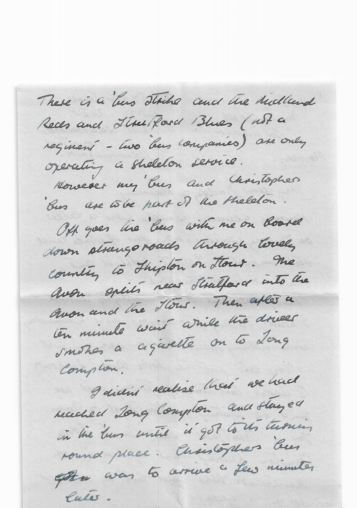
> 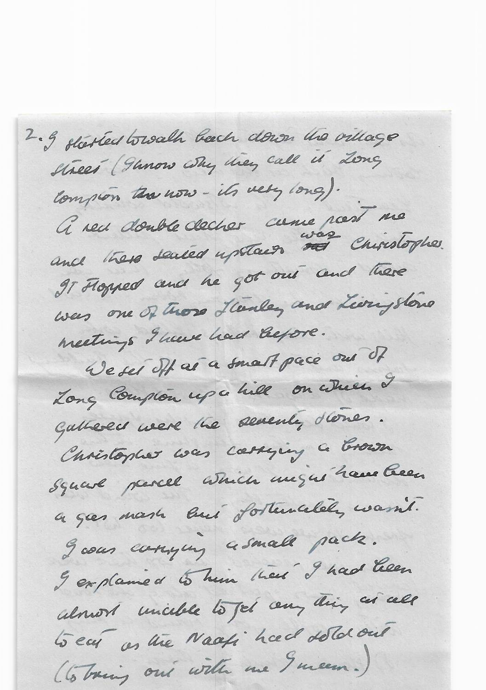
> 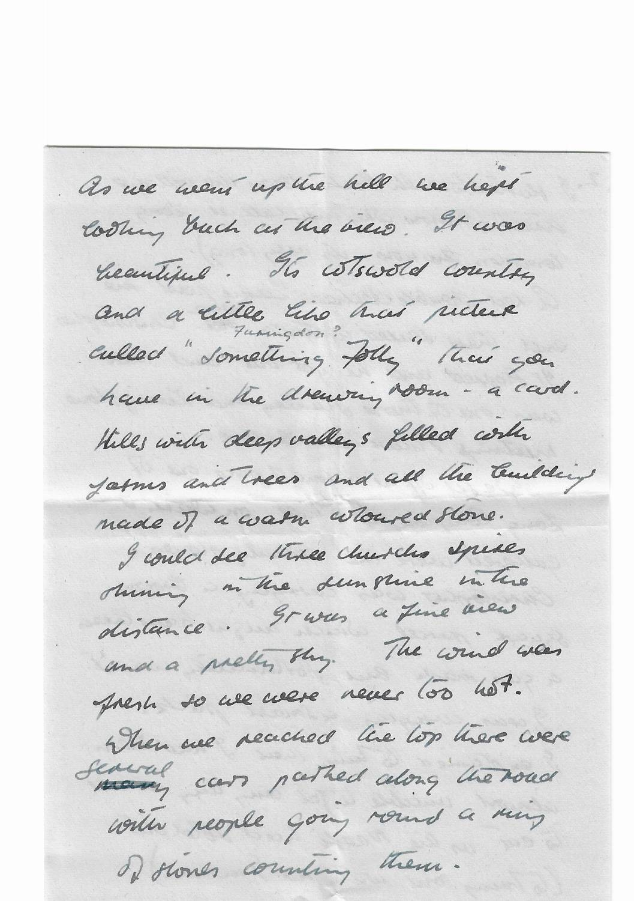
> 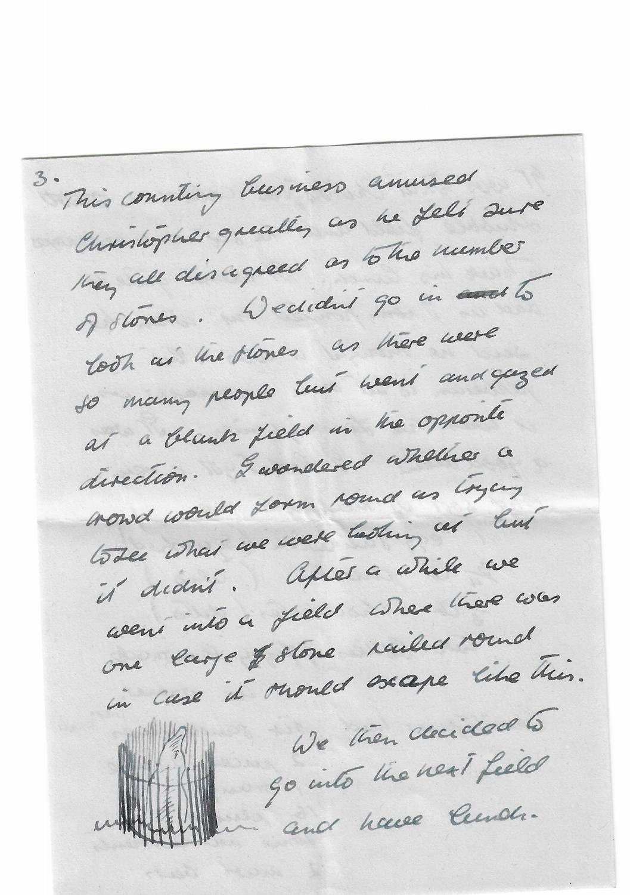
> 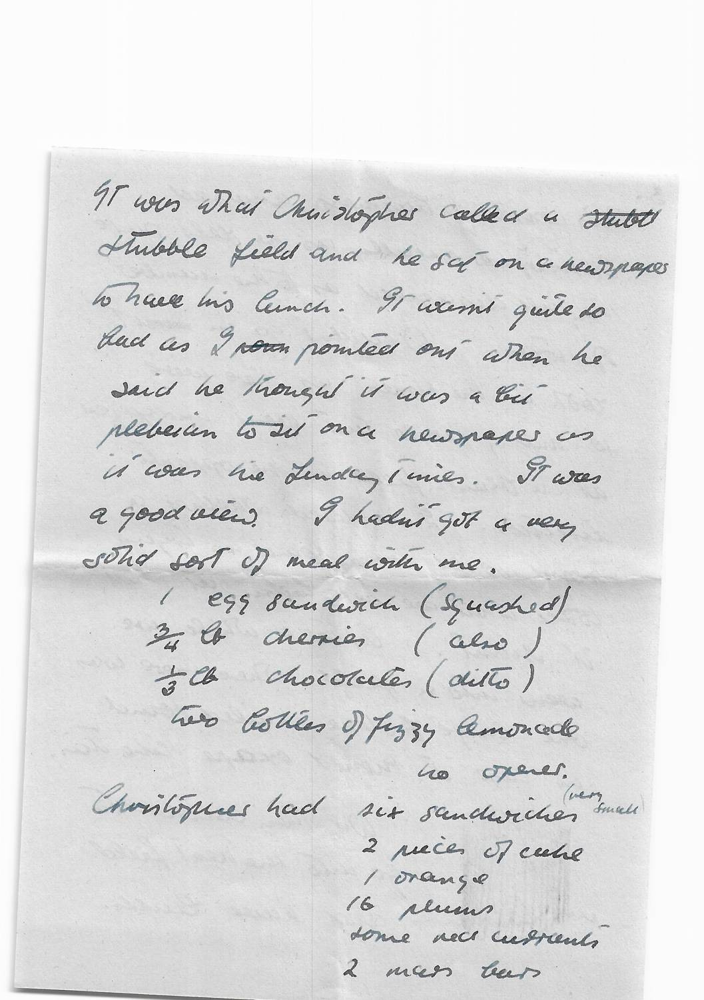
> 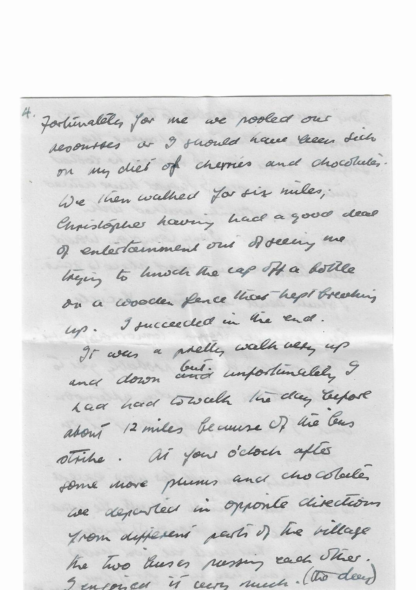
> 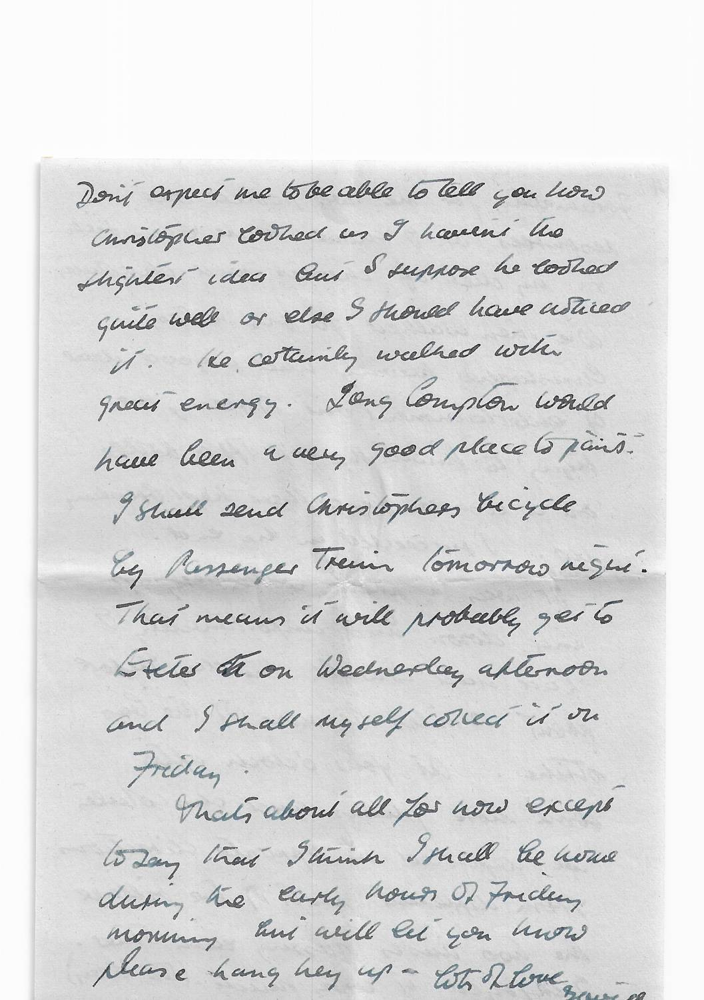

## Envelopes

Two envelopes to his parents at Tresillian, postmarked WARWICK & LEAMINGTON SPA 1 JLY 1947 and 8 JLY 1947.

> *(envelope)*
> [Top:] C. M. Silver Esq. / West Avenue / Exeter / Devon. [2½d blue King George VI stamp; postmark WARWICK & LEAMINGTON SPA 11.45 AM 1 JLY 1947, slogan "VOLUNTEER FOR A FORCES CAREER"]
> [Bottom:] Mr & Mrs Silver / Tresillian / West Avenue / Exeter / Devon. [2d orange + ½d green stamps; postmark WARWICK & LEAMINGTON SPA 11.45 AM 8 JLY 1947, same slogan]

> [!scan]- Scans (1)
> 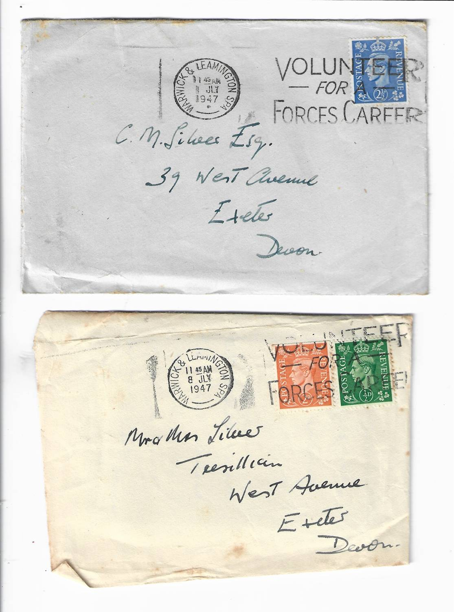
